<!-- Automation and operations > Operations > Monitoring > Resources -->

### Resources

After logging into **CloverDX Server** you are automatically redirected to the **Resources** section, which provides an overview of the Server’s current state and recent history from the technical point of view (e.g., the heap space allocated to the Server worker and core or the system memory and CPU utilization). This section also allows you to [manage](monitoring.md#server-management) the Server core and worker processes. The appearance of the **Resources** section is different in standalone Server environments and Cluster environments: see [Standalone server view](monitoring.md#standalone-server-view) and [Cluster view](monitoring.md#cluster-view).

#### Standalone server view

In a standalone Server environment, an overview of information about resource utilization and performance of **CloverDX Server** will be displayed. You can also [manage](monitoring.md#server-management) the Server core and/or worker processes here. The information on this page is grouped into several panels and refreshed every 10 seconds. The following panels are displayed by default:

- [Resource utilization](monitoring.md#resource-utilization-panel)
- [Worker and system](monitoring.md#worker-and-system-panels)
- [Performance](monitoring.md#performance-panel)
- [Running jobs](monitoring.md#running-jobs-enqueued-jobs-panel)
- [Status history](monitoring.md#status-history-panel)

The following panels can be optionally displayed by using the [Show details](monitoring.md#8-displaying-hiding-additional-debug-information)**Actions** option:

- [Users' accesses](monitoring.md#users-accesses-panel)
- [License](monitoring.md#license-panel)
- [Classloader cache](monitoring.md#classloader-cache-panel)
- [Status](monitoring.md#status-panel)
- [Resource utilization detail](monitoring.md#resource-utilization-detail-panel)
- [Heartbeat](monitoring.md#heartbeat-panel)
- [Threads](monitoring.md#threads-panel)
- [Quartz](monitoring.md#quartz-panel)

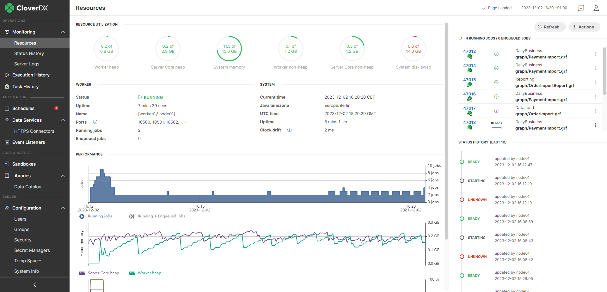
*Figure 85. Standalone server detail*

##### Resource utilization panel

The **Resource Utilization** panel shows the heap and non-heap memory currently allocated to the Server worker and core processes, system memory, and system disk swap.

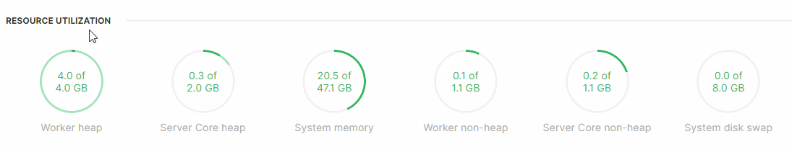
*Figure 86. Resource Utilization*

###### Worker and Server Core heap

Hover over the Worker or Server Core heap dials to see further information about the JVM heap memory usage.

- **Used**: the amount of memory currently used by objects in the heap, including recently used objects that haven’t been garbage collected yet.
- **Committed**: the pre-allocated amount of memory reserved for the heap objects by the operating system. This is the memory usage (together with the non-heap committed memory) reflected in OS memory monitoring tools. If the JVM needs more memory, it will attempt to allocate it from the OS, increasing the committed heap.
- **Max**: the absolute limit on how much memory the heap can grow to. It’s set using the `-Xmx` JVM flag.
> [!NOTE]
> Even if the requested increase in committed memory is lower than the max heap size, the JVM might be terminated at the OS level if there is no available memory.

###### System memory

The System memory dial display the total OS memory and its current usage.

###### Worker and Server Core non-heap

Hover over the Worker or Server core non-heap dials to see further information on the JVM non-heap memory usage.

- **Used**: the amount of memory currently used by non-heap objects.
- **Committed**: the pre-allocated amount of memory reserverd for the non-heap objects by the operating system. This amount (together with the heap committed memory) is reflected in OS memory monitoring tools.
- **Max**: the absolute limit on how much memory the non-heap can grow to.
> [!NOTE]
> Even if the requested increase in committed memory is lower than the max non-heap size, the JVM might be terminated at the OS level if there is no available memory.

###### System disk swap

This dial display the current state of disk swap in your OS.

##### Worker and System panels

These two panels display information about the worker process (e.g., current state or uptime) and operating system (e.g., current time, timezone, and system uptime).

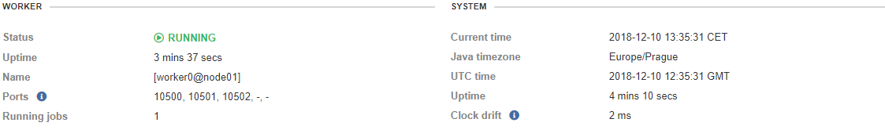
*Figure 87. Worker*

##### Performance panel

The **Performance** panel includes three line charts: *Running jobs*, *Heap memory*, and *CPU load*.

You can display a tooltip with detailed information for a selected point in time by hovering over the charts. For better visibility, you can enable/disable individual lines in the charts by clicking on their label below the respective graphs.

You can modify the displayed time interval by hovering over one of the charts and mouse scrolling or using the slider at the bottom of this section. The slider allows you to set the start and end time intervals individually. By default, the maximum time interval for the charts in the *Performance* panel is 24 hours. This value can be modified using the [cluster.node.sendinfo.stats.interval](../admin/list-of-properties.md#lop-cluster-node-sendinfo-stats-interval) property.

###### Running jobs chart

The *Jobs* chart displays the number of running and enqueued jobs.

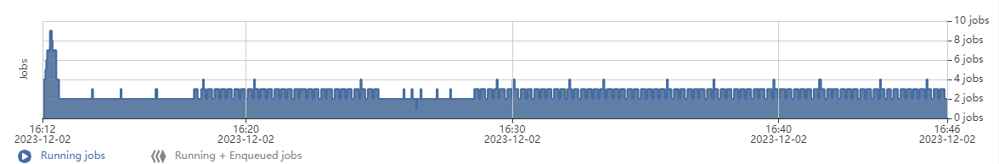
*Figure 88. Running jobs chart*

###### Heap memory chart

The *Heap memory* chart displays the amount of used Server core and worker heap memory.

Note that the heap memory is constantly oscillating, even in an idle state, since it is periodically managed by the JVM garbage collector (i.e., the temporary data required for running **CloverDX Server** and Worker is periodically removed from/allocated to the heap memory).

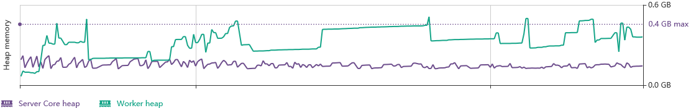
*Figure 89. Heap memory*

###### CPU load chart

The *CPU chart* displays information about **CloverDX Server** core, worker, and system CPU load.

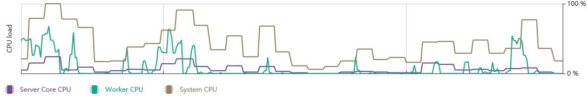
*Figure 90. CPU Load*

##### Running jobs / Enqueued jobs panel

The *Running jobs / Enqueued Jobs* panel lists the 10 most recent currently running or enqueued jobs. This panel is visible only if there are any running or enqueued jobs.

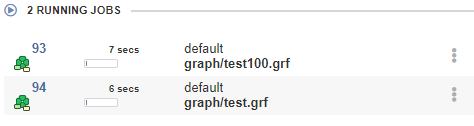
*Figure 91. Currently running jobs*

##### Status history panel

The *Status history* panel displays core and worker status history since the restart of the Server.

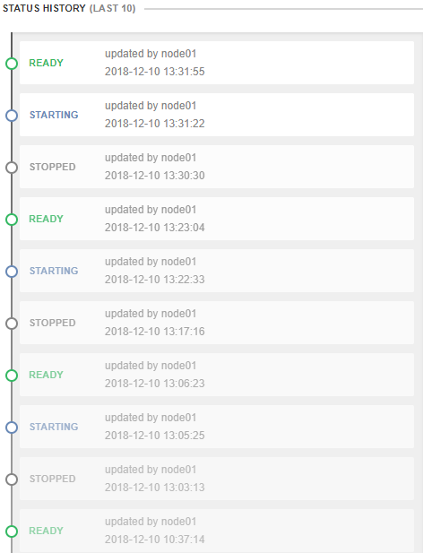
*Figure 92. Status history*

##### Users' accesses panel

This panel lists information about activities on files performed by users. The list displays a timestamp of an event, username, IP address, and name of the method.

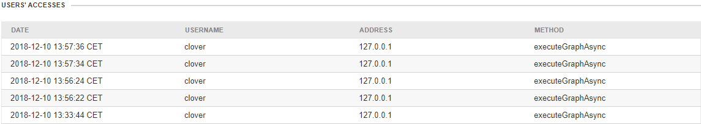
*Figure 93. Users' accesses panel*

##### License panel

The *License* panel contains license information like the license number, license expiration date, and license location.

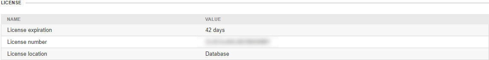
*Figure 94. System*

##### Classloader cache panel

The *Classloader cache* panel lists all currently cached classloaders. The classloader cache may be empty as classloader caching is disabled by default.

##### Status panel

The *Status* panel displays information like current node status, heap and non-heap memory usage, Java version, exact **CloverDX Server** version, JDBC driver used to connect to the system database, etc.

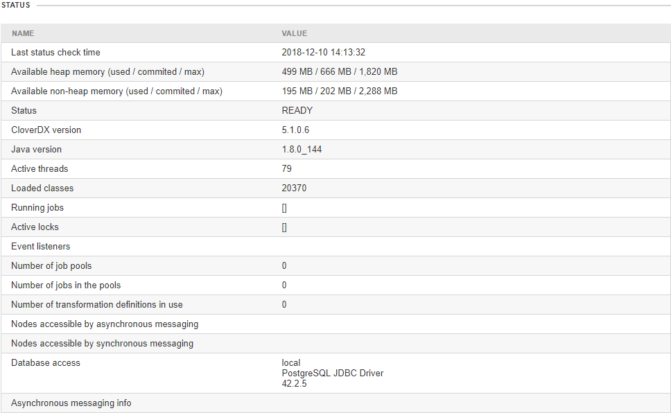
*Figure 95. Status*

##### Resource utilization detail panel

The *Resource Utilization Detail* panel provides additional information about Server utilization of operating system resources.

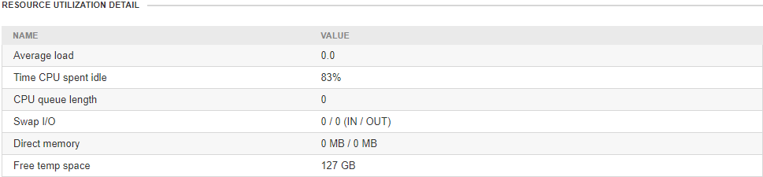
*Figure 96. Status*

##### Heartbeat panel

The *Heartbeat* panel lists heartbeat events between the Server core and system database.

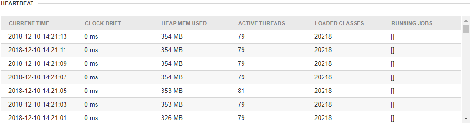
*Figure 97. Heartbeat*

##### Threads panel

The *Threads* panel lists Java threads and their states.

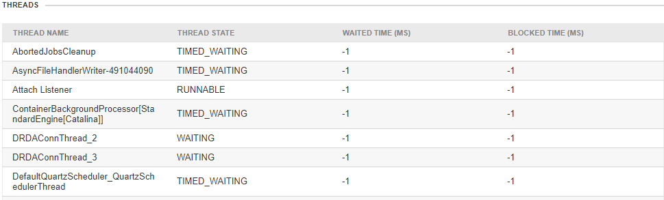
*Figure 98. Threads*

##### Quartz panel

The *Quartz* panel lists scheduled actions: their name, description, start time, end time, time of the previous event, and the time of the next event.

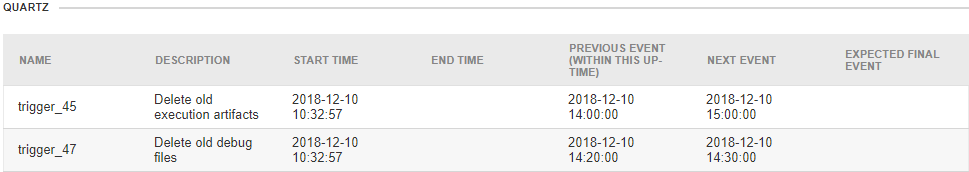
*Figure 99. Quartz*

#### Cluster view

After logging into the **CloverDX** console in a Cluster environment, the **Resources** section will by default display an overview of all configured Cluster nodes. The information is grouped into several panels:

- **List of Cluster nodes**, their resource utilization, URL, uptime, and the number of currently running and enqueued jobs. In the nodes list on the left side, you can easily see to which node you are currently connected. By default, the check boxes next to each node are selected, allowing you to quickly control all nodes at once. Nodes can be suspended gracefully (i.e., nodes will be suspended only after all currently running jobs on the nodes have finished) by selecting the nodes and clicking on the **Suspend** button. If you want to suspend nodes forcefully use the **Suspend At Once** button instead. To resume suspended nodes use the **Resume** button.
- **Status history** panel, which displays the last 10 status changes from all Cluster nodes.
- **Running jobs** panel, which will be displayed only when there are currently running jobs.

The information in this section is automatically refreshed every 10 seconds. If you want to refresh it yourselves or stop refreshing it, use the **Refresh** or **Stop Refreshing** buttons, respectively.

In the nodes list on the left side, you can easily see to which node you are currently connected.

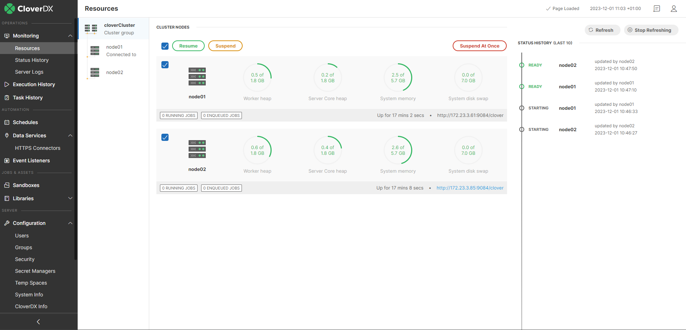
*Figure 100. Cluster View*

##### Node detail view

By clicking on a specific node in the node list on the left side, you will be redirected to a node view, which displays the same kind of information as described in the [Standalone Server View](monitoring.md#standalone-server-view) section, and which allows you to [manage](monitoring.md#server-management) the Server core and worker processes on the selected node.

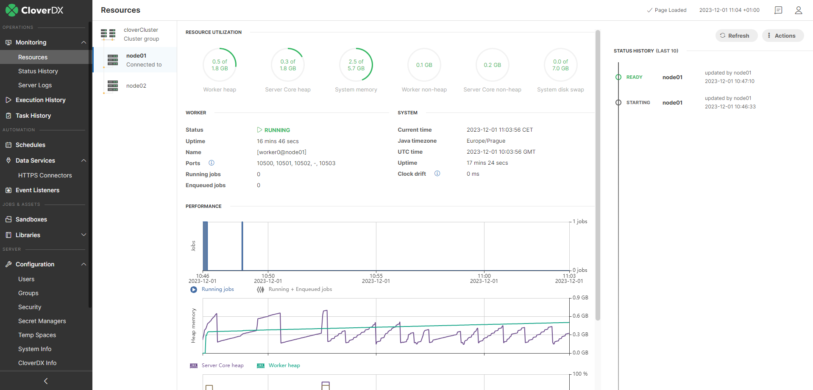
*Figure 101. Node detail*

#### Server management

The **Resources** section allows you to control the Server core and worker processes, as well as display additional debug information. The controls can be found under the **Actions** menu in the upper right corner. When connected to a standalone Server environment, this menu will be available right away when you navigate to the **Resources** section. In a Cluster environment, the menu is available in a [node detail view](monitoring.md#node-detail-view) after clicking on a specific node in the node list. In the **Actions** menu, the following operations can be performed:

- [Starting worker](monitoring.md#1-starting-worker)
- [Restarting worker](monitoring.md#2-restarting-worker)
- [Displaying worker log](monitoring.md#3-displaying-worker-log)
- [Showing worker command line](monitoring.md#4-showing-worker-command-line-arguments)
- [Suspending server core](monitoring.md#5-suspending-server-core)
- [Resuming server core](monitoring.md#6-resuming-server-core)
- [Restoring dismissed messages](monitoring.md#7-restoring-dismissed-warnings)
- [Displaying additional debug information](monitoring.md#8-displaying-hiding-additional-debug-information)
- [Disabling / Enabling of automatic refresh](monitoring.md#9-disabling-enabling-of-automatic-refresh)

##### 1. Starting worker

If the worker process is not running, you can use the ***Start worker*** option to start it back up.

##### 2. Restarting worker

Depending on if you want to let the currently running jobs finish first select one of the options:

- ***Finish jobs and restart worker*** will wait for all currently running jobs to finish before restarting the worker.
- ***Restart worker now*** will forcibly kill all currently running jobs and restart the worker immediately.

##### 3. Displaying worker log

The ***Go to worker logs*** option will redirect you to the **Server Logs** section under **Monitoring** and display the latest information in the worker log. For more information about server logs see [Server logs](monitoring-server-logs.md).

##### 4. Showing worker command line arguments

By selecting the ***Show worker command line*** option, the command line arguments and parameters used by the worker will be displayed.

See also [Properties on Worker’s command line](../admin/list-of-properties.md#properties-on-workers-command-line).

##### 5. Suspending server core

When a Server core is suspended, features like Schedulers, Event Listeners, or Data Apps will be disabled. Manual execution of graphs, jobflows, and tasks is still possible with explicit confirmation. Depending on if you want to let the currently running jobs finish first, select one of the options:

- ***Suspend server core*** will wait for all currently running jobs to finish before stopping the server core.
- ***Force suspend server core*** will forcibly kill all currently running jobs and stop the core immediately.

##### 6. Resuming server core

To resume a suspended Server core use the ***Resume server core*** option.

##### 7. Restoring Dismissed Warnings

**CloverDX Server** shows warnings if it detects possible issues with the state of the Server or its configuration (e.g., when the Server is under heavy load a warning will appear in the **Resources** section, or when worker heap memory is not set, a warning will appear under Configuration > Setup > Worker). If you do not consider these warnings to be an issue, you can dismiss them by clicking on the X button at the end of the warning. Dismissing messages dismisses them for all users. Messages regarding worker configuration get renewed after changing its configuration and after restarting the worker. Messages regarding the Server Core are renewed after the restart of the Server.

Dismissed warning messages can be restored by using the ***Show dismissed warnings*** option.

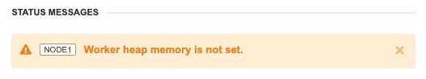
*Figure 102. Dismissible warning message*

##### 8. Displaying / hiding additional debug information

To display additional debug information, e.g., a detailed overview of memory utilized by **CloverDX Server**, or a list of threads used by the core, use the ***Show Details*** option. After clicking on this option, the debug information will appear at the bottom of the page under the **Performance** section. To see what panels will appear when using this option, refer [here](monitoring.md). To hide the debug information use the ***Hide details*** option.

##### 9. Disabling / enabling of automatic refresh

By default, the information in the **Resources** section is refreshed automatically every 10 seconds. If you do not want the information to be refreshed, use the ***Stop refreshing*** option. To enable it again, use the ***Start refreshing*** option.
