<!-- Automation and operations > Operations > Monitoring > Monitoring (Operations Dashboard) -->

### Monitoring (Operations Dashboard)

#### Overview

The **Operations Dashboard** provides an overview of the state of data processing on **CloverDX Server** or **Cluster**. It helps to quickly identify business processes that are encountering issues, or to quickly confirm that they are successfully passing. The Operations Dashboard displays the state of **Monitors**, where each Monitor automatically checks and reports the state of data processing represented by some selected automations such as **Event Listeners, Schedules and Data Services**.

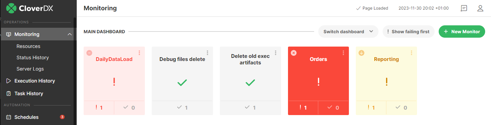
*Figure 69. Operations Dashboard*

The Operations Dashboard is an entry point to start analyzing issues in the data processing. From simple display that some issue is occurring it allows you to quickly drill-down to the specific failure to analyze and fix it, e.g. a failed graph triggered by a Schedule.

Information shown on the Operations Dashboard is provided via a public [REST API](rest-api.md) that can be used to implement your own dashboard or to integrate with a 3rd party monitoring solution.

#### Quickstart

The **Operations Dashboard** is the default landing page of the Server. It shows Monitors as tiles, where each Monitor represents some data processing (typically for a business process). The Monitors automatically watch the state of selected items of automation - Schedules, Event Listeners or Data Services. These items perform the data processing needed by the business process.

Multiple Dashboards can be defined, with the default **Main dashboard** being available automatically. You would typically create additional Dashboards for specific projects or areas of responsibility in the team. Each Dashboard has its own Monitors, i.e. each Monitor belongs only to one Dashboard.

The Operations Dashboard refreshes automatically every few seconds, so it’s not necessary to refresh the browser window to see the current state.

*Figure 70. Operations Dashboard*

Tiles of Monitors show the following information:

- *Name* - name of the Monitor, specified when creating it
- *State icon* - failing / passing. A Monitor is shown as failing in case any of the items watched by the monitor are failing.
- *Alert level* - indicates the highest [Alert Level](alerts-and-notification.md#alert-level) of all failing triggers in this monitor. Alert level is displayed by background color and icon in the top-left corner.
- *Warning icon* - a warning icon in top-left indicates that the Monitor was failing recently, but currently is passing. You should investigate the recent issues and manually acknowledge them to dismiss the warning.
- *Number of failing and passing items* - how many of the watched items are passing and how many are failing. These numbers give you a more detailed overview of the health of the Monitor, for example if just 1 item is failing but a large number of items are passing, then the issue is probably of lesser criticality.

Selecting a Monitor shows details about it:

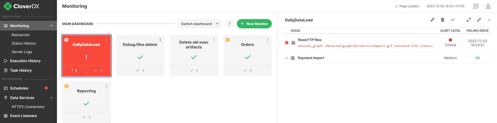
*Figure 71. Monitor details*

Each monitor watches some items that automate data processing in the Server (Event Listeners, Schedules, Data Services). In the details of the Monitor you can see all the items with the following information:

- *Name* - name of the item, e.g. name of the watched Schedule
- *Error message* - if the item is failing, this is the last error message it returned. For example it would be the reason why a job triggered by a Schedule failed.
- *Warning message* - if the item was failing recently but it’s passing now, this is the last error message it returned. This is useful information to understand what was happening with the data processing e.g. in the last few days. The warning message disappears when you manually mark the issue as resolved (see [Operations Dashboard - Issue Investigation](ops-dashboard.md#issue-investigation)).
- *Alert level* - [Alert Level](alerts-and-notification.md#alert-level) of the trigger.
- *Failing since* - when did the item start failing
- *Actions* - actions on the whole Monitor - you can modify the Monitor, remove it, mark all issues as resolved, and expand/collapse details about all of the items.

#### Using the dashboard

##### Dashboard

The **Operations Dashboard** is the landing page of **CloverDX Server** designed to quickly show the state of data processing (typically for a business process). It shows **Monitors** and their state, where each Monitor watches the state of several items that automate data processing (i.e. **Schedules, Event Listeners, Data Services**). These items perform the data processing needed by the business process.

*Figure 72. Operations Dashboard*
> [!NOTE]
> The Operations Dashboard was introduced with CloverDX 5.8. In previous versions the landing page showed information about load, resources, running jobs etc. That page was moved to the Resources page under Monitoring, see [Resources](monitoring.md#standalone-server-view) for more details.

Multiple Dashboards can be defined. This is useful in more complex deployments, where each Dashboard could cover a separate project, area of responsibility of a specific team etc. Each of the Dashboards has its own set of Monitors (i.e. a Monitor belongs to just one Dashboard, it cannot be shared). There is one default Dashboard provided by default - **Main Dashboard**. Name of the currently selected Dashboard is shown in the top-left corner of Operations Dashboard.

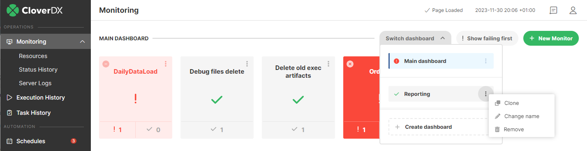
*Figure 73. Multiple dashboards*

Switching between Dashboards is done via the **Switch Dashboard** widget at the top right. The **Switch Dashboard** widget provides also actions for Dashboards:

- *Create dashboard* - creates a new Dashboard, you must specify its name.
- *Change name* - renames a Dashboard.
- *Clone* - copies the Dashboard to a new Dashboard. The new Dashboard will have the same Monitors and configuration. The Monitors are not shared between Dashboards, so change in a Monitor in the cloned Dashboard will not affect the original Dashboard. This action is useful to create a new Dashboard based on an existing one and then configure it further.
- *Remove* - deletes the Dashboard. The default **Main Dashboard** cannot be deleted.

If some Monitors are failing, they are highlighted in red color. With the **Show failing first** button, it’s possible to switch the dashboard to a visualization mode where the failing Monitors are shown at the top. This is useful with a larger number of Monitors to see all the failing ones at the top.

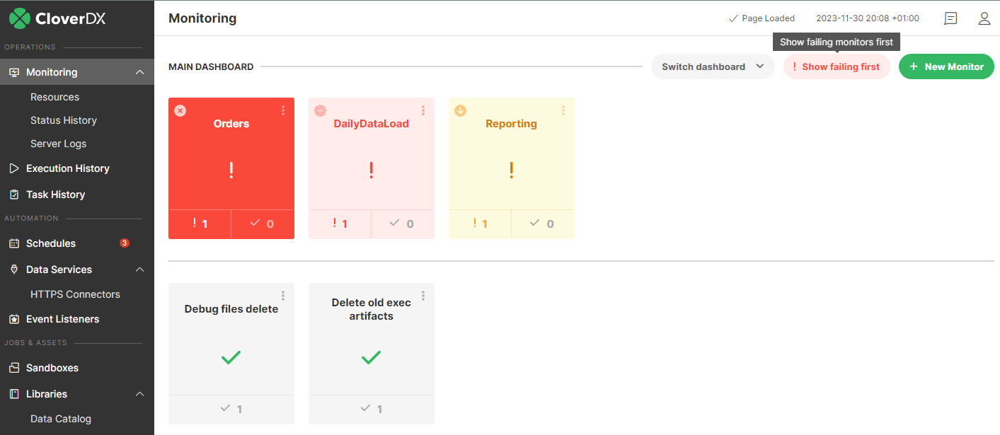
*Figure 74. Failing monitors on top*

The dashboard shows all Monitors as tiles, providing the following information:

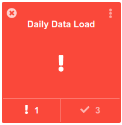
*Figure 75. Monitor tile*

- *Name* - name of the Monitor, specified when creating it. Names of Monitors are unique.
- *State icon* - failing / passing. A Monitor is shown as failing in case any of the items watched by the monitor are failing.
- *Alert level* - indicates the highest [Alert Level](alerts-and-notification.md#alert-level) of all failing triggers in this monitor. Alert level is displayed by background color and icon in the top-left corner.
- *Warning icon* - a warning icon in top-left indicates that the Monitor was failing recently, but currently is passing. You should investigate the recent issues and manually acknowledge them to dismiss the warning.
- *Number of failing and passing items* - how many of the watched items are passing and how many are failing. These numbers give you a more detailed overview of the health of the Monitor, for example if just 1 item is failing but a large number of items are passing, then the data processing represented by this Monitor has probably only a minor issue.

The three-dot button is used to perform actions on the Monitor:

- *Show details* - selects the Monitor and shows details about it and its items. This is the same as clicking on the Monitor tile.
- *Edit* - opens a dialog to modify the Monitor, e.g. to add or remove its items
- *Mark as resolved* - manually marks all issues in the Monitor as resolved (see [Operations Dashboard - issue investigation](ops-dashboard.md#issue-investigation))
- *Remove* - deletes the Monitor from the dashboard. The items of the Monitor are not affected by this action, i.e. deleting a Monitor does not delete its watched Schedules.

##### Monitor

The **Monitors** are designed to represent data processing of a business process. They allow you to quickly see the health of the data processing, even though it can be implemented by a wide range of functionality - running jobs from Schedules, triggering them via Event Listeners or using Data Services (or Data Apps). Monitor can be used to guard Schedules, Event Listeners and Data Services from one or more sandboxes.

Monitors watch the health of data processing by watching the state of automations represented by items:

- Schedules
- Event Listeners
- Data Services

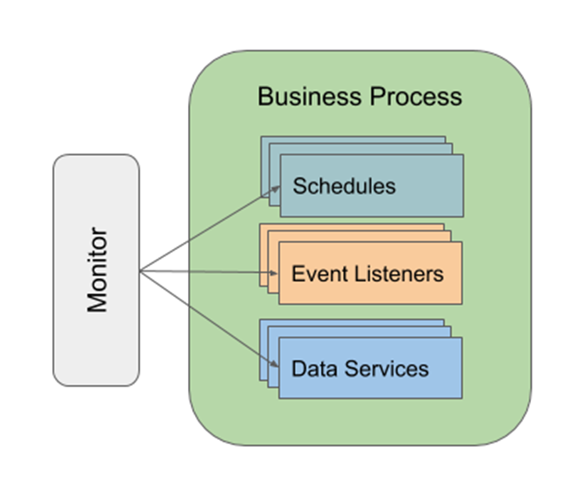
*Figure 76. Monitor*

All of the automations that can be watched by a Monitor provide a similar concept of state. They can be configured to report as failing when certain conditions are met (see [Alerts and Notification](alerts-and-notification.md)). Typical cases:

- *On each failure* - e.g. each failure of a graph marks its schedule as failing
- *On a number of consecutive failures* - e.g. 10 failures of a Data Service invocation in a row mark it as failing
- *On a % of failures during a time interval* - e.g. if 50% calls of a Data Service fail within one minute, then it’s marked as failing.

The more complex failure configurations are typically used for frequently called automations - for example API implemented by a Data Service would be considered as failing only when 10 calls of the Data Service fail in a row. On the other hand, scheduled run of an important job that performs daily load of data would be considered as failing immediately when the job fails.

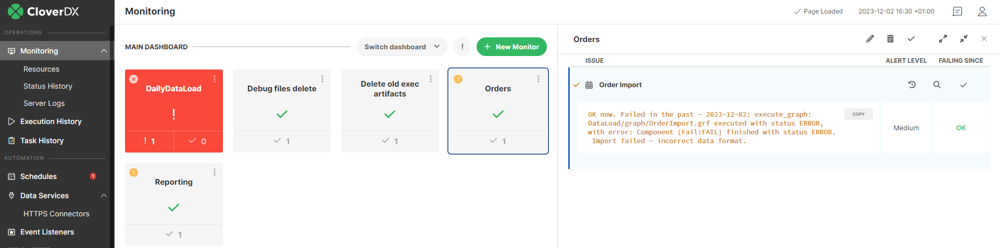
*Figure 77. Monitor warning*

If a Monitor starts to fail and then returns to passing state, it stays in a warning state. This feature is designed to prevent missing important failures in the past - for example, there can be outages during the weekend that stop happening and would be missed by support team on Monday. When you select a Monitor in the warning state, you will find warning details in some of its items. To acknowledge that the warning is handled, mark the issue as resolved (see [Operations Dashboard - issue investigation](ops-dashboard.md#issue-investigation)).

##### Issue investigation

To drill down to details about a failure, select a **Monitor** in the dashboard to see a list of its items:

*Figure 78. Monitor detail*

You can click on an item to see more of the error message and to see available actions. The **Show** action (e.g. **Show Schedule**) will navigate you to the configuration of the affected item - e.g. it will show you the configuration of the affected **Schedule**. From there you can analyze the issue in more detail, check the configuration of the item, go to the history of executions of the automation etc. The **Show history** action takes you directly to the history of the item, e.g. to history of executions of the specific Schedule.

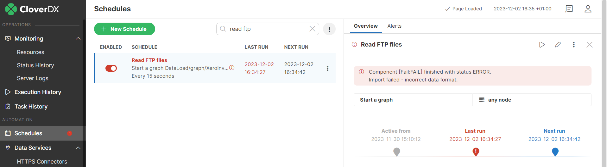
*Figure 79. Schedule detail*

The **Monitors** update their state automatically based on the state of their items. So if an item stops failing because of some intermittent issue (e.g. networking problem), its Monitor will automatically stop being marked as failing.

If a Monitor starts to fail and then returns to passing state, it stays in a warning state. This feature is designed to prevent missing important failures in the past - for example, there can be outages during the weekend that stop happening and would be missed by support team on Monday. When you select a Monitor in the warning state, you will find warning details in some of its items. To acknowledge that the warning is handled, mark the issue as resolved , see below for details.

*Figure 80. Monitor warning*

It is possible to manually reset the health of an item to mark it as successfully passing - use the **Mark as resolved** action on the item in **Operations Dashboard**. This is typically used when you fix the underlying issue that caused the failure (e.g. configuration of a system), but the item will run later and you can mark it as already resolved so that someone else will not spend time on the issue. Resolving all failures resolves the failing state of the Monitor. This action is also used to reset the state of a Monitor in warning state, where an item was failing recently but passes currently. In such case the action indicates that the recent outage was analyzed and handled.

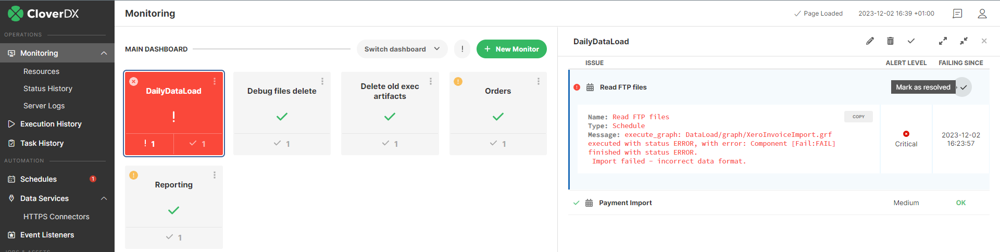
*Figure 81. Mark as resolved action*

You can use the **Mark all as resolved** action to resolve all issues in a Monitor:

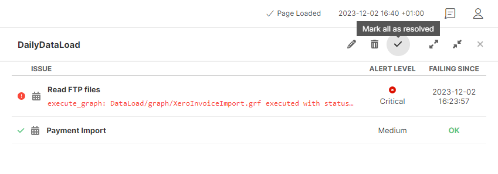
*Figure 82. Mark all as resolved action*

To analyze history of changes to the state of Monitors, use the [Monitor log](logging.md#monitor-log). It contains detailed historical information on Monitor health, failing and recovering monitored items and manual reset of item health.

##### Create & modify monitors

Monitors are manually created and the items watched by the Monitors are explicitly selected, i.e. the Monitors are not automatically generated.

Each Monitor belongs to one Dashboard. In case you have multiple Dashboards defined, you create and configure Monitors for the currently selected Dashboard.

Creating a Monitor:

- Use the **Create Monitor** tile
- Use the **Monitor all sandboxes** tile if no Monitors are created yet. This is a shortcut to automatically create Monitors for all your sandboxes.

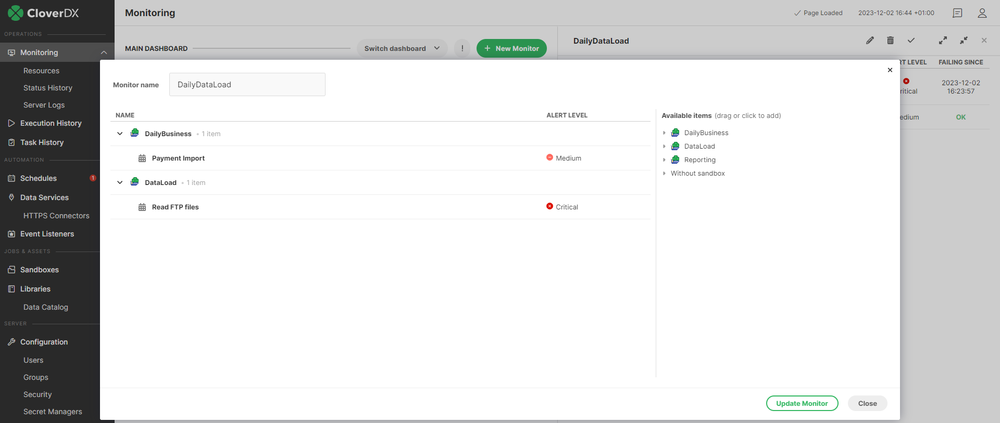
*Figure 83. Monitor configuration*

When creating a Monitor, you must specify the items it watches. These items perform the data processing or business process represented by the Monitor. To add an item to a Monitor, drag & drop it from the right side to the left. It’s possible to add all items related to a sandbox by dragging & dropping the sandbox, or to add all items of some type by e.g. dragging the **Schedules** node.

To change configuration of a Monitor, select it and use the **Edit** action. The edit action is also available in the three-dot button.

Items are not added automatically to a Monitor. For example if you create a new Schedule that runs a job from a sandbox, then you need to update some Monitor to watch the state of the Schedule.

It is possible to import & export the configuration of the dashboard and all its Monitors via the standard [Server configuration export/import](../admin/server-config.md) feature of CloverDX Server.

#### Logs

Changes to the state of Monitors are logged in the [Monitor log](logging.md#monitor-log). The Monitor log tracks changes of Monitors, such as deteriorating or improving health, which items started to fail and which recovered, manual reset of health state of monitored items etc. This allows you to analyze what was happening to your data processing in the past.

For more information, see [Monitor log](logging.md#monitor-log).

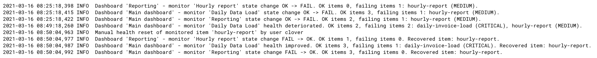
*Figure 84. Monitor log*

#### Scenarios

- *Monitor shows high number of failure, low number of successful passes* - this typically indicates that the business process represented by the Monitor is encountering a serious issue and should be investigated
- *Complex deployments* - in complex deployments with a high number of Monitors, projects, separate teams etc. you can create multiple Dashboards. For example each Dashboard would cover one project, or would be managed by one support team or
- *Tracking of fixes* - if an item is failing and you fixed the underlying issue (e.g. fixed configuration of some system, fixed networking etc.) then you can manually mark the issue as resolved (via the **Mark as resolved** action on the item). This is especially useful if the item will automatically run much later and you need to let other members of your team know that the problem is already fixed.
- *Analyze the issue* - if an item is failing, you can use the **Show schedule** (and similar) action to navigate to its configuration. There you have additional means to analyze the issue - via error message, history of previous executions etc.
- *Initial set-up of Monitors* - if you already have data processing set-up on the Server but no Monitors yet, you can use the **Monitor all sandboxes** action to create an initial set of Monitors for you.
- *Move Dashboard between Server instances* - to move configuration of a dashboard between Server instances, use the standard Configuration Migration functionality of CloverDX Server

#### API

The Operations Dashboard is backed by a modern **REST API** of the Server. This **REST API** is public and you can use it to create your own dashboards, integrate with 3rd party monitoring tools etc.

See [REST API](rest-api.md) for more details.

#### Configuration

The following configuration affects the Operations Dashboard:

- *Permissions* - the **Operations Dashboard** is available for users that have the **Monitoring UI** and **List dashboards and monitors** permissions. Moreover if a user has **Operations dashboard write access** permission, they can create and modify Monitors (for more information about permissions see [Groups](../admin/groups.md)). It is possible to define minimalistic permissions for users, so that they can use the Operations Dashboard but not have access to Event Listeners, Schedules and Data Services. In such a case the user will be able to see details of Monitors and error messages of the items, but won’t be able change configuration of the items. This setting can be useful for the support team.
- *API configuration* - there are configuration properties related to the API, see [operations.dashboard.refreshing.interval](../admin/list-of-properties.md#lop-operations-dashboard-refreshing-interval), [operations.dashboard.request.timeout](../admin/list-of-properties.md#lop-operations-dashboard-request-timeout).

#### Limitations

The Operations Dashboard currently has the following limitations:

- It monitors only automations as Schedules, Event Listeners or Data Services. It’s not possible to monitor manually (or via API) started jobs
- Newly created automations (e.g. Schedules) are not automatically added to any Monitor - you need to manually add them to some monitor.
