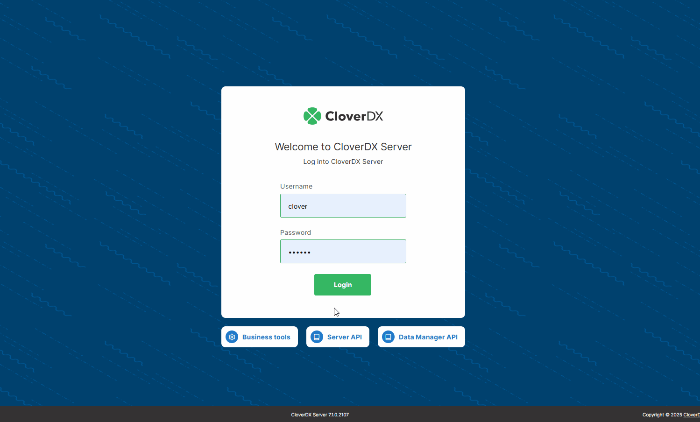

<!-- Automation and operations > Server management APIs -->

# Server management APIs

To effectively manage and interact with CloverDX Server, various types of APIs are available, each catering to different needs and preferences. These APIs provide flexible and robust mechanisms for performing various server operations or automating tasks. The options include the [**REST API**](rest-api.md), which offers a modern and widely-used approach for web-based interactions; or the [**SOAP WebService API**](soap-ws.md), which supports more structured and formal messaging standards. Understanding the capabilities and appropriate use cases for each API type is crucial for optimizing server management and ensuring seamless integration within your workflow.

*Figure 143. REST API Catalog*
