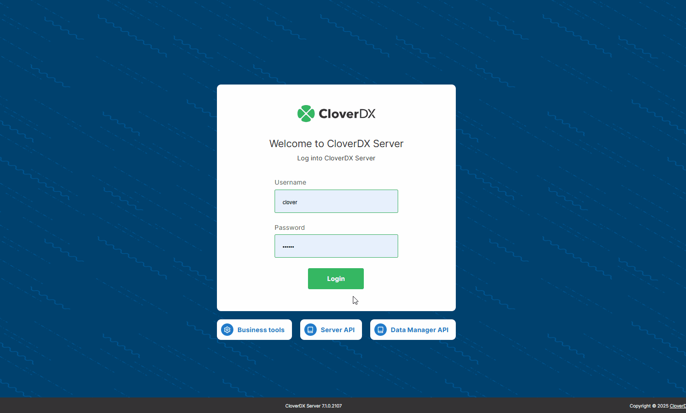

<!-- Automation and operations > Data Manager API -->

# Data Manager API

The **CloverDX Data Manager API** allows you to interact with [reference and transactional data sets](../user/data-manager-introduction.md#basic-concepts) in CloverDX Data Manager programmatically, enabling you to read these data sets as well as update them based on information from third-party systems or external data sources.
> [!NOTE]
> The Data Manager API can be used only in CloverDX Server environments with a [local Data Manager](../admin/data-manager-administration.md#local-data-manager-configuration). It is not supported when using a [remote Data Manager connection](../admin/data-manager-administration.md#remote-data-manager-configuration).

A generated REST API documentation is available at:

```
http://[domain]:[port]/clover/api/rest/data-manager/[api-version]/docs.html
```

For example:

```
http://example.com:8080/clover/api/rest/data-manager/v1/docs.html
```

You can access this page through the **Data Manager API** link on the Server Console login page. It serves as the primary resource for using the API, providing comprehensive details on all available resources, their operations (including URI paths and HTTP methods), parameters, and examples of both requests and responses. This interactive page also allows you to test API requests and view the corresponding responses directly.


*Figure 144. Data Manager API*

Requests to the API must be authenticated, the **API uses basic HTTP authentication.** Regarding authorization, the user used to authenticate the request needs to have the [required permissions](../admin/data-manager-administration.md#data-manager-permissions-in-cloverdx-server) to read or modify the data sets.

The REST API provides **protection against Cross-Site Request Forgery (CSRF) attacks.** The mechanism basically requires the presence of a `X-Requested-By` header in every request to the API, and is also controlled globally by the same configuration property [`security.csrf.protection.enabled`](../admin/list-of-properties.md#lop-security-csrf-protection-enabled).
