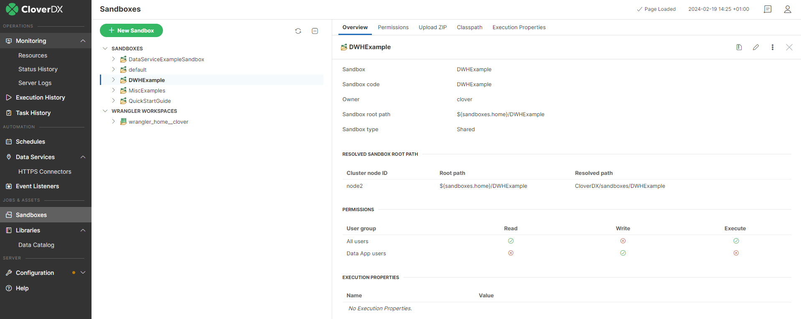
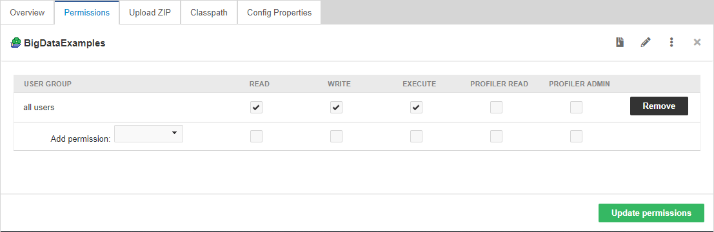
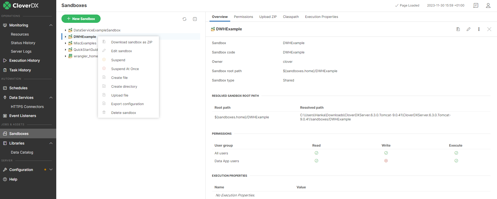
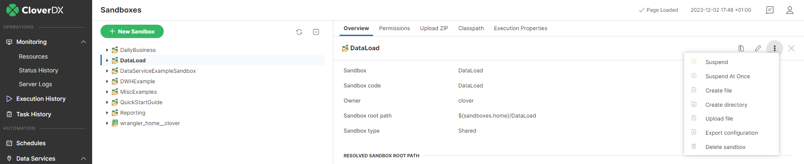
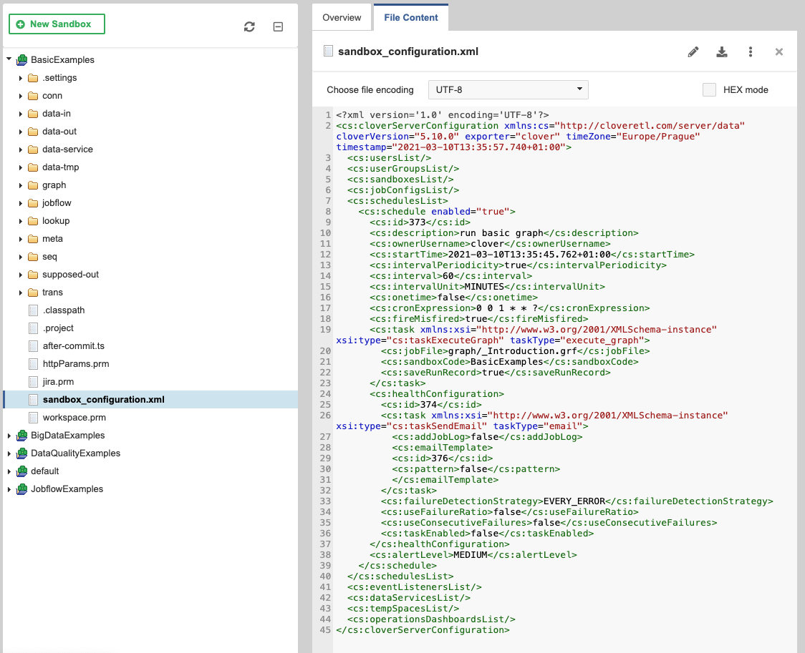
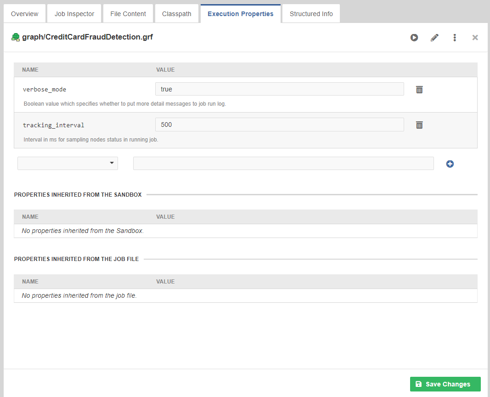
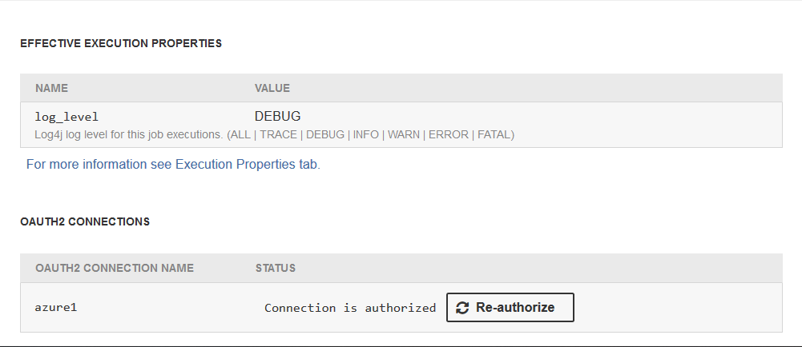

<!-- Automation and operations > Libraries, Sandboxes, and AI / ML Models modules > Sandboxes -->

## 16. Sandboxes

A sandbox is a place where you store all your project’s transformation graph files, jobflows, data, and other resources. It’s a server side analogy to a Designer project. The Server adds additional features to sandboxes, like user permissions management and global per-sandbox configuration options.

The Server and the Designer are integrated so that you are able to connect to a Server sandbox using a **Server Project** in your Designer workspace. Such a project works like a remote file system – all data is stored on the Server and accessed remotely. Nonetheless, you can do everything with Server Projects the same way as with local projects – copy and paste files, create, edit, and debug graphs, etc. See the **CloverDX Designer** manual for details on configuring a connection to the Server.

Technically, a sandbox is a dedicated directory on the Server host file system and its contents are managed by the Server. Advanced types of sandboxes, like “partitioned sandbox” have multiple locations to allow distributed parallel processing (more about that in [Sandboxes in cluster](../admin/cluster-setup-index.md#sandboxes-in-cluster)). A sandbox cannot contain another sandbox within – it’s a single root path for a project.

It is recommended to put all sandboxes in a folder outside the **CloverDX Server** installation (by default the sandboxes would be stored in the `${user.data.home}/CloverDX/sandboxes`, where the `user.data.home` is automatically detected user home directory). However, each sandbox can be located on the file system independently of the others if needed. The containing folder and all its contents must have read/write permission for the user under which the **CloverDX Server** is running.


*Figure 178. Sandboxes section in CloverDX Server Web GUI*

Each sandbox in non-cluster environment is defined by the following attributes:

| Name | Description |
| --- | --- |
| Sandbox | A sandbox name used just for display. It is specified by the user during sandbox creation and it can be modified later. |
| Sandbox ID | A unique name of the sandbox. It is used in server APIs to identify sandbox. It must meet common rules for identifiers. It is specified by user in during sandbox creation and it can be modified later. *Note: modifying is not recommended, because it may be already used by some APIs clients.* |
| Owner | It is set automatically during sandbox creation. It may be modified later. |
| Sandbox root path | The absolute server side file system path to sandbox root. It is specified by user during sandbox creation and it can be modified later. Instead of the absolute path, it’s recommended to use `${sandboxes.home}` placeholder, which may be configurable in the **CloverDX Server** configuration. So for example, for the sandbox with ID "dataReports" the specified value of the "root path" would be `${sandboxes.home}/dataReports`. Default value of `sandboxes.home` config property is `${user.data.home}/CloverDX/sandboxes` where the `user.data.home` is configuration property specifying home directory of the user running JVM process - it’s OS dependent). Thus on the unix-like OS, the fully resolved sandbox root path may be: `/home/clover/CloverDX/sandboxes/dataReports`. See [Sandboxes in cluster](../admin/cluster-setup-index.md#sandboxes-in-cluster) for details about sandboxes root path in cluster environment. |
| Sandbox type | Type of the sandbox. It can be: [local](../admin/cluster-setup-index.md#local-sandbox), [shared](../admin/cluster-setup-index.md#shared-sandbox), [partitioned](../admin/cluster-setup-index.md#partitioned-sandbox) sandboxes or [workspace](../admin/wrangler-administration.md#workspaces). |

### Sandbox content security and permissions

Each sandbox has its owner who is set during sandbox creation. This user has unlimited privileges to this sandbox as well as administrators. Another users may have access according to sandbox settings.


*Figure 179. Sandbox permissions in CloverDX Server Web GUI*

Permissions to a specific sandbox are modifiable in **Permissions** tab in sandbox detail. In this tab, selected user groups may be allowed to perform particular operations.
> [!NOTE]
> Any change in user group permissions will automatically log out all users assigned to the affected group from all their active sessions and force them to log in again.

There are the following types of operations:

| Name | Description |
| --- | --- |
| Read | Users can see this sandbox in their sandboxes list. |
| Write | Users can modify files in the sandbox through CS APIs. |
| Execute | Users can execute jobs in this sandbox.  **Note:** job executed by **graph event listener** and similar features is actually executed by the same user as job which is the source of the event. See details in **graph event listener**. Job executed by schedule trigger is actually executed by the schedule owner. See details in [Scheduling](scheduling.md). If the job needs any files from the sandbox (e.g. metadata), the user also must have **read** permission, otherwise the execution fails. |

Note that these permissions modify the access to the content of specific sandboxes. In addition, it is possible to configure permissions to perform operations with sandbox configuration (e.g. create sandbox, edit sandbox, delete sandbox, etc). For details, see [Groups](../admin/groups.md).

### Sandbox content and options

A sandbox should contain jobflows, graphs, metadata, external connection and all related files. Files, especially graph or jobflow files, are identified by a relative path from sandbox root. Thus you need two values to identify a specific job file: sandbox and path in sandbox. The path to the Jobflow or graph is often referred to as **Job file**.

Although the web GUI section **sandboxes** is not a file-manager, it offers some useful features for sandbox management:


*Figure 180. GUI - Sandboxes context menu*


*Figure 181. GUI - Sandboxes options menu*

#### Download sandbox as ZIP

Select a sandbox in the left panel, then the web GUI displays the **Download sandbox as ZIP** button in the tool bar on the right side.

Created ZIP contains all readable sandbox files in the same hierarchy as on the file system. You can use this ZIP file to upload files to the same sandbox, or another sandbox on a different Server instance.

#### Upload ZIP to sandbox

Select a sandbox in the left panel. You must have the **write** permission for the selected sandbox. Then select the **Upload ZIP** tab in the right panel. Upload of a ZIP is parametrized by couple of switches, which are described below. Click the **+ Upload ZIP** button, to open a common file browser dialog. When you choose a ZIP file, it is immediately uploaded to the Server and a result message is displayed. Each row of the result message contains a description of one single file upload. Depending on selected options, the file may be skipped, updated, created or deleted.

| Label | Description |
| --- | --- |
| Encoding of packed file names | File names which contain special characters (non ASCII) are encoded. In the drop-down list, you choose the right encoding, so filenames are decoded properly. |
| Overwrite existing files | If this checkbox is checked, the existing file is overwritten by a new one, if both of them are stored in the same path in the sandbox and both of them have the same name. |
| Delete folders and files missing in uploaded zip file | If this option is enabled, all files which are missing in uploaded ZIP file, but they exist in destination sandbox, will be deleted. This option might cause a loss of data, so the user must have the [May delete files missing in uploaded ZIP](../admin/groups.md#permission-may-delete-files) permission to enable it. |

#### Download file in ZIP

Select a file in the left pane, then the web GUI displays the **Download file as ZIP** button in the tool bar on the right side.

Created ZIP contains just the selected file. This feature is useful for large files (i.e. input or output file) which cannot be displayed directly in the web GUI, so the user can download it.

##### Download file HTTP API

It is possible to download/view the sandbox file accessing "download servlet" by a simple HTTP GET request:

`http://[host]:[port]/[Clover Context]/downloadFile?[Parameters]`

The Server requires BASIC HTTP Authentication. Thus with Linux command line HTTP client "wget" it would look like this:

```bash
wget --user=clover --password=clover
    http://localhost:8080/clover/downloadFile?sandbox=default\&file=data-out/data.dat
```

Please note, that the ampersand character is escaped by a back-slash. Otherwise, it would be interpreted as command-line system operator, which forks processes.

URL Parameters

- sandbox - Sandbox code. Mandatory parameter.
- file - Path to the file relative from sandbox root. Mandatory parameter.
- zip - If set to `true`, the file is returned as ZIP and the response content type is `application/x-zip-compressed`. By default it is `false`, so the response is the content of the file.

#### Create file

You can create a file in a sandbox by selecting the sandbox and clicking the **Options (three dots)** button on the top of the right pane, or by right-clicking the sandbox in the tree pane on the left and selecting the **Create file** option.

After that, a popup dialog is opened where you can enter the name of the file to be created. The file creation fails if there is already a file with the same name.

#### Create directory

You can create a directory in a sandbox by selecting the sandbox and clicking the **Options (three dots)** button on the top of the right pane, or by right-clicking the sandbox in the tree pane on the left and selecting the **Create directory** option.

After that, a popup dialog is opened where you can enter the name of the directory to be created. The directory creation fails if there is already a file with the same name.

#### Upload file

You can upload a file into a sandbox by selecting the sandbox and clicking the **Options (three dots)** button on the top of the right pane, or by right-clicking the sandbox in the tree pane on the left and then selecting the **Upload file** option.

After that, a file browser is opened where you can select a file to be uploaded. The upload will fail if a file with the same name already exists.

You can also simply drag and drop a file into a sandbox or directory.

#### Export sandbox configuration

You can export sandbox-related configuration by selecting the sandbox and clicking the **Export configuration** button on the top of the right pane, or by right-clicking the sandbox in the tree pane on the left and selecting the **Export configuration** option.

This action creates `sandbox_configuration.xml` file that can be imported by [Sandbox Configuration Import](sandboxes.md#sandbox-configuration-import).

#### Delete sandbox

You can delete a sandbox by selecting the sandbox and clicking the **Delete sandbox** button on the top of the right pane, or by right-clicking the sandbox in the tree pane on the left and selecting the **Delete sandbox** option.

After that, a confirmation dialog opens where you can choose to delete sandbox files on disk, as well.

### Sandbox configuration import

Sandbox-related configuration (sandbox permissions, sandbox owner username, schedules, job configs, event listeners and data services) is imported from `sandbox_configuration.xml` file in sandbox root directory, when a new sandbox is created. The XML file should contain configuration related to the one sandbox, e.g. schedules that trigger graphs in the sandbox. Sandbox directory containing the configuration file must be present before creating the sandbox from server console.

This functionality helps with deployment and versioning of the whole sandbox and configuration entities related to it. The sandbox thus contains "code" (graphs, jobflows etc), related files (parameters, connections, etc.) and also configuration to be created in Server (e.g. schedules that periodically run the graphs, event listeners that trigger the graphs on some event etc.).


*Figure 182. Sandbox configuration import*

The sandbox configuration is automatically imported only if the `sandbox_configuration.xml` file is found when the sandbox is created. If an error occurs during import of the sandbox configuration, the sandbox is still created. Only specific elements are imported from the file (sandbox permissions, sandbox owner username, schedules, job configs, event listeners and data services), other entities are ignored (e.g. users).

Only entities referring to sandboxCode of the newly created sandbox are imported (e.g. if a scheduler runs a graph from sandbox "myproject", then the new sandbox must have "myproject" sandbox code). It is allowed to use empty sandboxCode element in entities. Empty `<sandboxCode></sandboxCode>` stands for "this" .. current sandbox. The **Export configuration** action creates sandbox configuration file with current sandbox code value.

Sandbox configuration import is automatically started only when sandbox is being created. It means that configuration import is not performed for example during sandbox ZIP file upload, because sandbox already exists in this case. For manual update of sandbox configuration from XML file use [REST API](rest-api.md).

When the sandbox is created, messages with summary information about the import are shown. Detailed information about the imported configuration can be found in the `all.log`.

When the Server starts for the first time, it can automatically create sandboxes it detects in a directory, see [sandboxes.autoimport](../admin/list-of-properties.md#lop-sandboxes-autoimport) configuration property (this is enabled by default in our Docker container). Configuration is also imported from all of the automatically created sandboxes, and if any of the imports fails it will fail the Server’s startup (i.e. fast fail).

To create the `sandbox_configuration.xml`, use the **Export configuration** action on the sandbox. The action creates the file with configuration entities that are related to the sandbox (e.g. schedule that triggers a graph in the sandbox).

### Execution properties

Each graph or jobflow may have a set of execution properties which are applied during its execution, for example to change the log level, number of parallel executions etc. The properties can be set in the job’s XML file (via **CloverDX Designer**) or in the **Server Console**. For more information see [Execution properties](../developer/jobconfig.md).


*Figure 183. Execution properties*

### OAuth2 connections

In case graph or jobflow contains OAuth2 connections a special section is displayed in **Overview** page. There user can start authorization process for available OAuth2 connections.

OAuth2 connection has to be authorized by manual interactive process in which user gives the connection access to their resources. A new tab is open in the browser where user can interact with OAuth2 provider UI. After successfull autorization connection is displayed as autorized. User may repeat the authorization process by using the **Re-authorize** button.

OAuth2 connection can be authorized also by using [Job Inspector](execution-history-main.md#overview).


*Figure 184. OAuth2 connections*

See also [OAuth2 connections in Designer](../developer/oauth2-connections.md).

### WebDAV access to sandboxes

Since 3.1

WebDAV API allows you to access and manage sandbox content using a standard WebDAV specification.

Specifically, it allows for:

- Browsing a directory structure
- Editing files
- Removing files/folders
- Renaming files/folders
- Creating files/folders
- Copying files
- Moving files

The WebDAV interface is accessible from the URL: "http://[host]:[port]/clover/webdav".

Note: Although common browsers will open this URL, most of them are not rich WebDAV clients. Thus, you will only see a list of items, but you cannot browse the directory structure.

#### WebDAV clients

There are many WebDAV clients for various operating systems, some OS support WebDAV natively.

##### Linux like OS

Great WebDAV client working on Linux systems is Konqueror. Please use different protocol in the URL: `webdav://[host]:[port]/clover/webdav`

Another WebDAV client is Nautilus. Use different protocol in the URL `dav://[host]:[port]/clover/webdav`.

##### MS windows

Last distributions of MS Windows (Win XP and later) have native support for WebDAV. Unfortunately, it is more or less unreliable, so it is recommended to use some free or commercial WebDAV client.

- The best WebDAV client we’ve tested is BitKinex: [http://www.bitkinex.com/webdavclient](http://www.bitkinex.com/webdavclient)
- Another option is to use Total Commander ([http://www.ghisler.com/index.htm](http://www.ghisler.com/index.htm)) with WebDAV plugin: [http://www.ghisler.com/plugins.htm#filesys](http://www.ghisler.com/plugins.htm#filesys)

##### Mac OS

Mac OS supports WebDAV natively and in this case it should be without any problems. You can use "finder" application, select "Connect to the server …​" menu item and use URL with HTTP protocol: "http://[host]:[port]/clover/webdav".

#### WebDAV authentication/authorization

**CloverDX Server** WebDAV API uses the HTTP Basic Authentication by default. However it may be reconfigured to use HTTP Digest Authentication.

Digest Authentication may be useful, since some WebDAV clients can’t work with HTTP Basic Authentication, only with Digest Authentication.

HTTP Digest Authentication is a feature added to the version 3.1. If you upgraded your older **CloverDX Server** distribution, users created before the upgrade cannot use the HTTP Digest Authentication until they reset their passwords. So when they reset their passwords (or the admin does it for them), they can use Digest Authentication as well as new users.

The HTTP Digest Authentication is configured with `security.digest_authentication.*` configuration properties. To enable it, set `security.digest_authentication.features_list` to contain features that are listed in the `security.digest_authentication.features_list`. As items in `security.basic_authentication.features_list` have higher priority, you should empty it to allow HTTP Digest Authentication to be used.

See [List of configuration properties](../admin/list-of-properties.md) for details.

For details on authentication methods, see [https://tools.ietf.org/html/rfc7617](https://tools.ietf.org/html/rfc7617) and [https://tools.ietf.org/html/rfc2617](https://tools.ietf.org/html/rfc2617).
