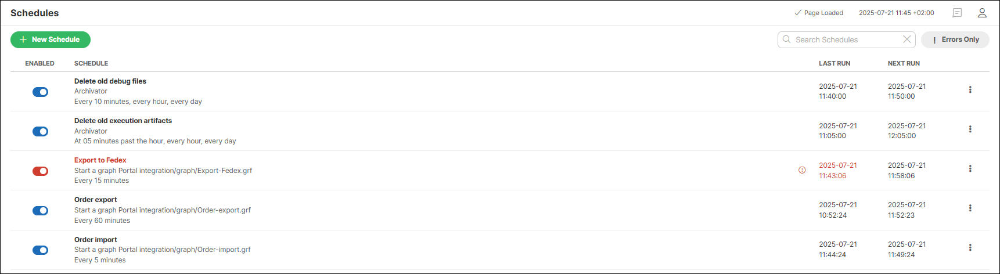
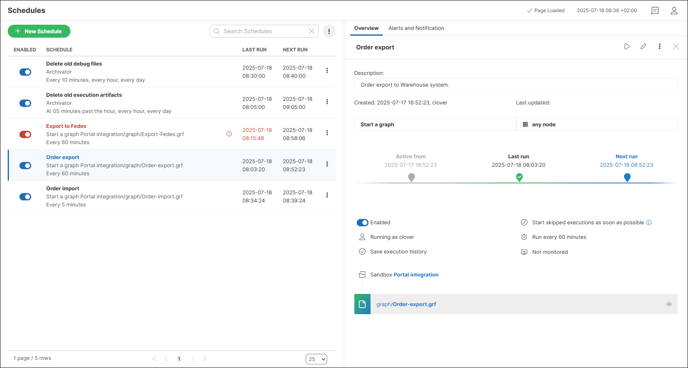
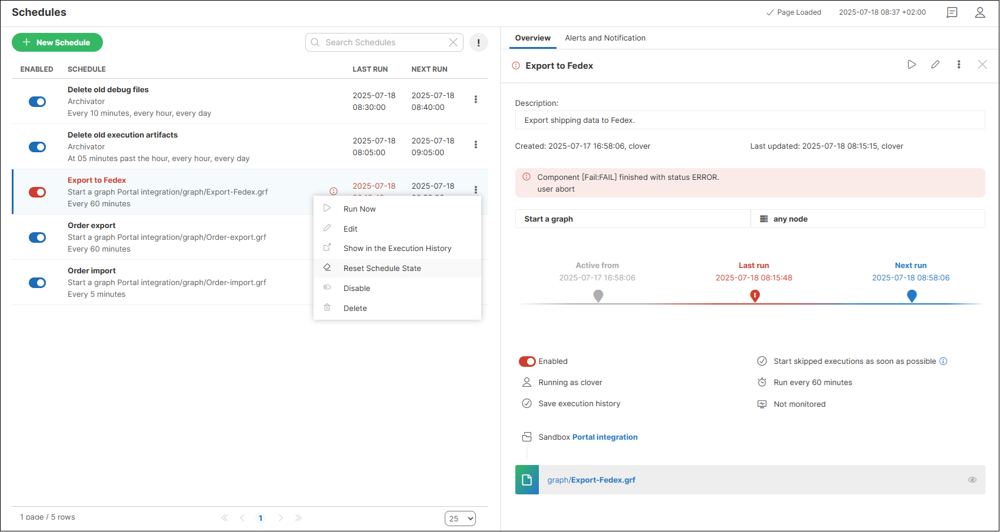
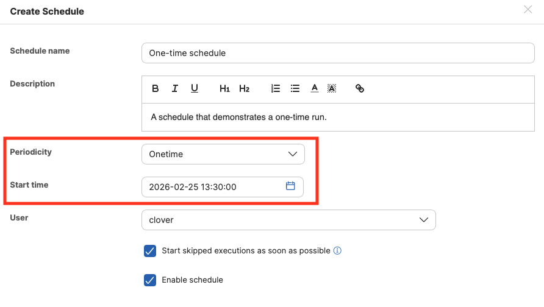
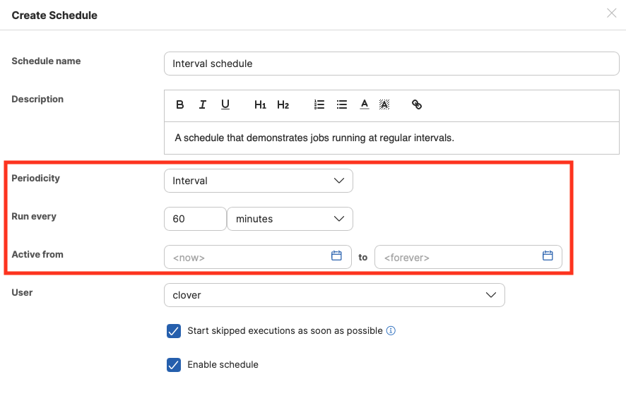
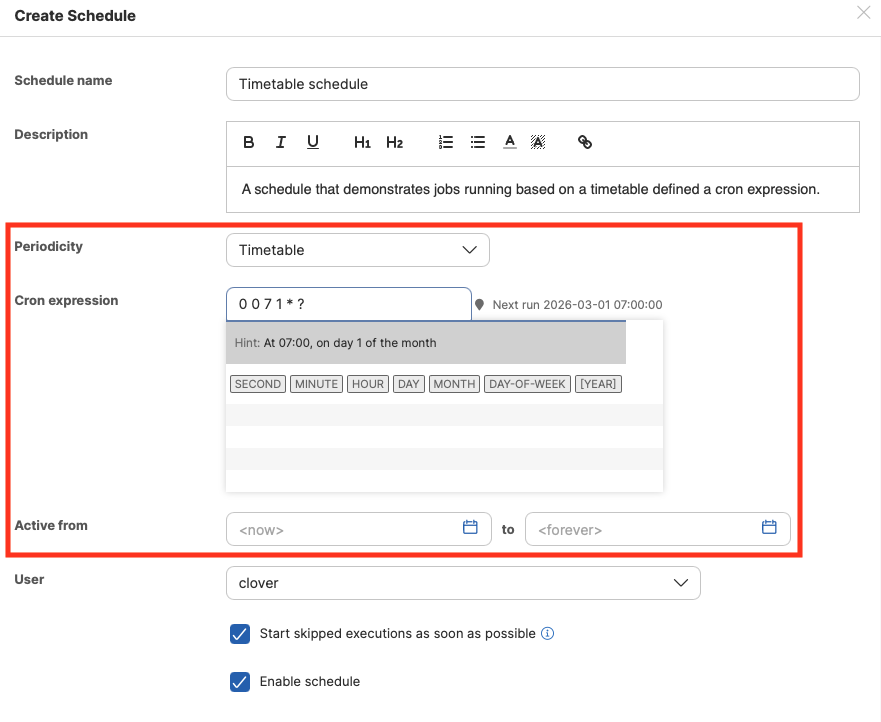
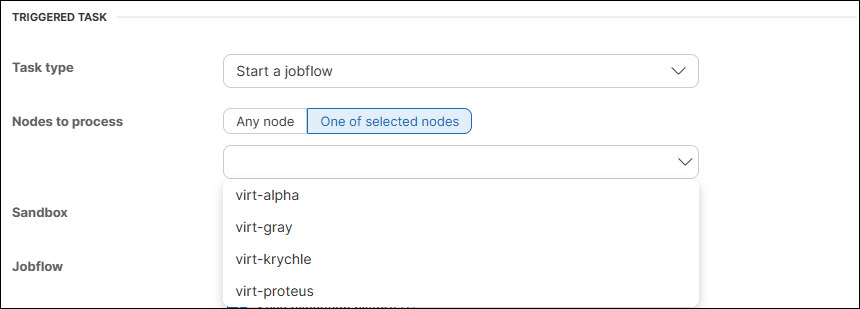
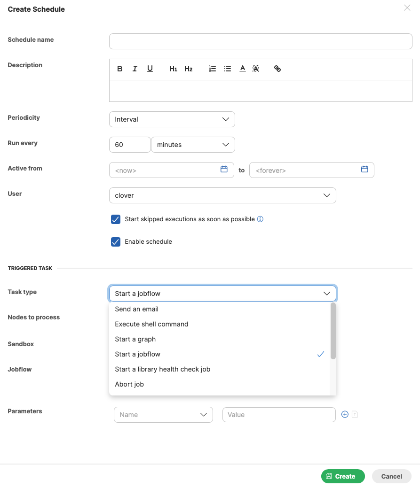
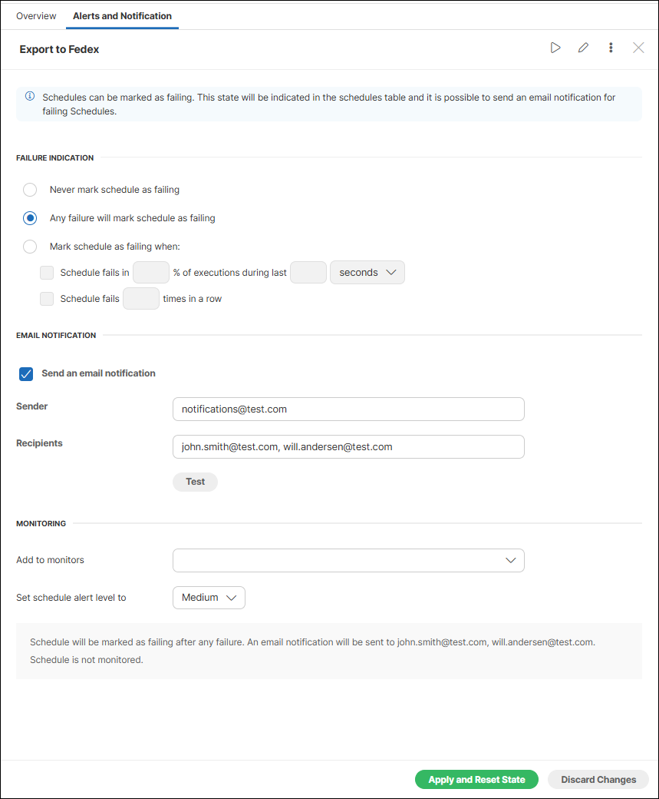

<!-- Automation and operations > Automation > Scheduling -->

## 2. Scheduling

The scheduling module allows you to create a time schedule for operations you need to trigger in a repetitive or timely manner. Similar to cron from Unix systems, each schedule represents a separate time schedule definition and a task to perform.

*Figure 10. List of schedules*

The list of schedules provides the following information and options:

| Column name | Description |
| --- | --- |
| Enabled | Indicates whether the schedule is enabled or disabled. Clicking the icon enables/disables the schedule. |
| Schedule | Displays the schedule name, task type and its execution timing. |
| Last run | Shows the date and time of the last run. |
| Next run | Shows the date and time of the next scheduled run. |
| **⋮** | Click the kebab menu to open a submenu with the following options:  - **Run Now**[[1]](scheduling.md#schedules-fn-01) - Runs the scheduled task immediately. - **Edit** - Opens the schedule editor. - **Show in the Task History** - Opens the related records in the Execution History. - **Disable/Enable** - Changes the schedule status. When disabled, the schedule will not run. - **Delete** - Permanently removes the schedule. |

| 1 | If your Server environment is suspended, this action requires explicit confirmation of execution on the suspended server. |
| --- | --- |

Clicking on a schedule opens a pane on the right side, where the **Overview** tab displays additional information such as the schedule description[[2]](scheduling.md#schedules-fn-02) (if provided), the creation[[3]](scheduling.md#schedules-fn-03) and last update date along with the associated user [[4]](scheduling.md#schedules-fn-04), last and next run times, and other schedule details.

You can set up [alerts and notifications](scheduling.md#alerts-and-notifications) for failed schedules on the **Alerts and Notifications** tab.

| 2 | Descriptions can be added in CloverDX version 7.1 or higher. |
| --- | --- |

| 3 | This information is populated only for schedules created in CloverDX version 7.1 or higher. |
| --- | --- |

| 4 | This information is populated only for schedules updated in CloverDX version 7.1 or higher. |
| --- | --- |

*Figure 11. Web GUI - Scheduling*

If a schedule is failing, you can see the cause of the failure in the right pane, and there is an additional action available in the **⋮** menu: **Reset schedule state**. When selecting this action, the schedule is no longer marked as failing. It acts as if it were never run, but its timeline is still visible in the detail pane. This function is useful when you fix a failing schedule with a long interval between runs and by resetting the state, you mark the schedule as OK. This way, it doesn’t cause a distraction by being shown as failing until its status is refreshed in the next run.

*Figure 12. Failed schedule details*

### Timetable settings

This section describes how to configure schedule triggers. Note that exact trigger times are not guaranteed; a delay of a few seconds may occur. There are three schedule types: **one-time, timetable (Cron-based)**, and **interval schedules.**

| [Onetime schedule](scheduling.md#one-time-schedule) |
| --- |
| [Periodical schedule by interval](scheduling.md#periodical-schedule-by-interval) |
| [Periodical schedule by timetable (cron expression)](scheduling.md#periodical-schedule-by-timetable-cron-expression) |

#### One-time schedule

This schedule is triggered just once.

| Name | Description |
| --- | --- |
| Periodicity | Onetime |
| Start time | Date and time, specified in the `yyyy-mm-dd hh:mm:ss` format. |
| Start skipped executions as soon as possible | If checked and execution is skipped for any reason (e.g., due to a server restart or [job queue emergency mode](job-queue.md#emergency-mode)), the task will be triggered as soon as possible. If not checked, the missed execution is ignored and will be triggered at the next scheduled time. |

*Figure 13. Web GUI - onetime schedule form*

#### Periodical schedule by interval

This type of schedule is the simplest periodical type. Trigger times are specified by these attributes:

| Name | Description |
| --- | --- |
| Periodicity | Interval |
| Run every | Specifies the interval between two trigger times (in *seconds, minutes*, or *hours*). The next task is triggered even if the previous task is still running. |
| Active from/to | Date and time, specified in the `yyyy-mm-dd hh:mm:ss` format. |
| Start skipped executions as soon as possible | If checked and execution is skipped for any reason (e.g., due to a server restart or [job queue emergency mode](job-queue.md#emergency-mode)), the task will be triggered as soon as possible. If not checked, the missed execution is ignored and will be triggered at the next scheduled time. |

*Figure 14. Web GUI - periodical schedule form*

#### Periodical schedule by timetable (cron expression)

This schedule type allows you to create a timetable specified by a cron expression.

| Name | Description |
| --- | --- |
| Periodicity | Timetable |
| Cron expression | Cron is a job scheduler that uses its own format for scheduling. E.g., `0 0/2 4-23 * * ?` means "every 2 minutes between 4:00 AM and 11:59 PM". |
| Active from/to | Date and time, specified in the `yyyy-mm-dd hh:mm:ss` format. |
| Start skipped executions as soon as possible | If checked and execution is skipped for any reason (e.g., due to a server restart or [job queue emergency mode](job-queue.md#emergency-mode)), the task will be triggered as soon as possible. If not checked, the missed execution is ignored and will be triggered at the next scheduled time. |

*Figure 15. Cron periodical schedule form*

When setting up a cron expression, a hint displays it in a human-readable format. Furthermore, when you click on each field in the expression, the hint expands, indicating which part of the expression you are editing, and listing symbols, their meaning, and values that can be used in the expression.
> [!NOTE]
> Server cron expression for *Days of Week* differs from *nix cron expression. Days in the cron expression in CloverDX Server start from 1, which corresponds to Sunday. *nix cron expression uses 0 or 7 for Sunday.

### Allocations of scheduled tasks on nodes

In a **cluster** environment, you can set the node on which the scheduled task will be launched. If not set, the node will be selected automatically from all available nodes (but always just one).

If you choose:

- **Any node** - one of the available nodes will be selected automatically.
- **One of selected nodes** - you can select which node will run the task.

*Figure 16. Schedule allocation - One or more specific nodes*

### Tasks

When creating a schedule, you can choose from a variety of task types to trigger. For more information on each task type, see the [Tasks](tasks.md) section.

| [Send an email](tasks.md#send-an-email) |
| --- |
| [Execute shell command](tasks.md#execute-shell-command) |
| [Start a graph](tasks.md#start-a-graph) |
| [Start a jobflow](tasks.md#start-a-jobflow) |
| [Start a library health check job](tasks.md#start-a-library-health-check-job) |
| [Abort job](tasks.md#abort-job) |
| [Archivator](tasks.md#archive-records) |
| [Data Manager Expired Row Purge](tasks.md#data-manager-expired-row-purge) |
| [Send a JMS message](tasks.md#send-a-jms-message) |
| [Execute Groovy code](tasks.md#execute-groovy-code) |

*Figure 17. Available tasks*

### Alerts and notifications

The **Alerts and Notification** tab enables you to define the conditions under which a schedule is marked as failing. You can also set up email notifications for failures here and set up monitoring in the Operations Dashboard. See [Alerts and notifications](alerts-and-notification.md) for more details.

*Figure 18. Schedule - Alerts and Notification*
