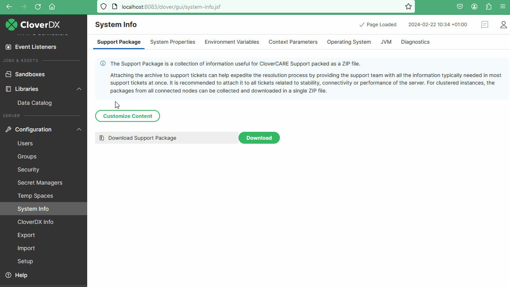
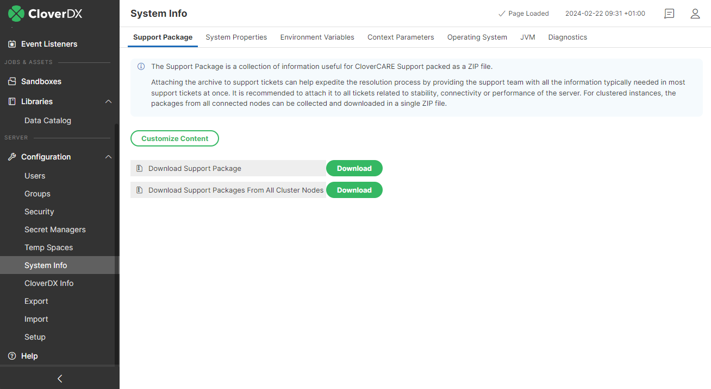

<!-- Automation and operations > Operations > Server logs & troubleshooting > Support package -->

### Support package

**CloverDX Server** allows you to create a **support package** to expedite troubleshooting assistance from the CloverDX Support team. This package provides essential information about your server environment, streamlining the resolution process.

The **support package** is a ZIP file containing various information collected from your **CloverDX Server** and the execution environment, namely:

- [**CloverDX Server** log files](monitoring-server-logs.md)
- Application container log files
- Worker garbage collector log files
- Java Virtual Machine attributes
- Java system properties
- Operating system properties
- Server core and worker thread dumps
- License information
- **CloverDX Server** configuration (not included by default)

All information in the ZIP file is stored in text files and, if needed, you can check the package content and remove any sensitive data before attaching it to your CloverDX support ticket.

#### Downloading support package
> [!NOTE]
> The size of the support package is limited to 50 MB by default to meet the upload limit of the CloverDX website. The server packs the log files starting with the newest ones until the limit is reached. This can be disabled to pack all of the present log files should they be needed for the troubleshooting.
>
> When downloading support packages from all cluster nodes, the size limit applies to individual node packages, not to the resulting common ZIP file.

1. In the CloverDX Server GUI, go to **Configuration** ****System Info** ****Support Package tab**.
2. To download the support package click on the **Download** button next to **Download Support package**. You can optionally customize the content of the package and include the server configuration file or select to ignore the default 50 MB limit.

*Figure 111. Support package download in standalone server environments*

- In **cluster environments**, clicking on the **Download** button next to **Download Support package** downloads a support package just for the node you are connected to. To download support packages from all connected cluster nodes, click on the **Download** button next to **Download Support Packages From All Cluster Nodes**. This will collect individual packages from all cluster nodes and download them all in a single ZIP file.

*Figure 112. Support package options in cluster environments*
