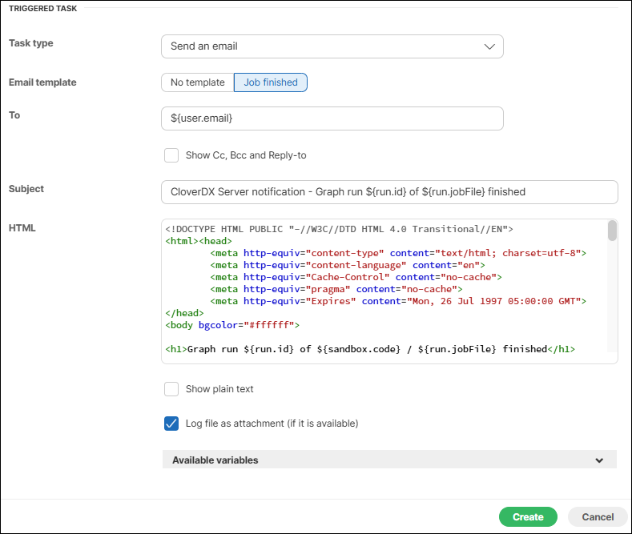
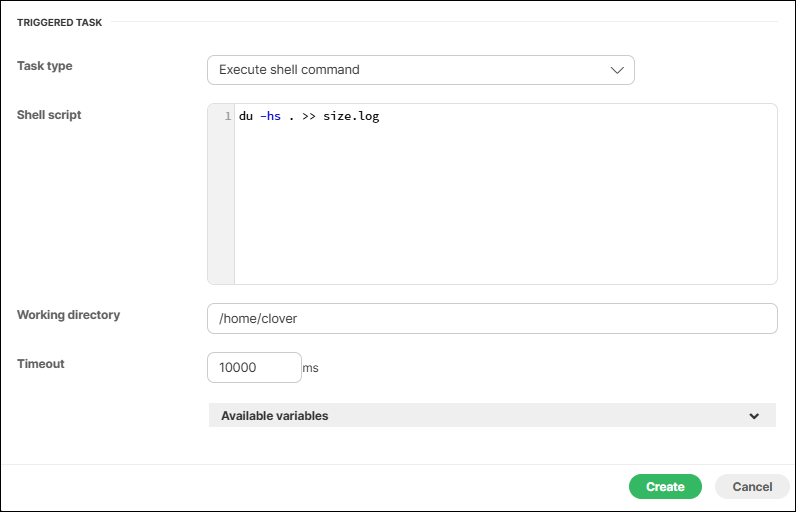
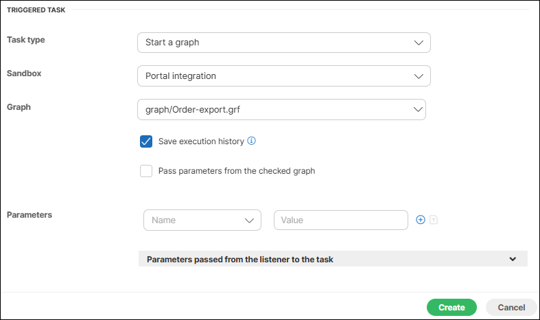
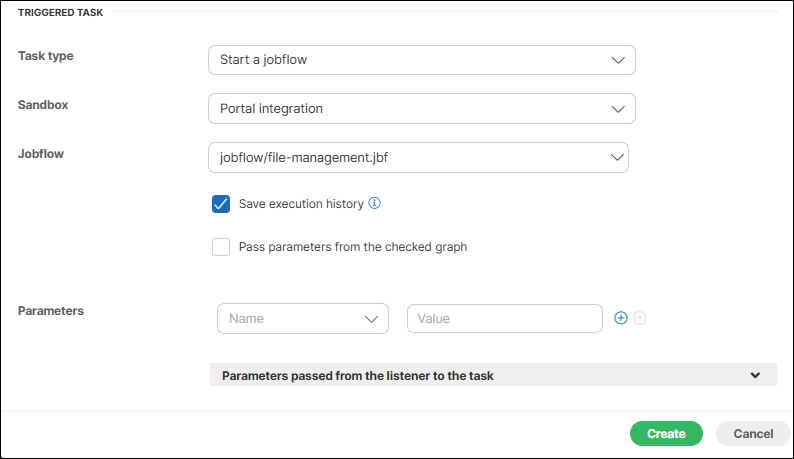
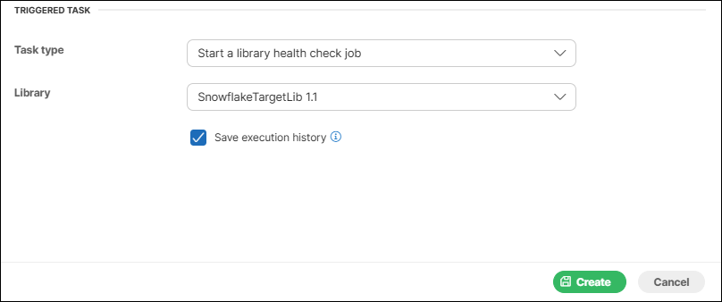
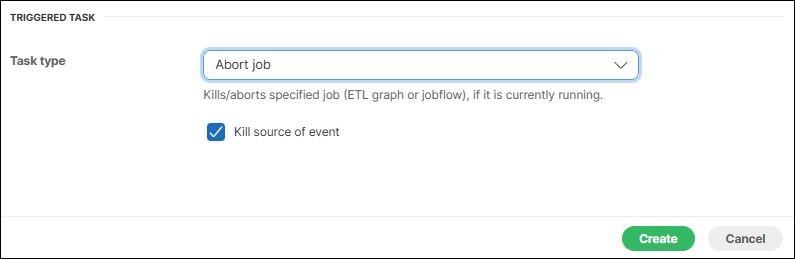
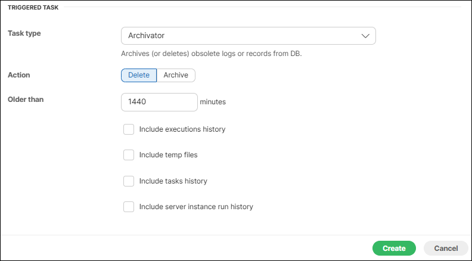
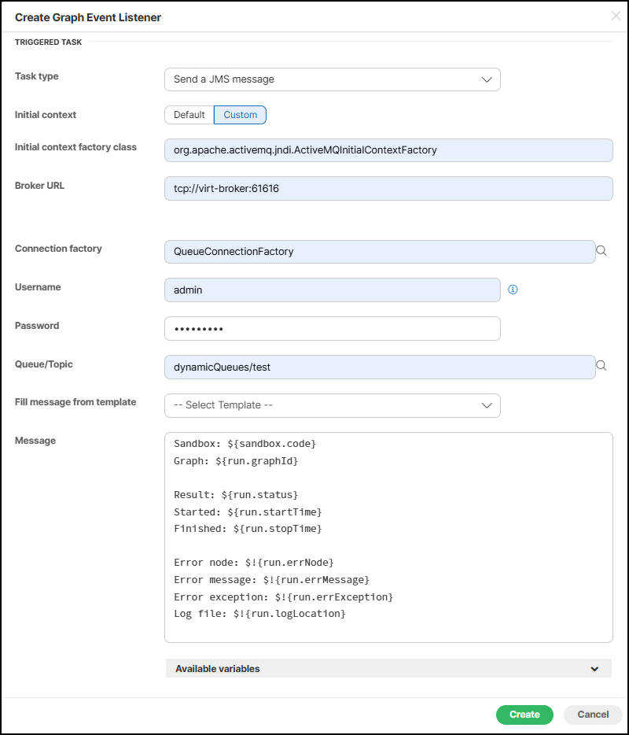
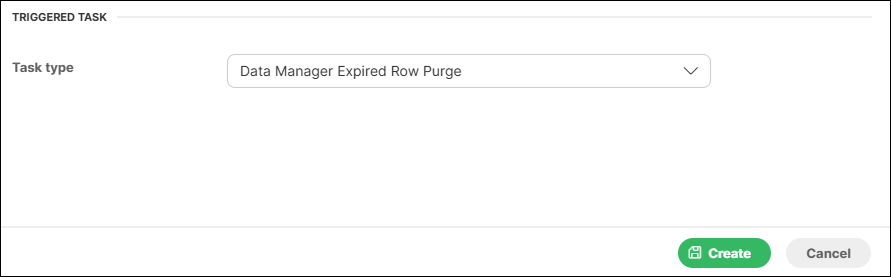

<!-- Automation and operations > Automation > Tasks -->

## 1. Tasks

A task is a graph, jobflow, Groovy script, etc. that can be started manually, started on scheduled time, or triggered by some event. A task specifies WHAT to do.

Tasks are used in:

| [Scheduling](scheduling.md) |
| --- |
| [Listeners](listeners.md) |
| [Manual task execution](manual-task-execution.md) |

There are several tasks implemented for schedule and graph event listeners as follows:

- [Start a graph](tasks.md#start-a-graph)
- [Start a jobflow](tasks.md#start-a-jobflow)
- [Start a library health check job](tasks.md#start-a-library-health-check-job)
- [Abort job](tasks.md#abort-job)
- [Execute shell command](tasks.md#execute-shell-command)
- [Send an email](tasks.md#send-an-email)
- [Execute Groovy code](tasks.md#execute-groovy-code)
- [Archive records](tasks.md#archive-records)
- [Data Manager Expired Row Purge](tasks.md#data-manager-expired-row-purge)

In **cluster environment**, you can specify a node where the task runs. The task can run on **Any node** or on **one of selected nodes**. If there is no node ID specified, the task may be processed on any cluster node; so in most cases, it will be processed on the same node where the event was triggered. If there are some nodeIDs specified, task will be processed on the first node in the list which is connected in cluster and ready.

### Send an email

The **send e-mail** task is useful for notifications about a result of graph execution. For example, you can create a listener with this task type to be notified about each failure in the specified sandbox or a failure of the particular graph.

This task is very useful, but for now only as a response for graph events. This feature is very powerful for monitoring. (for description of this task type, see [Graph event listeners](listeners.md#graph-event-listeners)).

| Name | Description |
| --- | --- |
| Task type | "Send an email" |
| To | The recipient’s email address. It is possible to specify more addresses separated by a comma. It is also possible to use placeholders. For more information, see [Placeholders](tasks.md#placeholders). |
| Cc | Cc stands for 'carbon copy'. A copy of the email will be delivered to these addresses. It is possible to specify more addresses separated by a comma. It is also possible to use placeholders. For more information, see [Placeholders](tasks.md#placeholders). |
| Bcc | Bcc: stands for 'Blind carbon copy'. It is similar as Cc, but the others recipients aren’t aware, that these recipients received a copy of the email. |
| Reply-to (Sender) | Email address of sender. It must be a valid address according to the SMTP server. It is also possible to use placeholders. For more information, see [Placeholders](tasks.md#placeholders). |
| Subject | An email subject. It is also possible to use placeholders. For more information, see [Placeholders](tasks.md#placeholders). |
| HTML | A body of the email in HTML. The email is created as multipart, so the HTML body should have a precedence. A plain text body is only for email clients which do not display HTML. It is also possible to use placeholders. For more information, see [Placeholders](tasks.md#placeholders). |
| Text | A body of the email in plain text. The email is created as multipart, so the HTML body should have a precedence. A plain text body is only for email clients which do not display HTML. It is also possible to use placeholders. For more information, see [Placeholders](tasks.md#placeholders). |
| Log file as attachment | If this switch is checked, the email will have an attachment with a packed log file of the related graph execution. |


*Figure 1. Web GUI - send email*

*Note: Do not forget to configure a connection to a SMTP server (see [Email configuration](../admin/setup.md#e-mail)).*

#### Placeholders

Placeholder may be used in some fields of tasks. They are especially useful for email tasks, where you can generate the content of email according to context variables.

*Note: In most cases, you can avoid this by using email templates (See E-mail task for details)*

These fields are preprocessed by Apache Velocity templating engine. See the Velocity project URL for syntax description *[http://velocity.apache.org/](http://velocity.apache.org/)*. CloverDX is compatible with Apache Velocity v2.3.

There are several context variables, which you can use in placeholders and even for creating loops and conditions.

- *event*
- *now*
- *user*
- *run*
- *sandbox*

Some of them may be empty depending on the type of the event. For example, if a task is processed because of a graph event, then *run* and *sandbox* variables contain related data, otherwise they are empty.

| Variable name | Contains |
| --- | --- |
| now | Current date-time |
| user | The user, who caused this event. It may be an owner of a schedule, or someone who executed a graph. It contains sub-properties which are accessible using dot notation (i.e. ${user.email}) email:  - user.email - user.username - user.firstName - user.lastName - user.groups (list of values) |
| run | A data structure describing one single graph execution. It contains sub-properties which are accessible using dot notation (i.e. ${run.jobFile})  - job.jobFile - job.status - job.startTime - job.stopTime - job.errNode - job.errMessage - job.errException - job.logLocation |
| tracking | A data structure describing a status of components in a graph execution. It contains sub-properties which are accessible using the Velocity syntax for loops and conditions.   ```velocity #if (${tracking}) <table border="1" cellpadding="2" cellspacing="0"> #foreach ($phase in $tracking.trackingPhases) <tr><td>phase: ${phase.phaseNum}</td>     <td>${phase.executionTime} ms</td>     <td></td><td></td><td></td></tr>    #foreach ($node in $phase.trackingNodes)       <tr><td>${node.nodeName}</td>           <td>${node.result}</td>           <td></td><td></td><td></td></tr>       #foreach ($port in $node.trackingPorts)          <tr><td></td><td></td>              <td>${port.type}:${port.index}</td>              <td>${port.totalBytes} B</td>              <td>${port.totalRows} rows</td></tr>       #end    #end #end </table> #end } ``` |
| sandbox | A data structure describing a sandbox containing an executed graph. It contains sub-properties which are accessible using dot notation (i.e. ${sandbox.name})  - sandbox.name - sandbox.code - sandbox.rootPath |
| schedule | A data structure describing a schedule which triggered this task. It contains sub-properties which are accessible using dot notation (i.e. ${schedule.description})  - schedule.description - schedule.startTime - schedule.endTime - schedule.lastEvent - schedule.nextEvent - schedule.fireMisfired |

### Execute shell command

**Execute Shell Command** executes a system command or shell script.

This task is used in [Scheduling](scheduling.md), [Listeners](listeners.md) and [Manual Task Execution](manual-task-execution.md).

| Name | Description |
| --- | --- |
| Task type | "Execute shell command" |
| Start on | Node IDs to process the task.  This attribute is accessible only in cluster environment. If there are nodes specified, the task will be processed on the first node which is online and ready. |
| Shell script | Command line for execution of external process. |
| Working directory | A working directory for the process.  If not set, the working directory of the application server process is used. |
| Timeout | Timeout in milliseconds. After a period of time specified by this number, the external process is terminated and all results are logged. |


*Figure 2. Web GUI - shell command*

#### Execute shell command parameters

Some parameters are available only in particular context: scheduling, event listeners, or manual task execution.

| Name | Description |
| --- | --- |
| event | An event that has triggered the task |
| now | Current date-time |
| task | The triggered task |
| user | The object representing the user who executed the graph/jobflow. It contains sub-properties that are accessible using dot notation (i.e. ${user.email})  - user.email - user.username - user.firstName - user.lastName - user.groups (list of values) |
| **Parameters available in Scheduling** |  |
| schedule | The object representing the schedule that triggered this task. It contains sub-properties that are accessible using dot notation (i.e. ${schedule.description})  - schedule.description - schedule.startTime - schedule.endTime - schedule.lastEvent - schedule.nextEvent - schedule.fireMisfired |
| EVENT_USERNAME | The name of the user who caused the event. |
| EVENT_USER_ID | The numeric ID of the user who caused the event. |
| EVENT_SCHEDULE_DESCRIPTION | A description of the schedule. |
| EVENT_SCHEDULE_EVENT_TYPE | The type of the schedule - SCHEDULE_ONETIME or SCHEDULE_PERIODIC. |
| EVENT_SCHEDULE_ID | The numeric ID of the schedule |
| EVENT_SCHEDULE_LAST_EVENT | Date-time of the latest schedule triggering (in java.util.Date.toString() format). |
| **Parameters available in Listeners** |  |
| run | The object representing a single graph/jobflow execution. It contains sub-properties that are accessible using dot notation (i.e. ${run.jobFile}).  - run.jobFile - run.status - run.startTime - run.stopTime - run.errNode - run.errMessage - run.errException |
| sandbox | The object representing a sandbox containing the executed graph/jobflow. It contains sub-properties that are accessible using dot notation (i.e. ${sandbox.name})  - sandbox.name - sandbox.code - sandbox.rootPath |
| tracking | An object representing a status of components in a graph execution. It contains sub-properties that are accessible using Velocity syntax for loops and conditions. |
| EVENT_USERNAME | The name of the user who caused the event. |
| EVENT_USER_ID | A numeric ID of the user who caused the event. |
| EVENT_RUN_SANDBOX | A code of the sandbox containing the graph/jobflow. |
| EVENT_RUN_JOB_FILE | A sandbox-relative path to the graph/jobflow file. |
| EVENT_RUN_RESULT | The current status of the graph/jobflow execution  - N_A - READY - RUNNING - WAITING - FINISHED_OK - ERROR - ABORTED - TIMEOUT - UNKNOWN |
| EVENT_RUN_ID | A numeric ID of the run record representing graph/jobflow execution |
| EVENT_TIMEOUT | A specified timeout (in milliseconds) for the TIMEOUT event to occur. |
| EVENT_JOB_EVENT_TYPE | Graph event that triggered the task  - GRAPH_STARTED - GRAPH_PHASE_FINISHED - GRAPH_FINISHED - GRAPH_ERROR - GRAPH_ABORTED - GRAPH_TIMEOUT - GRAPH_STATUS_UNKNOWN |
| **Parameters available in Manual Task Execution** |  |
| parameters | Task parameters - container for String-String key-value pairs passed to this task. |

### Start a graph

**Start a Graph** starts a specified graph from a specified sandbox.

| Name | Description |
| --- | --- |
| Task type | "Start a graph" |
| Start on | Node(s) to process the task.  This attribute is accessible only in cluster environment. If there are nodes specified, the task will be processed on the first node which is online and ready. |
| Sandbox | This select box contains sandboxes which are readable for the logged user. Select the sandbox which contains the graph to execute. |
| Graph | The graph to be executed.  This select box is filled with all graphs files accessible in the selected sandbox. Type a graph name or path to filter available items. |
| Save execution history | Information about the execution of the graph is saved to database.  If the task runs too often (once in several seconds), you can increase the database performance by disabling this attribute. |
| Pass parameters from the checked graph (jobflow) | Allows the user to pass parameters from the checked graph (jobflow) to the graph triggered by this event listener.  Check the option and enter a comma-separated list of parameters to be passed in the newly appeared field. |
| Parameters | A list of parameters passed to the graph.  Event parameters like `EVENT_RUN_RESULT`, `EVENT_RUN_ID`, etc. are passed to the executed job without limitations. The `EVENT_RUN_RESULT` and `EVENT_RUN_ID` parameters are used in context of event listeners. They are not used in context of scheduling. |


*Figure 3. Web GUI - Graph execution task*

Please note that the behavior of this task type is almost the same as [Start a jobflow](tasks.md#start-a-jobflow).

#### Parameters

You can start a graph with parameters.

To start a graph with a parameter, choose an existing parameter from the list, set its value, and click the **plus sign** button at the end of line.

If the graph is started by an event listener, it receives additional parameters from the triggering job.

##### Parameters passed to graph by Event listeners

| Name | Description |
| --- | --- |
| EVENT_USERNAME | The name of the user who caused the event |
| EVENT_USER_ID | A numeric ID of the user who caused the event. |
| EVENT_RUN_SANDBOX | A code of the sandbox containing the graph/jobflow |
| EVENT_RUN_JOB_FILE | A sandbox-relative path to the graph/jobflow file. |
| EVENT_RUN_RESULT | The current status of the graph/jobflow execution (N_A, READY, RUNNING, WAITING, FINISHED_OK, ERROR, ABORTED, TIMEOUT or UNKNOWN). |
| EVENT_RUN_ID | A numeric ID of the run record representing graph/jobflow execution. |
| EVENT_JOB_EVENT_TYPE | A graph/jobflow event type that triggered the task. |
| EVENT_TIMEOUT | A specified timeout (in milliseconds) for the TIMEOUT event to occur |

### Start a jobflow

**Start a jobflow** starts a specified jobflow from a specified sandbox.

| Name | Description |
| --- | --- |
| Task type | "Start a jobflow" |
| Start on | Node(s) to process the task.  This attribute is accessible only in cluster environment. If there are nodes specified, the task will be processed on the first node which is online and ready. |
| Sandbox | This select box contains sandboxes which are readable for logged users. Select sandbox which contains jobflow to execute. |
| Jobflow | This select box is filled with all jobflow files accessible in the selected sandbox. Type the jobflow name or path to filter available items. |
| Save execution history | Information about the execution of the jobflow is saved to database.  If the task runs too often (once in several seconds), you can increase the database performance by disabling this attribute. |
| Pass parameters from the checked graph (jobflow) | Allows the user to pass parameters from the checked graph (jobflow) to the jobflow triggered by this event listener.  Check the option and enter a comma-separated list of parameters to be passed in the newly appeared field. |
| Parameters | Key-value pairs which are passed to the executed job as parameters.  Event parameters like `EVENT_RUN_RESULT`, `EVENT_RUN_ID`, etc. are passed to the executed job without limitations. The `EVENT_RUN_RESULT` and `EVENT_RUN_ID` parameters are used in context of event listeners. They are not used in context of scheduling. |


*Figure 4. Web GUI - Jobflow execution task*

Please note that the behavior of this task type is almost the same as [Start a Graph](tasks.md#start-a-graph).

If the jobflow start is triggered by an event, the same set of parameters as in a graph event listener is passed to the jobflow. [Parameters](tasks.md#parameters).

### Start a library health check job

**Start a library health check job** starts a predefined graph or jobflow to check whether the selected library is working properly. This task is only available in schedules (not in event listeners) and once the schedule is created, the task type cannot be changed. For more information, see the [Health Check section](libraries.md#health-check-job) in Libraries.

| Name | Description |
| --- | --- |
| Task type | "Start a library health check job" |
| Start on | Node(s) to process the task.  This attribute is accessible only in cluster environment. If there are nodes specified, the task will be processed on the first node which is online and ready. |
| Library | This select box contains libraries which are readable by the logged user AND define a health check job AND the job is not scheduled yet (there can be only one health check schedule per library). |
| Save execution history | Information about the execution of the health check job is saved to database. |


*Figure 5. Web GUI - Library health check task*

The behavior of this task type is similar to [Start a graph](tasks.md#start-a-graph), but it does not accept any parameters.

### Abort job

This task kills/aborts a specified job (graph or jobflow), if it is currently running.

| Name | Description |
| --- | --- |
| Task type | "Abort job" |
| Start on | Node(s) to process the task.  This attribute is accessible only in cluster environment. If there are nodes specified, the task will be processed on the first node which is online and ready. |
| Kill source of event | If this switch is on, the task will kill the job which is the source of the event, which activated this task. Attributes **sandbox** and **job** are ignored.  This checkbox is useful only if **Abort job** is activated by some event. |
| Sandbox | Select a sandbox which contains the job to kill.  This attribute works only when the **Kill source of event** switch is off. |
| Job | This select box is filled with all jobs accessible in the selected sandbox. All instances of the selected job that are currently running and will be killed. This attribute works only when **Kill source of event** switch is off. |


*Figure 6. Web GUI - "Abort job"*

### Archive records

This task can archive (or delete) obsolete records from a database or filesystem.

| Name | Description |
| --- | --- |
| Task type | "Archivator" |
| Start on | This attribute specifies a cluster node on which the task may process.  This attribute is accessible only in cluster environment.  If it is empty, it may be any node; if there are nodes specified, the task will be processed on the first node which is online and ready. |
| Archivator type | There are two possible values: `delete` or `archive`.  `Delete` removes records without any possibility of recovery.  `Archive` option removes records from the database, but creates a ZIP package with CSV files containing the deleted data. |
| Older than | Time period (in minutes) - specifies which records are evaluated as obsolete. Records older than the specified interval are stored in archives/deleted. |
| Output path for archives | This attribute is useful only for the `archive` option. |
| Include executions history | If checked, [Execution history](execution-history-main.md#execution-history-viewing-job-runs) will be archived/deleted as well. Log files of graph runs are included as well. |
| Include temp files | If checked, the archivator saves/removes all graph temporary files older than the value in **Older than** attribute. The temporary files are files with graph debug data, dictionary files and files created by graph components. Log files are **not** considered as temp files.  Note that due to performance optimization, the deletion of files may be postponed if the **Older than** value is lower than 5 minutes (i.e. some temporary files are not deleted sooner than after 5 minutes). |
| Include tasks history | If checked, the archivator will include task history run records. |
| Include server instance history | If checked, the archivator will include server instance history as well. |


*Figure 7. Web GUI - archive records*

### Send a JMS message

This type of task is useful for notifications about result of a graph execution. For example, you can create a graph event listener with this task type to be notified about each failure in a specific sandbox or failure of a particular graph.

JMS messaging requires JMS API (javax.jms-api-2.0.jar) and third-party libraries. All these libraries must be available on the application server classpath.

| Name | Description |
| --- | --- |
| Task type | "JMS message" |
| Initial context | Choose between the **default** and **custom** initial context. |
| Initial context factory class | A full class name of `javax.naming.InitialContext` implementation. Each JMS provider has its own implementation. For example, in the case of Apache MQ, it is `org.apache.activemq.jndi.ActiveMQInitialContextFactory`. If it is empty, the Server uses the default initial context. |
| Broker URL | A URL of the broker. |
| Connection factory | The JNDI name of a connection factory. It depends on a JMS provider. |
| Queue/Topic | The JNDI name of a message queue/topic on the server. |
| Username | A username for connection to a JMS message broker. |
| Password | A password for connection to a JMS message broker. |
| Fill message from template | This select box is available only when the user is creating a new graph listener. It contains all predefined JMS message patterns. If the user chooses any of them, the text field below is automatically filled with a value from the pattern. |
| Message | The body of a JMS message. It is also possible to use placeholders. For details, see [Placeholders](tasks.md#placeholders). |


*Figure 8. Web GUI - Task JMS message editor*

| Name | Description |
| --- | --- |
| event | The event that triggered the task. |
| now | Current date-time |
| task | The triggered task. |
| user | The object representing the owner of the schedule. It contains sub-properties that are accessible using dot notation (i.e. ${user.email}) email, username, firstName, lastName, groups (list of values). |
| schedule | The object representing the schedule that triggered this task. It contains sub-properties that are accessible using dot notation (i.e. ${schedule.description}) description, startTime, endTime, lastEvent, nextEvent, fireMisfired. |
| EVENT_USERNAME | The username of the user who caused the event |
| EVENT_USER_ID | A numeric ID of the user who caused the event. |
| EVENT_SCHEDULE_DESCRIPTION | A description of the schedule |
| EVENT_SCHEDULE_EVENT_TYPE | The type of the schedule - SCHEDULE_ONETIME or SCHEDULE_PERIODIC. |
| EVENT_SCHEDULE_ID | A numeric ID of the schedule. |
| EVENT_SCHEDULE_LAST_EVENT | Date-time of the latest schedule triggering (in java.util.Date.toString() format). |

### Execute Groovy code

This type of task allows to execute a code written in the Groovy script language. The script can be defined in place or using a path to external `.groovy` file. It is possible to use some variables.

The basic attribute of this task is a source code of written in Groovy.

If the source codes are provided from both a file and through the input form, only the code from the input form will be executed.

In cluster environment, there is also one additional attribute **Node IDs to process the task**. If it is empty, it may be any node; if there are nodes specified, the task will be processed on the first node which is online and ready.

**CloverDX Server** contains Groovy version 4.0.13

| Variable | Class | Description | Availability |
| --- | --- | --- | --- |
| event | com.cloveretl.server.events.types.AbstractServerEvent |  | every time |
| task | com.cloveretl.server.persistent.Task |  | every time |
| now | java.util.Date | current time | every time |
| parameters | java.util.Properties | Properties of a task | every time |
| user | com.cloveretl.server.persistent.User | Same as event.getUser() | every time |
| run | com.cloveretl.server.persistent.RunRecord |  | When the event is an instance of GraphServerEvent |
| tracking | com.cloveretl.server.worker.commons.persistent.TrackingGraph | same as run.getTrackingGraph() | When the event is an instance of GraphServerEvent |
| sandbox | com.cloveretl.server.persistent.Sandbox | same as run.getSandbox() | When the event is an instance of GraphServerEvent |
| schedule | com.cloveretl.server.persistent.Schedule | same as ((ScheduleServerEvent)event). getSchedule() | When the event is an instance of ScheduleServerEvent |
| servletContext | jakarta.servlet.ServletContext |  | every time |
| cloverConfiguration | com.cloveretl.server.spring.CloverConfiguration | Configuration values for **CloverDX Server** | every time |
| serverFacade | com.cloveretl.server.facade.api.ServerFacade | The reference to the facade interface. Useful for calling **CloverDX Server** core.  WAR file contains JavaDoc of facade API and it is accessible via http(s)://host:port/clover/javadoc/index.html. | every time |
| sessionToken | String | A valid session token of the user who owns the event. It is useful for authorization to the facade interface. | every time |

Variables run, tracking and sandbox are available only if the event is an instance of GraphServerEvent class. A variable schedule is only available for ScheduleServerEvent as an event variable class.

#### Example of use Groovy script

This example shows a script which writes a text file describing the finished graph. It shows use of the 'run' variable.

```groovy
import com.cloveretl.server.persistent.RunRecord;
String dir = "/tmp/";
RunRecord rr = (RunRecord)run        ;

String fileName = "report"+rr.getId()+"_finished.txt";

FileWriter fw = new FileWriter(new File(dir+fileName));
fw.write("Run ID       :"+rr.getId()+"\n");
fw.write("Graph ID     :"+rr.getGraphId()+"\n");
fw.write("Sandbox      :"+rr.getSandbox().getName()+"\n");
fw.write("\n");
fw.write("Start time   :"+rr.getStartTime()+"\n");
fw.write("Stop time    :"+rr.getStopTime()+"\n");
fw.write("Duration     :"+rr.getDurationString()+"\n");
fw.write("Status            :"+rr.getStatus()+"\n");
fw.close();
```

### Data Manager Expired Row Purge

This task deletes committed transactional data set rows that are past their retention period. For more information on the lifecycle of data set rows, refer [here](../user/data-manager-working-with-transactional-data.md#row-lifecycle).


*Figure 9. Web GUI - Data Manager Expired Row Purge*
