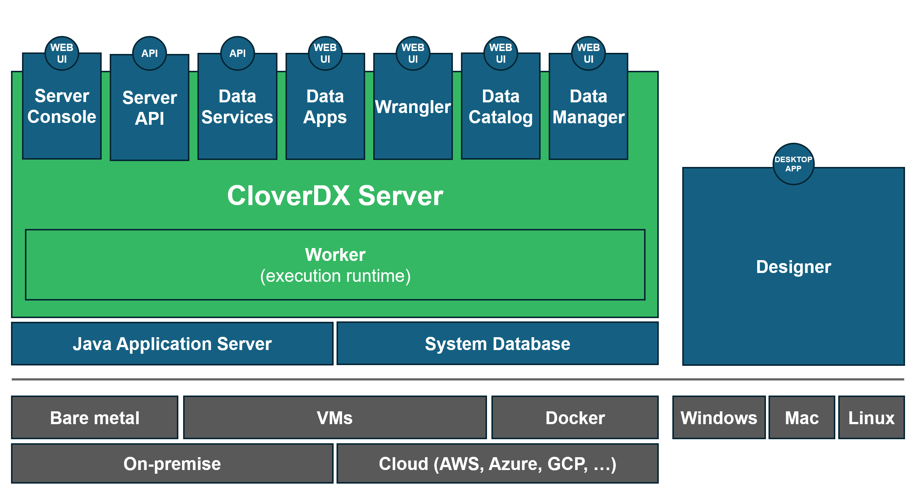

<!-- CloverDX Data Integration platform -->

## CloverDX Data Integration platform

The **CloverDX Data Integration platform** allows you to develop, deploy and automate data transformation jobs, and share data and collaborate with end users by allowing them to take an active part in the process. It provides an effective blend of rapid visual design of transformations and workflows with full coding IDE, debugging, customization capabilities, and automation.

**CloverDX** boosts productivity and trust in data processes by focusing on automation and robustness of daily operations. **CloverDX** represents a single platform that covers the needs of the IT teams (**Server, Designer**) as well as providing a self-service interface to end users ([Wrangler](../user/wrangler-index.md), [Data Catalog](../user/data-catalog.md), [Data Apps](../operations/data-apps.md), Data Manager), covering the entire lifecycle of data from ingestion and processing to delivery and consumption.

**CloverDX platform** is used to streamline data onboarding, automate data ingestion, shorten data migrations, build trust in data quality, operate data pipelines feeding BI and analytics efforts, and to facilitate data exchange among applications.

The **CloverDX Data Integration platform** consists of two installed components:

- **CloverDX Server** is the execution heart of the platform. It can be deployed on premise or in cloud. An enterprise-grade runtime, the Server provides everything for operations (Server Console), *job execution, workflow management, [scheduling](../operations/scheduling.md), [event triggers](../operations/listeners.md), APIs* (*[Server API](../operations/part3.md), [Data Services](../operations/data-services.md)*), and *[monitoring](../operations/monitoring-intro.md)*. It also hosts multiple different interfaces for end users (*[Data Apps](../operations/data-apps.md), [Wrangler](../user/wrangler-index.md), [Data Catalog](../user/data-catalog.md) and Data Manager*). Multiple Servers can be deployed at once and connected into a cluster, providing parallel data loading and processing, high availability, and increased throughput.
- **CloverDX Designer** is a desktop development environment for data engineers and developers to build, test and deploy data jobs and automations. It allows seamless switching between visual design and coding. **CloverDX Designer** is designed for rapid development, providing instant insight into data being transformed, context assist, and the ability to create and share reusable and customizable building blocks. The Designer is intended to be primarily connected to projects on the Server (sandboxes), although it can run data transformations locally too.

*Figure 1. Platform architecture*

---

*This guide refers to CloverDX 7.5.1 release.*

*Copyright © 2010-2026 CloverDX a.s. All rights reserved.*

*Do not copy or distribute without express permission of CloverDX a.s.*

*[http://www.cloverdx.com](http://www.cloverdx.com)*
> [!TIP]
> **Feedback welcome**
>
> *If you have any comments or suggestions to improve this documentation, please let us know by emailing [support@cloverdx.com](mailto:support@cloverdx.com).*
>
> **Tip**
>
> *If you’re experiencing issues with a CloverDX product and need assistance, please review our [How to speed up communication with CloverDX Product Support](https://www.cloverdx.com/support/how-to) guide before contacting our support team. This guide can help you gather essential information and provide context for your issue, enabling our support team to troubleshoot more efficiently and provide a faster resolution.*
