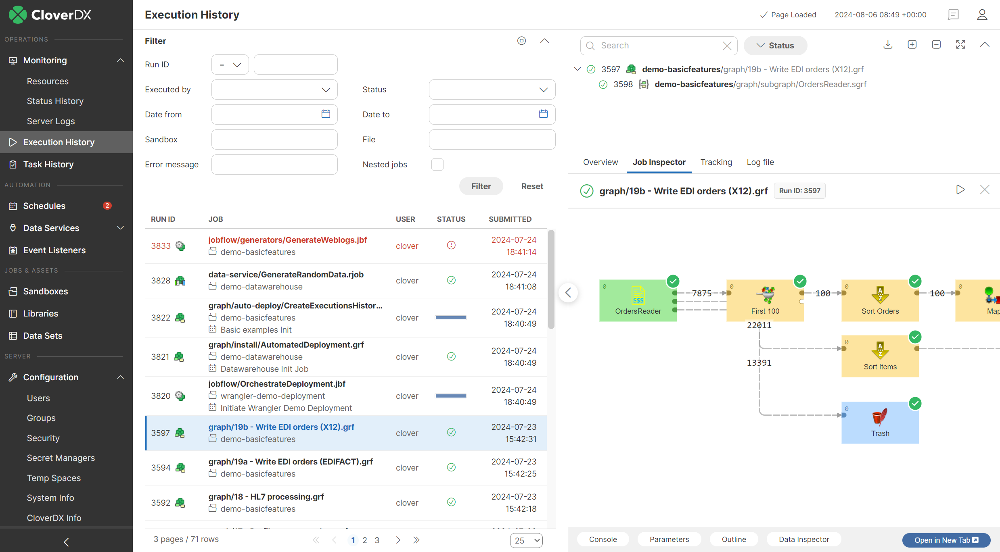
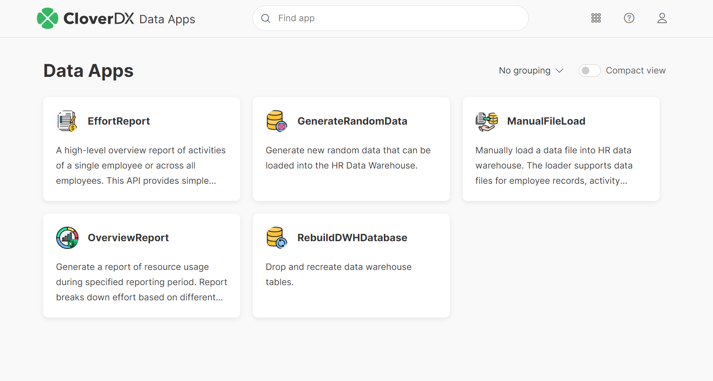
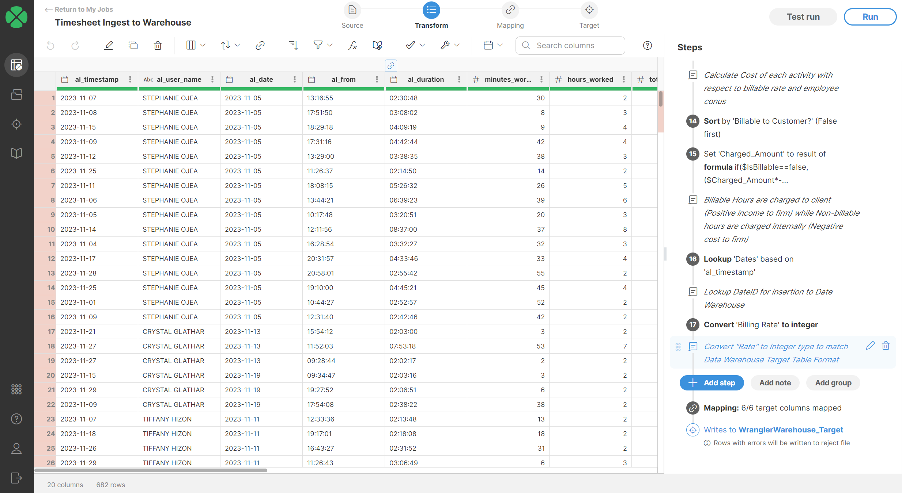
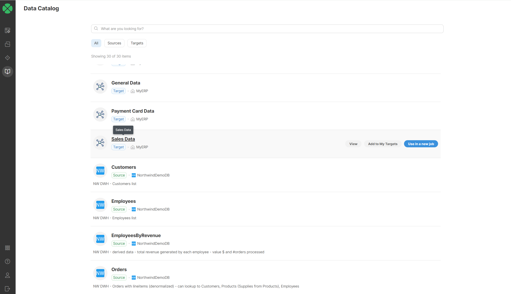
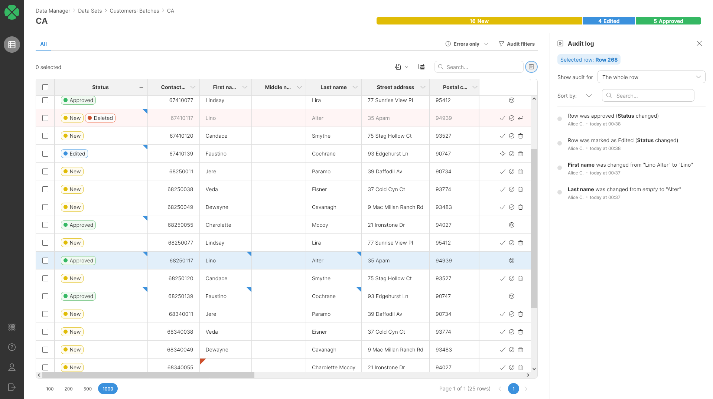
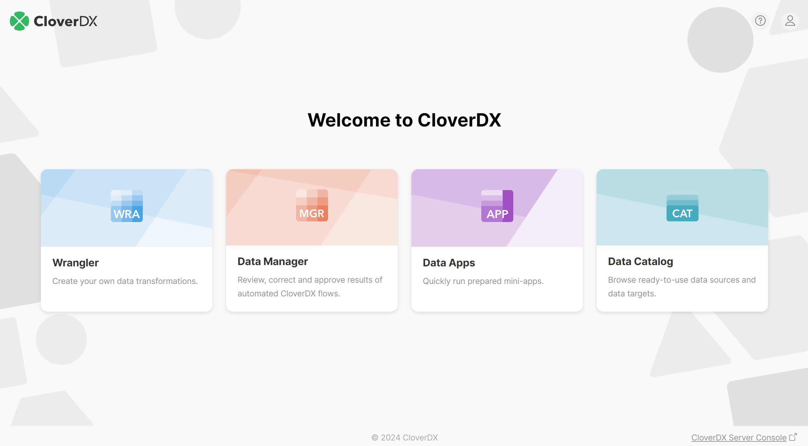

<!-- CloverDX Data Integration platform > Interfaces hosted on CloverDX Server -->

# Interfaces hosted on CloverDX Server

**CloverDX Server** hosts multiple interfaces for users to interact with the Server, either through GUIs or APIs.

**Server Console** is the primary interface of the Server used by engineers, developers and operations staff to manage jobs, triggers, schedules and configuration of the Server.

*Figure 2. Server Console*

[**Data Apps**](../operations/data-apps.md) provide end users with the ability to control data pipelines developed by data engineers as simple, user-friendly applications. Fill in parameters, click a button and wait for the data to arrive.

*Figure 3. Data Apps*

[**Wrangler**](../user/wrangler-index.md) is a self-service interface for end users to transform data on their own, without needing assistance from the IT team. It provides an easy-to-use frontend for data preparation tightly integrated with the data pipelines and the Data Catalog published by the IT team.

*Figure 4. Wrangler*

[**Data Catalog**](../user/data-catalog.md) is currently available only through Wrangler and provides access to data assets shared within the organization. Data engineers fill the Data Catalog with curated data connectors for Wrangler users to use for their data prep and transformations.

*Figure 5. Data Catalog*

[**Data Manager**](../user/dm-index.md) is a user interface for data stewards and data quality staff to jump into individual data records and review, edit, and approve them down to a field and record levels. Data Manager is used when manual intervention into automated pipelines is required or for managing shared static data (lookups).

*Figure 6. Data Manager*

**CloverDX Home** is a simple navigation module that allows users to easily switch between all Server interfaces.

*Figure 7. CloverDX Home*

[**Server API**](../operations/rest-api.md) is a comprehensive REST API for controlling the Server by 3rd party apps, allowing for interoperability among multiple systems in your organization’s tech stack.

[**Data Services**](../operations/data-services.md) are API endpoints published by data engineers. Data transformations can easily be published as REST APIs for 3rd party apps to use. Data Services are the backbone of **Data Apps**.
