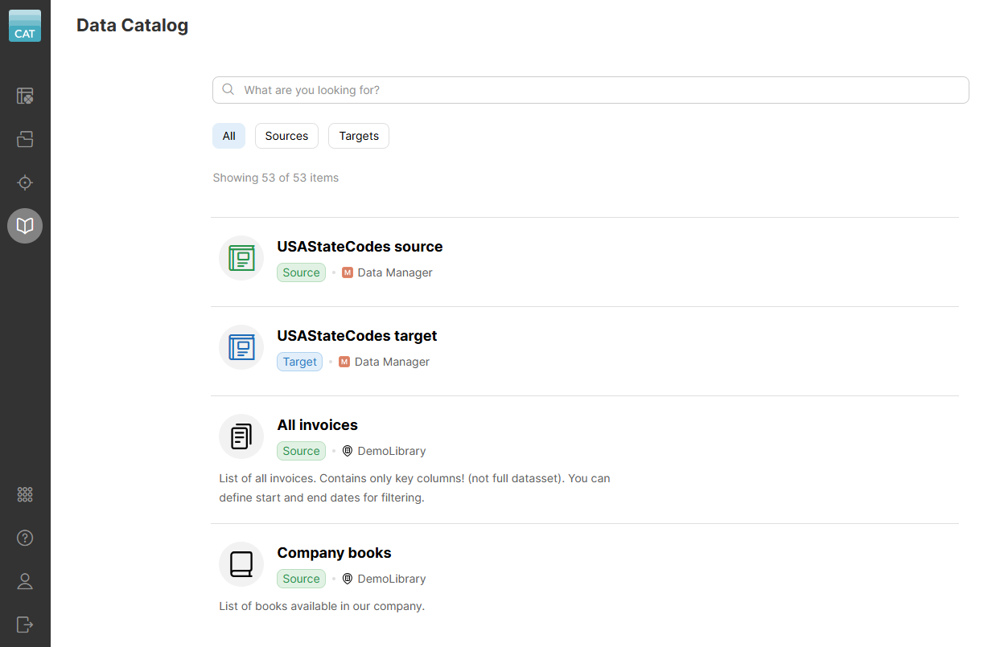
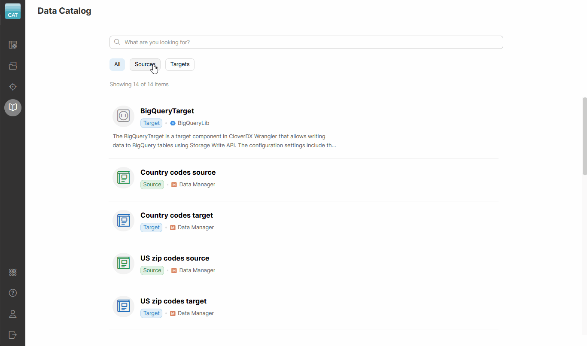
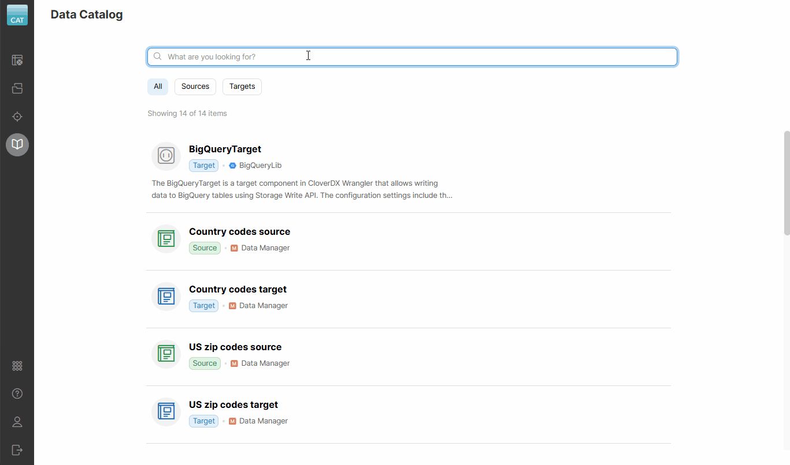
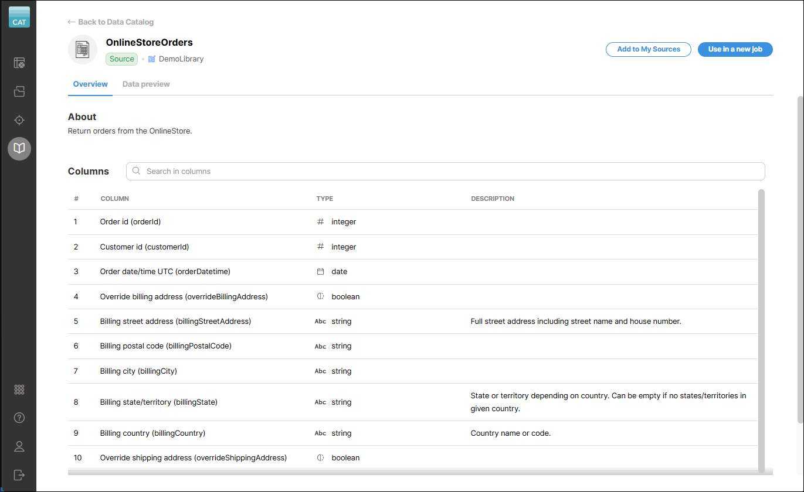
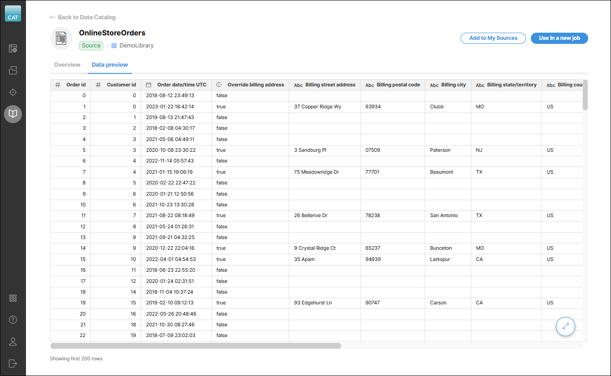

<!-- End user’s guide > Wrangler user guide > Data Catalog -->

### Data Catalog

The **Data Catalog** includes a shared collection of custom sources and targets created and maintained by your company. These sources and targets can be **data source and data target connectors** or **reference data set sources and targets** from [**CloverDX Data Manager**](https://www.cloverdx.com/data-manager).

The **data source and target connectors** are designed to read from or write to external interfaces based on your company’s business needs. Connectors can be, for example, used to read data from a database or an interface like Hubspot or Xero. Each connector has its own tag, which is defined by your administrators during setup to help categorize and identify it.

In addition to these connectors, the **Data Catalog** can also include **reference data set sources** from the [**CloverDX Data Manager**](https://www.cloverdx.com/data-manager). A reference data set is a structured collection of standardized reference data that can be reused across multiple applications, processes, or systems. Each reference data set source **has a corresponding reference data set target**, which can be used to update the contents of the data set. Alternatively, the source data can be used for further processing, with results written to other targets as needed. Reference data set sources and targets are marked with a **DATA MANAGER** tag, making them easy to identify.

All sources and targets in the **Data Catalog** are created and configured by your CloverDX Server administrators. Administrators can refer to our CloverDX Server [documentation](../operations/libraries.md) for more information on how to publish **new data source or target connectors**. For more information on **reference data set configuration**, see [Data set permissions](data-manager-working-with-reference-data.md#user-roles-and-permissions).

The **Data Catalog** is usually the first place to visit when creating a new Wrangler job and looking for the data you need. To use a data source or data target from the **Data Catalog** in your jobs, you first need to add them to **Sources** or **Targets**, respectively. See the [Data sources and data targets](data-sources-data-targets.md) section in this documentation for more information on how to add and work with data sources and data targets.

*Figure 74. Data Catalog showing available sources and targets*

By default, the **Data Catalog** displays both sources and targets. You can quickly switch to only **sources** or **targets** by clicking on the respective buttons.

When hovering over a catalog item, you will see different actions depending on the level of access assigned to you by your CloverDX Server administrators:

#### Permissions

| Action | Visibility | Description |
| --- | --- | --- |
| **View** | Always | Opens a **details screen** with additional information about the catalog item. If your source or target comes from a reference data set, you will also see a button that will open the related data set in the Data Manager. |
| **Add to Sources** / **Add to Targets** | If you have permissions | Opens the **Add to Sources** or **Add to Targets** wizard that will allow you to enter connector parameters and add the connectors or reference data set sources or targets to **Sources** or **Targets**. |
| **Use in a new job** | If you have permissions | A shortcut that allows you to quickly create a new job with the selected item, and automatically add it to **Sources** or **Targets**. This is the most common action to take when you want to work with your data. |
| **Get access** | If you don’t have permissions | This link is only visible if you don’t have access to the given item. It provides information on how to request access. |

If you have permissions for the given Data Catalog item, you can use it in your jobs right away. If you don’t have permissions, you must contact your CloverDX Server administrators to grant you access.

#### Searching in the Data Catalog

For easier navigation in the **Data Catalog**, use the search box at the top. It scans catalog item names, their origins, and column names, displaying real-time matching results as you type.

*Figure 75. Search results displayed after searching for "payment" in the Data Catalog.*

The search results page will show you where the keyword you were looking for was found. You can then click on the **View** button to view further details or use the **Add to Sources** or **Add to Targets** buttons to add them to your sources or targets. You can also directly create a new job by clicking the **Use in a new job** button.

Note that the search will also look through sources and targets that you may not have access to (but they are still visible to you). In that case, you will have to contact your CloverDX Server administrator to grant you permissions.

#### Catalog item details

The details screen shows you additional details about the selected Data Catalog item.

*Figure 76. Connector details screen with data preview*

On the *Data preview* tab, for connectors that do not require additional configuration and for reference data set sources, you will see a preview of the data. If a connector requires additional settings, you will have to use the **Add to Sources** wizard first to configure it and then you will be able to see the preview in the **Sources** screen.

*Figure 77. Connector details screen with data preview*
