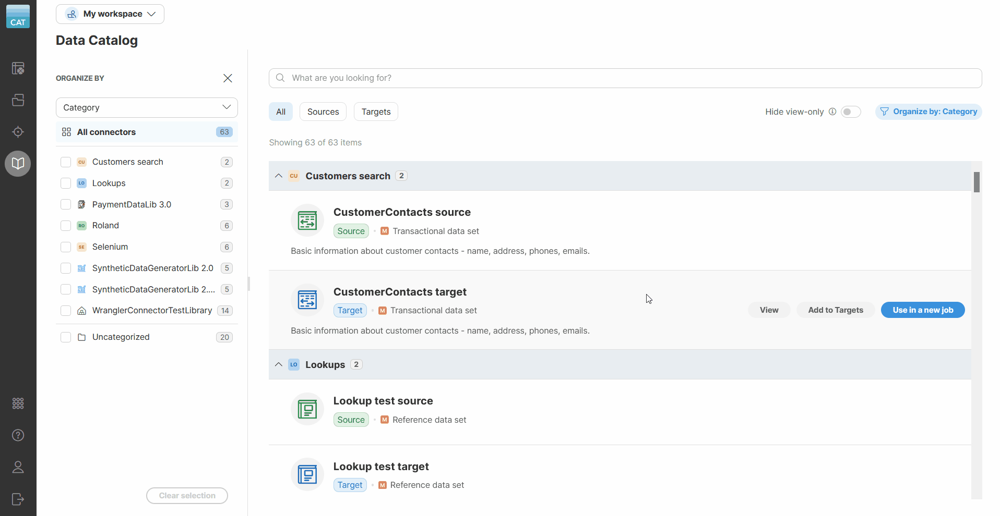
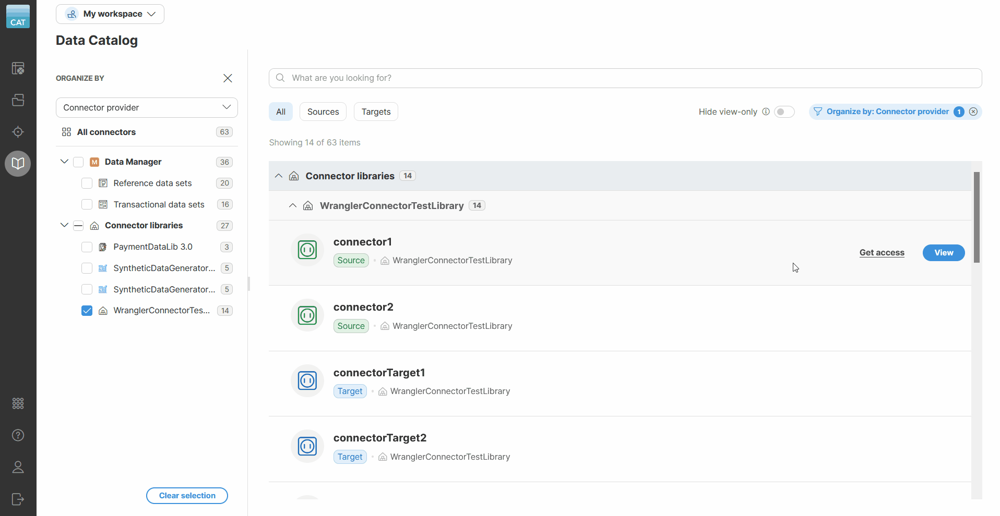
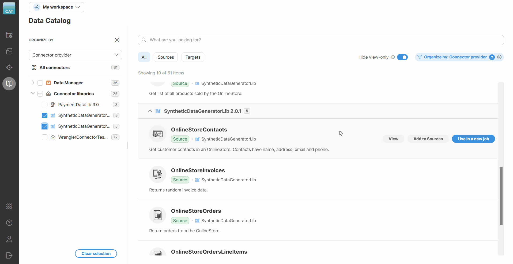

<!-- End user’s guide > Wrangler user guide > Data Catalog -->

### Data Catalog

The **Data Catalog** provides a way to browse a shared collection of custom sources and targets created and maintained by your company. It can show connectors of various types — **data source and data target connectors** coming from installed libraries, **reference data set sources and targets** from [**CloverDX Data Manager**](https://www.cloverdx.com/data-manager).


*Figure 74. Data Catalog showing available sources and targets grouped by connector provider.*

The **Data Catalog** is usually the first place to visit when creating a new Wrangler job and looking for the data you need. To use a data source or data target from the **Data Catalog** in your jobs, you first need to add them to **Sources** or **Targets**, respectively. See the [Data sources and data targets](data-sources-data-targets.md) section in this documentation for more information on how to add and work with data sources and data targets.

#### Types of items in the Data Catalog

The **data source and target connectors** are designed to read from or write to external interfaces based on your company’s business needs. Connectors can be, for example, used to read data from a database or an interface like Hubspot or Xero.

Library sources and targets in the **Data Catalog** are created and configured by your CloverDX Server administrators. Administrators can refer to our CloverDX Server [documentation](../operations/libraries.md) for more information on how to publish **new data source or target connectors**.

Data Catalog can also include sources and targets corresponding to **data sets** from [**CloverDX Data Manager**](https://www.cloverdx.com/data-manager). **Reference data set sources** allow you to link reference data sets to your jobs in Wrangler. Reference data sets are often used as various lookups but you can also write to them from your Wrangler jobs. **Transactional data sets** point to transactional data sets in Data Manager. These are typically used for transactional data and Wrangler jobs working with them often implement data ingestion and validation processes for such data. Data Catalog entries for Data Manager data sources and targets are created automatically and depend on what you have available in Data Manager.

#### Organizing connectors in the Data Catalog

To help you navigate connectors, Data Catalog organizes them based on various criteria into different groups. When navigating the Catalog, you can use the sidebar to select the grouping mode and filter which groups to show in the main view.

The grouping works in two different ways:

- **Group by category**: groups connectors by their category. The category typically represents connectors data domain; for example, "Marketing", "Finance", etc. For Data Manager connectors, the category corresponds to the data set category as configured by data set administrators in Data Manager. This grouping mode is the default.
- **Group by connector provider**: groups connectors by where they come from: a Data Manager data set, or an installed connector library.


*Figure 75. Showing different grouping modes and how to collapse the sidebar.*

To change the grouping mode, use the drop down in the sidebar. To completely hide the sidebar, click on the **Organize by** button in the top right.

##### Category

Category is a string property of each connector, derived as follows:

- For a data set connector (reference or transactional), the category is the category of the data set itself, as assigned in Data Manager. Categories do not distinguish between sources and targets — if a data set belongs to Category X, both its source and target have Category X.
- For a library connector, the category is derived from the library name and version. The name is what the administrator configured in the Server when the library was installed. Sources and targets from a single library belong to the same category.

Connectors with no assigned category fall into **Uncategorized**. This is not a real category name, and it always sorts last in the list. Connectors coming from libraries are never in Uncategorized, since every library has a name.

Categories cannot be nested. They are a flat structure, with a single tree root for all connectors:

```
All connectors
  Category 1
  Category 2
  Category 3
  Uncategorized
```

##### Connector provider

Connector provider is the source the connector comes from. Unlike category, provider has multiple levels:

```
All connectors
  Data Manager
    Reference data sets
    Transactional data sets
  Connector libraries
    LibraryX
    LibraryY
    ...
```

**Data Manager** contains all connectors corresponding to data sets, split into **Reference data sets** and **Transactional data sets**. **Connector libraries** contains all connectors coming from any library, with one entry for each installed library that provides connectors. The entry is named after the library, as configured during installation.

There is no Uncategorized category in the Connector provider view — every connector belongs somewhere.

##### Filtering with the sidebar

The sidebar also works as a filter. Each group has a checkbox next to it:

- Checking a single group shows the connectors in it, and in its child groups.
- Checking several groups shows connectors from all of them combined.
- Unchecking everything switches back to **All connectors** and shows every item.
- **Clear selection**, at the bottom of the sidebar, clears your selection and switches back to **All connectors**.

Each group shows how many connectors it contains, including its children. Since **All connectors** is the root, it shows the total number of connectors in the catalog.

When you select one or more groups:

- The number of selected groups appears on the **Organize by** button, for example *Organize by: Category 3 X*.
- **Clear selection** appears at the bottom of the sidebar.
- A clear (**X**) appears next to the **Organize by** button.


*Figure 76. Toolbar showing an active filter.*

If you collapse the sidebar while groups are selected, the **Organize by** button stays active, the count stays visible, and the **X** stays available. Clicking the button opens the sidebar again. Clicking **X** clears your selection without opening the sidebar.

#### Permissions

| Action | Visibility | Description |
| --- | --- | --- |
| **View** | Always | Opens a **details screen** with additional information about the catalog item. If your source or target comes from a data set, you will also see a button that will open the related data set in the Data Manager. |
| **Add to Sources** / **Add to Targets** | If you have permissions | Opens the **Add to Sources** or **Add to Targets** wizard that will allow you to enter connector parameters and add the connectors or data set sources or targets to **Sources** or **Targets**. |
| **Use in a new job** | If you have permissions | A shortcut that allows you to quickly create a new job with the selected item, and automatically add it to **Sources** or **Targets**. This is the most common action to take when you want to work with your data. |
| **Get access** | If you don’t have permissions | This link is only visible if you don’t have access to the given item. It provides information on how to request access. |

If you have permissions for the given Data Catalog item, you can use it in your jobs right away.

If you don’t have permissions, you must contact your CloverDX Server administrators to grant you access. An item you can only **View** is called view-only. Turn on **Hide view-only** above the list to show only the items you can actually add to **Sources** or **Targets** or use in a job.


*Figure 77. Hiding view-only connectors*

#### Searching in the Data Catalog

For easier navigation in the **Data Catalog**, use the search box at the top. It scans catalog item names, their origins, and column names, displaying real-time matching results as you type.

If you also have a sidebar group selected, the list shows connectors that match both your search term and your selection. Group counts in the sidebar update to reflect the search, and a group with no matches stays visible, showing 0. Search does not match category or provider names.


*Figure 78. Search results displayed after searching for "payment" in the Data Catalog.*

#### Catalog item details

Click **View** on a catalog item to open its details screen.

The top of the screen shows a breadcrumb, the item’s name, its tag, and the actions available to you — see [Permissions](data-catalog.md#permissions).

The breadcrumb reflects how the catalog was grouped when you opened the item. Grouped by **Category**, it shows **My workspace** and the category the item belongs to. Grouped by **Connector provider**, it shows the full provider path instead, for example **My workspace > Connector libraries > SyntheticDataGeneratorLib 2.0**.

The **Overview** tab shows an **About** description of the item, followed by its **Columns** — each with a name, type, and description where available.


*Figure 79. Connector details screen*

On the *Data preview* tab, for connectors that do not require additional configuration and for data set sources, you will see a preview of the data. If a connector requires additional settings, you will have to use the **Add to Sources** wizard first to configure it and then you will be able to see the preview in the **Sources** screen.
