<!-- End user’s guide > Data Manager user guide > Editing data in Data Manager -->

### Editing data in Data Manager

#### Data Editor screen

Data is edited on the **Data Editor** screen which is shown when you click on a data set or data set batch. Transactional data sets and reference data sets use slightly different layout of the Data Editor screen but most of the functionality is the same. In this chapter we’ll describe the common functionality and will point out the differences between the two types of data sets.

*Figure 182. Data Editor screen for transactional data sets showing the data grid and audit side bar.*

The main part of the screen is taken by the **editor grid** (or data grid). The grid shows data in the data set as a simple table with columns shown in the same order as the order defined in the data set layout.

The first column is the **row selector** column which allows you to select multiple rows by checking the checkboxes. Once multiple rows are selected, you can perform mass actions on those rows via row actions on the toolbar (see below for more details).

All the other columns contain data and are ordered as configured in the data set layout or via **Column Chooser** dialog. On the screenshot above, the `Status` column is the first data column, but this does not have to be the case since the column can be positioned anywhere in data set’s data layout.

Each column shows additional information in its header:

| Column header | Description |
| --- | --- |
| 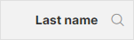 | Regular column without any additional flags. The column data is editable. The *magnifying glass* is clickable and will show the search row if clicked. Search is available in every column regardless of its other properties. |
| 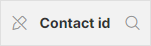 | The *pencil icon* shows that the column is read-only and cannot be changed. |
| 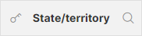 | The *key icon* shows that the column is configured as **batch key column**. There can be either one or no batch key column in a data set depending on whether the data set has batching enabled or not. |
| 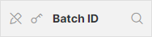 | Batch key and read-only indicators can be combined and designate a column that is a read-only batch key. |
| 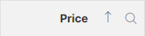 | The arrow up (or down) indicates that the row is used to sort data in the data editor. See additional details in the [Sorting the data section below](data-manager-editing-data.md#sorting-the-data-in-the-data-grid). Note that sort indicators can be combined with other icons in the header. |

##### Cell colors in transactional data sets

Data editor uses different **background colors** when working with transactional data sets to provide additional information about the row. The following screenshot show different background colors you may see in the data grid:

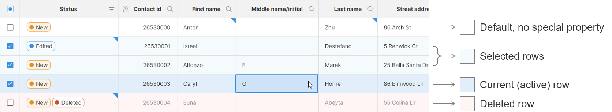
*Figure 183. Colors in the data grid provide additional information about the row.*

Most rows typically use the default color (white) to denote that they do not have any special property.

There can be any number of **selected rows** while there is always at maximum one **current (or active) row**. The current row is the one where you are currently making changes. Rows can be highlighted as current by either clicking into a cell to edit its value or by performing any other action on the row (e.g., click on the status, click on one of the row actions etc.).

**Deleted rows** are highlighted in red to make them stand out more. There can be any number of deleted rows.

##### Cell colors in reference data sets

Reference data sets use slightly different color scheme in their data editor. The following screenshot provides overview of different colors you can see when working with reference data sets:

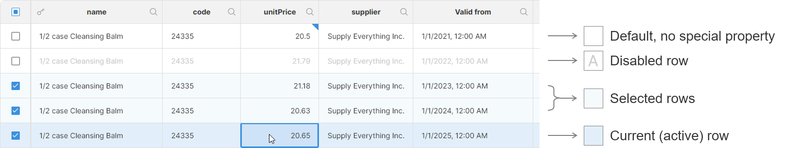
*Figure 184. Colors in the data grid provide additional information about the row.*

Rows that do not have any special property use the white background and dark text. [Disabled rows](data-manager-working-with-reference-data.md#enabled-and-disabled-rows) use light grey text to make them stand out. Selected and current rows use the same color scheme as in transactional data sets.

Note that there are no “deleted” rows in the reference data. To prevent row from being used it should be disabled. Deleting a row will completely remove it from the data set.

##### Cell error and change markers

Data editor grid shows additional information about data in each cell in the form of colored **markers** in the cell corners:

| Cell | Cell with tooltip | Description |
| --- | --- | --- |
|  |  | Cell without any markers. |
|  | 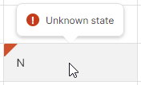 | Cell with a red **error marker** in the top left corner. The error marker shows that there is an error message attached to the value in the cell. The error message is shown in a tooltip when mouse hovers over the cell. |
|  | 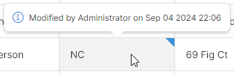 | Cell with a blue **change marker** designating that the cell value has been modified. Additional information about the value is available in tooltip or in the [Audit log side bar](data-manager-editing-data.md#audit-log). |

#### How to edit data

To edit data in the data grid, simply click into a cell you wish to change. If the cell is in a column that is editable, you will be able to modify the value of the cell. Note that Approved or Committed rows are read-only and values of their cells cannot be changed regardless of whether the columns are editable or not.

The editor behaves differently depending on whether the column you are trying to edit is restricted to a lookup or not (see [Data Layout section](data-manager-working-with-transactional-data.md#data-layout) for more details).

##### Columns without lookups

If the column is not restricted to a lookup, editing a cell will bring an editor that depends on the data type:

| Column type | Cell editor |
| --- | --- |
| `boolean` | `true` or `false` can be selected from a drop-down. You can also select an `empty` option that will remove the value from the cell (it will be set to `null`). |
| `date` | You can either type the date or use the provided date-time picker dialog. The dialog allows you to pick any date and time with precision to a minute (i.e., you cannot change seconds or milliseconds even though the Data Manager backend does support such precision for datetime values). |
| `decimal` | You must write decimal numbers without any formatting. You cannot use thousands separators, currency symbols or any other special characters. A decimal point must be used. |
| `integer` | You must write integer numbers without any formatting. You cannot use thousands separators, currency symbols or any other special characters. |
| `string` | Write any string, including national characters (even emoji). Unicode is used to represent the data internally, so any national and many thousands of special characters can be handled without any issues. |

##### Columns with lookups

For columns with lookups, you will only be allowed to pick a value from the lookup associated with the column. The lookups are displayed in a dialog or a dropdown box depending on the lookup configuration:

- Simple drop-down will be shown when the lookup only contains value (the lookup key) and a label. For example, a list of countries can use country code as the key and country code name as the value:
  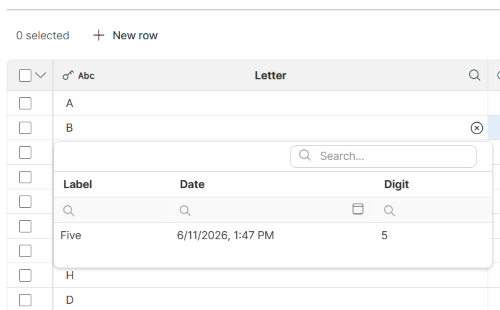
- A more complex table which can show additional columns alongside the lookup value and label. These additional columns provide context that you can use to better pick the value since you can compare the extra columns with the information in the main data grid:
  

Additionally, if the cell that you are trying edit contains an error, you will see the error message in the dialog and you may also get suggestions which can provide guidance for selecting the best item from the list.

The suggestions are displayed as the first items in the dialog and use the lightbulb icon so that you can easily distinguish them from the remaining items in the lookup.

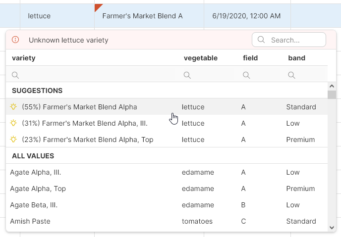

Regardless of how the dialog is displayed, you can use the search box to find the items you are looking for. You can also resize the dialog by dragging the edges or corners or move the dialog by dragging it by its header. The dialog will also stay open if you click on the scrollbars so that you can scroll within your data set (this is mainly useful in wide data sets with many columns where you may have to scroll to see the additional columns that can help you select the correct item from the lookup).

#### Audit log

Data Manager keeps track of all changes in the data in the **Audit log**. Audit log records information about who made the change (user), when the change was made and the actual change (column name, original value, and new value). This is kind of audit trail is kept for every column including the Status column.

The audit log is used to show the blue change markers in cells in the data editor – every cell with a change in the audit log gets the change marker.

To display the audit log of the current row, use the **Audit log**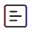 icon on the toolbar. The audit log will be displayed in a side bar:

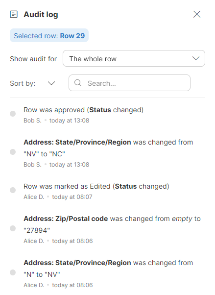
*Figure 185. Audit log showing events for a single row.*

The side bar allows you to filter the view if you are looking for a specific change. You can show audit for a selected column by selecting the column in **Show audit for** dropdown.

You can search for a specific event using full text search. This allows you to find specific value, user, or event type.

You can also change the sort order via the **Sort by** setting to sort by the time (the default) or by the person who made the change.

Note that the audit log side bar will show the audit of the current row. You can review logs of different rows simply by clicking on them in the data grid.

#### Sorting the data in the data grid

You can sort rows in the data set by left clicking on the header of the column you’d like to sort by. The header will change to reflect the sorting status of the column. Clicking on the header will toggle the sort order between ascending and the descending. Note that the sorting order is used only when showing the data in the grid, it does not affect the order in which rows are stored in the Data Manager’s storage and does not affect the order in which rows are read using the [TransactionalDataSetReader component](../developer/datasetreader.md).

- Sort in ascending order (smallest to largest): 
- Sort in descending order (largest to smallest): 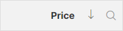

To reset the sorting, right click the column and select the **Clear sorting** item from the context menu.

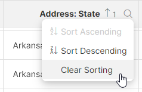

It is also possible to **sort based on multiple columns**. To add a column as a sorting key, hold the *Shift* key when you left click the column header. The order in which the columns were added defines the order of the columns in the sort key – this is shown as little numbers to the right of the sort direction arrow for given column:

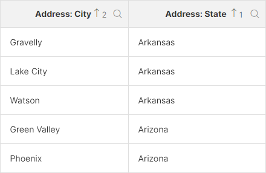
*Figure 186. Data grid header showing data sorted by the State column and then by the City column.*

To change the sorting direction of a column when sorting by multiple columns, *Shift* + click the column header.

#### Filtering the data

To help you find the data you’d like to work with, the editor screen offers multiple ways of filtering your data. You can filter based on column values, presence of errors, past changes in the data and more.

The filtering is configured using multiple controls on the data editor screen:

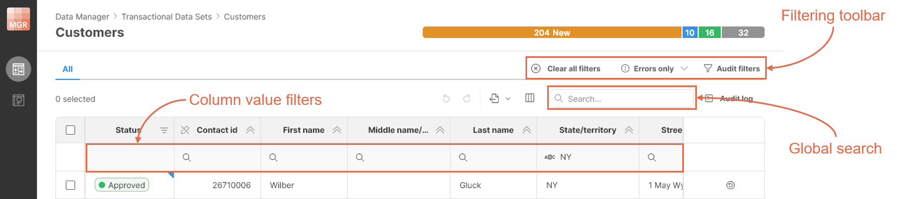
*Figure 187. User interface elements on the data editor screen that allow you to configure variety of filters.*

If any filtering is enabled, the toolbar will show **Clear all filters** button that allows you to reset all filters and show the whole data set. The button will appear in the upper right section of the toolbar next to the Errors only and Audit filters:

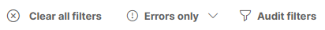

Note that if multiple filter types are enabled, they are all combined and only the rows that satisfy all filtering conditions will be shown in the editor.

Reference data sets have additional filters available in the form of View modes. These allow you to easily show or hide rows that have been modified or that require approval. See more about the view modes in [View modes section](data-manager-working-with-reference-data.md#view-modes-in-data-editor).

##### Global full-text search

Global search is a full-text search box in the top-right corner right above the editor grid. Typing into the box will filter in real-time in the whole data set (i.e., even if the data set contains more data than what is currently displayed).

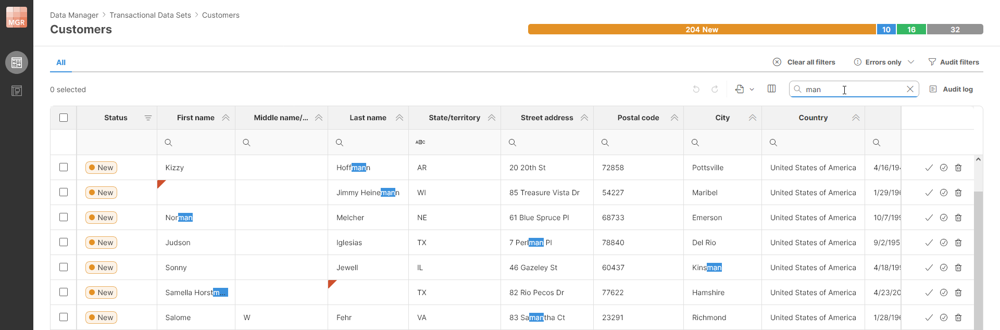
*Figure 188. Screenshot showing global search with highlighted occurrences of the search string.*

When searching using the full-text search, the matches will be highlighted in the data grid to allow you to easily spot the occurrences of your search string.

##### Column value filters

**Column value filters** can be shown by clicking on the down arrow on each column. This will show a new filtering row under the header. Each column can be configured with its own filter with the filtering options that depend on the data type of the column:

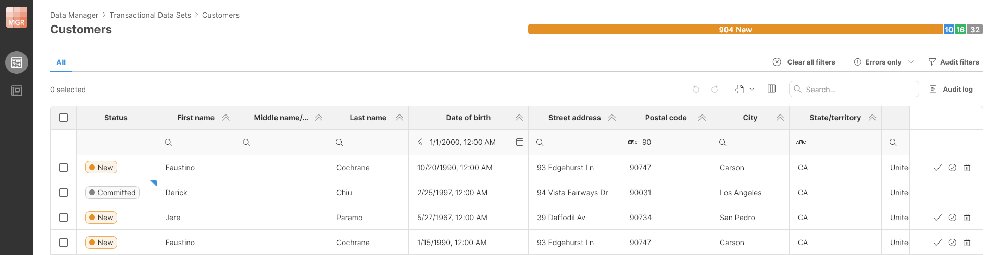
*Figure 189. Data editor with expanded value filters showing filters on Postal code and Date of Birth columns.*

Depending on the column type, you will be able to filter in different ways. Default filter for each column type is applied when you type a value into the box itself, additional filter types can be shown by clicking on the magnifying glass icon. The following table provides a summary of filtering options for different column types.

| Column type | Default filter | Additional filters |
| --- | --- | --- |
| `string` | 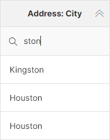  Search for a substring, case sensitive. | 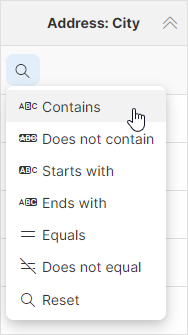 |
| `integer` | 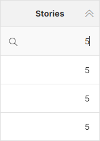  Exact value match (equality). | 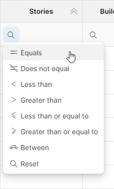 |
| `decimal` | 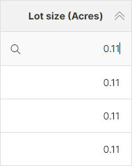  Exact value match (equality). | 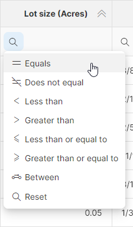 |
| `date` | 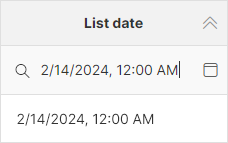  Exact value match (equality) on date *and* time. | 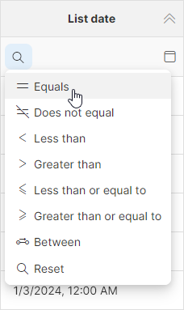 |
| `boolean` | 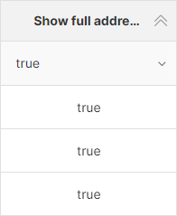  Exact match (equality) with value selected from `true`/`false` dropdown. | No more options. |
| `Status` (only applies to the `Status` column) | 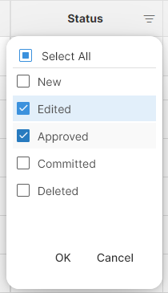  Match values selected in multi-select list. | No more options. |

##### Error filters

To allow you to quickly find rows which contain errors, you can use **Errors only** filter available in the toolbar:

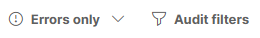

The **Errors only** can be clicked to only show rows that contain errors in any column. Alternatively, you can click on the down arrow to get additional options to filter based on errors in specific columns only:

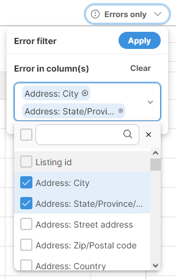

The **Errors only** button will be highlighted in blue to make it easy to see that the filtering is enabled.

##### Audit filters

**Audit filters** allow you to filter rows based on changes made in the data. It allows you to, for example, find rows that were modified by certain users or at a certain time and so on.

The **Audit filters** configuration is available via toolbar:

Clicking on the **Audit filters** will show a configuration pop-up with the following settings:

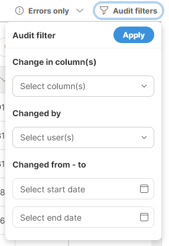

If multiple filters are configured above (e.g., you filter by column and user), they all must be satisfied for the row to be shown in the editor (e.g., specified user must have made a change in the specified column).

#### Configuring data editor columns

In wide data sets it can be useful to not show all columns all the time to simplify the navigation within the data. You can configure the current view and the columns that are shown in the data editor using either **drag & drop** or with the **Column chooser** dialog. This dialog can be shown by clicking on the **Column chooser** icon in the toolbar:

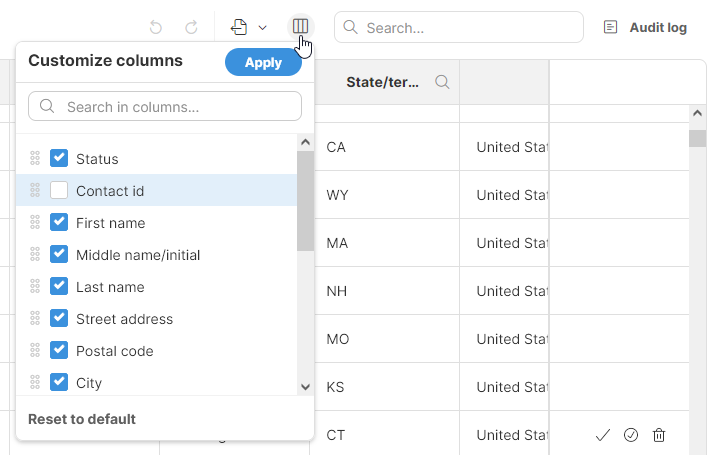
*Figure 190. Column chooser allows you to select which columns to show and their order. It can be shown by clicking on the icon to the left of the full text search.*

Note that not all columns can be shown or hidden. The ability to show or hide specific columns depends on how they are configured in the data set’s layout:

- *Always visible* columns: these columns can be hidden and shown as needed,
- *Hidden* columns: these columns can be hidden and shown as needed,
- *Always hidden* columns: these columns cannot be shown, they are invisible to Data Manager users (but are accessible via graph components).

To learn more about column visibility in transactional data sets, please see the [Transactional data sets data layout section](data-manager-working-with-transactional-data.md#data-layout). In reference data set, the rules are simple since all columns are visible by default except for the system columns. To learn more about reference data sets and their data layout, please see [Reference data sets data layout section](data-manager-working-with-reference-data.md#data-layout).

#### Exporting data to Excel

To export your data to an Excel spreadsheet, you can use the **Export** action on the toolbar:

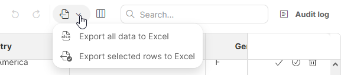

Two export options are provided:

- **Export all data to Excel** to export the whole data set
- **Export selected rows to Excel** to export just the selected rows

Both options produce output with the same formatting – a single Excel file in XLSX format. The file will contain a single worksheet with one header row and the rest taken by the data. The only difference between the two options is whether all data from the data set is included or just the selected rows.

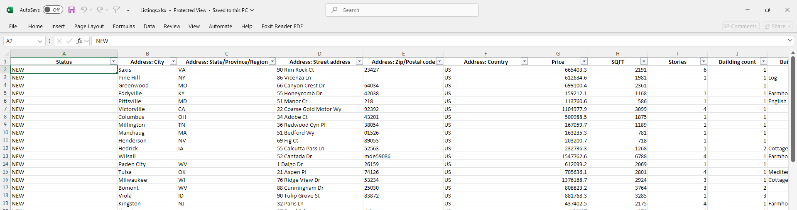
*Figure 191. Data exported from the Data Manager via the Export to Excel function.*
