<!-- End user’s guide > Data Manager user guide > Data Manager introduction -->

### Data Manager introduction

#### Overview

Data Manager provides functionality that allows domain experts to work directly with data that is processed by or used by CloverDX. Data Manager allows users to view, edit and approve changes to data that flows through the system.

Data Manager supports two basic use cases - **data quality management** and **reference data management**. In both cases, the Data Manager offers a comfortable user interface that allows users to see their data, make changes and review/approve them to ensure that only valid data is retained and processed further. Data Manager implements permissions system which allows different users to have different roles (e.g., read-only users, approvers and more) to ensure that everyone has just the access they need to do their job.

##### Data quality in Data Manager

The first use case we’ll cover in this manual is the **data quality** use case. The Data Manager is used to monitor and improve the quality of the data that flows through it. It can be used, for example, to store rows that fail data validation and require manual user intervention to correct the data issues. Data Manager offers an interface where users can easily see the data and associated validation messages and fix data issues by manually editing the data. The rows can then be sent for approval and once approved they will be picked up by a CloverDX graph which will send them to the downstream system.

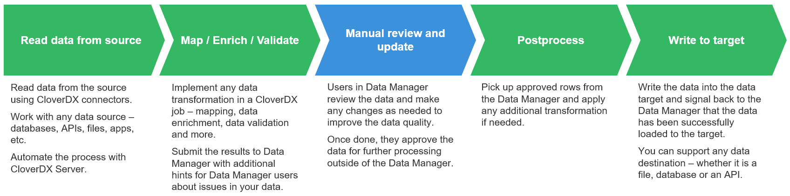
*Figure 134. High-level overview of the data flow through the Data Manager.*

The above diagram shows basic data flow in a data quality use case when implemented with CloverDX Data Manager. Data starts its journey in a CloverDX job (e.g., in a graph) which reads the data from the source and applies any transformations as needed. This process is typically automated, and data is picked up from the source based on a schedule, or the load can be triggered by an event such as file arrival or an API call.

During this initial processing, data is validated. Any validation issues are collected and sent along with the data to the Data Manager.

Data Manager shows the data to users who can review and modify the data to ensure that any issues are fixed. Once the data is clean, it can be approved in the Data Manager for further processing.

All approved rows are picked up from the Data Manager’s storage by another CloverDX job. As before, this step can be automated and performed based on a schedule or variety of triggers.

And finally, the records are uploaded to their destination. This can be any target system – whether it is a file, API, cloud app or a database. At the same time, the Data Manager is notified that each row has been processed and will show this information to its users. Users can then see that the data was successfully loaded into the target system.

A typical example of the data quality use case that benefits from the Data Manager is **data ingestion**. During data ingestion data issues are frequently detected early in the process and in many cases cannot be fixed automatically - a person (domain expert) needs to review, fix, and then approve the data.

To learn more about data quality uses cases and how Data Manager can help, see more information about [transactional data sets and their usage](data-manager-working-with-transactional-data.md).

##### Reference data management in Data Manager

The second use case focuses on **master data management** and **reference data management**. In these cases, users need to manage shared data that is used across the organization. Typically, this means various shared reference (lookup) tables, product lists, configuration tables and more.

Compared to the data quality use case, these reference tables are often relatively static. Once the data set is created and populated, the data tends to stay there for a long time even though it is modified. As an example, you can have reference tables for product catalog, product categories, country codes, regional codes and more.

Maintaining reference tables in the Data Manager allows domain experts to work on the same data in a simple user interface that allows them to make and track all changes via audit log.

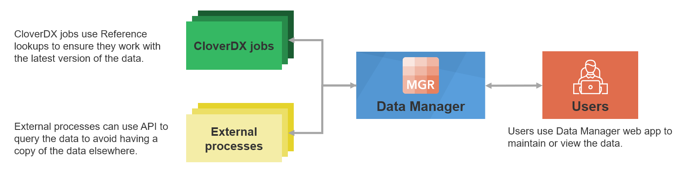
*Figure 135. A high-level diagram showing how Data Manager is used for reference data management.*

Data Manager provides an easy-to-use interface to use such shared reference tables in the Designer when building your jobs. This allows domain experts (who own and manage the lookup) to effectively share data that they own with the data engineers who need to use the data.

As an example of a use case where Data Manager can help you with the reference data management, we can even use the same example as above - data ingestion. During data ingestion you’ll have to validate your incoming data and, in many cases, will need various reference tables to ensure that incoming data does not contain any unexpected values (e.g., you can validate product codes against product catalog, validating product categories, and more.)

To learn more about how Data Manager can help you, read more about [reference data sets](data-manager-working-with-reference-data.md).

#### Basic concepts

##### Data set

Data Manager stores its data in **data sets**. Data set is a collection of **rows** (records) all of which have the same **data layout**. Any number of data sets can be defined in a single instance of a Data Manager.

Data Manager supports two types of data sets – **transactional data sets** and **reference data sets**.

**Transactional data sets** are designed to store and work with transactional data. Transactions are rows that are loaded to the Data Manager, updated as needed and then unloaded to be sent to the target system. As such, each transaction is kept in the Data Manager only for limited amount of time (this depends on the use case – can be days or even months or years).

This style of working with data benefits the data quality use cases – each row is reviewed, edited and once it is approved it is processed further in a CloverDX job and does not need to be stored in the Data Manager anymore.

On the other hand, **reference data sets** are designed to store data that is more static and permanent – your reference data (the lookups). Rows in reference data sets do not get processed directly but rather are involved in various processes in the form of lookups or various configuration tables.

Each data set can have a description. The description is set on the Data Set Configuration page and helps you and other users understand the purpose of a data set without having to open it.

The description is shown in the data set list, for both transactional and reference data sets.

The description is also shown in the data set editor, below the data set title. If a data set has no description, this line is not shown.

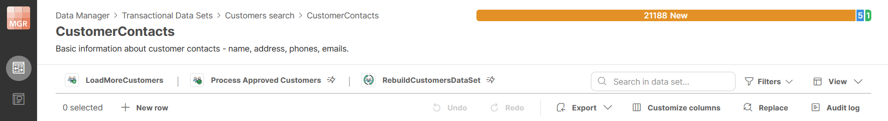
*Figure 136. Data set editor showing a description of a data set.*

##### Data set categories

###### Introduction

Data Manager provides categories to help you organize data sets into logical groups. Categories can be used with both transactional data sets and reference data sets.

A data set can belong to one category. If no category is selected, the data set is shown under *Uncategorized* in the data set list.

Categories do not change how data sets work. They provide an additional structure for displaying, finding, and selecting data sets.

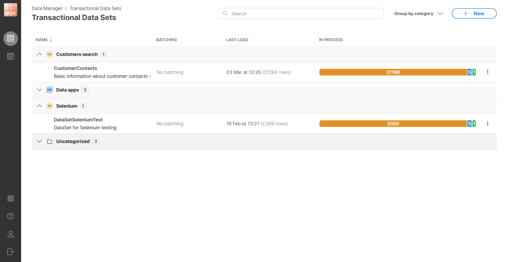
*Figure 137. Data sets grouped by category.*

###### Setting a category

You can set a category in the basic configuration of a data set. The category field is optional. You can use it to select an existing category or create a new category by typing its name into the field. Confirm the new category name to assign it to the data set.

Categories are shared between transactional data sets and reference data sets. This means that the category dropdown shows categories used by both data set types.

Each data set can have only one category. Leaving the category field empty means that the data set has no category and will be shown under *Uncategorized* label in the list.

Category names are handled case-insensitively. This means that categories with the same name but different letter casing are treated as the same category and the name that was used the first will remain. The value *Uncategorized* cannot be used as a category name.

If no data set uses a category anymore, the category is removed automatically (i.e., there are no empty categories).

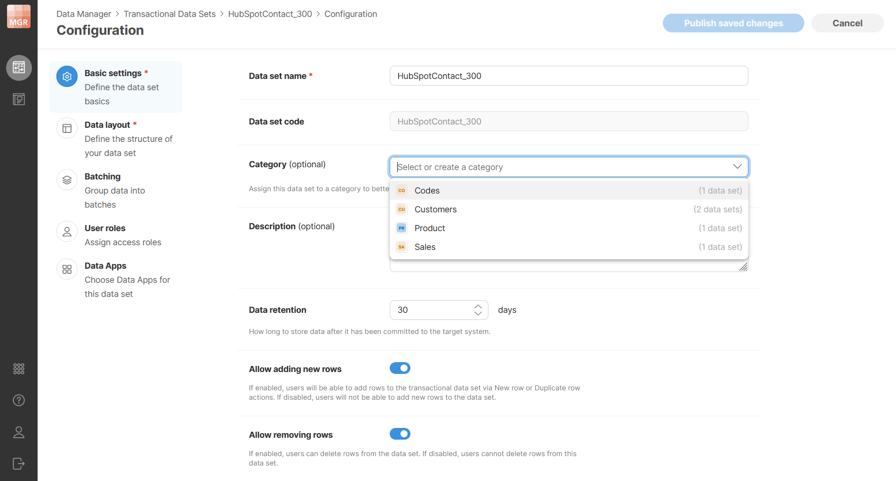
*Figure 138. Setting a data set category.*

###### Grouping data sets by category

Transactional data set list and reference data set list can be grouped by category. When grouping is enabled, data sets are displayed under category sections. Each section can be expanded or collapsed.

Data sets without a category are displayed under *Uncategorized* which is shown last by default.

Grouping is enabled by default. You can turn grouping off to display the data sets in a flat list.

You can also move a data set into a different category by dragging it onto the target category section.

###### Searching grouped data sets

Categories are sorted from A to Z. The *Uncategorized* section is shown last, so categorized data sets are displayed first.

Search is applied to both data set names and category names. When the search matches a data set name, the parent category is expanded and the matching data set is shown. When the search matches a category name, the matching category is expanded and all data sets in that category are shown. Categories without matches are not shown in the filtered view.

###### Renaming categories

Categories can be renamed from the data set list. When a category is renamed, all data sets assigned to that category are updated to use the new category name. This helps you avoid having to change potentially many data sets when category name needs to be changed.

The new category name must be unique. Duplicate category names are not allowed, including names that differ only by letter casing.

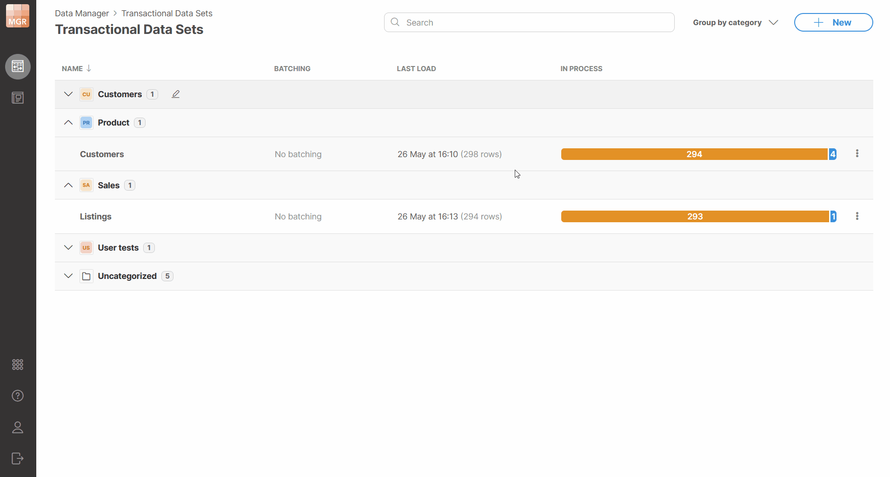
*Figure 139. Renaming a data set category.*

###### Category in breadcrumb navigation

When a data set has a category, the category name is shown in the breadcrumb on the data set detail page. The breadcrumb has the following structure:

```
... / Category / Data set name
```

If the data set has no category, the breadcrumb keeps the default structure without the category level.

The category name in the breadcrumb is clickable. Selecting it opens the data set list with grouping enabled, expands the selected category, and brings the category into view.

###### Categories in Server Console

Data set modules in Server Console can also be displayed by category. The category structure is the same as in Data Manager. Data set modules are displayed under their category sections, and data sets without a category are displayed under Uncategorized.

In Server Console, categories are read-only. They can be used for displaying and navigating data set modules, but they cannot be changed there.

##### Data set rows

Each data set contains any number of rows with each row having the same data layout (same columns). Rows can be in different statuses depending on what work was done with each row. When selecting rows for bulk actions, you can select rows on the current page or across the current data set context.

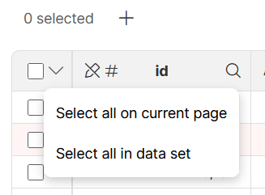
*Figure 140. Selecting rows for bulk actions.*

The structure of each row is described by its **data layout**. The data layout defines **columns** (fields) and their **data types** as well as additional column properties (for example, whether the column is editable, whether it is restricted to a set of values derived based on a lookup, etc.).

The columns can be **strings** (representing text), **numbers** (integers as well as decimal numbers), **dates**, or **boolean** (representing `true`/`false`). For more information about data layout and column data types, please see the Data layout section.

#### Data set permissions

Data set permissions are configured for each data set separately. Each data set has an owner who is also an administrator of that data set. The ownership of the data set cannot be changed.

Permissions are configured in terms of **user roles**. Roles define what users who have these roles can do with the data in the data set. Four permission levels (roles) are available – **Administrator** (the most powerful role), **Data Approver**, **Data Editor**, and **Read-only** user (the least powerful role). Note that Read-only users are only available in reference data sets. In transactional data set, the Data Editor is the least powerful role.

The operations permitted on a data set for each role are shown in the following diagram:

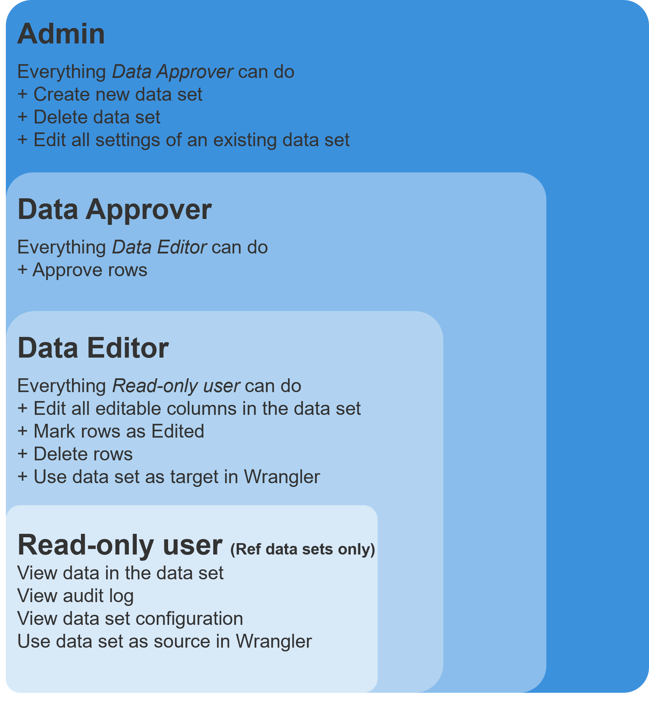
*Figure 141. Hierarchy of data set permissions in the Data Manager.*

You can assign any number of individual users or user groups into each role. Users and groups can be selected from a dropdown. When you hover over a selected group, a tooltip shows the users who belong to that group. The groups shown here are the ones that are configured in CloverDX Console by CloverDX administrator. The membership of users within these groups cannot be changed from Data Manager, only administrator with access to Server Console can change group settings (see [User management and access control](../admin/users-groups-index.md)).

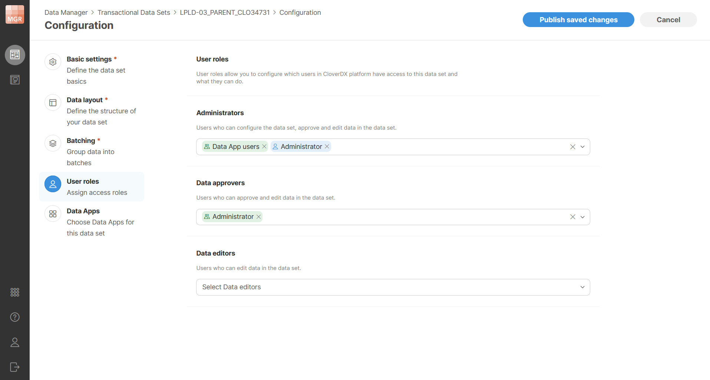
*Figure 142. Data set user roles configuration*

#### View modes in Data Manager

Data Manager supports two ways of viewing and editing data: **table view** and **split view**.

**Table view** shows data in the grid, with inline editing directly in the cells. This mode allows you to see large number of data cells at the same time. It is often suitable for quickly scanning many rows looking for patterns in your data or for quick data edits. For wide data sets (with many columns), it may not be the best way of looking at your data since many columns will be outside of your view.

**Split view** splits the screen into the grid and a sidebar. The grid is the same as in table view and it allows. The sidebar shows currently active row from your data in a structured form. Each column gets its own edit control arranged in a simple grid with multiple columns. This mode is most suitable when you need to focus on a single row of data and need to work with wide data sets. Sidebar will allow you to fit many columns on screen. In some ways, you can think of the sidebar as "details panel" — it shows details of the row that you are currently working with. In this mode, you can edit your data in two ways — in the grid or in the sidebar.

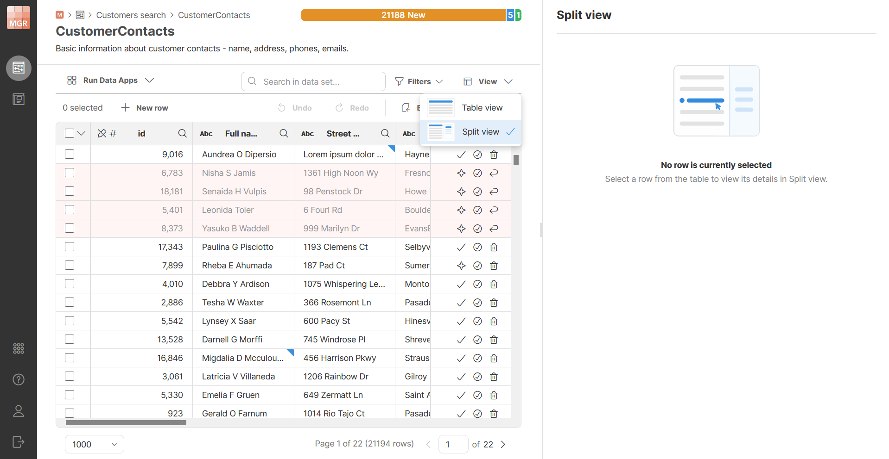
*Figure 143. Table view and split view*

Table view is the default when you open a data set. Data Manager remembers your chosen view mode per data set, stored in your browser. Both view modes provide the same functionality — the difference is only in how you look at and edit a row, in the grid or in the sidebar.

##### The sidebar

The sidebar shows data from the currently active row. A data set always has exactly one active row, or none — even if you select multiple rows using their checkboxes, only one of them is active at a time. The active row is highlighted with a darker shade of blue.

The sidebar covers the full height of the screen and is resizable by dragging its left edge. It shows column editors in as many columns as fit its current width.

Changes are saved automatically as you leave a field, whether by clicking elsewhere or by pressing Tab to move to the next column’s editor within the same row.

Sidebar value editors follow the same conventions as cells in the grid — red triangle in the upper left corner indicates an error, blue triangle in the upper right corner indicates a column with unsaved changes. Hovering over the value will show the same tooltip as in gird — error message for values with error and previous version tooltip for modified values.

##### Creating new rows

You can create new rows in the data set if it is allowed in the data set configuration. The **New row** button on the toolbar behaves differently depending on the view mode.

In split view, creating a new row opens an empty row in the sidebar — all its columns will be blank. The row is not saved until you click **Save** button in the bottom right corner. **Cancel** discards the row and returns to the previously selected row. A **Save & create new** button saves the current row and immediately opens another empty row to help you enter several rows one after another with fewer clicks.

Once a new row is saved, it becomes the active row: the sidebar shows it, and the grid scrolls to and focuses on it.

If you have unsaved changes in a new row and try to select a different row or switch the view mode, a confirmation dialog appears asking whether you want to save or discard the changes.

In table view, a new row appears at the top of the table, and clicking on another row commits it. Since the table may be sorted, it can happen that the new row moves to a different page of your data set once it is saved.

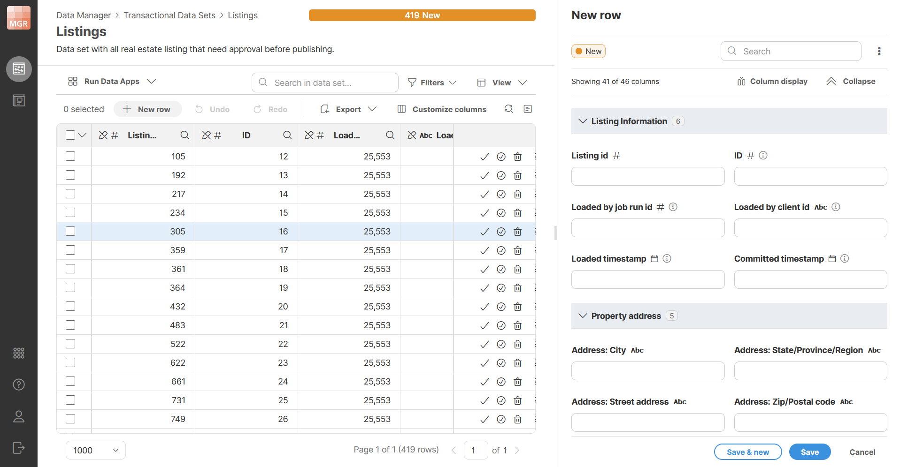
*Figure 144. New row creation in split view*

##### Sidebar header

The sidebar header shows information about the current row, and provides actions for moving between rows, searching, and switching views.

###### Row label

The header can show a configurable row label. The label is defined in data set’s configuration on **Row label** configuration page. Since row label is a property of the data set, only data set administrators can change it. It is also the same for every user — it is not a per-user setting.

Row label is configured in terms of a **row label template**. The template is a text template that can reference the row’s columns using `${columnName}` syntax. For example, `${firstName} ${lastName}` will create row label composed of person’s first name, then space, and then last name. The names in braces are technical names of columns in the data set. Any column can be used — including system columns. Each column can appear any number of times in the template.

If the template field is left empty, the page shows the default label that will be used instead, computed from the data set’s columns.

Data Manager will validate the row label template and will report an error if you use a column that does not exist or if the template contains syntax errors. If you rename a column, or delete a column, you must fix the row label template before the data layout change can be published.

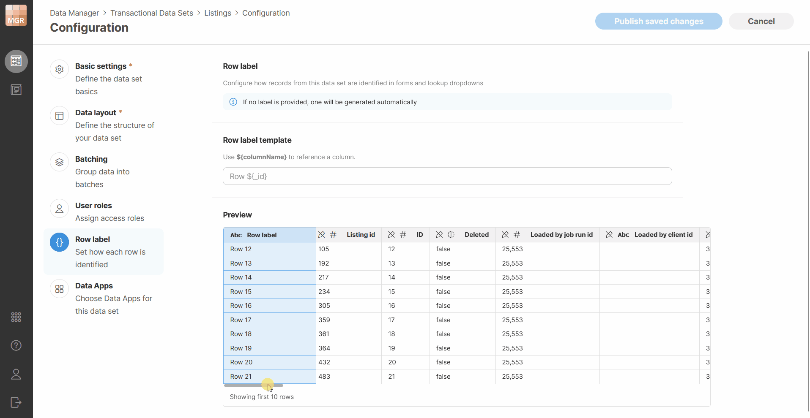
*Figure 145. Row label configuration in data set configuration*

###### Row status

The row’s status is shown in the sidebar as well: as a colored status pill for transactional data sets, or as an enabled/disabled toggle for reference data sets.

You can change the status directly from the sidebar. For a transactional data set, clicking the status opens a dropdown listing the other available statuses. For reference data set, use the toggle. The change takes effect immediately.

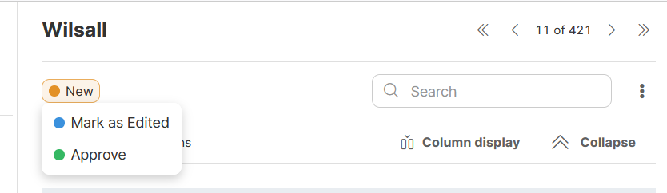
*Figure 146. Row status in the sidebar*

##### Navigating between rows

Previous and next buttons in the sidebar let you move between rows one at a time. Navigation respects the grid’s current filter and sort settings, so if the data is filtered or sorted, the first row is the first one matching that configuration, not the first row in the data set. You can also jump directly to the first or last matching row.

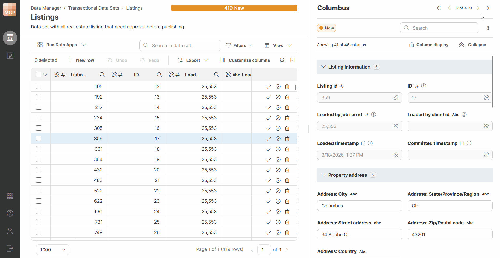
*Figure 147. Navigating between rows in the sidebar.*

##### Keyboard shortcuts

The sidebar can be controlled from the keyboard for its primary actions, to support fast data entry and review.

| Action | Shortcut |
| --- | --- |
| Cancel | Esc |
| Undo / Redo | Ctrl+Z / Ctrl+Y |
| Mark as Edited | Ctrl+1 |
| Approve | Ctrl+2 |
| Next search match | Arrow Down |
| Previous search match | Arrow Up |
| Next row | Alt+PageDown |
| Previous row | Alt+PageUp |
| Next empty field | F8 |
| Previous empty field | Shift+F8 |

##### Column layout and editors

Columns appear in the same reading order as they are defined in the data set layout. Sidebar will also show column groups if they are configured in a data set — this can help you navigate data sets with many columns easier than grid navigation which may require a lot of horizontal scrolling. The reading order for columns and groups in the sidebar looks like this:

```
[Column group 1 header]
Column1     Column2
Column3

[Column group 2 header]
Column4     Column5
```

Each group header shows how many of its columns are currently visible, since column visibility settings may hide some of them. Each group can collapse to allow you to hide columns you do not need to look at.

Every column value editor has a title and an input control suited to its type, a data type icon next to its name, and a marker if the column is used as a key. Columns with a description show an info icon after the name; hovering over it shows the description as a tooltip. Errors and unsaved changes are indicated the same way described above — a red triangle for errors, a blue triangle for unsaved changes.


*Figure 148. Sidebar showing column groups.*

###### Configuring column groups

Column groups are configured on the **Data layout** page of the data set configuration. Moving your mouse over the column list shows an insertion line where a new group can be added. Clicking **Add group** opens a dialog asking for a name; confirming it splits the columns at that point — everything above stays in the original group, and everything below, up to the next group or the end of the data set, becomes the new group.

To rename a group, hover over it to reveal a pencil icon, which opens an inline editor or a dialog for changing its name.

You can drag a column to move it into a different group using its drag handle. Dragging a column to the very top of the list, above the first group, creates a new group there, named **New group** by default. If you drag every column out of a group, the now-empty group is removed — there are no empty groups. You can also drag an entire group by its header to move all of its columns at once; dropping it into another group splits that group at the point where it was dropped.

When you create a new data set, all of its system columns are placed into a **System columns** group automatically. This group behaves like any other — you can rename it, delete it, or move columns into and out of it, for example if you want **Status** to appear as the first column instead. Data sets that existed before column groups were introduced do not get any groups added automatically; you can create groups for them the same way as for any other data set.

When you add a column to a data set that already has groups, it’s placed just before the **System columns** group, if one exists. If the **System columns** group is at the very top of the data set, a new group, named **Data set group**, is created for the column instead, since columns can’t exist outside of a group once groups are defined.

For each column you add after the first, Data Manager remembers the last column you added during your current session and adds the next one right after it — rather than always adding at the top — even if you’ve since moved that column elsewhere. This keeps newly added columns in a natural order as you build up a data set.

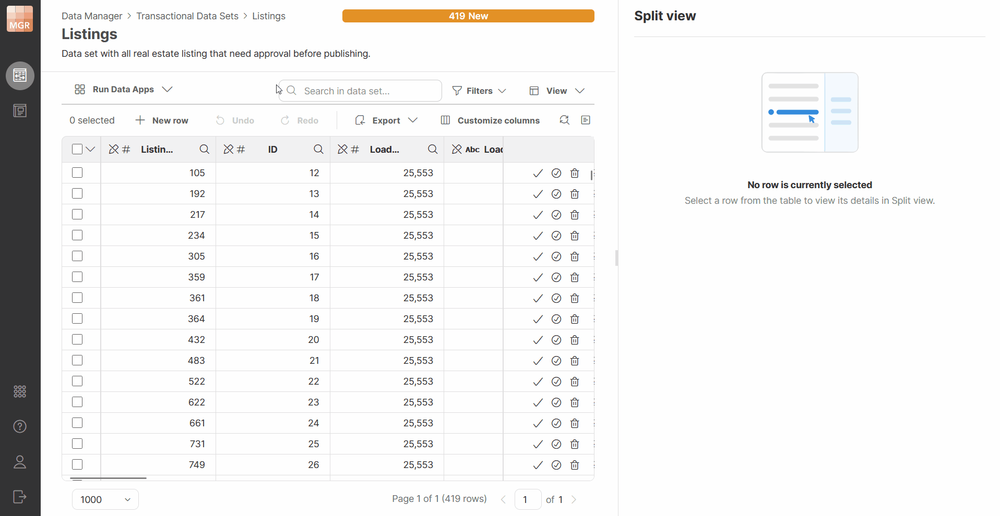
*Figure 149. Column group configuration in data set configuration.*

##### Choosing which columns are shown

The sidebar can show a different set of columns than the grid, configured through a **View** menu on the toolbar. This allows you to use the sidebar as "details panel" — simply configure a smaller subset of columns in the grid and leave all columns shown in the sidebar.


*Figure 150. A screenshot showing usage of sidebar as details panel. The grid only shows person’s name, city and state while the sidebar shows all columns.*

The view configuration for the sidebar offers quite a lot of options that allow you to configure it to suit your needs. The options menu looks like this:

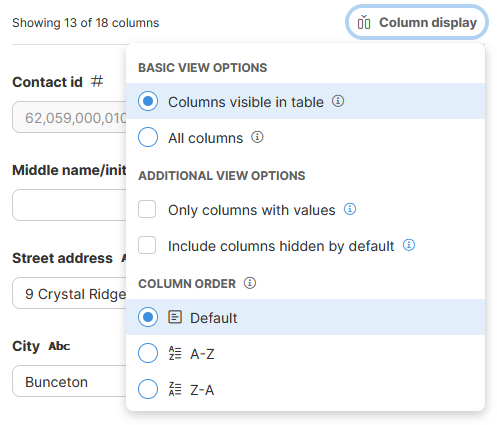
*Figure 151. Configuring sidebar column display options.*

It offers the following options:

- **Basic view options** allow you to configure which columns to show.
  - **Show currently visible columns**: shows columns currently visible in the grid, across the entire data set, not just what fits on screen. If you hide or reorder columns in the grid, the sidebar follows. This is the default setting.
  - **Show all columns**: shows every column in the data set, regardless of grid settings, in the order defined by the data set layout, excluding columns hidden by default.
- **Additional view options** allows you to refine the list of columns to show. These options can be combined with each other and with basic options described above.
  - **Only show non-empty columns**: hides columns with no value for the current row. This can result in a different set of columns from one row to the next but is very useful especially when viewing sparse data sets (many columns, but many of them empty).
  - **Also show columns hidden by default**: includes columns whose visibility is set to *Hidden*, including system columns such as `_id`.
- **Column ordering** allows you to change the order in which columns are shown in the sidebar.
  - **Default**: columns will be shown in the same order as they are defined in the data set layout. In this mode, column groups will be shown as well.
  - **A-Z**: ascending alphabetical order (from A to Z). Columns are ordered based on their label, column groups are not shown in the sidebar.
  - **Z-A**: descending alphabetical order (from Z to A). Columns are ordered based on their label, column groups are not shown in the sidebar.

Note that columns set to **Always hidden** are never shown, regardless of these settings.

#### Connected Data Apps

To help you interact with data sets, you can connect Data Apps to a dataset. This will make Data Apps available directly in the data set editor in the toolbar. Data Apps can be connected to the data set via **Data Set Configuration** pages. Only data set administrators can change Apps that are connected to a data set. Other users can see the Apps but cannot add or remove them.

A dataset can have any number of connected Data Apps. The **Data Apps** page allows you to see which Data Apps are currently assigned to the dataset, add new ones, remove existing ones, and change their order.

The order of connected Data Apps is preserved and affects how the actions are presented later in the editor – apps are shown in the same order as they are defined in the configuration (the first app in the list will also be the first app on the toolbar).

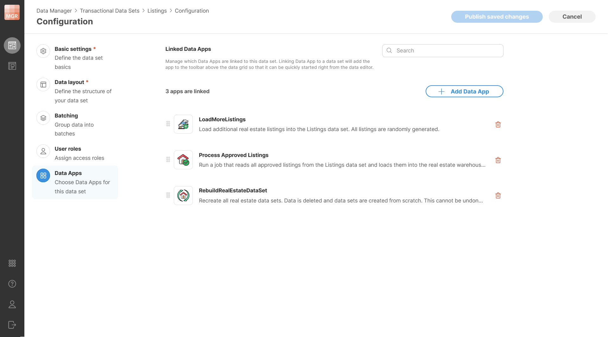
*Figure 152. Data set configuration showing connected Data Apps.*

Data Apps shown in the data set editor respect user’s permissions. It is therefore possible for a user with limited permissions to not see some of the apps on the toolbar since they do not have permissions to use those apps. This can allow you to add apps for everyone and then fine-tune which apps are available to different users with permissions settings in CloverDX Server Console.

##### Adding or Removing Data Apps

To add a new Data App, click **Add Data Apps**. This opens a dialog which will show you an App Catalog where you can browse available Data Apps and select one or more items. Only Data Apps that you have permissions to use will be shown here.

The selection dialog supports search, so you can quickly find the app you are looking for. After confirmation, the selected Data Apps are added to the dataset.

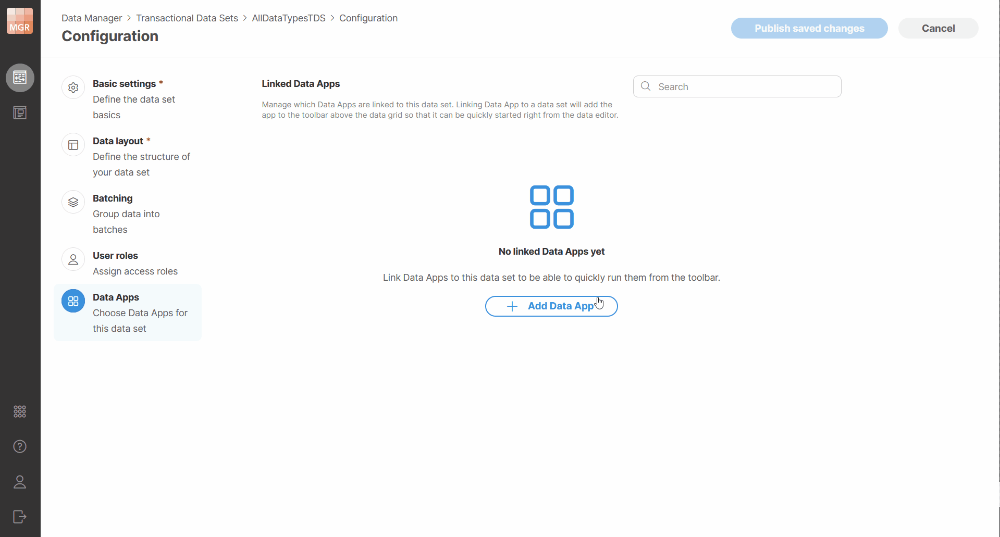
*Figure 153. Adding Data Apps to a dataset.*

Apps can be removed by clicking on the trash can icon next to each app in the data set configuration.

##### Running connected Data Apps

Connected Data Apps can be run directly from the Data Set Editor on the current dataset. The editor shows the Data Apps that are assigned to the dataset as available actions above the grid toolbar.

If only a few Data Apps are connected, they are displayed as quick action buttons. If more Data Apps are available, they are shown in a dropdown with search. Each connected Data App shows its description in a tooltip on hover.

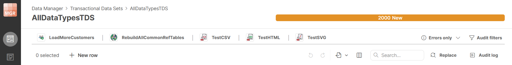
*Figure 154. Data set editor showing connected Data Apps on the toolbar.*

**To run a connected Data App**, select it from the toolbar. The Data App will open in a dialog showing app description and parameters (if any) - this is the same as when the app is started directly from the Data App Catalog.

A notification will be shown while a Data App is running. You will not be able to run other Data Apps while the first one is running. This is to allow you to see app results once it is done. However, the execution is non-blocking, so you can continue working with the dataset in the editor. Note that if multiple users are working on the same data set, they will be able to start multiple Apps in parallel. Each user will then only be able to see output of the app they started.

If you try to leave the editor while a Data App is still running, Wrangler shows a confirmation dialog explaining that leaving the editor prevents you from seeing the results in the current preview flow. However, the Data App will continue running and will not be terminated. This allows you to do something else while the app is running if it takes long time to run.

When the Data App finishes, Data Manager shows a notification with the result of the execution.

The notification will indicate whether the run finished successfully or with an error. Depending on the result, the notification can also provide additional actions such as downloading a file or opening the result preview.

If you choose **Open Preview**, Data Manager opens a dialog showing the result page. The result can be displayed as either a success page or an error page, using the same presentation as in Data Apps.

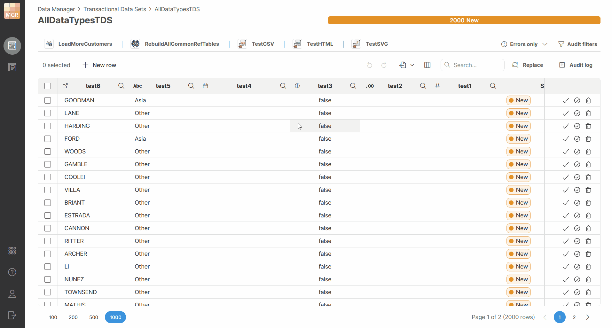
*Figure 155. Running Data Apps directly from the data set editor.*

###### Reloading data after running a Data App

Running Data Apps can make changes to multiple data sets. It one of the modified data sets is the currently opened one, Data Manager will show you notification with additional reload option. The reload does not happen automatically as that could interrupt your other work such as editing of your data or even just reviewing the data in the table since it could move the view and what you were looking at would be scrolled away.

The reload option is shown only to the user who started the Data App in the same browser window. Other users must reload manually (or the data is reloaded for them depending on actions they take).

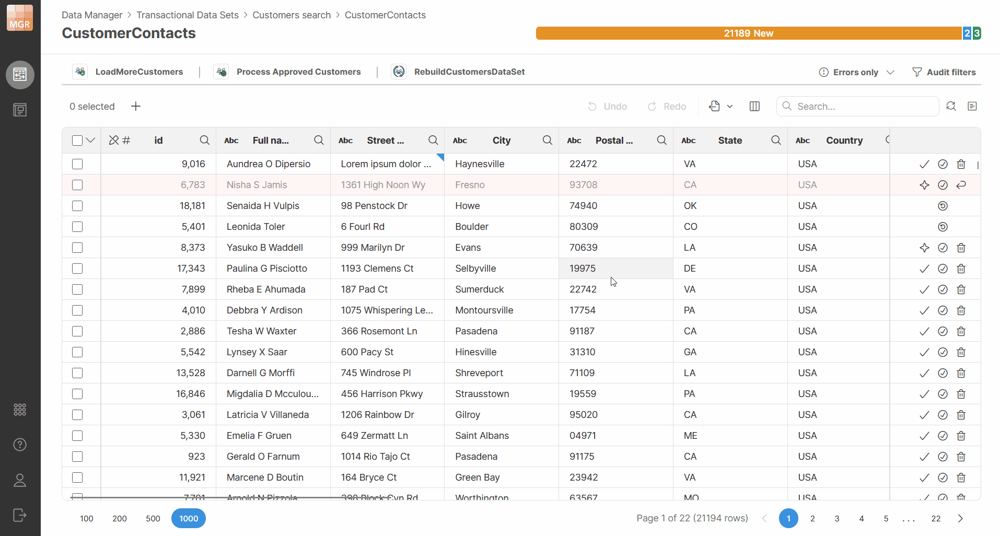
*Figure 156. Reloading data after running a Data App.*
