<!-- End user’s guide > Data Manager user guide > Working with reference data -->

### Working with reference data

In this section we’ll cover the reference data sets and master data management in CloverDX Data Manager. We’ll see how you can create and manage your reference tables, how you can use them in Data Manager in other data sets and how you can maintain the data over time.

**Reference data set** is a term often used in the context of **master data management (MDM)**. Reference data set is a structured collection of shared reference data that has been standardized and can be used across multiple applications, processes, or systems. The main purpose of reference data is to help categorize, classify, or validate other data.

Shared and centrally managed reference data provides a common framework that ensures that multiple applications or processes use the same data for data categorization, validation, and governance. This helps ensure interoperability and consistency across the whole organization.

There are a few key differences between transactional data and reference data:

- **Stable**: reference data is relatively stable as it changes less frequently than transactional data. However, it still needs to be maintained and updated from time to time.
- **Centrally managed**: to ensure effective use of reference data, there should only be one place that maintains the “golden” copy of the data. All applications and systems across the organization should work with this data rather than having their own copies which can get out of sync if not maintained properly.
- **Used across multiple use cases**: reference data is often used across multiple use cases or even domains (e.g., country codes or currency codes can be used by finance, marketing, product, etc.).
- **With data integrity**: reference data must be internally consistent to ensure that the inconsistencies do not spread to processes where the data is used.

A typical organization will require quite a lot of various reference data sets, for example:

- Country and currency codes, region codes.
- Product categories, customer segments, product catalogs.
- Industry classification codes like NAICS, ISIC, or NACE.
- HR codes like job titles, roles, contract types and more.

Reference data usually follows a simple lifecycle where new records must be approved before they can be used in production. In many cases, the records are versioned and updated over time and once they are no longer needed, they can be retired and archived.

#### Reference data sets

Reference data sets have been designed to support master data management of reference data as used by the organization. Reference data sets are shown on a **Reference Data Sets** screen in the Data Manager.

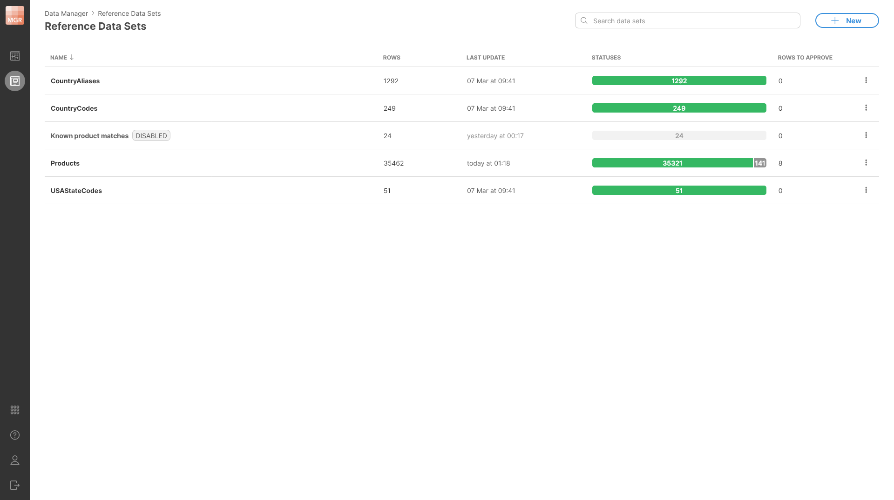
*Figure 174. A Reference Data Sets screen shows a list of existing reference data sets with basic information about each of them.*

The screen shows the following information for each data set:

- **Name**: name of the data set. The name can contain spaces and special characters.
- **Rows**: total number of rows in the data sets. This includes enabled as well as disabled rows.
- **Last update**: date of when the data set was last updated (i.e., when the last change was made).
- **Statuses**: shows an overview of row statuses in the data set. Rows can be either enabled or disabled – see [Enabled and disabled rows](data-manager-working-with-reference-data.md#enabled-and-disabled-rows) for more details.
- **Rows to approve**: shows the number of rows that have pending changes that were not approved yet.

Data sets can be disabled which is shown using the **Disabled** label next to the data set name. Disabled data set cannot be used in CloverDX jobs, but its data can be viewed and edited in the Data Manager.

#### Data set rows

Each reference data set can contain any number of rows. The structure of each row is described by its **data layout**. The data layout defines **columns** (fields) and their **data types** as well as additional column properties.

The columns can be **strings** (representing text), **numbers** (integers as well as decimal numbers), **dates**, or **boolean** (representing `true`/`false`). For more information about data layout and column data types, please see the [Data layout](data-manager-working-with-reference-data.md#data-layout) section.

All rows within the data set have the same data layout which allows the data set to be displayed as a simple table. The data is shown on the **Data editor** screen which allows you to see and edit the data in the data set. The data in the data editor is shown in the **data grid** (or just grid).

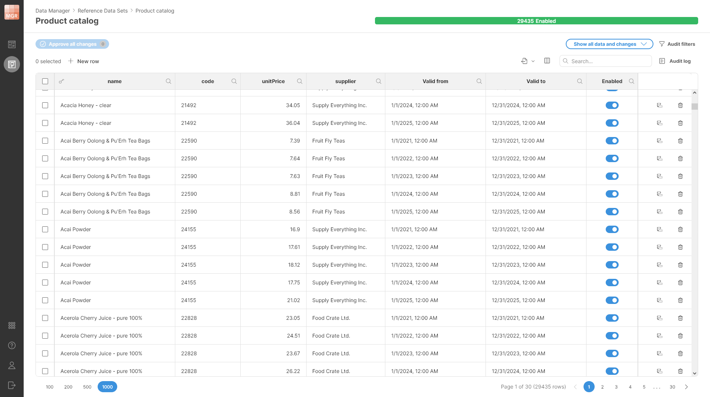
*Figure 175. An editor showing data in the Product catalog reference data set.*

To learn more about how to work with data in the data set – how to view or approve changes, edit the data and more – see the [Editing data in Data Manager](data-manager-editing-data.md) section.

##### Enabled and disabled rows

Rows in a reference data set can be either Enabled or Disabled. Disabled rows are skipped when the reference data set is used as a lookup. For example, in **CountryCodes** reference table this can be used to store country codes for countries that no longer exist.

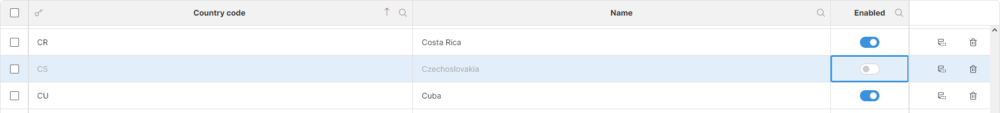
*Figure 176. An example showing a disabled row representing Czechoslovakia in CountryCodes reference table. The country does not exist since 1993, and the row is therefore disabled but it may be useful to keep it around.*

The Enabled/Disabled status or a row is stored in a column called **Enabled**. This column is always present in the data set and cannot be removed.

When new rows are created, they always start as disabled and need to be enabled and approved to appear in the data when the reference data set is used.

Note that changing the Enabled status of the row is the same as changing any other column – the change must be approved before it is reflected in the data used during lookups.

You can click a status in the progress bar to quickly filter rows by that status.

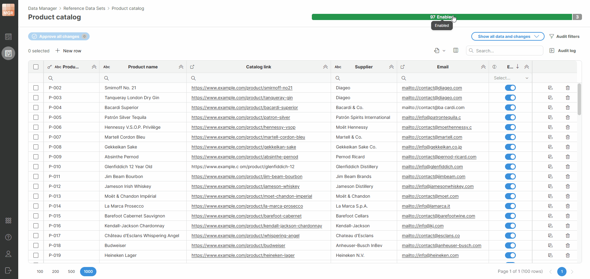
*Figure 177. Progress bar filters*

##### Row lifecycle

Rows in reference data sets have quite simple lifecycle with stages centered around row enabled/disabled status and its change status. Unlike in transactional data sets, there is no single status column that would represent all this data.

The lifecycle follows essentially just two stages – a row is either approved or changed (not approved). Whenever **any change is made** to a row (i.e., any column is modified), copy of the whole row is created and the change is applied to the copy. This copy is called **change row**. There is always at maximum one change row per data set row – all changes to a row accumulate in the change row.

When performing lookups into the data set, change rows are ignored. This means that only approved version of each row can be returned by a lookup.

Whenever **Approve** action is called on the change row, the original row is replaced with the change row and the change row is removed. The change row therefore becomes the approved row. All changes are visible to queries into the data set from that point (audit log is updated as well).

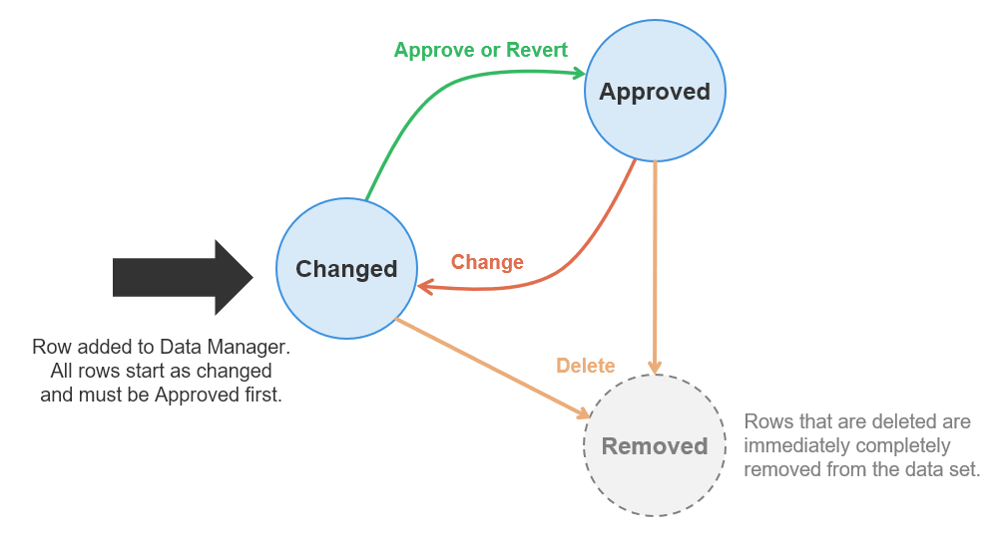
*Figure 178. Diagram showing reference data set row lifecycle. All rows start as Changed and must be Approved before they are visible to lookups.*

##### Editing reference data

When working with reference data sets, several actions are available in the data editor:

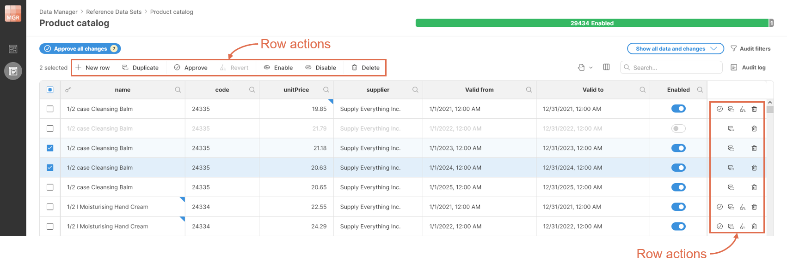
*Figure 179. Row actions available in data editor when working with reference data sets.*

Following row actions are available:

| Row action | Description |
| --- | --- |
| **New row** | Add new row to the data set. Row will be created as change row and will need to be approved before it is visible in lookups. |
| **Duplicate** | Duplicate all selected rows. Duplicates will be created as change rows and will need to be approved before they are visible in lookups. |
| **Approve** | Approve selected row(s). All changes will become visible in lookups (and change row will be removed). |
| **Revert** | Revert all changes in selected row(s). This action removes change rows from all selected rows. If reverted row was a new row, it will be completely removed (since there is no approved version of it). |
| **Enable** | Enable selected row(s). The change must be approved before it is reflected in the data used during lookups. |
| **Disable** | Disable selected row(s). The change must be approved before it is reflected in the data used during lookups. |
| **Delete** | Remove selected row (and its change row if it exists). Removing the row takes effect immediately and the data is removed from the Data Manager. |

##### View modes in data editor

To help users navigate reference data sets, four different view modes are available when working with reference data. View modes can be switched via view mode drop down in the top right corner of the screen:

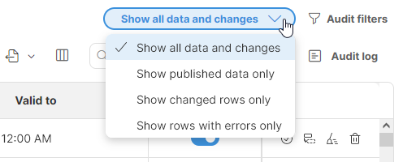
*Figure 180. View mode selector showing all four view modes.*

View modes do not affect data in the reference data set but help users see the data and changes in a way that makes it easier to accomplish certain tasks. The following view modes are available:

- **Show all data and changes**: this is the default mode which shows rows together with the changes made to them. Changes are shown with the blue triangle markers in the top right corner of each cell.
- **Show published data only**: this mode shows only published (approved) versions of each row. No changes are shown in this mode. This mode is useful when trying to debug a process to see what data is available when performing lookups in the data set.
- **Show changed rows only**: this mode shows all rows that have any change. This mode is most useful to data approvers who can have a look at all changes before they are approved.
- **Show rows with errors only**: in this mode only the rows that have any error are shown. This is most useful when making changes to data to see related rows that may need to be modified before they can be approved (Data Manager will not approve any row with error).

Note that not all modes are available to all users – read-only users only see published data and therefore cannot use view modes that show changes or errors.

#### Data sets with Effective dates

In many cases you may require multiple versions of the same reference data row that apply in different periods of time. A typical example is a product catalog where product prices change over time or a currency conversion table where exchange rates change daily.

In these cases, it would be possible to set-up the reference data set so that it contains an extra column with the date when certain values are applicable. But such an approach is unfeasible in cases like the product catalog where different products change prices at different times.

To support such use cases, reference data sets in Data Manager support **effective dates** for each row. Effective dates for a row are a time period defined by two date columns. The first date column called **Valid from** defines the start of the period while the column called **Valid to** defines the end of the period in which the given row is applicable.

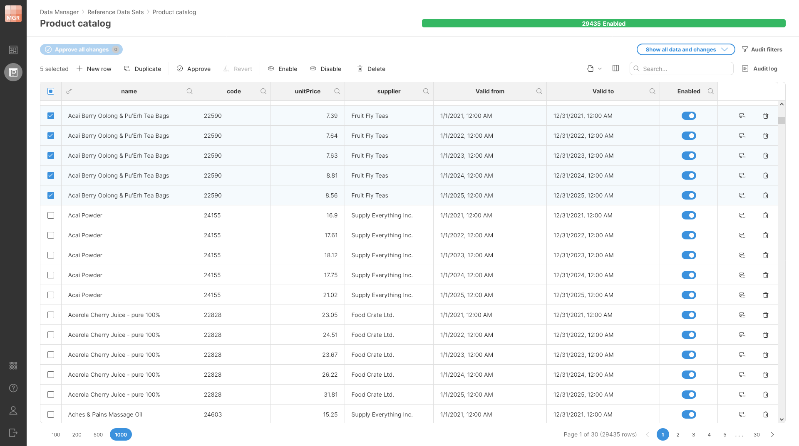
*Figure 181. An example showing five different rows (the selected ones) from the product catalog all with the same key (name column) but with different effective dates. The effective dates define one-year long intervals where the product has different prices.*

Note that time periods defined by the **Valid from** and **Valid to** columns must not overlap for rows that have the same values of their key columns. Data Manager will not allow you to approve rows if this is the case and will show you an error on rows that are in conflict.

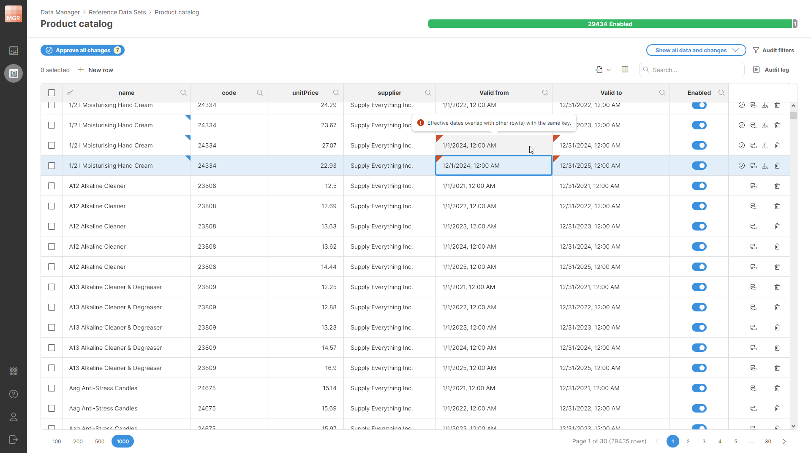
*Figure 182. Data editor showing conflicting rows with the red markers in the corners. The conflicts shown on this screenshot are caused by the highlighted row – the Valid from value was changed to 1st December 2024 which overlaps with the interval defined in the previous row.*

If you tried to approve any of the rows with such a conflict, you’ll get an error message and the approval will fail. This way Data Manager guarantees that overlapping rows which cause lookup ambiguities do not get into the data set and cannot cause issues in the processes where the data is used.

#### Using reference data sets as lookups

Reference data sets can be used as lookups in Data Manager as well as in the Designer. In both cases they are used as a data source for lookups in various situations – data validation, enrichment and so on.

##### Using reference data in Data Manager

Reference data sets can be used as lookups when defining the layout of another data set using the Restrict to lookup functionality. For example, you can have a data set where one column should allow only values from another reference data set, such as country codes, currency codes, product IDs, or other predefined values.

To be able to use a reference data set as a lookup, it must satisfy the following conditions:

- **It must only have a key with a single column.** Reference data sets that have compound keys composed of multiple columns cannot be used in this way, because they would require more than one value to identify a row.
- **It must not have effective dates enabled.** Effective dates add another column to the data set key and therefore cannot be used for this type of lookup.
- **It must have a field that can be used as a label when lookup values are shown in the data editor.** The label field does not have to have the technical name *label*. You select the *label* field when configuring *Restrict to lookup* for a specific column.
  - **Key column**: this column represents the value that is stored in the data set where the lookup is used. The column can have any name, but it must be configured as the single key column of the lookup reference data set. Its data type must match the type of the column where the lookup is used (.e.g, if your lookup has an integer key, the column where it is used must be an integer as well).
  - **Label column**: this column defines the value that is shown to users in the data editor. It must be a string column. The selected label is used only for display; the value stored in the data set is still the lookup key.

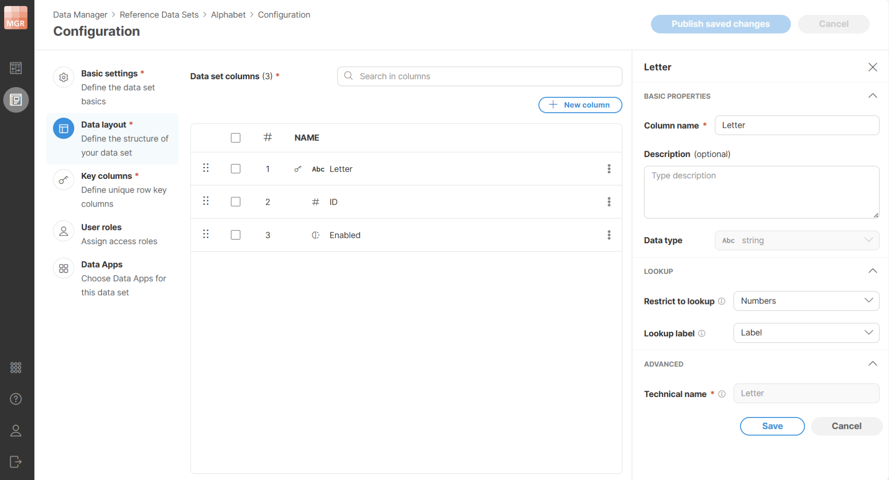
*Figure 183. Configuration of the Letter column in the Alphabet reference data set. The column is restricted to lookup values from the Numbers data set, and Label is used as the value shown to users.*

To use this data set, configure it in the target column using **Restrict to lookup**. In the same Lookup section, use Lookup label to select which field from the lookup data set should be shown in the dropdown.

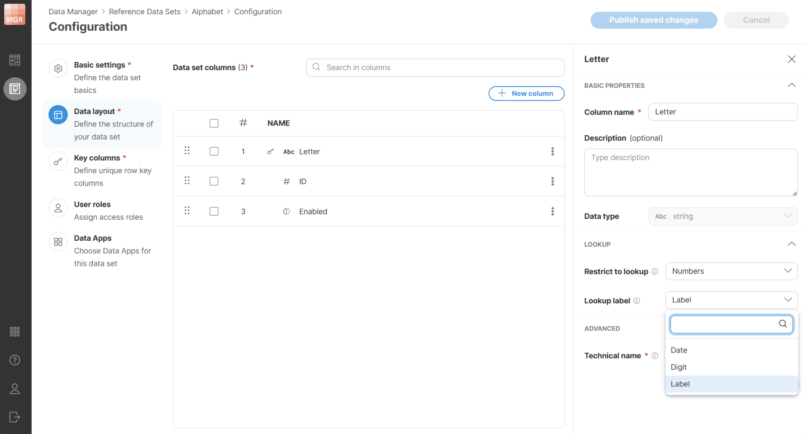
*Figure 184. Selecting the lookup label for the Letter column. The Lookup label setting defines which value from the lookup data set is displayed.*

When configured like this, the values of the target column are shown as a dropdown populated by values from the selected reference data set.

*Figure 185. The Alphabet data set opened in the data editor. The Letter column is configured with lookup values from the Numbers reference data set.*

The value stored in the edited data set is the lookup key. Data Manager shows the selected label instead, making the data easier to understand when the stored values are technical codes, IDs, or other values that are not clear .

The reference data set used as a lookup can have more than two columns. Additional columns are displayed together with the key and label when the dropdown is shown in the data editor. These columns can provide more information and help choose the correct value.

##### Using reference data sets in Designer

Reference data sets can also be used when working in CloverDX Designer. The Designer provides **Lookup** functionality that allows users to define different kinds of lookup tables depending on their exact requirements and usage patterns. One of the lookup types is **Reference data lookup table**.

When such a reference data lookup table is created, it is linked directly with a specific reference data set and will use its data when the job runs.

**The Designer allows complex lookups** besides just lookups with a single key column. The reference data sets designed to be used in Designer can therefore have compound keys that have multiple columns and can also have effective dates enabled.

To learn more about how this can be implemented in CloverDX Designer, please see [Reference lookup table](../developer/lookup-tables.md#reference-lookup-table) chapter in the Developer’s guide.

Note that regardless of how the data is used in the Designer, the maintenance of the data set remains the same and does not require any access to CloverDX Designer.

#### Creating reference data sets

You can create any number of data sets in Data Manager as long as you have *Create new data sets* permission configured in CloverDX Server. See [Data Manager permissions in CloverDX Server](../admin/data-manager-administration.md#data-manager-permissions-in-cloverdx-server) to learn more about how to configure permissions in CloverDX Server.

Reference data sets can be created from **Reference data sets** screen using the **New** button in the top right corner of the screen. Once you click the **New** button, a **New Reference Data Set** wizard will be shown and will guide you through the rest of the process.

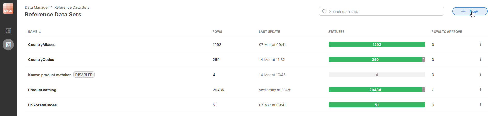
*Figure 186. Reference Data Sets page offers a New button in the top-right corner when logged in as a user with Admin privileges.*

When creating a data set, you will have to configure its basic properties, data layout, permissions, and other settings. These are all configured on separate pages in the wizard.

##### Basic data set properties

The first screen of the wizard allows you to configure basic settings for the data set like its name, description, and more.

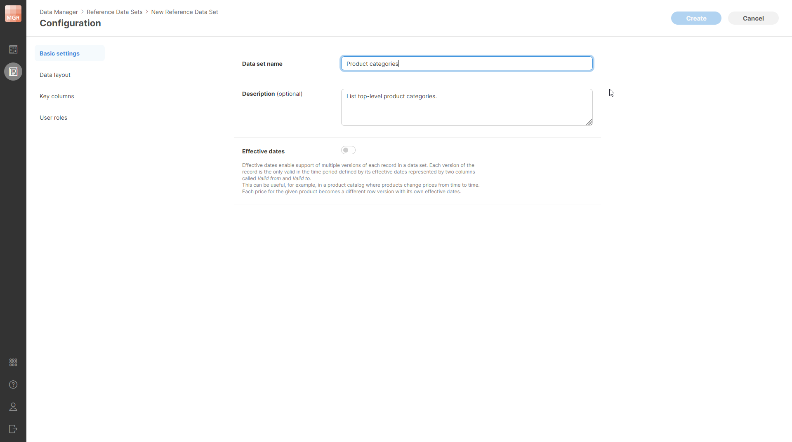
*Figure 187. Basic settings page of the New Reference Data Set wizard.*

The following settings can be configured on the **Basic settings** page:

- **Data set name**: unique name of the data set. The name *can* contain special characters (like spaces) and should be descriptive enough to allow you to find your data set when working in Data Manager or in Designer.
- **Data set code**: unique technical identifier of the data set. Unlike the data set name, the code cannot contain spaces or special characters. The data set code does not change even if you rename the data set, which allows you to continue using the data set in CloverDX jobs, Data Apps, and other references even if the name has changed.
- **Category**: an optional category used to organize data sets in Data Manager and Server Console. You can select an existing category or create a new one. See [Data set categories](data-manager-introduction.md#data-set-categories) for more details.
- **Description**: an optional more detailed description of the data set’s purpose.
- **Effective dates**: enables or disables Effective dates columns. If enabled, date columns **Valid from** and **Valid to** will be added to the data set. These allow you to have multiple versions of each row with each version having its own effective period (i.e., a period of time when it applies). See additional details in [Data sets with Effective dates](data-manager-working-with-reference-data.md#data-sets-with-effective-dates). Note that if effective dates are enabled on a non-empty data set, it is not possible to turn them off since that could lead to large number of conflicts in the data.
- **Allow adding new rows**: allows users to add new rows to the reference data set. If disabled, users cannot add new rows (*New row* and *Duplicate row* actions are disabled).
- **Allow removing rows**: allows users to delete rows from the reference data set. If disabled, users cannot remove rows (*Delete row* action is disabled).

##### Data layout

**Data layout** specifies the structure of each row in the data set – the column names, types, and other properties.

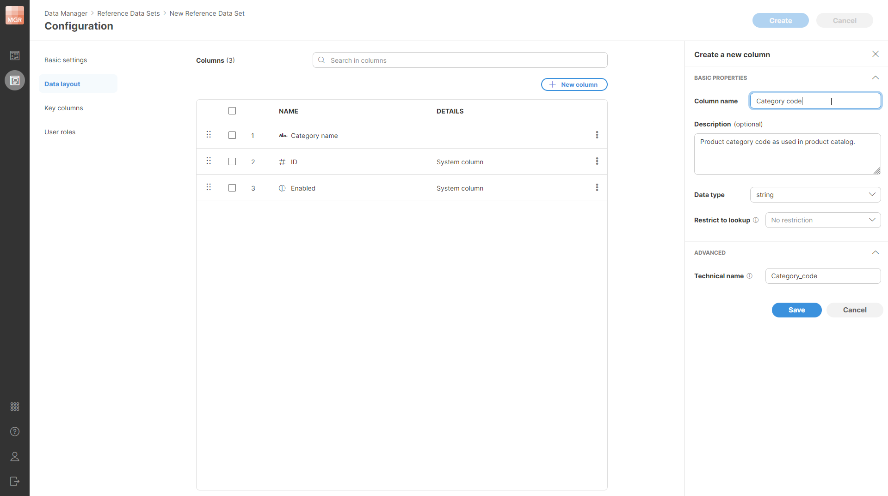
*Figure 188. Data layout page of the wizard with the column editor shown in the side bar. The first column has been added by the user while the remaining two columns are system columns which are shown in the table before any user-defined columns are added.*

All rows in the data set have the same layout. The layout can contain any number of user-defined columns and will also contain a set of system-defined columns that are always present and cannot be removed (but can be moved around to a different place within the row).

The layout of the data set is shown in a table which lists all the columns. The first column (at the top of the table) is the first column of the record. Columns can be reordered freely by using the drag handle on the left side of each column’s row in the layout table.

Columns in the data set can have one of the following data types:

| Type | Description | Examples | Metadata type |
| --- | --- | --- | --- |
| **boolean** | `false` and `true`. | `true` | `boolean` |
| **date** | Date and time with millisecond precision. | `2024-09-04` (date only) `2024-09-04 18:30:25` (date and time) `2024-09-04 18:30:25.428` (date and time including milliseconds) | `date` |
| **decimal** | Numbers with fractions with up to 22 digits before decimal point and 10 after the decimal point. The numbers are fixed-point – i.e., they are suitable to represent currency values and other exact quantities without various precision issues that often manifest with floating-point numbers. | `3.14` `-5348.6574` | `decimal(32, 10)` |
| **integer** | Whole numbers. | `5` `-8700` | `long` |
| **string** | Text data of any length with full support for Unicode to allow for characters of any alphabet. | `"Data Manager is cool"` `"東京"` | `string` |
| **url** | A link – a string containing a web address (URL). Valid URLs are shown underlined in the grid. Hold the **Ctrl** key and click the link to open the target.  The URL columns support markdown, which lets you create clickable links with custom text, for example:  `[Discover CloverDX](https://www.cloverdx.com/product)`  In addition to `http(s)://` protocols, you can also use other protocols:  - `ds://` – a special, CloverDX-only protocol which calls a Data Service in your local CloverDX Server. Use the *Data Service URL* from the Data Service detail page. Only Data Services using the **GET** method are supported, including those with query parameters. - `emailto://` – Opens your default email client and starts a new message with the specified email address. - `ftp://` – Opens your default FTP client and accesses the specified file or directory. - `tel://` – Opens your default phone application and pre-loads the specified phone number. | - `https://www.cloverdx.com/` - `ds://test-service` - `ds://test-service/1` (a Data Service requiring a parameter) - `emailto://hello@cloverdx.com` - `ftp://ftp.example.com/pub/files/manual.pdf` - `tel://+1-800-555-1234` | `string` |

When you create a new column, the following column settings are shown in a **Create a new column** side bar:

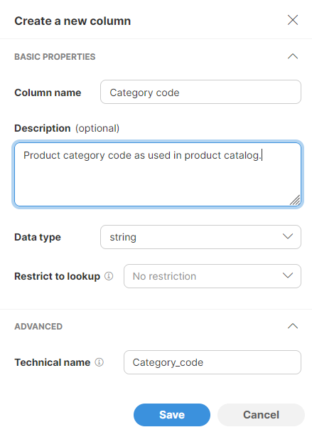
*Figure 189. Column setting shown in a Create a new column side bar.*

The following settings can be configured for the new column:

- **Column name**: name of the column. The name can contain special characters like spaces or other symbols. Data Manager will generate a *Technical name* as a column identifier automatically based on the human-readable name.
- **Description**: optional longer description of the column’s purpose.
- **Data type**: one of the data types mentioned in the table above – `boolean`, `date`, `decimal`, `integer`, `string`.
- **Restrict to lookup**: if configured, column values will only be allowed to have one of the values as defined in the lookup defined either using a Reference data set (see [Using reference data in Data Manager](data-manager-working-with-reference-data.md#using-reference-data-in-data-manager) for more details) or via lookups that are managed by the CloverDX Server in a special sandbox (see [Shared lookup tables in CloverDX Server](../developer/shared-lookups-in-server.md)). The dropdown will show you a list of all lookups regardless of how they were defined.
- **Technical name**: defines a unique identifier for the column in the data set. Technical name will be generated for you automatically based on the column name. In most cases you can leave the technical name in its default value, however, you can change the value if needed. Technical names have to follow these rules:
  - They are case-sensitive (i.e., “Name” is not the same as “name”),
  - They can only contain letters, numbers, and underscore character,
  - They cannot start with a number.

Unlike transactional data sets, reference data sets do not have column visibility settings (all columns are visible except for the system columns which start as hidden). There is also no editable setting since all columns in the reference data set are editable (except for system columns which are maintained by the system automatically).

##### Key columns

**Each reference data set must have a key.** A key defines how to search for data in the data set when performing lookups. Key can be composed of any number of columns of different types and keys of all published (approved) rows must be unique.

To configure a key, use the Key columns page of the wizard. You can add any number of columns from the data set to the key and reorder them as needed by using the drag handles to the left of each column.

The system `_id` column can also be selected as a key column when you need an automatically generated unique key. Reference data sets that use `_id` as part of the key cannot have *Effective dates* enabled.

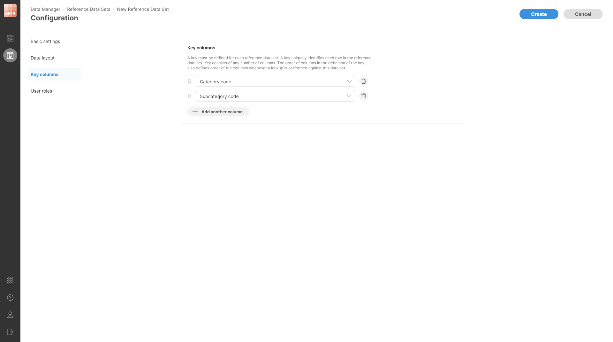
*Figure 190. Key columns configuration shown on a separate page of the wizard.*

The order of the keys specified on this page of the wizard is important as it defines the order of the keys as used when lookups are performed in the reference data set.

Note that if you create a row which has a duplicate key, you will not be able to approve it. The rows with duplicate keys will be highlighted with the red marker. To see all conflicts, you can use the [**Show rows with errors only** view mode](data-manager-working-with-reference-data.md#view-modes-in-data-editor) in the data editor.

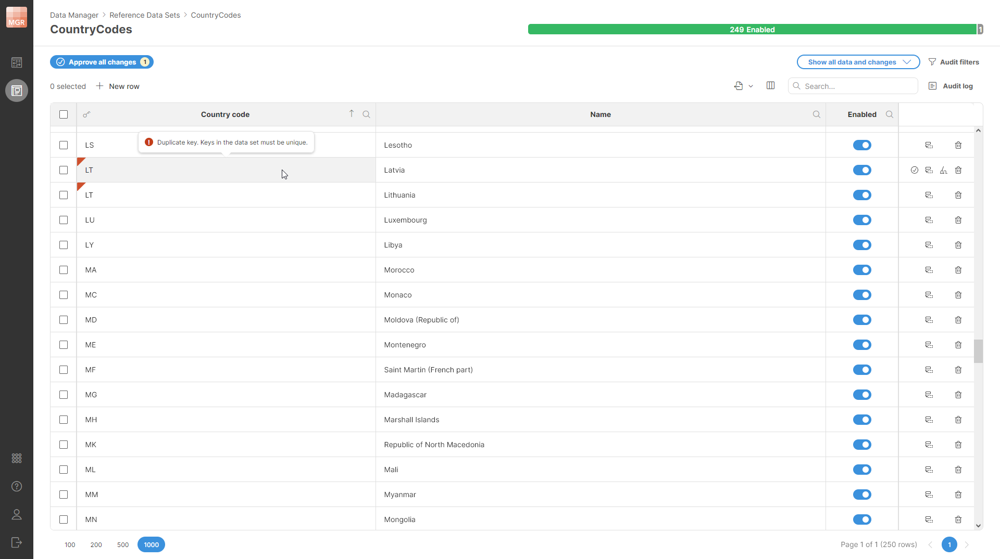
*Figure 191. An example of an error caused by duplicate keys in a data set without effective dates.*

When working with data set which has effective dates enabled, an extra “column” is added to the data set key. This column called **timestamp** must be used whenever a lookup is performed to ensure that the correct version of the data set row is found. For example, consider a reference data set representing product catalog where each product can have different prices at different date. To find the product price, you have to supply the product code as well as the timestamp for when you want the price to be valid. The timestamp is then matched to effective dates intervals for rows that have the same product code as the code you are trying to find.

Since effective dates must not overlap for rows with the same keys, Data Manager will not allow you to approve rows where this condition is not satisfied. As with duplicate keys, the rows that overlap are highlighted with red markers in *Valid from* and *Valid to* columns.

*Figure 192. An example of an error caused by having overlapping intervals defined by effective dates columns.*

##### User roles and permissions

Each data set has its own set of **permissions** – list of users and their roles with regards to the operations they can perform on the data set.

Roles are configured on a **User roles** page when creating a new data set:

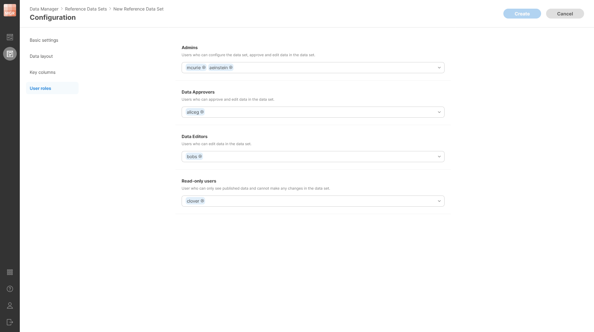
*Figure 193. User roles page in the new data set configuration.*

Clicking on a dropdown for each role will give you a list of all users on the Server and you can select any number of users in each role.

The roles form a simple hierarchy – a higher role has more permissions than a lower role. This means that *Admin* can do everything that *Data Approver* can, and *Data Approver* can do everything that *Data Editor* can. This means that for each user it is enough to place them into the role with the highest permissions they will need for their work. See more details in [Data Set Permissions section](data-manager-introduction.md#data-set-permissions).

In reference data sets one more role is available – a role of a read-only user. This role allows users to see the published data in the data set, but they cannot make any changes to it. As such, this role is ideal for processes that do not need to modify the data set and only perform lookup in it or for users who need to be able to see the data but have no need to be able to make any changes to it.

#### Editing reference data set configuration

Data set configuration can be edited even after the data set has been created and data has been loaded to it. To edit the configuration of a data set, select the ***Configure** option from the data set’s context menu which is shown on Reference Data Sets screen when you click on the three dots menu next to each data set.

When editing a data set, additional options are available on the **Basic settings** page:

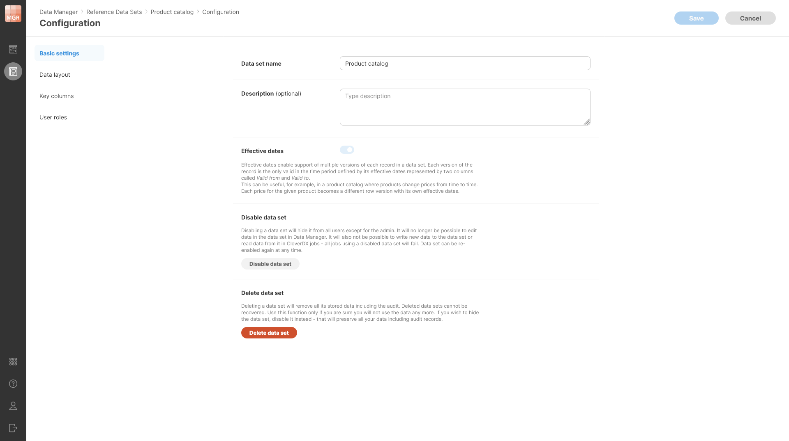
*Figure 194. Additional settings are available in the existing data set when its configuration is edited. Note that the data set on the screenshot has Effective dates enabled. Since it is not empty, Effective dates cannot be disabled.*

You can **Disable data set** to prevent anyone from using it without deleting any data. Disabled data set cannot be used in CloverDX jobs and data in disabled data set cannot be edited in the Data Manager’s editor.

Note that while the data set is disabled, the purge job that removes committed rows does not run. Therefore, the rows will stay in the data set. Once the data set is enabled, the purge job will start running as well and will purge all rows which have aged past their retention period.

You can also **Delete data set** to remove all data associated with the data set. Deleting the data set removes all the data as well as audit logs and other related metadata from the Server. **Note that deleted data set cannot be recovered.**

Editing data set (except when it is disabled or deleted) is always a single operation even if you changed multiple settings of the data set. You should make all the changes you need and then **Save** all the changes at once. The changes are only applied when you save rather than right away when you change something to ensure you do not damage your data in any way. Disabling the data set and deleting the data set are carried out immediately.

##### Changing data set layout

When changing the layout, the following operations are allowed:

- Reordering the columns.
- Adding new columns.
- Deleting existing columns.
- Renaming columns in the data set (both human-readable as well as technical column names can be changed).
- Changing column descriptions.
- Changing column lookup settings.

Note that it is not possible to change the column type in a data set that contains data. However, it is possible to change the type of a column in an empty data set.

Also note that if you delete a column, the data will be removed and cannot be recovered (the delete is hard delete without ability to undo).

The layout changes are only applied after you click on the **Save** button and all layout changes are applied at once.

##### Changing key columns

Key columns cannot be changed if the data set contains any data. This is to ensure that there are no conflicts in the data caused by duplicate keys or overlapping effective dates intervals.

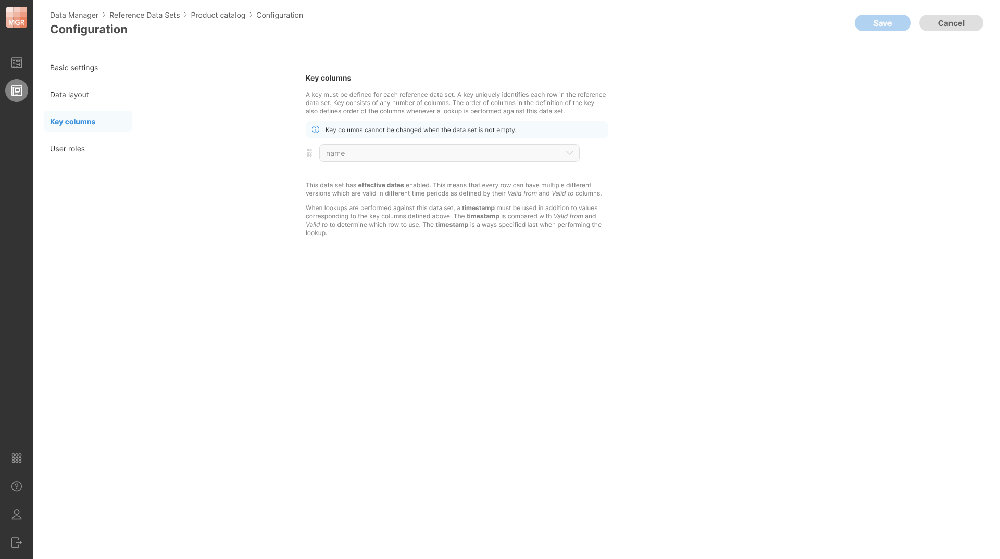
*Figure 195. A note shown on a non-empty data set when Key columns configuration page is open.*

##### Changing permissions

You can change permissions freely – add or remove users in various roles as needed. Note that you cannot remove yourself from the Admin list. This ensures that you cannot create a data set that cannot be changed because all permissions to it have been removed.
