<!-- End user’s guide > Data Manager user guide > Data quality – working with transactional data -->

### Data quality – working with transactional data

In this section we’ll have a more detailed look at the data quality use case. We’ll cover how transactional data sets allow you to edit your data, how to see the past changes, approve them and so on.

**Transactional data sets** have been designed to store records which represent transactions. In this case, each transaction is a record of event, activity, or data exchange as it moves through the system. Such a record captures relevant information for given event such as timestamp, parties involved, or any other associated data.

For example, common types of transactions can include the following:

- **Financial transactions**: records of payment processing, stock trades (buy/sell orders), invoices and so on. Each payment, stock order or invoice would be represented by a single transaction that tracks timestamps, amounts, currencies, buyer/seller information and so on.
- **Supply chain**: order fulfillment from order placement, processing, shipping, and delivery; inventory events in a warehouse, shipment tracking and more.
- **Technical transactions**: logs from various systems (e.g., access log, API call logs) and various system events (start, stop, restart) and more. Each such event or log entry would be represented by a single transaction that would provide the timestamp and data relevant to the event.

As you can see above, transactions typically define a short-lived event and carry information required to understand that event.

Transactions typically follow a simple lifecycle where they get created, then validated and processed and eventually finalized or archived. As such, each transaction typically appears only once and remains in the system only for a period of time after which it can be purged (or moved to long-term archive).

Transactional data sets allow users to work with such transactions in use cases that require manual data intervention as part of the data process. Often these kinds of data processes relate to data quality or various approval processes.

For data quality use cases, a typical approach is to validate the data as soon as possible and load the invalid records to the Data Manager. Users can then review and correct issues in the data. Once the data is approved, it can be further processed by automated processes built in CloverDX.

For approval processes, a common approach is to load all data into Data Manager where users review and approve the data. This may involve editing the data as well although not every use case requires that.

#### Transactional data sets

Transactional data sets are shown on a **Transactional Data Sets** screen which provides basic data set management functionality.

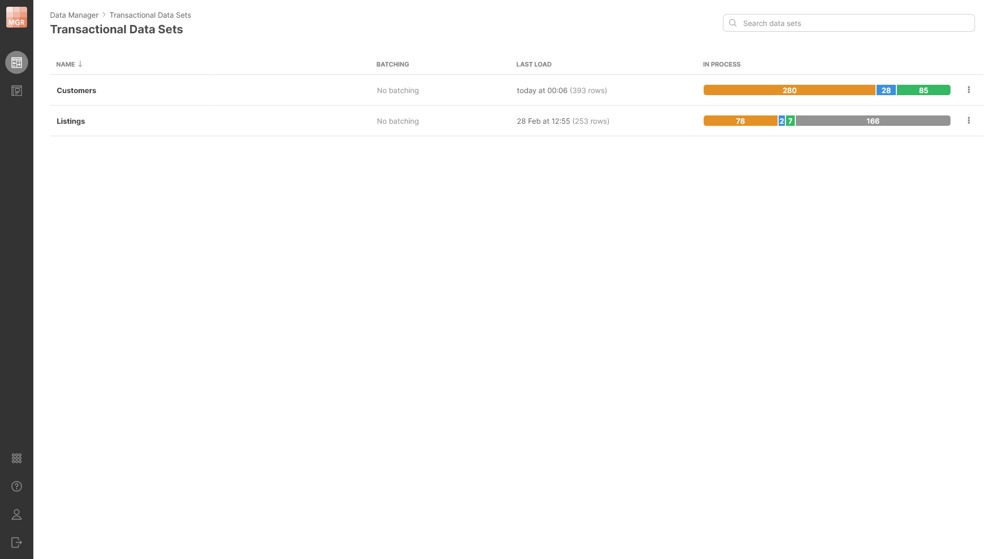
*Figure 136. Transactional Data Sets screen showing two data sets with basic information shown about each.*

The screen shows you basic information about each data set you have permissions for. If you are an Admin, you will be able to also see disabled data sets or create a new data set.

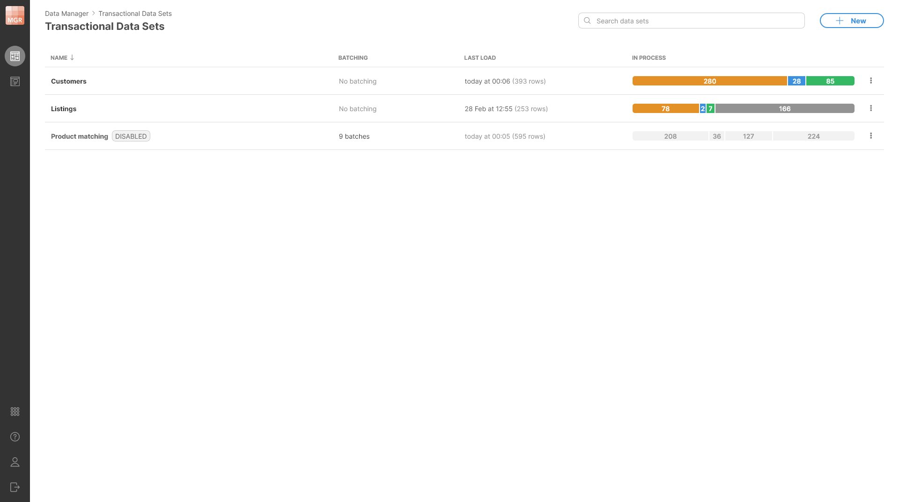
*Figure 137. Data Sets screen view for Admin user. Admin can see disabled data sets and has the ability to create new data sets.*

The screen shows the following information for each data set:

- **Name**: name of the data set. The name can contain spaces and special characters.
- **Batching**: information about whether the batching is enabled or not and the number of batches for data sets that have batching enabled and configured.
- **Last load**: date of when the last row was loaded to the data set and how many rows were loaded at the same time. This can help you see which data sets have been updated recently and therefore may require your attention.
- **In process**: shows an overview of rows in the data set. Rows in the data set can be in various statuses and this column shows you the number of records in each status. This can help you quickly see how much work is remaining in the data set. See [Row lifecycle](data-manager-working-with-transactional-data.md#row-lifecycle) for more information about different statuses and overall row lifecycle.

Data sets can be either **“flat”** or can have **batching** enabled. Batching allows you to essentially partition the data set based on a specific value of a column – for example billing country, arrival date, source file name, etc. To learn more about batching, please see the [Data batching section](data-manager-working-with-transactional-data.md#data-batching).

Rows can be loaded into the data set in two ways: programmatically with CloverDX jobs (graphs, subgraphs, etc.) using the [TransactionalDataSetWriter component](../developer/datasetwriter.md), or manually added by users directly in the **Data editor** screen. Similarly, CloverDX jobs use [TransactionalDataSetReader component](../developer/datasetreader.md) to read data from data set for further processing.

##### Data set rows

Each transactional data set contains any number of rows. The structure of each row is described by its **data layout**. The data layout defines **columns** (fields) and their **data types** as well as additional column properties (for example, whether the column is editable, etc.).

The columns can be **strings** (representing text), **numbers** (integers as well as decimal numbers), **dates**, or **boolean** (representing true/false). For more information about data layout and column data types, please see the [Data layout](data-manager-working-with-transactional-data.md#data-layout) section.

Since each row in the data set has the same layout, the rows can be nicely displayed as a table with pre-defined structure. This is available on the **Data editor** screen which allows you to see and edit the data in the data set. The data in the data editor is shown in the **data grid** (or just grid).

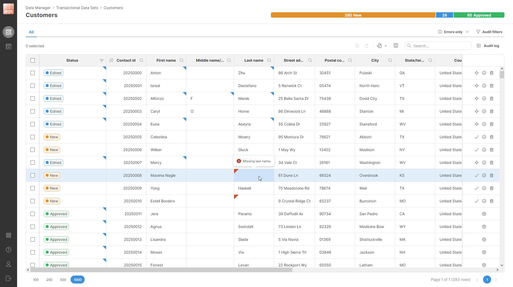
*Figure 138. Data Editor screen showing content of the data set with customer information. The editor shows changes made as well as issues in the data that have been highlighted by the validation process during the data load.*

To learn more about how to work with data in the data set – how to view or approve changes, edit the data and more – see the [Editing data in Data Manager](data-manager-editing-data.md) section.

##### Row lifecycle

Rows in each data set go through a row lifecycle with multiple stages that provide additional information about the row status – whether it is a new row, whether it has been already approved etc. This is called **row status**, and it is tracked in a special, system-defined column called **Status**.

The `Status` column is available in every data set and cannot be removed (although it can be hidden). The lifecycle of a row is not customizable – all rows must follow the same predefined statuses, and it is not possible to add new ones. This means that regardless of your exact use case, you’ll see just the statuses as described below.

Four different basic statuses and one supplementary status are defined in the Data Manager:

| Row status | Description |
| --- | --- |
|  | New row that has not been worked on yet. |
|  | This status means that the Data Editor user considers the row finished from their point of view (regardless of whether they made any change to the data or not). Use the **Mark as Edited** row action to switch the row to the *Edited* status. |
|  | The row been reviewed by an Approver user who considers the row to be done so that it does not require any further actions in the Data Manager’s editor. Use the **Approve** row action to switch the row to the *Approved* status. |
|  | The row has been picked up by a CloverDX graph after its approval and has been successfully loaded to the target system. The row cannot be edited anymore, and its status cannot change. Once the Data retention period for the row is up, the row will be completely removed from the Data Manager. There is no row action to switch the row to Committed status. This is done by CloverDX component [TransactionalDataSetCommit](../developer/datasetcommit.md) in a graph. |
|  | An extended status flag which means that the row has been marked for deletion. Row can have any status (*New*, *Edited*, *Approved* or *Committed*) and be *Deleted* at the same time. I.e., for deleted rows you will see two status “pills” in the `Status` column. Note that deleted rows are marked with red background in the whole row to make them stand out. |

You can click a status in the progress bar to quickly filter rows by that status.

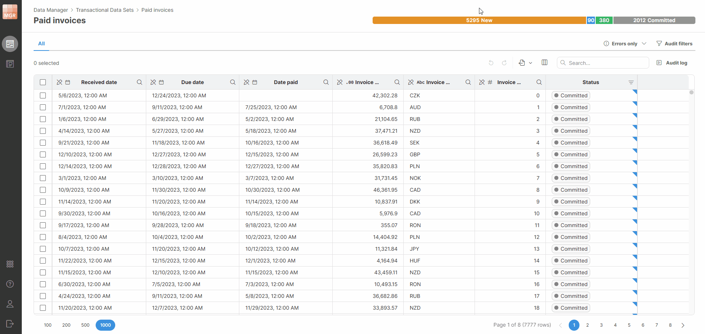
*Figure 139. Progress bar filters*

The Status can be changed with various row actions on the Data Editor screen as well as with CloverDX jobs (e.g., graphs). The row actions are available as buttons on the right side of each row in the data grid or via context-sensitive actions in the toolbar.

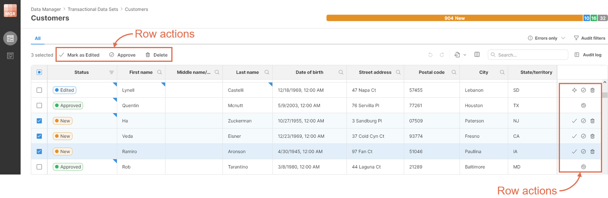
*Figure 140. Where to find row actions on the Data editor screen.*

Row actions on the toolbar allow you to work with multiple rows at once – all selected rows will be affected. The row actions in the data grid always only apply to a single row regardless of the row selection.

Following row actions are available:

| Row action | Statuses | Description |
| --- | --- | --- |
| **New row** | New | Add new row to the data set. Row will be created as new row. Read-only columns are editable when the new row is being created. Undo operation will remove the row. |
| **Duplicate** | New | Duplicate all selected rows. Duplicates will be created as new rows. Undo operation will remove the duplicated rows. |
| **Mark as Edited** | New → Edited | Switch the row to the Edited status to signal that the *Data editor* user considers their work on the record done. |
| **Mark as New** | Edited → New | Revert to New status to allow the *Data editor* user to reconsider their changes. |
| **Approve** | New → Approved  Edited → Approved | Approve the row to signal that it has been reviewed and is considered valid. You can approve row from New or from Edited status. |
| **Unapprove** | Approved → Edited | Revert the *Approver’s* decision to allow *Data editors* or *Approvers* to edit the row again. |
| **Delete** | New → New + Deleted  Edited → Edited + Deleted | Mark the row for deletion. This can be done in New or Edited status if the row is not Deleted. |
| **Undelete** | New + Deleted → New  Edited + Deleted → Edited | Remove the “deleted” mark from the row. This can be done in New or Edited statues if the row is marked as Deleted. |

Note that there are no row actions to switch the row to the *Committed* status. This can only be done with CloverDX jobs to signal that the row has been processed and can be removed from the data set once its retention period expired.

The statuses can only be modified in certain ways. Use the following diagram as a guide for the allowed transitions between different statuses:

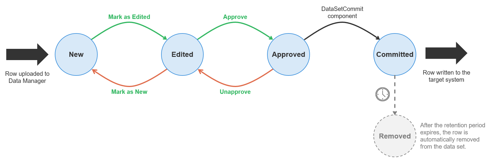
*Figure 141. Row lifecycle diagram showing different statuses and possible transitions between them for rows in transactional data sets.*

All transitions between states are accessible as actions in Data Manager’s editor except for the transition to *Committed* status which can only be done by the [DataSetCommit component](../developer/datasetcommit.md).

Note that you can delete a row only when it is in *New* or *Edited* status. *Approved* and *Committed* rows cannot be deleted.

The rows are not stored in the Data Manager’s database forever. Instead, once the row is committed (which means it has been fully processed), its **retention age** is evaluated. The retention age is measured as the time elapsed since the row was committed. If the retention age is greater than the **retention period** for the data set, the row is deleted from the database. Row audit and all associated data are deleted at the same time as well. The row cannot be recovered once its retention period expires.

The retention period can be configured in the data set’s Configuration screen and is measured in days. See [Basic data set properties section](data-manager-working-with-transactional-data.md#basic-data-set-properties) for additional details.

To ensure that your *Deleted* rows get deleted once their retention period expired, they have to be *Committed* as well. This can be done with the [DataSetCommit component](../developer/datasetcommit.md). If this is not done, the *Deleted* rows will be kept in the Data Manager forever.

#### Data batching

Data batching allows you to split your data into batches based on the value of the batch key column. With batching, data sets gain one additional level: Data set → Batches → Data instead of Data set → Data.

This allows you to effectively split data based on any property while still keeping the data together as part of a single business process.

Batches are created on the fly in real-time and depend solely on the unique values of the batch key column. As such, there can be any number of batches in your data set.

When the data set is batched, you will see this directly on the Data Sets screen:

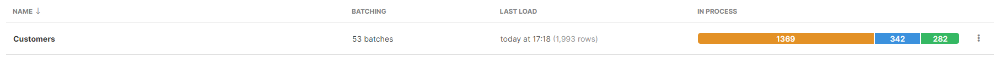
*Figure 142. Data set with batching enabled.*

The **Batching** column provides information about how many batches there are in the data set. The **In process** column still counts rows and works in the same way as for data sets without batching.

To see the batches, click on the data set and you’ll be brought to the Batches screen instead of the data editor:

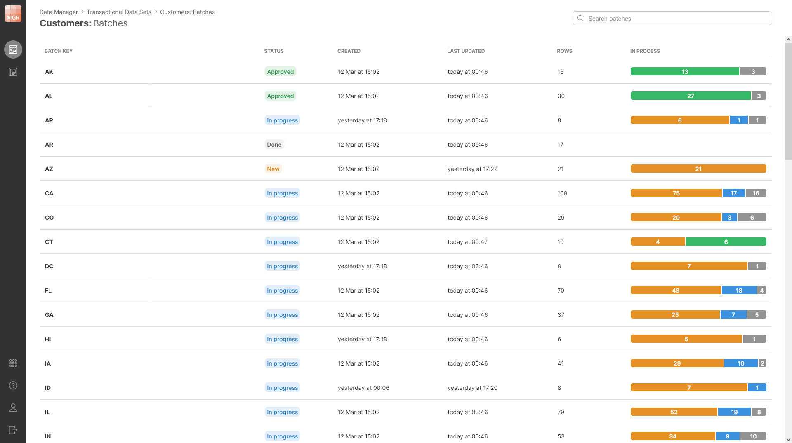
*Figure 143. Batches screen showing batches and their statuses in the Customers data set.*

Each batch can have its own status that depends on the status of the rows within the batch. The following are the batch statuses:

| Batch status | Description |
| --- | --- |
|  | All rows in the batch are in the **New** status. This batch has not been worked on yet. |
|  | Rows in the batch are in various statuses – some may have been *Edited*, some may be *Approved* or even Committed. This means that the batch needs additional work before it can be approved. |
|  | All rows in the batch are in the *Approved* status. This status means that the work on the batch has finished, and the batch is waiting for further processing by a CloverDX job. |
|  | All rows in the batch are *Committed*. No further changes can be made to any rows in this batch – all rows have been written to the target system. |

#### Creating transactional data sets

You can create any number of data sets in Data Manager as long as you have *Create new data sets* permission configured in CloverDX Server. See [Data Manager permissions in CloverDX Server](../admin/data-manager-administration.md#data-manager-permissions-in-cloverdx-server) to learn more about how to configure permissions in CloverDX Server.

Transactional data sets can be created from **Transactional data sets** screen using the **New** button in the top right corner of the screen. Once you click the **New** button, a **New Transactional Data Set** wizard will be shown and will guide you through the rest of the process.

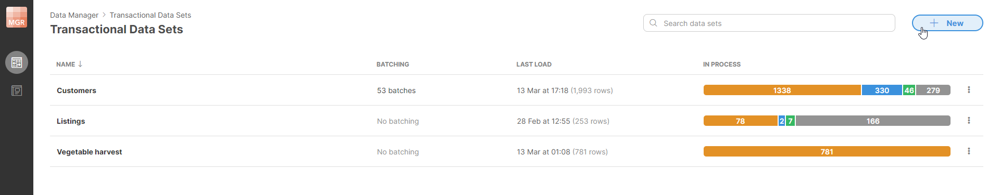
*Figure 144. Transactional Data Sets page offers a New button in the top-right corner when logged in as a user with Admin privileges.*

When creating a data set, you will have to configure its basic properties, data layout, permissions, and more. These are all configured on separate pages in the wizard.

##### Basic data set properties

The first screen of the wizard allows you to configure basic settings for the data set like its name, description, and more.

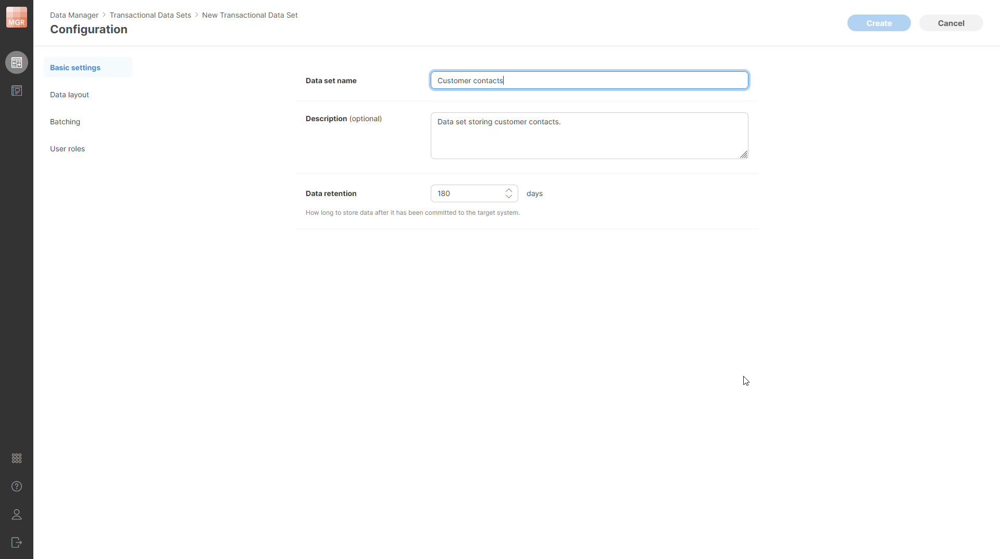
*Figure 145. Basic settings page of the New Transactional Data Set wizard.*

Following settings can be configured on the Basic settings page:

- **Data set name**: unique name of the data set. The name *can* contain special characters (like spaces) and should be descriptive enough to allow you to find your data set when working in Data Manager or in Designer. Internally, the Data Manager will create a **data set code** that will be used to identify the data set. Data set code does not change even if you rename the data set which allows you to continue using the data set in your CloverDX jobs even if the name has changed.
- **Description**: an optional more detailed description of the data set’s purpose.
- **Data retention**: specifies the number of days how long are the rows retained in the Data Manager’s storage after they have been committed. Rows that have been committed for longer than the number of days specified in this property will be automatically deleted from the data set. When rows are deleted, their audit records are deleted as well. This means that there is no way to recover rows that have been deleted after their retention period expired.

##### Data layout

**Data layout** specifies the structure of each row in the data set – the column names, types, and other properties.

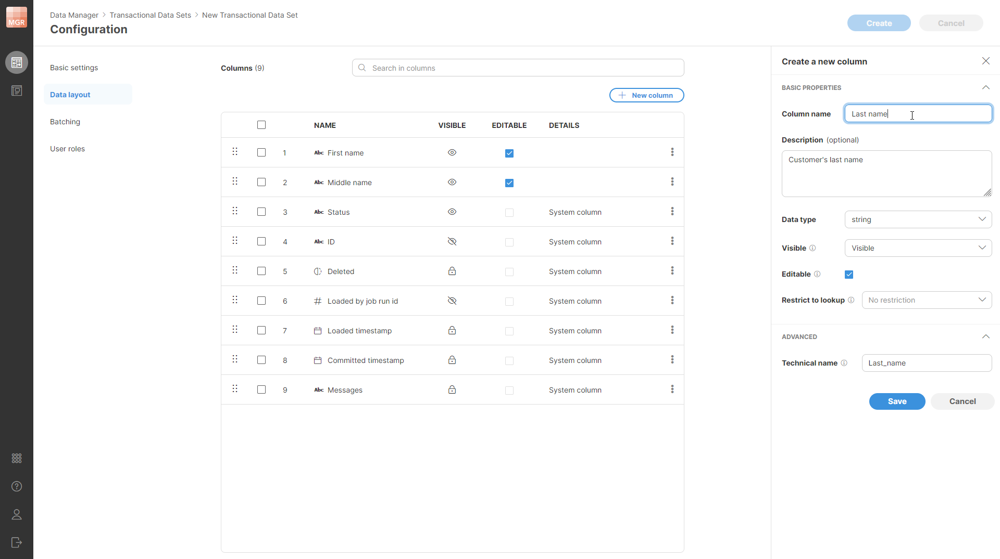
*Figure 146. Data layout page of the wizard with the column editor shown in the side bar. The first two columns have been added by the user (First name and Last name) while all the others are the system columns which are shown in the table before any user-defined columns are added.*

All rows in the data set have the same layout. The layout can contain any number of user-defined columns and will also contain a set of system-defined columns that are always present and cannot be removed (but can be moved around to a different place within the row).

The layout of the data set is shown in a table which lists all the columns. The first column (at the top of the table) is the first column of the record. Columns can be reordered freely by using the drag handle on the left side of each column’s row in the layout table.

Columns in the data set can have one of the following data types:

| Type | Description | Examples | Metadata type |
| --- | --- | --- | --- |
| 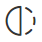**boolean** | `false` and `true`. | `true` | `boolean` |
| 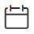**date** | Date and time with millisecond precision. | `2024-09-04` (date only) `2024-09-04 18:30:25` (date and time) `2024-09-04 18:30:25.428` (date and time including milliseconds) | `date` |
| 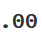**decimal** | Numbers with fractions with up to 22 digits before decimal point and 10 after the decimal point. The numbers are fixed-point - i.e., they are suitable to represent currency values and other exact quantities without various precision issues that often manifest with floating-point numbers. | `3.14` `-5348.6574` | `decimal(32, 10)` |
| **integer** | Whole numbers. | `5` `-8700` | `long` |
| 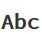**string** | Text data of any length with full support for Unicode to allow for characters of any alphabet. | `"Data Manager is cool"` `"東京"` | `string` |
| **url** | URL strings. Valid URLs are underlined. Hold the **Ctrl** key and click the link to open it.  The URL columns support markdown, which lets you create clickable links with custom text, for example:  `[Product catalog link](https://www.example.com/product/johnnie-walker-black)`  In addition to `http(s)://` protocols, you can also use:  - `ds://` - calls a Data Service in your local CloverDX Server. Use the *Data Service URL* from the Data Service detail page. Only Data Services using the **GET** method are supported, including those with query parameters. - `emailto://` - Opens your default email client and starts a new message with the specified email address. - `ftp://` - Opens your default FTP client and accesses the specified file or directory. - `tel://` - Opens your default phone application and pre-loads the specified phone number. | - `https://www.cloverdx.com/` - `ds://test-service` - `ds://test-service/1` (a Data Service requiring an ID) - `emailto://admin@cloverdx.com` - `ftp://ftp.example.com/pub/files/manual.pdf` - `tel://+1-800-555-1234` | `string` |

When you create a new column, the following column settings are shown in a **Create a new column** side bar:

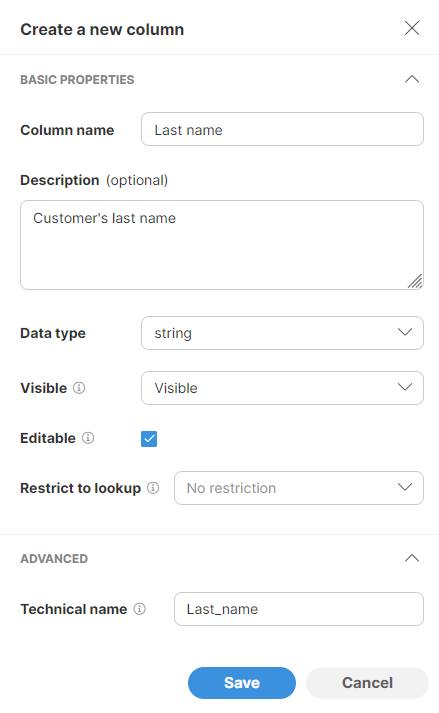
*Figure 147. Column setting shown in a Create a new column side bar.*

The following settings can be configured for the new column:

- **Column name**: name of the column. The name can contain special characters like spaces or other symbols. Data Manager will generate a *Technical name* as a column identifier automatically based on the human-readable name.
- **Description**: optional longer description of the column’s purpose.
- **Data type**: one of the data types mentioned in the table above – `boolean`, `date`, `decimal`, `integer`, `string`.
- **Visible**: defines whether the column is visible to data set editors. The following values are allowed:
  - **Visible** : the column is visible by default (i.e., when the data set is first opened by user). Users can hide such columns using the **Column chooser** in the data editor. This is the default setting. Use this setting for most columns that are important for the users to see or to work with.
  - **Hidden** : the column is not visible in data editor by default, but users can show it via the **Column chooser** menu. Use this setting for columns that may not be as important but may be useful in certain situations.
  - **Always hidden** : the column is not visible in the data editor and users cannot show it via **Column chooser** menu. Use this setting for columns you need in your data set, but which should never be touched by users. For example, unique entity id, various technical fields that users should not manipulate etc.
- **Editable**: configures whether the column value can be changed by data editors (when checked) or whether the value is read only (unchecked).
- **Restrict to lookup**: if configured, column values will only be allowed to have one of the values as defined in the lookup defined either using a Reference data set (see [Using reference data in Data Manager](data-manager-working-with-reference-data.md#using-reference-data-in-data-manager) for more details) or via lookups that are managed by the CloverDX Server in a special sandbox (see [Shared lookup tables in CloverDX Server](../developer/shared-lookups-in-server.md)). The dropdown will show you a list of all lookups regardless of how they were defined.
- **Technical name**: defines a unique identifier for the column in the data set. Technical name will be generated for you automatically based on the column name. In most cases you can leave the technical name at its default value, however, you can change the value if needed. Technical names have to follow these rules:
  - They are case-sensitive (i.e., “Name” is not the same as “name”),
  - They can only contain letters, numbers, and underscore character,
  - They cannot start with a number.

##### Batching

Batching allows you to split your transactional data set into partitions called **batches**. Each batch is a subset of records in the data set. All records within the batch have the same value of the **batch key column**. Batch key column can be any column in the data set as long as it is an integer or string data type. Rows are assigned their batches in real-time based on the data and there is no need for you to do anything else except for selecting the batch key column.

Using batching with a data set can help you organize the data better to match the expected usage by users or to match the way the data is represented when it arrives.

Few examples:

- You can batch based on a file name for data that arrives in files. It is often important to process each file as a whole and using batching in this case allows you to easily work with data in a single file but without having to create a new data set for every new file that arrives.
- You can batch orders based on the country of origin. This can help you align your processes better since laws in various countries can place different requirements on how orders must be processed.
- You can batch invoice data by their date (e.g., month). This gives you a quick overview of your invoices and again allows you to align process within Data Manager with usual accounting practice of always processing the full month once the month is over.
- You can select to batch data based on run IDs of jobs that load the data and the [remote data manager](../admin/data-manager-administration.md#data-manager-configuration) client names (*Loaded by job run id and client name* option). This will create a new batch for each job run that writes data into the data set.

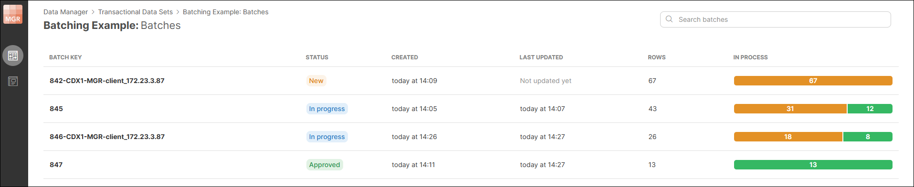
*Figure 148. Example of job run batches, coming both from local and remote environments.*

Any number of batches can be created. The membership of the row in a batch is evaluated in real-time as needed. I.e., it is possible to change the batch for a row simply by changing the value of the row’s batch key column.

The following settings are available on the Batching page:

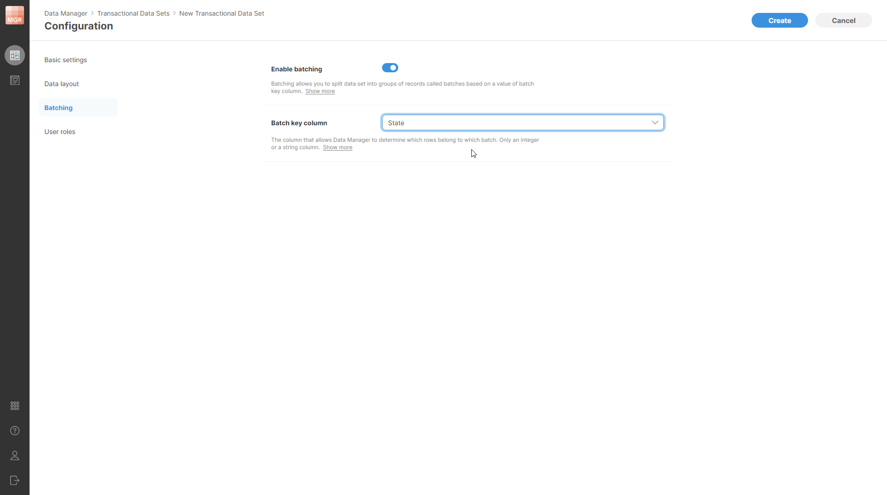
*Figure 149. Data set batching configuration page.*

- **Enable batching**: enables of disables batching on the data set. By default, this is turned off (i.e., the data set is not batched). If this is enabled, you will have to select the batch key column.
- **Batch key column**: allows you to select which column from the data set is the batch key. Only one column can be selected. The column must be either integer or string.

Note that enabling or disabling batching on the data set does not change the data at all. It simply changes the presentation of the data in the Data Manager. If batching is enabled, the **Batches** screen will be available for the data set.

##### User roles and permissions

Each data set has its own set of **permissions** – list of users and their roles with regards to the operations they can perform on the data set.

Roles are configured on a **User roles** page when creating a new data set:

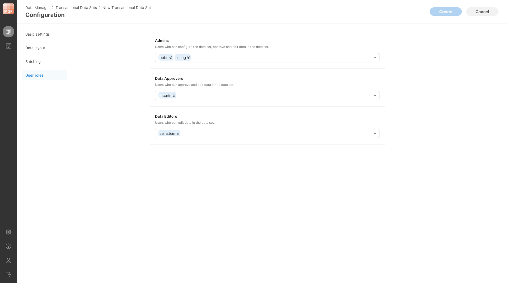
*Figure 150. User roles page in the new data set configuration. The screenshot shows different users assigned to different roles - two admin users, one approver and one data editor.*

Clicking on a dropdown for each role will give you a list of all users on the Server and you can select any number of users in each role.

The roles form a simple hierarchy - a higher role has more permissions than a lower role. This means that *Admin* can do everything that *Data Approver* can, and *Data Approver* can do everything that *Data Editor* can. This means that for each user it is enough to place them into the role with the highest permissions they will need for their work. See more details in [Data Set Permissions section](data-manager-introduction.md#data-set-permissions).

#### Editing transactional data set configuration

Data set configuration can be edited even after the data set has been created and data has been loaded to it. To edit the configuration of a data set, select the **Configure** option from the data set’s context menu which is shown on Transactional Data Sets screen when you click on the three dots menu next to each data set.

When editing data set’s configuration, additional options are available on the **Basic settings** page:

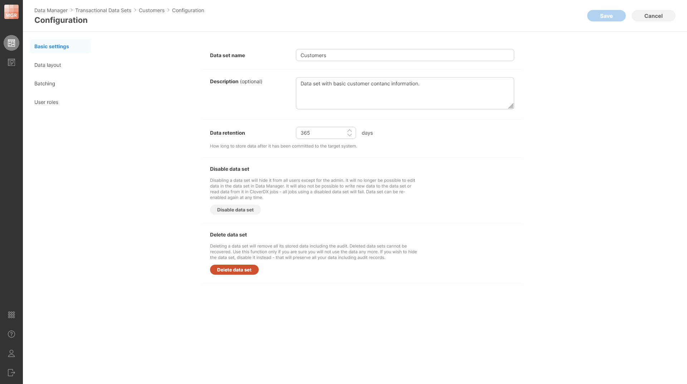
*Figure 151. Additional settings are available in the existing data set when its configuration is edited.*

You can **Disable data set** to prevent anyone from using it without deleting any data. Disabled data set cannot be used in CloverDX jobs and data in disabled data set cannot be edited in the Data Manager’s editor.

Note that while the data set is disabled, the purge job that removes committed rows does not run. Therefore, the rows will stay in the data set. Once the data set is enabled, the purge job will start running as well and will purge all rows which have aged past their retention period.

You can also **Delete data set** to remove all data associated with the data set. Deleting the data set removes all the data as well as audit logs and other related metadata from the Server. **Note that deleted data set cannot be recovered.**

Editing data set (except when it is disabled or deleted) is always a single operation even if you changed multiple settings of the data set. You should make all the changes you need and then **Save** all the changes at once. The changes are only applied when you save rather than right away when you change something to ensure you do not damage your data in any way. Disabling the data set and deleting the data set are carried out immediately.

##### Changing data set layout

When changing the layout, the following operations are allowed:

- Reordering the columns.
- Adding new columns.
- Deleting existing columns.
- Changing column visibility.
- Changing column editability.
- Renaming columns in the data set (both human-readable as well as technical column names can be changed).
- Changing column descriptions.
- Changing column lookup settings.

Note that it is not possible to change the column type in a data set that contains data. However, it is possible to change the type of a column in an empty data set.

Also note that if you delete a column, the data will be removed and cannot be recovered (the delete is hard delete without ability to undo).

The layout changes are only applied after you click on the **Save** button and all layout changes are applied at once.

##### Changing batching settings

You can enable or disable batching at any time as well as change batch key column to any column within the data set. Batching settings changes do not make any changes to the data – batching only affects how the data is presented in the Data Manager and how it can be read by the [TransactionalDataSetReader component](../developer/datasetreader.md).

##### Changing permissions

You can change permissions freely – add or remove users in various roles as needed. Note that you cannot remove yourself from the Admin list. This ensures that you cannot create a data set that cannot be changed because all permissions to it have been removed.
