<!-- End user’s guide > Wrangler user guide > Data sources and targets -->

### Data sources and targets

#### Introduction

Wrangler employs the concept of **data sources** and **data targets** to specify the origin and destination of the data in the transformation process. You can find the menus for the data source and data target management in the left-side panel.

Data sources and data targets are part of a workspace. Therefore, each workspace defines its own sources or targets. Note that Data Catalog is common across all workspaces - it contains all possible sources and target specifications while workspaces contain source or target instances (which have their own configuration).

Before you can start working on your data transformations, it is essential to incorporate your **data sources** into **Sources** in the workspace you are working with. Detailed instructions on how to do this and what the supported source types are can be found in the [**Data sources**](data-sources-data-targets.md#sources) section below.

When you create a new Wrangler job, a CSV **data target** is automatically generated. However, you can always create or add your own data target in **Targets** and then update your job to utilize it. Additional information about **data targets** can be found in the [**Data targets**](data-sources-data-targets.md#targets) section below.

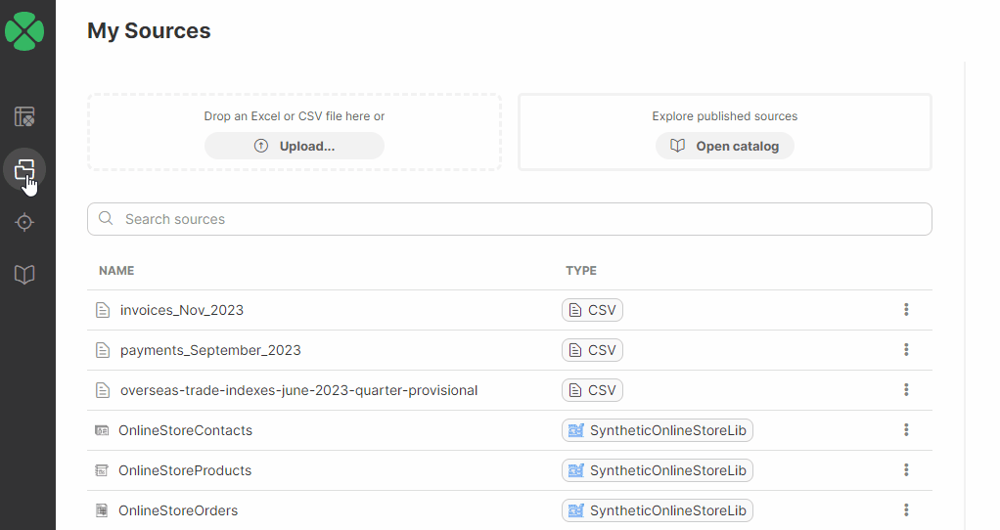

#### Data sources

In CloverDX Wrangler, you can extract data from specific locations known as **data sources**. These sources can be file-based, like an uploaded CSV or Excel file, or custom sources tailored by your company and shared in the [**Data Catalog**](data-catalog.md).

Multiple types of sources are available in Wrangler:

- **CSV and Excel file sources**: these allow you to read CSV and Excel files uploaded to Wrangler. These sources automatically scan the input files and can determine the data layout based on the data in the files. See more details in [CSV source](data-sources-data-targets.md#csv-data-sources) and [Excel source](data-sources-data-targets.md#excel-data-sources).
- **Data Manager sources**: these sources allow you to read data from data sets configured in Data Manager. You can read data from transactional data sets via <<, transactional data set sources>> as well as from reference data sets via <<, reference data set sources>>.
- **Custom sources**: also called [**data source connectors**](data-sources-data-targets.md#data-source-connectors). Connectors can access wide range of data sources - databases, 3rd party interfaces such as Salesforce, HubSpot, Xero, and more. Connectors are created in CloverDX Designer and need to be added into CloverDX by installing libraries (from [CloverDX Marketplace](https://marketplace.cloverdx.com/) or custom) by your CloverDX Server administrator.

Data sources that you created in a workspace are all visible in the **Sources** screen. Typically, you’ll create the data sources when you start working on a new job, but you can work with sources independently and manage them via the **Sources** page.

##### Sources

The **Sources** page allows you to view and manage all data sources that you’ve used in your Wrangler workspace. It will show you all your sources - whether they are files you uploaded to Wrangler or data sources created from the [**Data Catalog**](data-catalog.md). Sources are part of a workspace, so switching to a different workspace will show different sources.

The **Sources** page is accessible directly from Wrangler’s main menu.


*Figure 36. A preview of a data source alongside a list of configured sources*

The **Sources** screen is split into two halves - the left half provides an overview of all the sources you’ve already created, while the right half allows you to view details and manage the source you select.

The list of sources provides basic information for each source:

- **Name** is the name of your source.
- **Type** to help you determine the type of source. A source can be file-based (CSV or Excel files uploaded to your workspace) or connector-based (created from connectors in your Data Catalog), or a [reference data set source](data-sources-data-targets.md#reference-data-set-sources) from the Data Manager.

Additional actions are available after clicking on the three-dot menu for each item:

- **Use in a new job** opens a wizard to create a new job with the selected data source.
- **Delete** removes the selected source. Note that deleting the source will invalidate the jobs that are using it.
- **View in Data Catalog** (for data source connectors and reference data set sources only) opens the details page in the [Data Catalog](data-catalog.md) .

When you select a source in the table, the right half of the screen will show you additional details about that source including data preview. It will also allow you to edit its configuration. Note that reference data set sources do not allow any configuration changes.

To edit the configuration, click on the **Edit** button in the **Configuration** section. This will open a dialog that will allow you to change the parameters of your data source.

The exact layout of this dialog depends on the source type: you will get the [**CSV data source settings** dialog](data-sources-data-targets.md#configuring-csv-data-source), [**Excel data source settings** dialog](data-sources-data-targets.md#configuring-excel-data-source) or the dialog to configure the data source connector provided by a library similar to the one in [**Add to Sources wizard**](data-sources-data-targets.md#adding-data-sources).

##### Adding data sources

There are several ways to add data sources to **Sources** in the workspace:

- **CSV or Excel files** can be uploaded:
  - Directly in **Sources** by uploading a CSV or Excel file via the drop area at the top
  - Uploading a CSV or Excel file via the drop area when creating a new job via **Create a new job action** on the **Jobs** page
- [**Data source connectors**](data-sources-data-targets.md#data-source-connectors), [reference data set sources](data-sources-data-targets.md#reference-data-set-sources), and [transactional data set sources](data-sources-data-targets.md#transactional-data-set-sources) can be added from the [**Data Catalog**](data-catalog.md):
  - Click the **Add to Sources** or **Use in a new job** buttons
  - Click the **Add to sources** or **Use in a new job** buttons when exploring connector details

When adding **data source connectors**, the *Add to Sources* wizard opens to allow you to configure settings for your data source. The dialog will look different for each data source since it shows the parameters for that specific data source. If a data source settings is updated, a warning will be displayed to remind you to reload preview data to reflect the changes in the data preview.

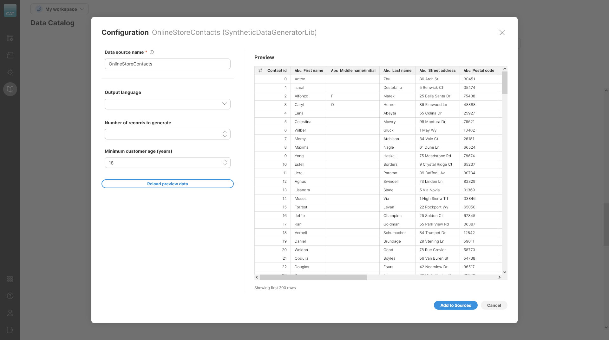
*Figure 37. Connector configuration dialog in the Add to Sources wizard*

##### Updating data source in an existing job

To update the data source in an existing job, click on the **Source** button in the overview diagram of your job at the top of the [transformation editor screen](transforming-data.md#working-with-transformations) or click on the  icon which appears when you hover over the **Source step**.

You will be redirected to a page listing all your sources added to your **Sources** page. Select a new source by performing one of the following:

1. Double-click on the desired data source.
2. Select the **Use in a new job** option from the three-dot menu for the desired data source.
3. Click on the desired data source in the list and click on the **Select** button in the right upper corner.

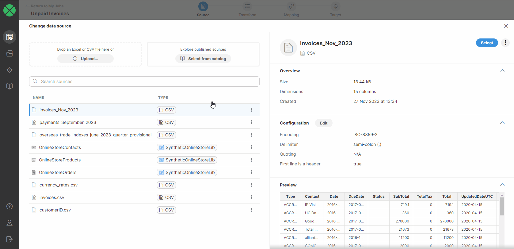

After performing one of these steps, you will be asked to confirm the data source change.
> [!NOTE]
> When you change the data source of a job, the data source which was previously used by the job is not changed or deleted. To remove it, select this source and delete it via the three-dot menu.

##### Data source connectors

Wrangler allows you to use custom **data source connectors** that are created, managed, and maintained by your CloverDX Server administrators. These connectors can read data from various sources, including databases or other external systems, like Hubspot. Connectors published by your company are available in the [Data Catalog](data-catalog.md).

###### Adding connectors to Sources

If you have sufficient [permissions](data-catalog.md#permissions), you can add published data source connectors from the **Data Catalog** to **Sources** and use it as a data source in your job.
> [!NOTE]
> If you cannot find the data source connector you need, contact your CloverDX Server administrator to either grant you access or create a new connector for you. Administrators can consult our Server [documentation](../operations/libraries.md#development) for more information on how to install and configure data source connectors.

When adding **data source connectors** the **Add to Sources** wizard opens, where you can configure settings for your data source. The dialog will look different for each data source since it will show the parameters for that specific data source. If a data source setting is updated, a warning is displayed to remind you to **Reload preview data** to reflect the changes in the data preview.


*Figure 38. Connector configuration dialog in the Add to Sources wizard*

If you specify a different connector name when adding a connector from the **Data Catalog**, you can find the original connector name in the connector detail.

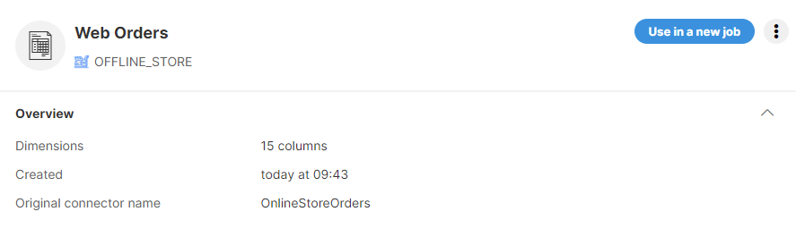

##### CSV data sources

The **CSV data source** allows you to read data from CSV files uploaded to your Wrangler workspace.

When you want to create a new CSV data source, you can do so either from [**Sources**](data-sources-data-targets.md#sources) or directly from the [**Create a new job** screen](transforming-data.md#creating-your-job). In both cases, you can simply upload a file by dragging & dropping it or by selecting the file on your computer.

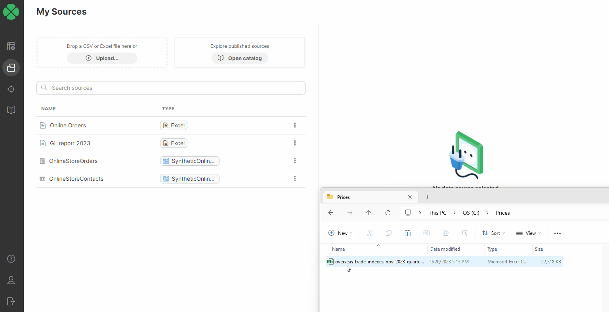

Once a file is uploaded, the CSV connector scans your data and automatically determines the data structure. The algorithm looks at a data sample at the beginning of the file to determine the columns and their data types.

You can see the preview of your data to verify that the automatically determined file structure matches your expectations. You can read more about data types available in Wrangler in the [Data types section](transforming-data.md#data-types-in-wrangler).

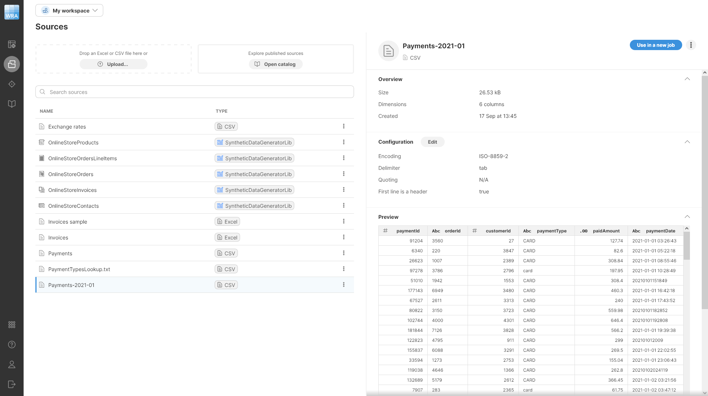

###### Configuring CSV data source

If the automatically determined structure of the uploaded file does not match your expectations, you can configure the connector parameters via the **Edit** action:

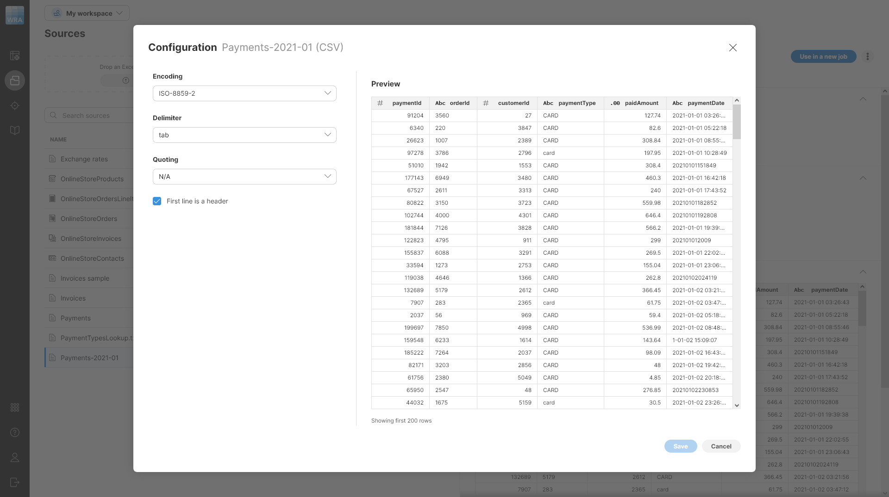

The following options are available in the configuration dialog:

- **Encoding**: pick data encoding for your file. Encoding determines how characters are stored in text files and picking incorrect encoding can result in incorrectly read data (for example, some accented letters may show incorrectly). The most common encodings are UTF-8 (universal encoding that can handle any characters), windows-1252 (US English encoding commonly used for files created on Windows), or ISO-8859-1 (US ASCII encoding).
- **Delimiter**: allows you to select column delimiter. A column delimiter is a single character that serves as a separator between columns in the file. The most common delimiters are comma (",") and tab. You can also type your delimiter if none of the default delimiters work for you. Setting a correct delimiter ensures that all columns are read from the file as expected.
- **Quoting**: determines whether values in your source file are enclosed in quotes or not. You can select from three options - **double quotes**, **single quotes**, or **N/A** (no quotes).
- **First line is a header**: tell the CSV connector that it should interpret the first line of the data as a header and read the names of columns from it. If this is unchecked, columns in your data set will have sequentially generated names like `field1`, `field2`, and so on.

###### Where are my CSV files?

The files you upload to Wrangler are stored in your **workspace**. Only you (and your IT administrator) have access to those files. Other Wrangler users cannot see or manipulate the files in your workspace.

If you have access to CloverDX Server Console, you can find these files via [Sandboxes module](../operations/sandboxes.md) by browsing to your Wrangler workspace and then into the `data-in` folder.

###### Limitations of the CSV data source

CSV data source can handle most common data layouts but it does have some limitations. It **can handle** the following:

- Files of **any size**. There is no limit to the total number of rows in your file. Note that by default only the first 1000 rows are shown in the preview. To ensure the whole file is processed, run the job once you are finished building the transformation.
- Files with **any number of columns**. While there is no technical limitation to how many columns can your files have, Wrangler implements a soft limit set to 1000 columns by default to help you prevent cases where your browser may not be able to handle displaying too large of a sample. You can change this limit by contacting your CloverDX Server administrators and asking them to increase the value of [`Wrangler.MAX_NUMBER_OF_COLUMNS` property](../admin/server-engine-configuration.md).
- Files with **varying numbers of columns** on different rows. Your files do not have to have the same number of columns on each row. However, this feature works correctly only when the header or one of the sample rows is the longest row in the file. For example, the connector will work fine if your header contains 20 columns but some of the rows in your file contain fewer than 20 columns. By default, the connector will read the first 512 kB of your data or the first 1000 rows whichever comes first to determine how many columns your data has. You can work with your CloverDX Server administrators to increase these limits by setting `CSVAnalyzer.BYTES_TO_ANALYZE` and `CSVAnalyzer.LINES_TO_ANALYZE` settings (see more [here](../admin/server-engine-configuration.md)).

The connector **does not support**:

- Files in which the longest row (a row with the largest number of columns) does not appear within the analyzed sample. For example, if you have a file that has a header with 20 columns and much later in the file (after the first 1000 rows) you have a record with more than 20 columns. See above for more details about increasing sampling limits.
- It does not support files with multiple different types of column delimiters. If you have such a file, you will need to pick one of the delimiters and then split the columns using the other delimiter in your Wrangler job using the [Calculate formula step](wrangler-step-formula.md).

##### Excel data sources

The **Excel data source** allows you to read data from **Excel****.xlsx** or **.xls** files uploaded to your Wrangler workspace.

When you want to create a new Excel data source, you can do so either from [**Sources**](data-sources-data-targets.md#sources) or directly from the [**Create a new job** screen](transforming-data.md#creating-your-job). In both cases, you can simply upload a file by dragging & dropping it or by selecting the file on your computer.

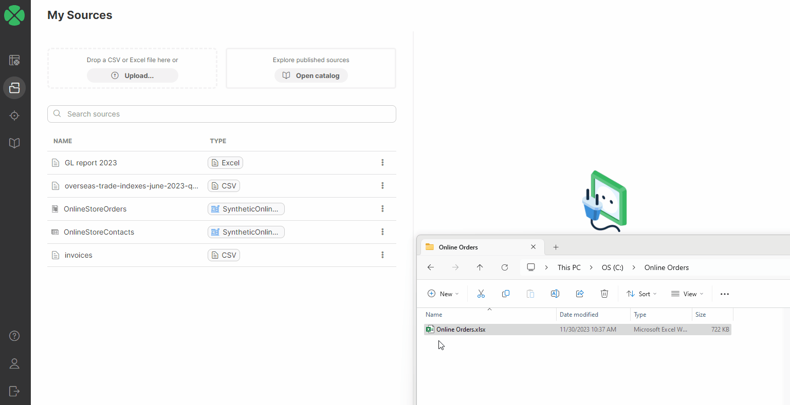

Once a file is uploaded, the Excel connector will scan data from the **first sheet** and automatically determine the data structure. The algorithm looks at a sample of data at the beginning of the file to determine the columns and their data types. You can read more about data types available in Wrangler in the [Data types section](transforming-data.md#data-types-in-wrangler).
> [!NOTE]
> It is possible to read data from one sheet only. If you want to read data from a different sheet than the first sheet, see the configuration section below for more information.

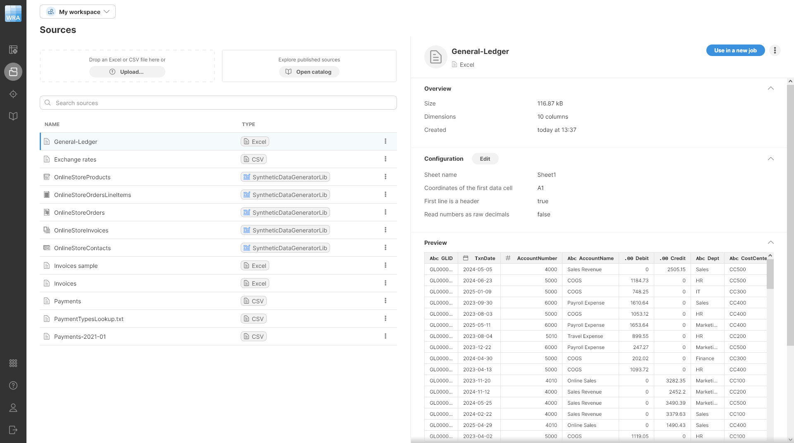

###### Configuring Excel data source

If you want to read data from a different sheet or want to change the data start point, click on the **Edit** button in the **Configuration** section to edit the data source configuration.

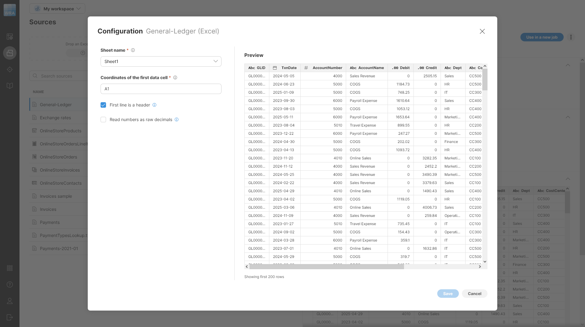
*Figure 39. Configuring Excel data source*

The following options are available in the Configuration dialog:

- **Sheet name**: defaults to the first sheet name found in the loaded Excel file. If you want to read data from a different sheet, select it from the list or type it in. You can also use sheet numbers - note that the numbering starts with 0 (i.e., the first sheet number is 0, the second sheet number is 1, etc.).
- **Coordinates of the first data cell**: defaults to A1; i.e., the typical first position in Excel files. To change it, type in the desired start cell (e.g., C1).
- **First line is a header**: selected by default. When selected, the data in the first row are used as column names. When unchecked, the header names default to column positions (ColumnA, ColumnB, etc.).
- **Read numbers as raw decimals**: when this option is checked, all numbers are read as decimal numbers even if they are integer. In some cases, this can help you get complete data from your Excel file. For example, if you have a file where you have many integers in a column at first and later decimal places, the file scanner may only see the integer values and decide that the column is integer even though it should have been read as decimal - this would lead to loss of data since non-integer numbers would only have their integer portion read.

###### Where are my Excel files?

The files you upload to Wrangler are stored in your **workspace**. Only you (and your IT administrator) have access to those files. Other Wrangler users cannot see or manipulate the files in your workspace.

###### Limitations of the Excel data source

- Files of **any size**. There is no limit to the total number of rows in your file. Note that by default only the first 1000 rows are shown in the preview. To ensure the whole file is processed, run the job once you are finished building the transformation.
- Files with **any number of columns**. While there is no technical limitation to how many columns can your files have, Wrangler implements a soft limit set to 1000 columns by default to help you prevent cases where your browser may not be able to handle displaying too large of a sample. You can change this limit by contacting your CloverDX Server administrators and asking them to increase the value of [`Wrangler.MAX_NUMBER_OF_COLUMNS` property](../admin/server-engine-configuration.md).
- Files with **varying numbers of columns** on different rows. Your files do not have to have the same number of columns on each row. However, this feature works correctly only when the header or one of the sample rows is the longest row in the file. For example, the connector will work fine if your header contains 20 columns but some of the rows in your file contain fewer than 20 columns. By default, the connector will read the first 1000 rows to determine how many columns your data has. You can work with your CloverDX Server administrators to increase these limits by setting `CSVAnalyzer.BYTES_TO_ANALYZE` and `CSVAnalyzer.LINES_TO_ANALYZE` settings (see more [here](../admin/server-engine-configuration.md)).

##### Reference data set sources

Wrangler allows you to use custom sources that pull data from configured [**reference data sets**](data-manager-working-with-reference-data.md) in the **CloverDX Data Manager**. These sources are created and configured by your CloverDX Server administrators. Each reference data set source **has a corresponding reference data set target**, which can be used to update the contents of the data set. Alternatively, the source data can be used for further processing, with results written to other targets as needed.

###### Working with reference data set sources

Data sources for all reference data sets are automatically created by the **Data Catalog**. However, you will only be able to read those that you have permissions for. These permissions depend on your overall permissions in CloverDX Server and on your permissions on each data set itself. The permissions work like this:

- If you are a Data Manager administrator, you will be able to read any data set (since as Administrator you can give yourself access to any of the data sets).
- If you are not Data Manager administrator, your permissions are based on permissions on each data set. You will only be able to read reference data sets where you are configured at least as a Read-only user (i.e., you must be Read-only user, Editor, Approver, or Administrator on given data set).

Before you can use a reference data set, you have to add it to **Sources** in current workspace. To add it to Sources, click on **Add to Sources** button on given data set. An **Add to Sources** wizard will be shown. The wizard only has one option you need to configure - a name for your data source.

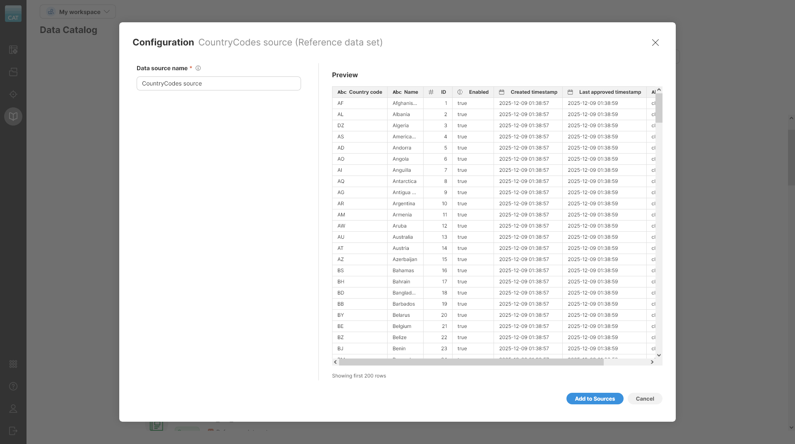
*Figure 40. Add to Sources wizard showing setting of a reference data set source.*

The source will only return rows that have been approved. It cannot be used to read changes pending the approval. It will return both enabled as well as disabled rows.

The source will always return system columns together with the data. Following system columns are included:

- `ID` (integer): unique identifier of the row, this id is assigned by the Data Manager when the row is inserted into the data set.
- `Enabled` (boolean): whether the row is enabled (`true`) or not (`false`).
- `Created timestamp` (date): date and time when the row was inserted into the data set.
- `Last approved timestamp` (date): date and time when the row was last approved.
- `Approved by` (string): name of the user who last approved the row.

##### Transactional data set sources

Transactional data set sources allow you to read data from [transactional data sets](data-manager-working-with-transactional-data.md) defined in **CloverDX Data Manager**. Transactional data sets are most often used in data quality use cases when human-in-the-loop interaction with data is needed. Data loaded into transactional data set can be reviewed, corrected, and approved by Data Manager users.

Transaction data set sources allow you to build Wrangler jobs that can help you automate various tasks with transactional data sets. As an example, you can build a validation job that reads data from transactional data set, runs validation in Wrangler and then writes the validated records back to the same data set including the validation output (i.e., the error messages).

###### Working with transactional data sets sources

Data sources for all transactional data sets are automatically created by the **Data Catalog**. However, you will only be able to read those that you have permissions for. These permissions depend on your overall permissions in CloverDX Server and on your permissions on each data set itself. The permissions work like this:

- If you are a Data Manager administrator, you will be able to read any data set (since as Administrator you can give yourself access to any of the data sets).
- If you are not Data Manager administrator, your permissions are based on permissions on each data set. You will only be able to read transactional data sets where you are at least an Editor (i.e., you are Editor, Approver, or Admin on given data set).

Before you can use any data set in your job, you have to add it to **Sources** in current workspace. To do that, simply click on the **Add to Sources** button on given data set. An **Add to Sources** wizard will open and will allow you to configure settings for the data set:

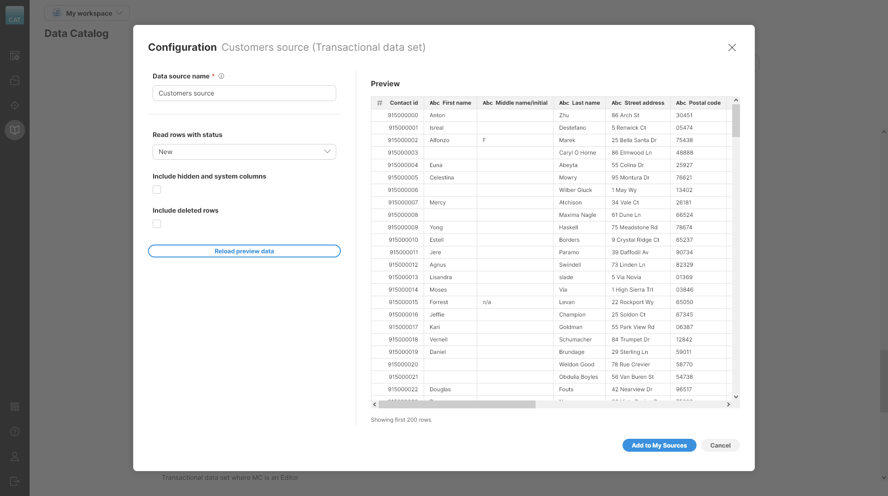
*Figure 41. Add to Sources wizard showing settings for the transactional data set source.*

The wizard offers several options that allow you to configure what data to read from the data set:

- **Data source name**: name of the data source
- **Read rows with status**: only rows with the select status will be read by the data source. Following statuses are available:
  - **All**: will read all rows regardless of their status
  - **New**
  - **Edited**
  - **Approved**: this is the default value
  - **Committed**
- **Include hidden and system columns**: select whether to add hidden and system columns to the data layout of the data set for this connector. By default, these columns are not included. When selected, the following additional columns will be added to the data set:
  - `Status` (string): rows status. Value will be one of `NEW`, `EDITED`, `APPROVED`, `COMMITTED`.
  - `ID` (integer): unique identifier of the row, this id is assigned by the Data Manager when the row is inserted into the data set.
  - `Deleted` (boolean): set to `true` if the row has been marked for deletion.
  - `Loaded by job run id` (integer): a run if of the job that loaded the row into the data set.
  - `Loaded by client id` (string): name of the client (user) who loaded the row into the data set.
  - `Loaded timestamp` (date): date and time when the row was loaded into the data set.
  - `Committed timestamp` (date): date and time when the row was committed.
  - Any additional columns which are configured as *Always hidden* in the Data Manager’s layout for this data set.
- **Include deleted rows**: configure whether to include deleted rows or not. Deleted rows can have any status. They can be distinguished from the other rows by the value of the `Deleted` column (which can be added to the data set with the previous option). By default, deleted rows are not read from the data set.

Once you confirm the settings in the wizard, you will be able to use the data set as a source of a job or inside a [Lookup step](wrangler-step-lookup.md).

#### Data targets

A **data target** in Wrangler is the destination where your processed data will be written. A data target can be a file (**CSV** or **Excel**), or a custom target created by your company and shared through the [**Data Catalog**](data-catalog.md). AS with data sources, multiple types of targets are available in Wrangler:

- **CSV and Excel file targets**: these write their output into files directly in your Wrangler workspace. They allow you to use any data layout as they will accommodate any data sent to them. See more details in <id_data_target_csv, CSV target>> or [Excel target](data-sources-data-targets.md#excel-data-targets).
- **Data Manager targets**: these targets allow you to write your data into data sets that have been created in the Data Manager. You can write to transactional data sets via [transactional data set targets](data-sources-data-targets.md#transactional-data-set-targets) as well as to reference data sets via [**reference data set targets**](data-sources-data-targets.md#reference-data-set-targets).
- **Custom targets**: also called [**data target connectors**](data-sources-data-targets.md#data-target-connectors). These connectors can write to any data target, frequently to various databases like Snowflake, SQL Server etc., to 3rd party systems like Salesforce, HubSpot, and more. Target connectors are created in CloverDX Designer and need to be added into CloverDX by installing libraries (from [CloverDX Marketplace](https://marketplace.cloverdx.com/) or custom) by your CloverDX Server administrator.

When a new job is created, Wrangler automatically generates a **CSV target** and assigns it an output file name based on the job name. However, you can always change the target to a different one (different file or even a completely different target type). To use a different target, you first need to add the data target to **Targets**.

##### Targets

The **Targets** page allows you to view and manage all data targets that you’ve used in your Wrangler workspace. It will show you all your targets - whether they are files or data targets created from the [**Data Catalog**](data-catalog.md). Since targets are part of a workspace, switching to a different workspace will show you different targets.

The **Targets** page is accessible directly from Wrangler’s main menu.

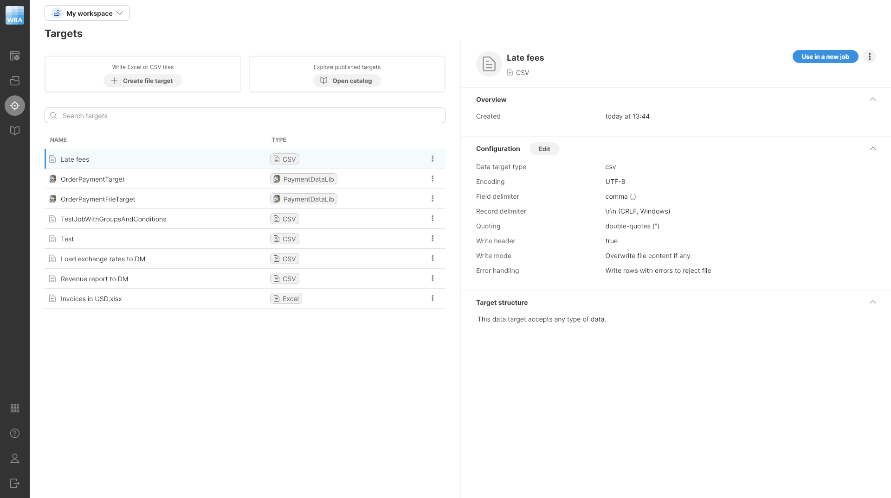
*Figure 42. A preview of a data target alongside a list of configured targets*

The table showing all targets provides basic information for each target:

- **Name** is the name of your target.
- **Type** to help you determine the type of target. Target can be file-based (CSV or Excel) or connector-based (created from **data target connectors** in the [**Data Catalog**](data-catalog.md)).
- Following actions are available for targets listed here:
  - **Use in a new job**: create a new job and set the selected target as the target of this newly created job,
  - **View in Data Catalog**: only available for targets that are created based on Data Catalog entries. This will open a Data Catalog page with details of the selected target.
  - **Copy to Shared workspace** or **Copy to My workspace** depending on which workspace you are in: this action allows you to copy the selected target to the other workspace in Wrangler. This may not be available at all depending on your permissions.
  - **Delete**: delete the target. Note that deleting the target will invalidate the jobs that are using that target. You will have to fix these jobs by configuring them with a different target.

When you select a target in the table, the right half of the screen will show you additional details about that target, as well as allow you to edit its configuration.

To edit the configuration, click on the **Edit** button in the **Configuration** section. This will open a dialog that will allow you to change the parameters of your data target.

The exact layout of this dialog will depend on the target type:

- For **CSV files**, see [**CSV data target settings**](data-sources-data-targets.md#csv-data-targets)
- For **Excel files**, see [**Excel data target settings**](data-sources-data-targets.md#excel-data-targets)
- For **data target connectors**, the configuration will depend on the design of each individual connector.
- For **transactional data set targets**, only the error handling options and write mode ("operation") can be configured.
- For **reference data set targets**, only the error handling options can be configured.

##### Adding data targets to Targets

There are several ways to add data targets to **Targets**:

- **CSV files or Excel files** can be uploaded:
  - Directly in **Targets** by uploading a CSV or Excel file after clicking on **Create file target**.
  - When a new job is created, a CSV file target is automatically generated.
- **Data target connectors**, **reference data set targets**, and **transactional data set targets** can be added from the [**Data Catalog**](data-catalog.md):
  - Click the **Add to Targets** or **Use in a new job** buttons.
  - Click the **Add to Targets** or **Use in a new job** buttons when exploring connector details.

##### Updating data target in existing job

To update the data target in an existing job, click on the **Target** button in the overview diagram of your job at the top of the [transformation editor screen](transforming-data.md#working-with-transformations) or click on the  icon which appears when you hover over the **Target step**.


*Figure 43. Job diagram showing main parts of your Wrangler job*

You will be redirected to a page listing all your targets added to your [Targets](data-sources-data-targets.md#targets) page. Select a new target by performing one of the following:

1. Double-click on the new data target.
2. Select a new target in the list, or hover over it and click on the blue button.
3. Select a new target in the list and click on the **Select ⟶** button.

After performing one of these steps, you will be asked to confirm the data target change.

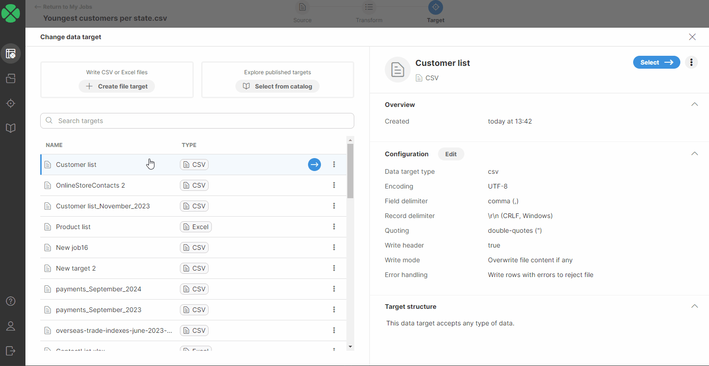
*Figure 44. Selecting a different target for a job.*

##### Target mapping

Some **data target connectors** and all **data set targets** require specific data formats, including required columns with defined data types. This is to ensure data integrity and compatibility with the target system. For example, when writing data to a CRM system like Salesforce, person’s name might be required.

Such data targets require **mapping** - a transformation from your data layout to the data layout required by the target. Mapping is always done at the end of the job and is clearly shown in the step list.

If your selected data target requires mapping, a **Mapping step** appears above the **Target step**. The **Mapping step** allows you to assign columns values or constants to columns in the target. The **Mapping step** displays the number of currently mapped vs. mappable fields, including a note about how many fields are required.

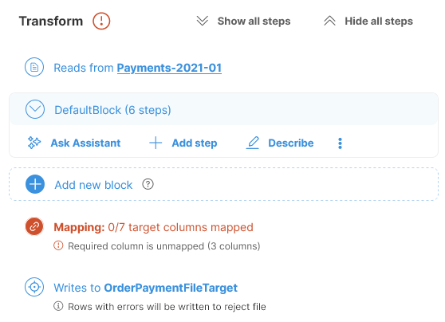
*Figure 45. Data target with mapping that requires at least 3 columns to be mapped.*

###### Mapping editor

To set or edit the mapping, click on the **Mapping step** (or on the little pencil next to the step). The view will switch to the **Mapping mode** which will display preview of your data as well as the **Mapping editor**.

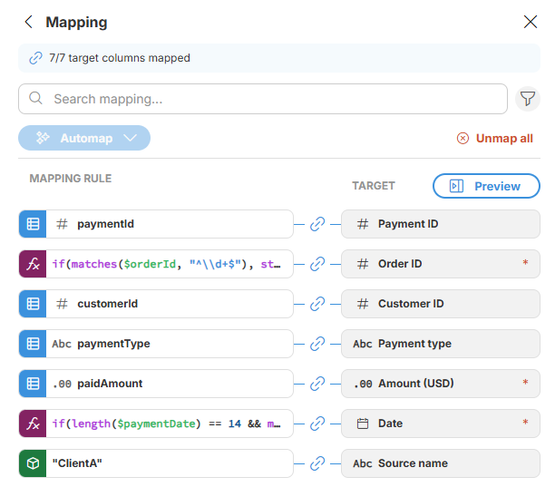
*Figure 46. Mapping editor showing different types of mapping rules.*

In the **Mapping editor** you can link your dataset columns to specific data target columns, define constant values, use formulas, or leave target fields unmapped where allowed.

Mapping consists of **mapping rules** with each rule defining what value gets written to each target column (i.e., there are as many mapping rules as there are columns in the target). The mapping rules are configured on the left side in the mapping rule section, while the target columns are listed on the right side.

Some columns may require a value (i.e., they cannot be left unmapped). These required columns have a little star symbol and are highlighted to distinguish them from optional columns.

The Mapping editor lets you assign values to target columns using different types of mapping rules. You can map a [source column](data-sources-data-targets.md#column-mapping), enter a [constant value](data-sources-data-targets.md#mapping-of-constants), use a [formula](data-sources-data-targets.md#formulas-in-mapping), or leave the target [unmapped](data-sources-data-targets.md#leaving-a-target-field-unmapped).

You can drag source columns from the data preview into the mapping or select a compatible source column from the mapping rule menu. Each mapping rule is shown with an icon that indicates its type, making it easier to understand how the target is being populated at a glance.
> [!NOTE]
> Only columns or constants with compatible data types can be successfully mapped. In some cases, the values will be automatically converted to the correct target type. See [Data type compatibility](data-sources-data-targets.md#data-type-compatibility) for more information about automatic conversions.

Your mapping changes are saved automatically - you will see a little status notification about this at the top of the mapping editor.

You can use the **Search mapping** feature in the mapping editor to display just the columns that contain your search term in their name. The search returns results from both the **Preview** and **Target** columns.

You can also use advanced search by clicking on the funnel icon on the right side to filter based on the mapping status (*Required*, *Optional*, *Unmapped*, *Mapped*, *With error*). The text under the **Search mapping** field will keep you informed about how many columns out of the total number of columns are currently displayed.

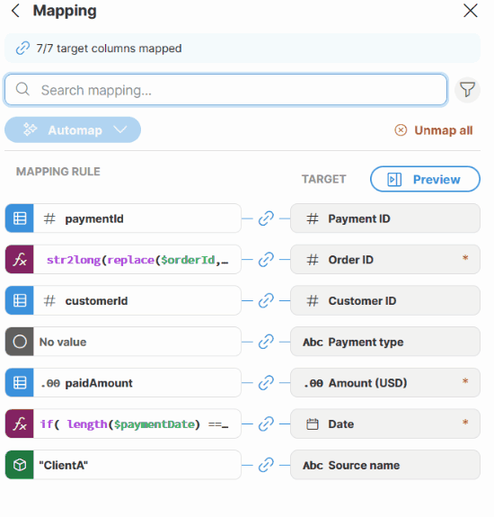
*Figure 47. Searching in the Mapping editor.*

The **Mapping editor** keeps track of all the mapped, unmapped, required, and optional fields, as well as the number of errors. It also automatically adjusts the numbers when you make a change. The **Mapping step** displays the overview as well.

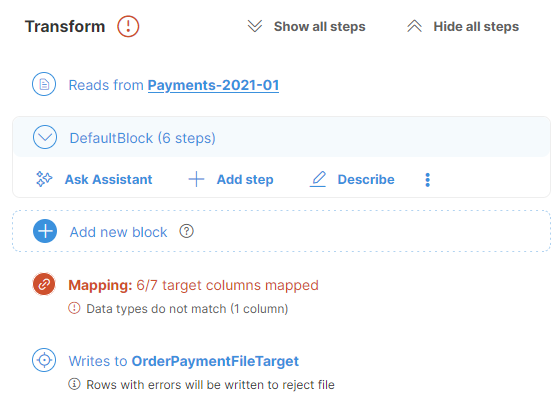
*Figure 48. Step with mapping details showing a mapping with a single "type mismatch" error.*

###### Column mapping

You have multiple options of mapping columns:

1. Drag and drop a column header from the data preview into the mapping rule area in the mapping editor. It is possible to map one column from the data preview to multiple target columns.
2. Select a compatible source column directly from the mapping rule menu in the mapping editor.
3. You can use the **Automapping tools** feature. This functionality offers automated column mapping and can use AI via the Wrangler Assistant if enabled. See [Automapping tools](data-sources-data-targets.md#automapping-tools) below for more details about how it works.
   Note that automapping is applied to visible columns only. If you used the **Search** option above the data preview or if you filtered columns in the Mapping editor, only the columns visible in both parts of the screen will be considered during automapping.

You can freely combine these options for maximum efficiency.
> [!NOTE]
> Ensure the data type of mapping rule matches the target column’s data type. For more information, see [Data type compatibility](data-sources-data-targets.md#data-type-compatibility).
> [!NOTE]
> When using a **reference data set** as the target, any `ID` values passed from the source must already exist in the reference data set. Otherwise, an error will be generated when the job is run. To insert new rows, leave the `ID` values empty.

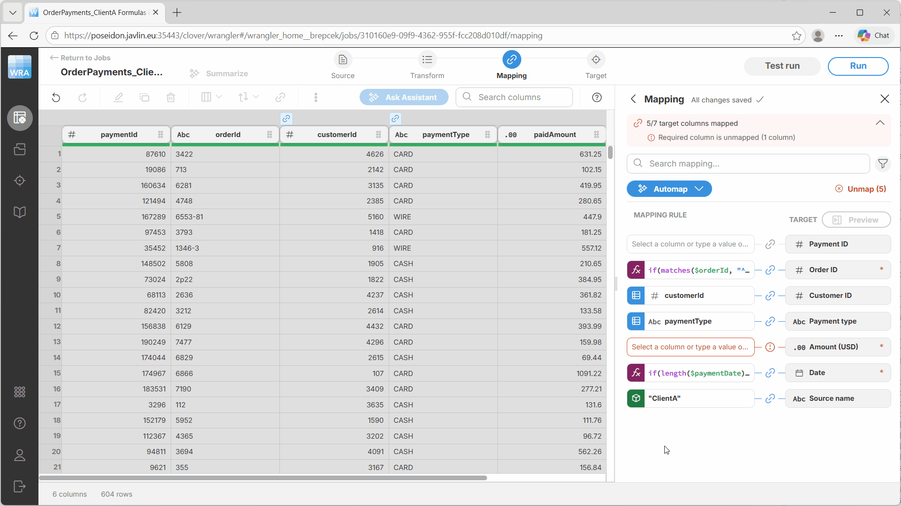
*Figure 49. Mapping columns directly to their target.*

###### Mapping of constants

If you want to assign a constant value to a target column, select the target field in the Mapping editor and choose a constant value rule.

The editor provides input controls based on the target data type. For example, date values can be selected from a calendar picker.
> [!NOTE]
> Ensure the format matches the target column’s data type. A hint about the required data type will be displayed in the field itself. For more information, see [Data type compatibility](data-sources-data-targets.md#data-type-compatibility).

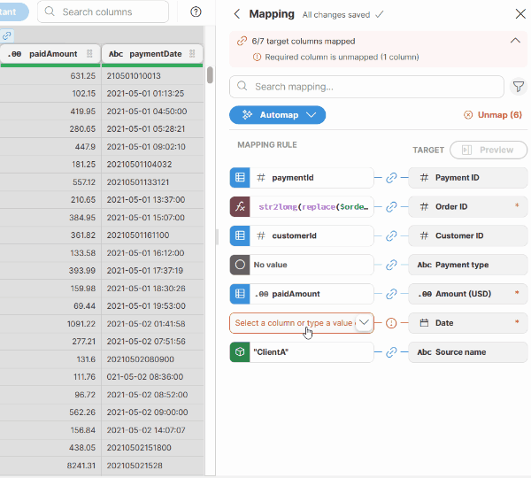
*Figure 50. Mapping a constant date value by selecting it from a calendar.*

###### Formulas in mapping

You can also use formulas to calculate values for individual target fields directly in the Mapping editor. When a target field uses a formula rule, the formula is edited in a separate formula editor opened from the mapping sidebar.

The formula always belongs to the selected target field and must return a value compatible with that target field. For more information about writing formulas, see see [Using formulas](transforming-data.md#using-formulas). For more information about compatible and automatically converted types, see [Data type compatibility](data-sources-data-targets.md#data-type-compatibility).

###### Formula preview

When working in the Mapping editor, you can preview formula results before finishing your changes. Formula preview helps you validate the result directly while editing the mapping.

Click **Generate preview** to display the result of the formula in a floating preview panel next to the main data preview. The preview shows the target column together with the relevant source columns used by the formula, so you can compare the calculated result with the input values directly during editing.

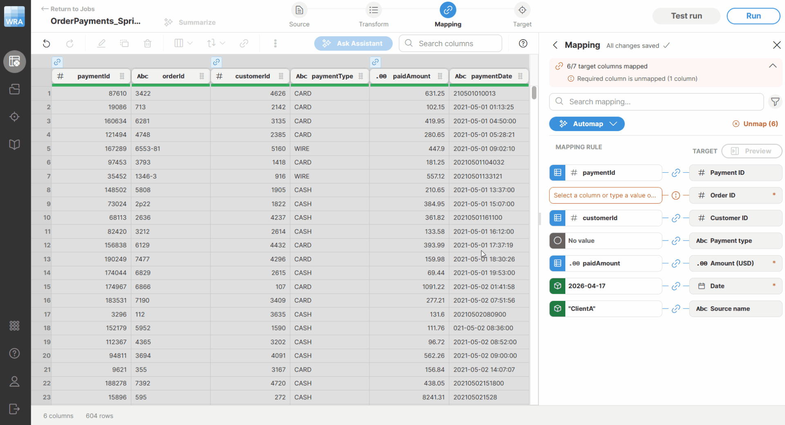
*Figure 51. Formula preview in mapping*

###### Leaving a target field unmapped

If you do not want to assign a value to a target field, you can set its mapping rule to **No value** or leave it empty. It is usually better to use the **No value** rule as it makes it clear that the field must remain empty and has not been forgotten. Using **No value** rule can also help you if the target layout changed - you will get an error while you get no such information if you simply leave the rule empty for given target field.


*Figure 52. Leaving a target field unmapped.*

###### Previewing target output

You can also preview the mapped target output as a whole. Click **Preview** in the Mapping editor to display the mapped target columns in their output order. This helps you confirm that the complete mapping produces the expected result before the data is written to the selected target.

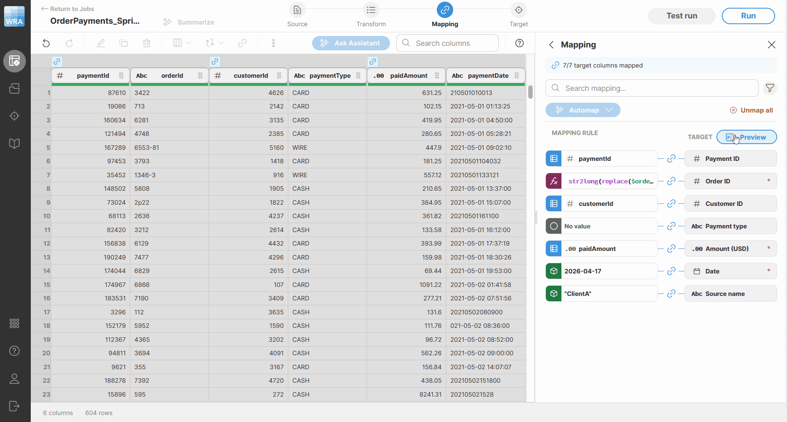
*Figure 53. Showing a complete preview of all columns in the target.*

###### Automapping tools

Automapping tools offer multiple ways of automatically mapping your data to the target layout.

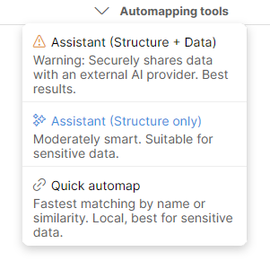
*Figure 54. Automapping tools menu shows three options when the Wrangler Assistant is available.*

Following options are available:

- **Assistant (Structure + Data)**: uses the Wrangler Assistant to determine the mapping. In this case, the Assistant will also receive sample data which may help resolve more complex or ambiguous mappings. Note that when this option is selected, sample of your data is uploaded to the LLM provider.
- **Assistant (Structure only)**: uses the Wrangler Assistant to determine the mapping. In this case, only the metadata is sent to the LLM provider - column names in your data, in target, their descriptions, types and so on. Data samples are NOT sent to the LLM provider. In most cases this option works great and there is no need to send sample data to LLM.
- **Quick automap**: this option does not use AI at all, it builds the mapping based on column name similarity, data type matches and so on. This option runs fully locally and does not send any data to the cloud at all. If you don’t have access to the Wrangler Assistant, this is the only option available.

When using the Assistant to create the mapping, a new block will be created for you at the end of the transformation. This block will contain prompt for the mapping and will allow you to review the mapping suggestions later. The suggestions from the Assistant may look like this:

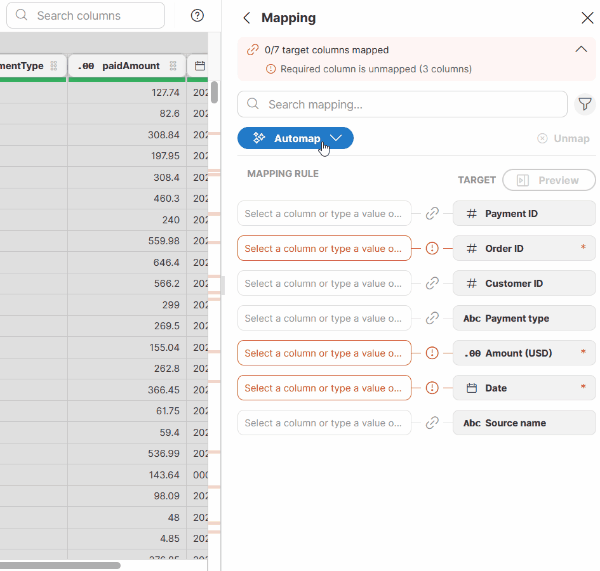
*Figure 55. Suggestions returned by the Wrangler Assistant after selecting the Assistant (Structure + Data) option.*

Just as with step suggestions, you can select which mapping to keep and which ones to ignore. Once you add the mappings to your job, the mapping view will be updated and the automapping block will show the suggestions for later review as well.

###### Data type compatibility

For successful mapping, ensure two key points:

1. When **mapping columns**, the source and target columns need to share the same data type (e.g., integer to integer, string to string). In some cases, Wrangler can automatically convert data types during mapping to enhance flexibility:
   - *Integer to String*: Integers are automatically converted to strings during mapping.
   - *Date to String*: Dates are automatically converted to strings during mapping.
   - *Decimal to String*: Decimals are automatically converted to strings during mapping.
   - *Boolean to String*: Booleans are automatically converted to strings during mapping.
   - *Integer to Decimal*: Integers are automatically converted to decimals during mapping.
2. When assigning **constant values** to target columns, enter them in the format required by the target’s data type. A hint about the expected format will be displayed within the Mapping editor.

The target column data type is indicated by an icon next to the column name, and you can also see it in the tooltip which appears when you hover over it. For further details on data types, refer to [Data types in Wrangler](transforming-data.md#data-types-in-wrangler).

If the data types do not match, the mapping is considered invalid. If your job includes invalid mapping, the job run will fail. It is recommended to use the [Data target preview](data-sources-data-targets.md#data-target-preview) to check if the mapping is valid and to preview your data before running the job.

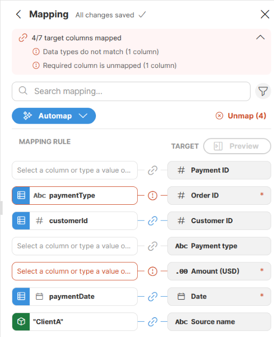
*Figure 56. Example of mapping with mismatched data types: paymentType is invalid because the target column is an integer while the mapped column is a string.*

###### Mapping indicators in data preview

When a column is mapped, an icon appears above its column name in the **Transformations editor** to indicate that the column is linked to a target column. If the mapping is successful, you will see a blue "link" icon . If the mapping of this column is invalid (e.g., the data types do not match), you will see an error icon .

When you click on any of these icons, the **Mapping editor** opens.

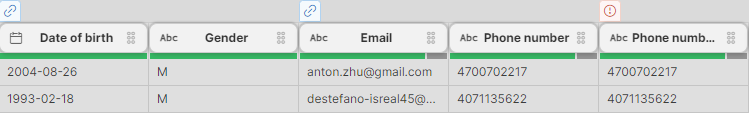
*Figure 57. Mapped columns: the Date of birth and Email are ok while the Phone number mapping is invalid as indicated by the red error icon above the header.*

###### Unmapping columns

To unmap a column, hover over the desired column in the **Preview column** section, and click on the X button. To quickly unmap all columns, use the **Unmap** button in the **Mapping editor**.

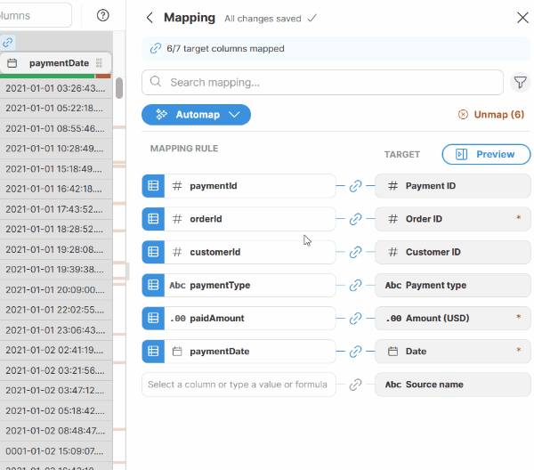
*Figure 58. Unmapping columns in the Mapping editor.*

##### Data target preview

Click on the target step to preview your data. This is particularly helpful when using a data target connector or reference data set as your target. The preview will show you the mapped data with the target column labels, allowing you to verify data integrity and identify any mapping errors before writing the data permanently.

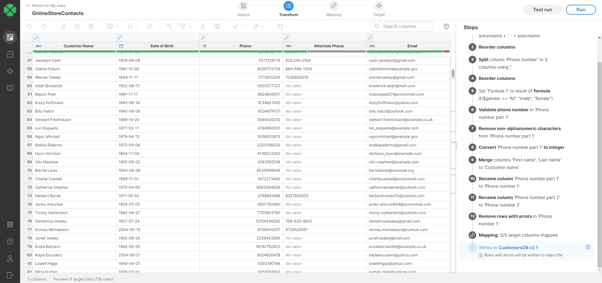
*Figure 59. Target preview showing what the data looks like when the transformation is complete.*

If your mapping is invalid, the preview will be unavailable.

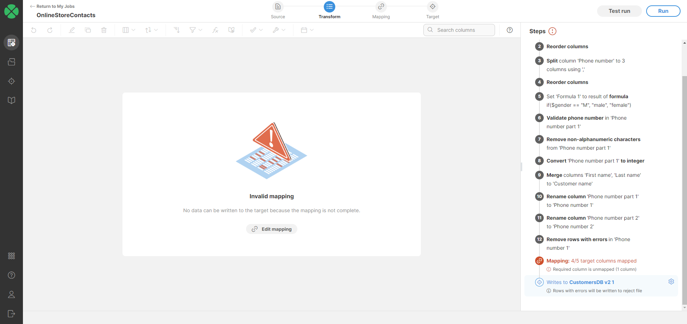
*Figure 60. Error message shown when preview is not available.*

Another way of viewing preview of the data sent to target is nby using [Preview in Mapping view](data-sources-data-targets.md#previewing-target-output).

##### Downloading and viewing output files

When files are written by Wrangler, they are stored in your workspace. You can download your files from Wrangler user interface from the **Jobs** screen by clicking on the **Download result** button:

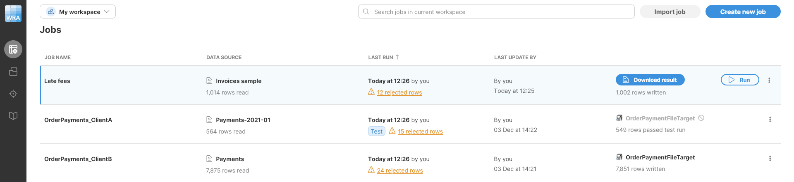
*Figure 61. Jobs screen showing information about three job runs.*

##### Reject file format

Wrangler offers an option to produce a **reject file**: a file which stores information about rows which contained errors. Reject files can be written in two different formats - a **CSV file** (for CSV data target) or **XLSX file** (for Excel data target). In both cases, the information in the file is the same and the only difference is the file format itself. The file provides information about why each row was rejected, including the data in the rejected row at the end of the transformation. For more information see [Errors and output](transforming-data.md#errors-and-output).


*Figure 62. Example reject file in Microsoft Excel format*

The reject file contains one row for each rejected row. Since there can be multiple errors in each row, all errors for given row are collected in the single reject file row.

Besides the error details, the reject file also contains the data that was rejected. The data is all stored as string columns to ensure that invalid values can be written to the reject file as well.

The reject file contains the following columns:

- **Error message** (column A in Excel): full error message describing the errors in current row. If more than one error is present in a row, error messages are concatenated together. This means that the value can be quite long for rows with many errors.
- **Error column** (column B): name of the column in which an error occurred. If there are multiple errors in current row, multiple column names are provided as semicolon-separated list.
- **Step** (column C): description of a step in which an error that caused the row to be rejected occurred. If multiple errors are present in current row, multiple steps are listed here as semicolon-separated list. Each step is written as `Step N: step type` where `N` is the number of the step in the step list (first step is 1) and `step type` is the "generic" name of the step. Example: `Step 15: Validate with formula` is 15th step in the job and it is a [Validate with formula step](wrangler-step-validate-with-formula.md).
- **Source row number** (column D): row number as it was read from the data source (regardless of the source type). The rows are numbered sequentially starting with 1 when they arrive from the data source. Sorting, filtering or removing rows does not change the *Source row number* value. This means that at the end of the transformation, the sequence of row numbers may be out of order or have gaps in it depending on transformation steps. The *Source row number* is useful to tie the data to what came from the source system and can help identify the rows in the source if data fix is required.
- **Data columns** (columns starting with E): all columns after *Source row number* are data columns. Data is in the same layout as in the last step of the transformation. The only difference is that all columns are converted to string before they are written to the reject file. This is to ensure that even invalid values (e.g. with wrong format) can be output to the reject file.

##### Data target connectors

Wrangler allows you to use **data target connectors** that are created, managed, and maintained by your CloverDX Server administrators. These connectors can be found in the [**Data Catalog**](data-catalog.md), from where you can choose to add them to [**Targets**](data-sources-data-targets.md#targets) and use them in your jobs.

For steps on how to add an existing data target connector from the **Data catalog** to **Targets**, refer [here](data-sources-data-targets.md#adding-data-targets-to-targets).

These target connectors do not generate an output file; instead, they write data directly to a configured external target within the connector, such as a database or a third-party interface. Depending on the connector’s design, certain target connectors may require mapping your transformed data into the target structure. For further details, refer to the [**target mapping**](data-sources-data-targets.md#target-mapping) section.
> [!NOTE]
> If you cannot find the data target connector you need, contact your CloverDX Server administrator to either grant you access or create a new connector for you. Administrators can consult our Server [documentation](../operations/libraries.md#development) for more information on how to install and configure data source connectors.

If you specify a different connector name when adding a connector from the **Data Catalog**, you can find the original connector name in the connector detail.

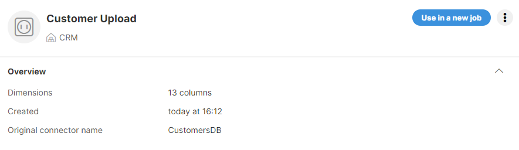

##### CSV data targets

CSV data target allows you to write your data into CSV files that are stored in your Wrangler workspace. To change your data target settings, click on the **Target** button in the overview diagram of your job at the top of the [transformation editor screen](transforming-data.md#working-with-transformations) or click on the  icon which appears when you hover over the **Target step**.


*Figure 63. Job diagram showing main parts of your Wrangler job*

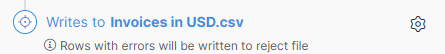
*Figure 64. Target step*

A page listing all the targets added to your [**Targets**](data-sources-data-targets.md#targets) will appear. Your currently used target will be automatically selected and its details displayed on the right side. To change the configuration of your CSV file, click on the **Edit** button next to **Configuration**.

To select a different target, select the desired target from the list, click on the **Select ⟶** button, and confirm your changes.

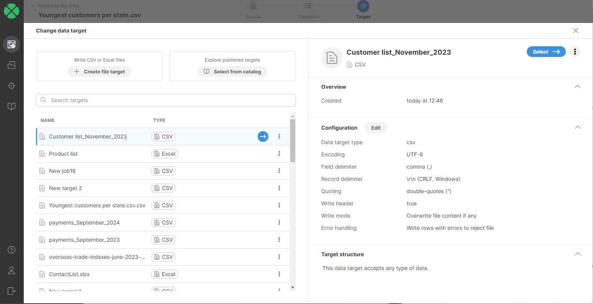

###### CSV data target configuration

The following settings are available for CSV data targets:

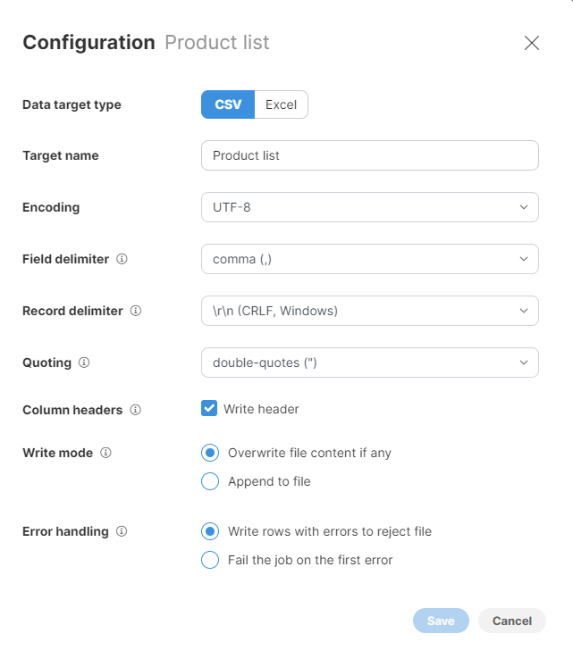
*Figure 65. CSV data target configuration dialog*

- **Target name**: name of the output file. Default value is the name of your Wrangler job.
- **Encoding**: encoding for the output file. The default (recommended) value is UTF-8, which is a universal encoding that will allow you to save data in any language while making it readable in many other apps. Other common encodings include windows-1252 (US English encoding commonly used for files created on Windows) or ISO-8859-1 (US ASCII encoding). Selecting the wrong encoding here can produce a file in which some characters are not stored correctly.
- **Field delimiter**: a single character to use as a separator between columns in the output file. You can either select one of the provided options or type your own character. The most common delimiter is either a **comma** or a **tab**.
- **Record delimiter**: configures character(s) that are used to separate rows in the output file. The default value is a "Windows new line" which means that each row appears on a separate line in the output file. Select the option based on your target platform - if you are targeting Windows users, use the Windows CRLF option, for Linux or Mac users pick the Linux LF option. You can also type your own delimiter if needed.
- **Quoting**: allows you to configure whether values in your file are surrounded by quotes or not. If you enable quotes, the data may look like this (assuming two columns: `Name` and `Age`):
  ```
  "Name","Age"
  "Alice","22"
  "Bob","23"
  ```
  Quoting is needed when your data can contain your delimiter character - e.g., if your delimiter is a comma and your data can contain commas as well. When configuring quoting you can pick which character to use - whether double quotes or single quotes. Double quotes (the default value) are more common and recommended if quoting is needed.
- **Column headers**: allows you to configure whether to write a file header or not. If enabled, the file header will be written as the first row of the output and will contain labels of all columns in your data. We recommend enabling the header as that will allow data recipients to know what is in the data.
- **Write mode**: determines how your data should be output.
  - **Overwrite file content if any**: any existing file content is deleted and replaced by the output from the latest job run.
  - **Append to file**: any existing file content is kept and data from the latest job run is added to the end of the file.
    - The append function is disabled if the number of columns or column data types change and no longer match the existing layout or data types in the target file. In such a case, you will either need to change the target settings and switch to the **Overwrite** option, or change the target file to a new empty file.
      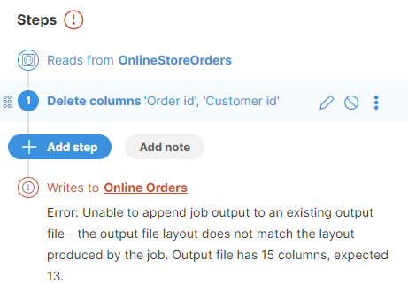
      *Figure 66. Error when job data layout does not match data layout in target file*
- **Error handling**: determines what to do with rows that contain errors in any of their cells. Two options are provided:
  - **Write rows with errors to reject file** (default value): if selected, all rows that contain errors are written to a **reject file**. The reject file allows you to see the rejected rows as well as information about errors that caused those rows to be rejected (read more [here](data-sources-data-targets.md#reject-file-format)). You can then see the number of rows that were rejected on **Jobs** page when job execution ends:
    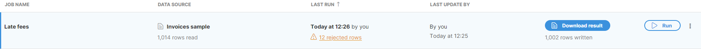
  - **Fail the job on the first error**: when an error is encountered when writing the file, the job is stopped and the error will be reported on **Jobs** page:
    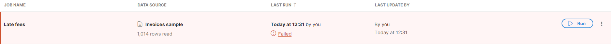

###### CSV data target limitations

CSV target will allow you to work with any size of data - unlimited number of rows or columns.

##### Excel data targets

Excel data target allows you to write your data into Microsoft Excel files in the XLSX format. The target produces a file with one sheet and a header. Formatting of data in the output file will follow the formatting configured for columns in your Wrangler job.

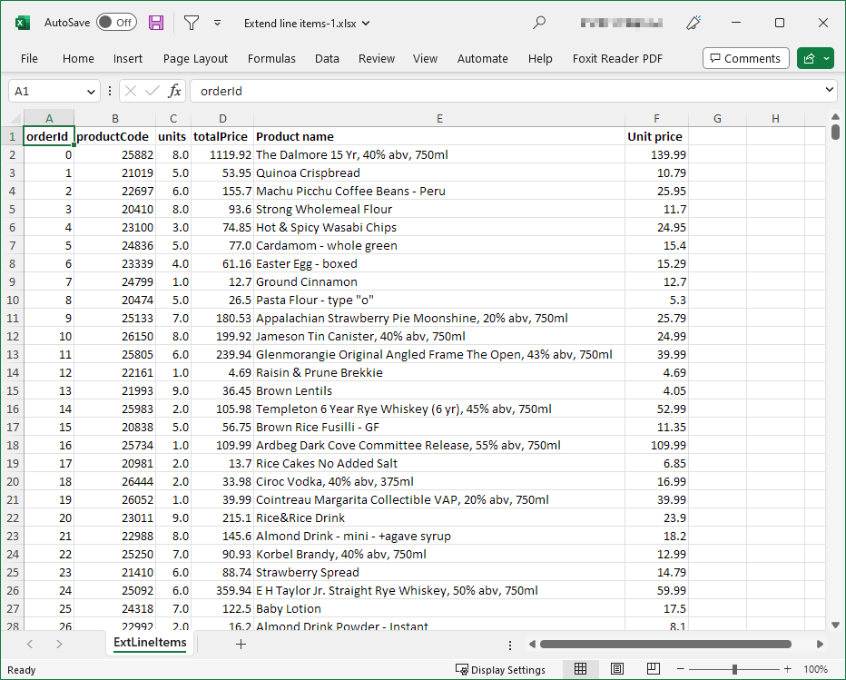
*Figure 67. Sample Excel file create with CloverDX Wrangler*

###### Excel data target configuration

Following settings are available for the Excel target:

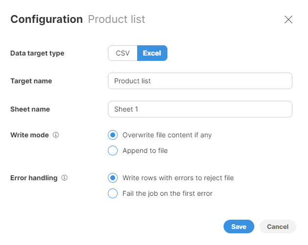
*Figure 68. Excel data target configuration dialog*

- **Target name**: name of the output file. The default value is the name of your Wrangler job.
- **Sheet name**: name of the sheet to create in the output file. Note that Excel limits the length of the sheet name to 31 characters.
- **Write mode**: determines how your data should be output.
  - **Overwrite file content if any**: any existing file content is deleted and replaced by the output from the latest job run.
  - **Append to file**: any existing file content is kept and data from the latest job run is added to the end of the file.
    - The append function is disabled if the number of columns or column data types change and no longer match the existing layout or data types in the target file. In such a case, you will either need to change the target settings and switch to the **Overwrite** option, or change the target file to a new empty file.
      
      *Figure 69. Error when job data layout does not match data layout in target file*
- **Error handling**: determines what to do with rows that contain errors in any of their cells. Two options are provided:
  - **Write rows with errors to reject file** (default value): if selected, all rows that contain errors are written to a **reject file**. Reject file allows you to see the rejected rows as well as information about errors that caused those rows to be rejected (read more [here](data-sources-data-targets.md#reject-file-format)). You can then see number of rows that were rejected on **Jobs** page when job execution ends:
    
  - **Fail the job on the first error**: when an error is encountered when writing the file, the job is stopped and the error will be reported on **Jobs** page:
    

###### Formatting of Excel files

The formatting of data in Excel output files depends on the formats configured on columns in your data set. Wrangler will set the corresponding Excel format depending on the display format for each column.

When saving to an Excel file, Wrangler will save the complete value even if the formatting restricts the display of data. This is especially important for numbers which may be stored with higher precision than what is displayed in Wrangler preview.

For example, consider a value like 3.1415926535 written in Wrangler with decimal format set to `#.###` (i.e. three decimal places):

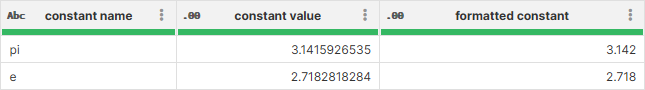

The column `$formatted_constant` was created as a duplicate of `$constant_value` column and then configured to show just three decimal places. The same is then replicated in Excel output in which complete value is stored and the formatting only applies during data display:

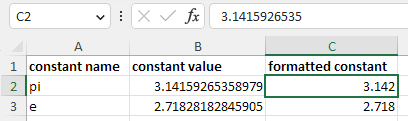

Note that the formats may not always be the same since Excel formatting and Wrangler formatting have slightly different capabilities.

###### Excel data target limitations

Note that some restrictions apply when working with Excel files. Some of the restrictions below are limitations of the Excel file format itself while others are technical limitations of the Excel data target in Wrangler.

- You cannot write more than 1048576 rows into an Excel file. This is a limitation of the Excel file format. If you need to work with more data, you will need to use CSV data target.
- You cannot have more than 16384 columns in the output. This is a limitation of Excel file format. Note that this is much higher than the default soft-limit for Wrangler columns - 1000 columns - so you are unlikely to reach this.
- You can only create a single sheet in the output file using Wrangler.

##### Reference data set targets

With **reference data set targets** you can create Wrangler jobs that allow you to insert new rows or update existing rows in [reference data sets](data-manager-working-with-reference-data.md) that were previously configured in **CloverDX Data Manager**.

###### Working with reference data set targets

To use the reference data set targets, you have to add them to your workspace via **Add to Targets** dialog from the Data Catalog. **Data Catalog** entries for all reference data sets are created automatically. Your permissions for each target will be based on your permissions within CloverDX Server and your permissions on the specific data set:

- If you are a Data Manager administrator, you will be able to write to any data set (since as Administrator you can give yourself access to any of the data sets).
- If you are not Data Manager administrator, your permissions are based on permissions on each data set. You will only be able to write to reference data sets where you already have write permissions (i.e., you are Editor, Approver, or Admin on given data set).

When adding the reference data set target to your **Targets**, you’ll see a wizard like this:

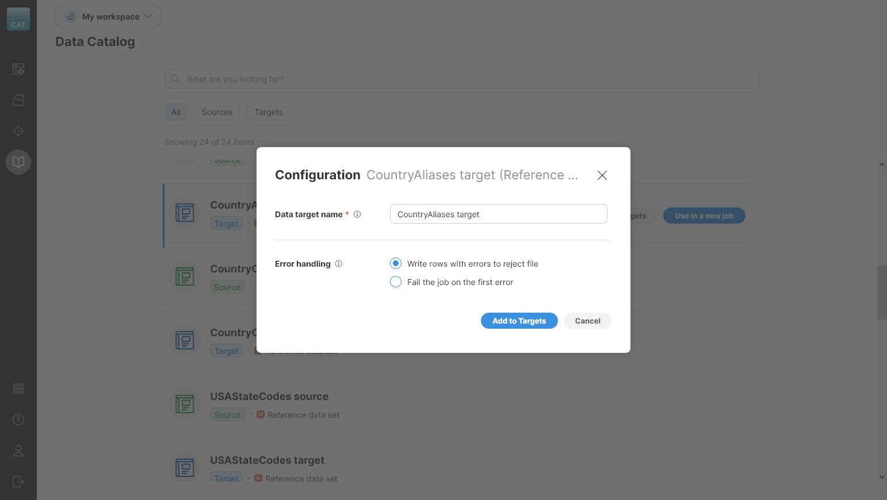
*Figure 70. Add to Targets wizard.*

The following settings are available in the wizard:

- **Data target name**: name of the target in the workspace.
- **Error handling**: configure how to deal with errors when writing data. Two options are available:
  - **Write rows with errors to reject file**: write all valid records to the data set and collect all errors in a separate reject file you can download,
  - **Fail the job on the first error**: end the job and fail as soon as the first record with any error is encountered.

All reference data set targets provide data layout and therefore all jobs that use them require **Mapping**. See [target mapping](data-sources-data-targets.md#target-mapping) for more information about how the mapping works.

###### Inserting rows into the reference data set

When inserting rows into the reference data set, simply leave the `ID` column unmapped. This is a signal to the target to generate new `ID` for the row and add it to the data set.

Note that the target does not verify uniqueness of your rows by looking at existing rows in the data set and comparing the keys. It will simply add new row to the data set.

All rows inserted like this will require approval in the Data Manager to publish the changes.

###### Updating rows in the reference data set

To update existing rows, you have to provide a valid value of `ID` column. A row with the same `ID` will be overwritten in the data set. All changes are audited and will be visible in the audit log once they are approved.

If you pass an `ID` value that does not exist in the target reference data set, an error is raised.

You can mix inserts and updates within the same job so you can easily have "refresh" job for your reference data set which will insert new rows and update the existing ones.

##### Transactional data set targets

You can use **transactional data set targets** to insert or update rows in [transactional data sets](data-manager-working-with-transactional-data.md) that were previously created in the **CloverDX Data Manager**.

###### Working with transactional data sets sources

Before writing to transactional data sets in Wrangler, you have to add targets for those data sets to your workspace via **Add to Targets** dialog from the **Data Catalog**. **Data Catalog** entries for all transactional data sets are created automatically. Your permissions with regards to each target will be based on your permissions within CloverDX Server and your permissions on the specific data set:

- If you are a Data Manager administrator, you will be able to write to any data set (since as Administrator you can give yourself access to any of the data sets).
- If you are not Data Manager administrator, your permissions are based on permissions on each data set. You will only be able to write to transactional data sets where you already have write permissions (i.e., you are Editor, Approver, or Admin on given data set).

To add the data set to **Targets**, use the **Add to Targets** wizard in the **Data Catalog**:

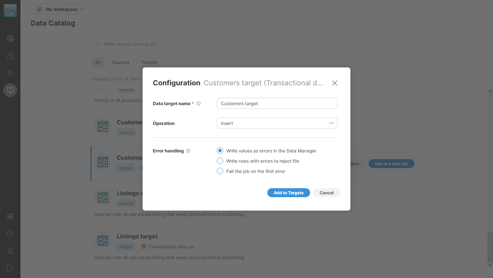
*Figure 71. Add to Targets dialog showing configuration to add transactional data set target to Targets*

The wizard offers the following settings:

- **Data target name**: name of the data source.
- **Operation**: configure whether the target inserts or updates records. Two options are available:
  - **Insert**: target will only insert records into the data set.
  - **Update**: target will update records in the data set. You have to provide a valid `ID` value in this case.
- **Error handling**: configure how to deal with errors when writing data. Three options are available:
  - **Write values as errors in the Data Manager**: all errors that get to the end of the job are translated to Data Manager format and written to the data set. Data Manager will then show the errors with red triangles on the cells that contain errors.
  - **Write rows with errors to reject file**: write all valid records to the data set and collect all errors in a separate reject file you can download.
  - **Fail the job on the first error**: end the job and fail as soon as the first record with any error is encountered.

All transactional data set targets provide data layout and therefore all jobs that use them require **Mapping**. See [target mapping](data-sources-data-targets.md#target-mapping) for more information about how the mapping works.

###### Inserting rows to the transactional data set

When inserting rows, the `ID` column will not be available in the target mapping. Depending on error handling settings in the target, the errors can be written to the target (this is the default), written to reject file or they can cause the job to fail.

When writing to the Data Manager, you can use any validation step in Wrangler to validate your data. The errors will be automatically mapped to the Data Manager format by the target and will appear in the Data Manager’s grid. Additionally, if any of your steps fail (e.g., you use a formula that crashes on a value), the error will be captured as well and written to the data set.

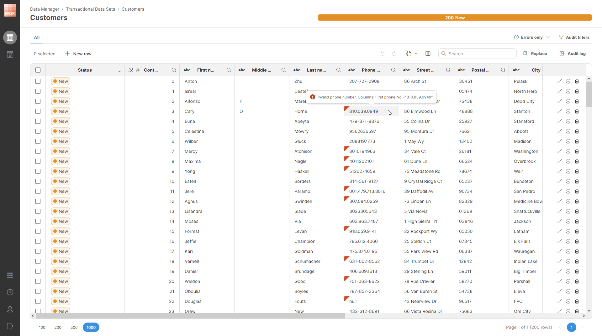
*Figure 72. Transactional data set in the Data Manager showing errors produced by a Validate phone number step in Wrangler job.*

All rows are always written with the status **New** - there’s no way to change the status via transactional data set target.

###### Updating rows in the reference data set

When you want to update the data set, you have to configure the **Operation** parameter on the data target to **Update**. In that case, the mapping will show one additional column - the `ID`.

When writing the output, the target will compare the values you are sending with values in the data set and if they are different, it will write the update. This means that you will see which values have changed and which not. This can be very useful when your job may leave some values intact (for example, if you trim a string and it was already trimmed, you will not see an update and will know that the value has not changed).

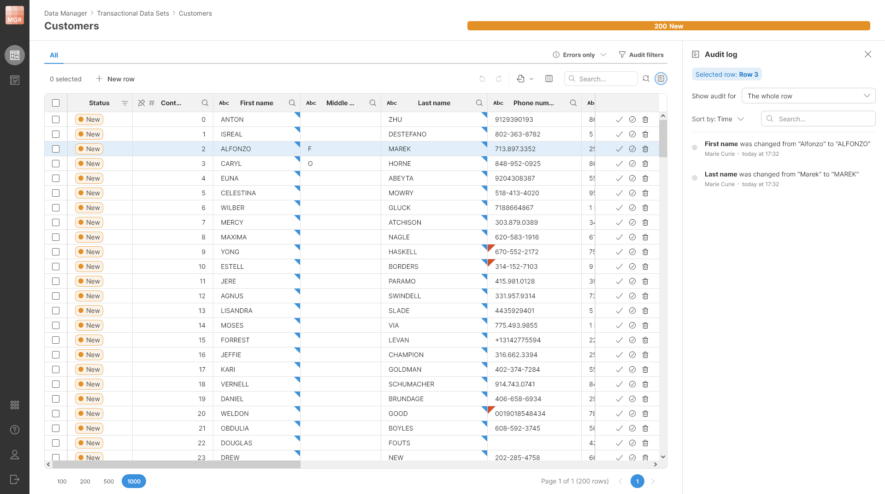
*Figure 73. Data set showing changes made using Wrangler job - First name, Middle name, and Last name columns were converted to uppercase. The audit log shows the changes in the sidebar.*

Note that you cannot change status of rows in the data set even when you are doing updates - the `Status` column is not available in the mapping.
