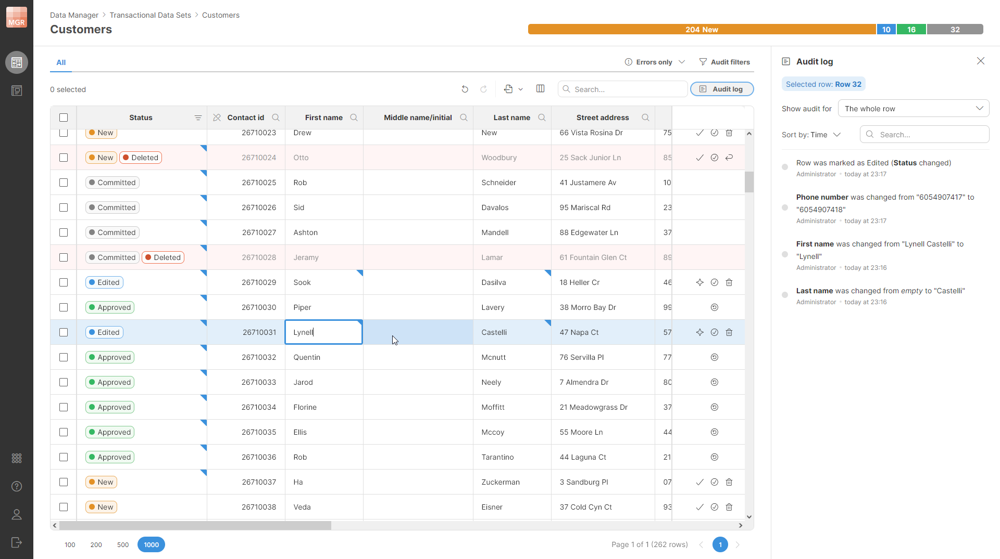

<!-- End user’s guide > Data Manager user guide -->

## 2. Data Manager user guide

In this part of the User’s guide, we’ll cover the Data Manager and its usage. Data Manager allows users to directly interact with data as part of the data process in CloverDX. This can be useful, for example, when managing **data quality** in a process or for **reference data management**.

*Figure 128. Data Manager’s data editor showing transactional data set.*

In this guide we’ll cover how you can use Data Manager to handle its most common use cases. Users working with transactional (moving) data will learn how to work with their data in the [Working with transactional data section](data-manager-working-with-transactional-data.md). Users looking for reference data manager or master data management can learn how to manage their data in [Working with reference data section](data-manager-working-with-reference-data.md).

Additional information required to implement a full solution using the Data Manager can be found in different parts of the CloverDX documentation:

- Guide for CloverDX Server administrators to help them manage the Data Manager instance can be found in the [Data Manager administration](../admin/data-manager-administration.md).
- Details about components that can be used to interact with transactional data in Data Manager can be found in the documentation for [TransactionalDataSetReader](../developer/datasetreader.md), [TransactionalDataSetWriter](../developer/datasetwriter.md) and [TransactionalDataSetCommit](../developer/datasetcommit.md) components.
- Details about components that can be used to work with reference data in Data Manager can be found in documentation for [ReferenceDataSetReader](../developer/referencedatasetreader.md) and [ReferenceDataSetWriter](../developer/referencedatasetwriter.md) components.
- Details about how lookups can be used in Designer can be found in [Reference lookup table](../developer/lookup-tables.md#reference-lookup-table) chapter.
