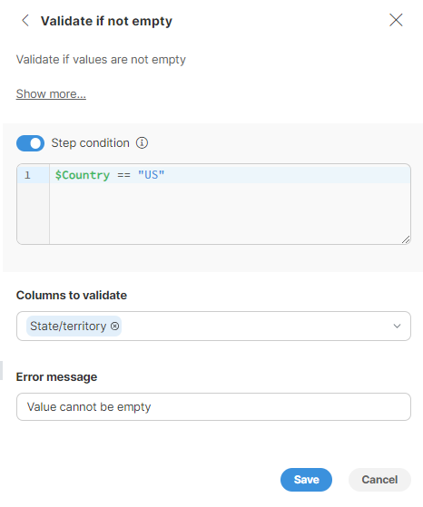
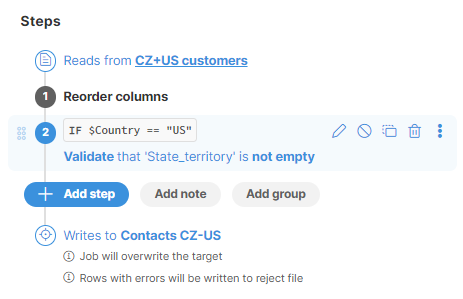
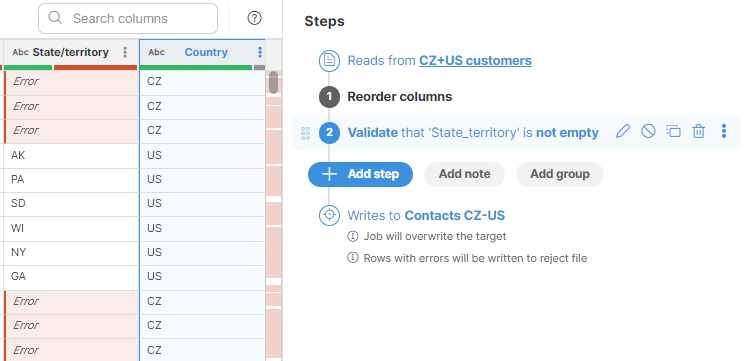
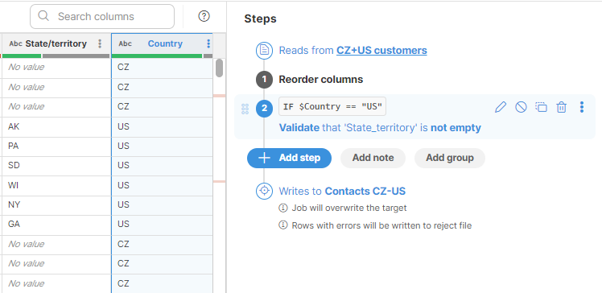
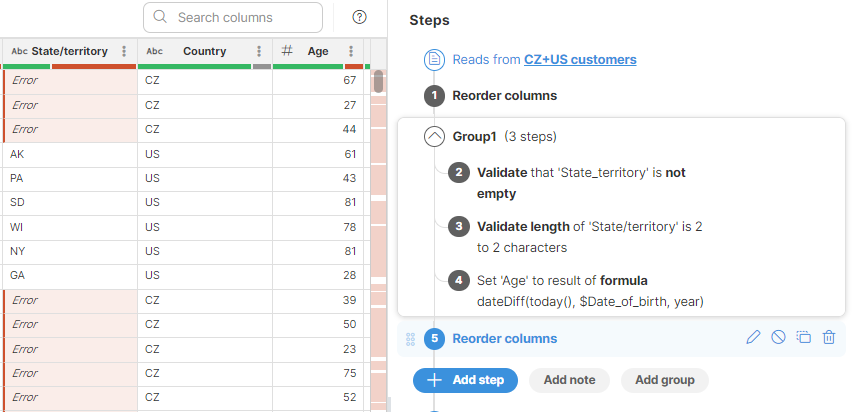
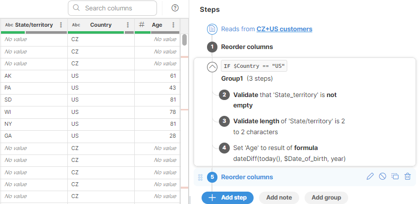
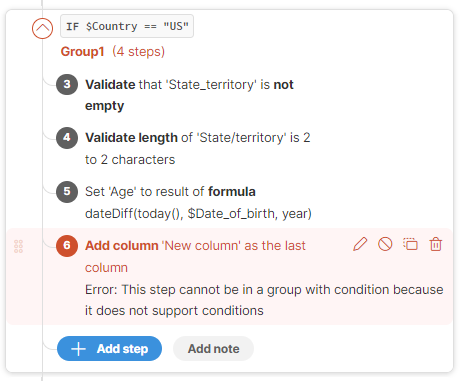
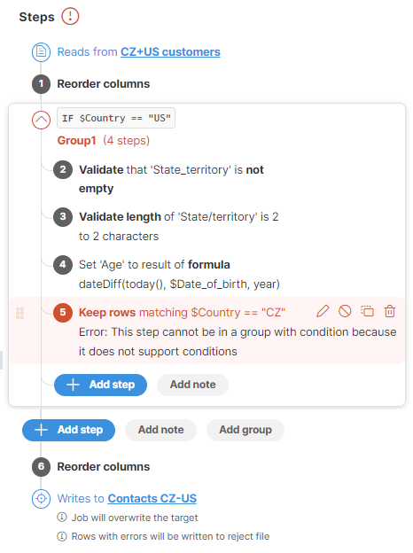
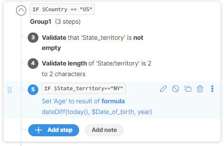
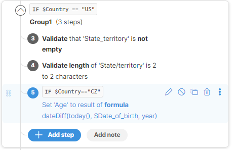

<!-- End user’s guide > Wrangler user guide > Transformation steps > Step and group conditions -->

#### Step and group conditions

Wrangler lets you add conditions to your data transformations. These conditions act like filters, telling Wrangler which rows of data to change based on a simple rule you set. Conditions can be set at two levels:

- [**Step level**](step-and-group-conditions.md#enabling-step-conditions), allowing you to create a rule directly on a step to target specific rows of data.
- [**Step group level**](step-and-group-conditions.md#enabling-group-conditions), allowing you to define a single rule for a group of steps, affecting all steps within the group at once.

You can combine both methods for more complex workflows.

##### Conditional formulas logic

In both cases, you will need to set your condition by specifying a formula:

- The formula needs to be written to return a boolean value (`true` or `false`).
- The formula syntax follows the same logic as in other places in Wrangler and it supports common operators, functions, and column references. For more information refer to the [Using formulas](transforming-data.md#using-formulas) section.

##### Step conditions

Most steps in **CloverDX Wrangler** allow you to conditionally apply transformations to specific rows of data. This means you can tell Wrangler to only change certain rows based on a condition formula. For a list of steps that support step conditions, refer [here.](step-and-group-conditions.md#steps-with-condition-support)

###### Enabling step conditions

To enable a step condition, perform the following:

- Locate the desired step within your Wrangler workflow.
- Click on the pencil (Edit) button to get into the step edit mode.
- Enable the **Step condition** toggle switch to activate the window where you can specify your condition formula.
- Enter your formula (See [Conditional formulas logic](step-and-group-conditions.md#conditional-formulas-logic) above).

*Figure 118. Specifying step condition*

Once you save your changes, the step will indicate that a condition is applied. You’ll see an "IF" statement and the condition in the step description.

*Figure 119. Step with condition in Step list*

During execution, Wrangler evaluates the specified formula for each row of data. If the formula evaluates to `true` for a particular row, the step is applied to that row. Conversely, if the formula evaluates to `false`, the step execution is skipped for that row.

In the example below, the *State/territory* values are populated only for contacts located in the United States. We want to use the *Validate if empty* step to ensure that the *State/territory* is populated for all *US* contacts. If we apply the *Validate if empty* step without a condition, the validation is run universally for all values in the *State/territory* column, disregarding the *Country*, marking all empty values for *CZ* contacts as an error.

*Figure 120. Example of step execution without condition*

By setting a condition to apply just to *US* records, the validation step is applied only to the *US* states.

*Figure 121. Example of step with condition*

##### Group conditions

If a condition is set at the step group level, all steps within the group will only be applied to rows where the condition is met. Only if the condition evaluates to `true` will any of the steps in the group be applied to a particular row of data. If the condition evaluates to `false` for a row, all steps within the group will be skipped for that row.

The steps within a group are executed sequentially.

###### Enabling group conditions

To set a condition at the group level, perform the following:

- Locate the desired group within your Wrangler workflow and click on it.
- From the three-dot menu on the right side, select **Set condition**.
- Enable the **Step condition** toggle switch to activate the window where you can specify your condition formula.
- Enter your formula (See [Conditional formulas logic](step-and-group-conditions.md#conditional-formulas-logic) above).

In the example below, when there is no condition set to specify that the steps should be applied only to *US* customers, the steps are applied to all rows.

*Figure 122. Steps in group without a condition*

When there is a condition set at the group level, all steps within the group are applied only to rows with "*US*" in the *Country* column.

*Figure 123. Steps in group with a condition*

###### Important considerations for group conditions

When adding steps to a group with a condition, bear in mind the following:

- Steps that do not support conditions will generate an error when added to a group with conditions. If an incompatible step is added, the job is considered invalid and its execution will fail. Such steps need to be deleted or removed from the group.

*Figure 124. Incompatible step*

- All steps within the group need to be configured to be compatible with the group condition. In the example below step 5 is incompatible because the group condition is set to work with *US* records, while the result of the formula in step 5 works with CZ customers. If such a situation arises, the data transformation is considered invalid and the job will fail. To remedy the situation, revise the step or group condition, or remove the step from the group.

*Figure 125. Incompatible condition*

- It is possible to add conditions to individual steps within a group, however, bear in mind that the group condition is processed first. In the example below, step 5 will be applied to all rows, where *Country* is "US" and *State/territory* is "NY".

Step 5 below will have no effect because it is set to apply to "CZ" rows and these rows were filtered out by the group condition.

##### Steps with condition support

The following steps support conditions:

| Step name |
| --- |
| [Absolute value](wrangler-step-absolute.md) |
| [Add noise to date](wrangler-step-add-noise-to-date.md) |
| [Add noise to number](wrangler-step-add-noise-to-number.md) |
| [Calculate formula](wrangler-step-formula.md) |
| [Ceiling](wrangler-step-ceiling.md) |
| [Clear error cells](wrangler-step-clear-error-cells.md) |
| [Common logarithm](wrangler-step-common-log.md) |
| [Current date and time](wrangler-step-current-datetime.md) |
| [Date add/subtract](wrangler-step-date-add-subtract.md) |
| [Date difference](wrangler-step-date-diff.md) |
| [Division remainder](wrangler-step-division-remainder.md) |
| [Duplicate column](wrangler-step-duplicate-column.md) |
| [Exponential](wrangler-step-exponential.md) |
| [Floor](wrangler-step-floor.md) |
| [Get part of date](wrangler-step-get-date.md) |
| [Left substring](wrangler-step-left.md) |
| [Lookup](wrangler-step-lookup.md) |
| [Lowercase](wrangler-step-lowercase.md) |
| [Mask text](wrangler-step-mask-text.md) |
| [Merge columns](wrangler-step-merge-columns.md) |
| [Natural logarithm](wrangler-step-natural-log.md) |
| [Normalize whitespaces](wrangler-step-normalize-whitespaces.md) |
| [Pad left](wrangler-step-pad-left.md) |
| [Pad right](wrangler-step-pad-right.md) |
| [Propercase](wrangler-step-propercase.md) |
| [Raise number to a power](wrangler-step-power.md) |
| [Remove accents](wrangler-step-remove-accents.md) |
| [Remove non-alphanumeric characters](wrangler-step-remove-non-alphanumeric.md) |
| [Remove non-ASCII characters](wrangler-step-remove-non-ascii.md) |
| [Remove non-numeric characters](wrangler-step-remove-non-numeric.md) |
| [Remove non-printable characters](wrangler-step-remove-non-printable.md) |
| [Remove whitespaces](wrangler-step-remove-whitespaces.md) |
| [Replace empty values](wrangler-step-replace-empty.md) |
| [Replace errors](wrangler-step-replace-errors.md) |
| [Replace text](wrangler-step-replace-text.md) |
| [Right substring](wrangler-step-right.md) |
| [Round](wrangler-step-round.md) |
| [Split column](wrangler-step-split-column.md) |
| [Square root](wrangler-step-square-root.md) |
| [Substring](wrangler-step-substring.md) |
| [Trim](wrangler-step-trim.md) |
| [Truncate](wrangler-step-truncate.md) |
| [Uppercase](wrangler-step-uppercase.md) |
| [Validate against list](wrangler-step-validate-against-list.md) |
| [Validate credit card](wrangler-step-validate-credit-card.md) |
| [Validate email](wrangler-step-validate-email.md) |
| [Validate if not empty](wrangler-step-validate-if-not-empty.md) |
| [Validate pattern match](wrangler-step-validate-pattern-match.md) |
| [Validate phone number](wrangler-step-validate-phone-number.md) |
| [Validate text length](wrangler-step-validate-text-length.md) |
| [Validate value range](wrangler-step-validate-value-range.md) |
| [Validate with formula](wrangler-step-validate-with-formula.md) |

###### Steps without condition support

The following steps do not support conditions:

| Step name |
| --- |
| [Add column](wrangler-step-add-column.md) |
| [Convert to boolean](wrangler-step-convert-to-boolean.md) |
| [Convert to date](wrangler-step-convert-to-date.md) |
| [Convert to decimal](wrangler-step-convert-to-decimal.md) |
| [Convert to integer](wrangler-step-convert-to-integer.md) |
| [Convert to string](wrangler-step-convert-to-string.md) |
| [Convert Unix time to date](wrangler-step-convert-unix-time-to-date.md) |
| [Delete column(s)](wrangler-step-delete-column.md) |
| [Filter rows based on formula](wrangler-step-filter-with-formula.md) |
| [Remove rows with errors](wrangler-step-remove-rows-with-errors.md) |
| [Rename column](wrangler-step-rename-column.md) |
| [Reorder columns](wrangler-step-reorder-columns.md) |
| [Sort](wrangler-step-sort.md) |
