<!-- End user’s guide > Wrangler user guide > Transforming data -->

### Transforming data

Wrangler allows you to build data transformations in an interactive way without having to learn coding. As you work with your data, you will be able to see real-time preview of your transformation on a **data sample**. Data sample is selected from the beginning of your data set as provided by the connector. By default, first 1000 rows are included in the sample.

#### Jobs screen

**Jobs** screen is the "front page" of the Wrangler - it is a place which allows you to quickly see which jobs you have in the currently selected workspace, run them, view their results and more.

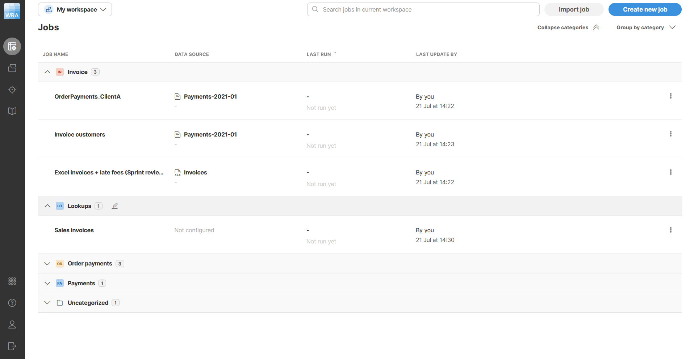
*Figure 78. Jobs page showing jobs and their history.*

To learn more about various statuses and how to work with reject files, see the [Running jobs in Wrangler](transforming-data.md#running-jobs-in-wrangler) section below.

The jobs page also allows you to quickly see who last modified each job. This is most useful when working in shared workspace where other users may have made changes to the job.

##### Creating your job

To create a transformation, click on the **Create new job** button on the **Jobs** page or **Use in a new job** button in the [**Data Catalog**](data-catalog.md) or [**Sources**](data-sources-data-targets.md#sources).

When using the **Create new job** button, you’ll first have to **pick your data source**. You can either pick an existing data source that you have already added to **Sources**, or you can drop a new file at the top of your screen.

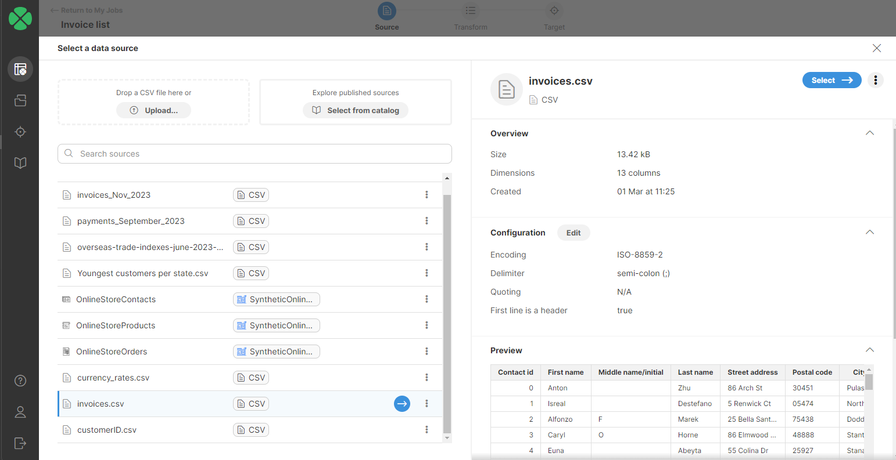
*Figure 79. Selecting a data source when creating a new job*

Regardless of how you create your data source, Wrangler will show you preview of the data, and you’ll be able to continue to create your transformation by pressing the **Select** button in the top-right corner.

##### Duplicate job

To create a copy of an existing job use the **Duplicate** job action, which is available under the **⋮** menu on the right side of each job on the **Jobs** page. The duplicated job is created with the same source, transformation steps, and target configuration as the original job. The new job is added right above the original job.

##### Job Export and Import

To share jobs between users, jobs can be exported and imported. To export a job, use the **Export** job action, which is available under the **⋮** menu on the right side of each job on the **Jobs** page.

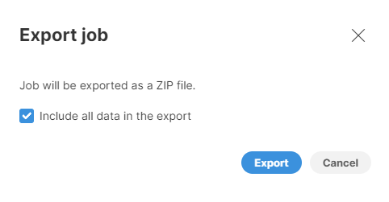
*Figure 80. Job export dialog.*

You can optionally select to include the data source and lookup files (this option applies to CSV file sources only). The export will generate a single ZIP file.

To import a job use the **Import job** button in the top-right corner of the **Jobs** page. Drag and drop or upload a job ZIP file and optionally select if you want to overwrite the job if it already exists. The imported job will be added to the bottom of the job list.

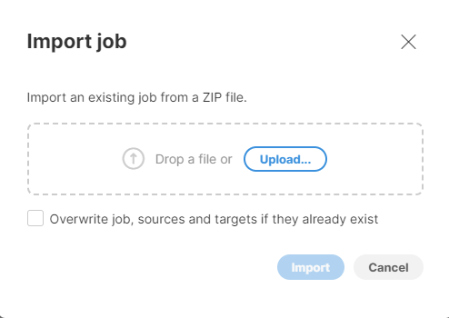
*Figure 81. Job import dialog.*

##### Copying jobs

Jobs can be copied to another workspace using **Copy** commands that are available in the **⋮** menu for each job. This functionality is most commonly used when collaboration between multiple users is needed. To read more about that, please see [Collaborating with other users](wrangler-workspaces.md#collaborating-with-other-users) section.

##### Test run

The **Test run** option is available when your job writes data into a [data target connector](data-sources-data-targets.md#data-target-connectors). Use this option to perform a trial run to see how many records would be written to the target interface and how many would be rejected. If your target is configured to generate a reject file, you can also download the reject file to review further reject details. For more information on reject files, see [Job run details](transforming-data.md#job-run-details). Note that only values from mapped columns are included in the number of rejected records and in the related reject file. For more information on target mapping, refer to the [Target mapping](data-sources-data-targets.md#target-mapping) section.

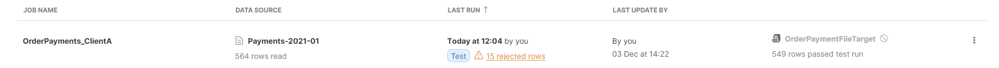

#### Working with transformations

When working with data in Wrangler you will be creating jobs that define transformations to apply to your data. Data transformations are edited in an interactive way in **transformation editor** screen which shows you large preview of your data and allows you to quickly add, modify or remove transformation steps. Each step defines an operation with your data set - for example "add column", "sort data", "calculate formula" and so on.

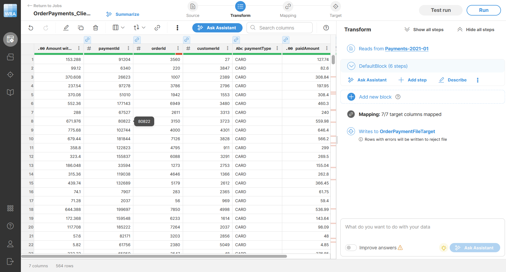
*Figure 82. Transformation editor screen.*

Transformation editor screen consists of several parts that allow you navigate and work with your data:

- **Toolbar** with actions that change depending on the selected column and other context. Toolbar allows quick access to transformation steps you can apply to your data.
- **Data preview** is the largest part of the screen. It shows you what your data looks like after each step. The preview will change dynamically depending on the steps you add to your transformation. The preview table has a header which provides useful information about your data:
  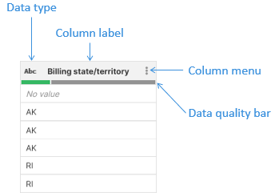
- **Job overview diagram** at the top of the screen. It provides quick overview of what your job looks like. Clicking on **Source** or **Target** icons allows you to change settings of your data source or your data target.
  
- **Steps sidebar** shows you the steps you’ve added to your transformation so far. Clicking on different steps in the sidebar allows you to move to different part of your transformation and review what your data looks like after given transformation step.
  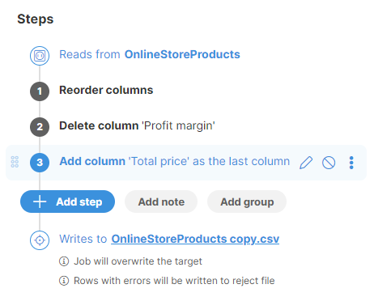

#### Data quality bar

The **Data quality bar** is displayed in the data header preview right under the technical column name. To display it, hover over a column name. It shows you how many values in the sample are valid, invalid or empty. It can help you quickly estimate quality of your data.

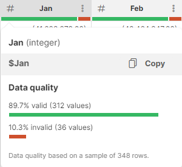

#### Using Steps sidebar

**Steps sidebar** shows you the operations that are applied to your data starting with the first step at the top going down towards steps with higher number.

Selecting a step in the sidebar will update data preview to show the data as it looks like after the selected step is performed. This way, you can go to different time in your transformation simply by selecting different steps in the sidebar.

You can add steps to your job in few different ways - by selecting them from a **column menu**, from the **toolbar**, or by clicking the **Add step** button in the **Steps sidebar**.

Both **context menu** and the **toolbar** react to currently selected column and may change the steps that you see there. The step list displayed when you click on **Add step** button will show all steps and will allow you to search based on a step name or its description so it is the best option if you are not sure which step to use.

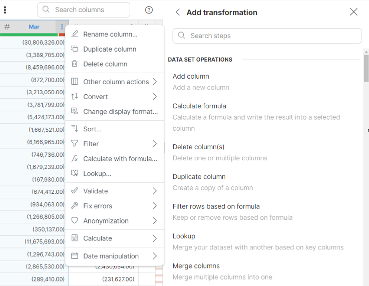

You can add steps to your job in few different ways - by selecting them for column’s **context menu** or by clicking **Add step** button in the **Steps sidebar**.

For example, renaming a column can be added in following ways that will all lead to the same result:

1. Right-click on a column (or open the menu by clicking on the three dots in column header) and select **Column actions > Rename column** step from the context menu.
2. Click on the column in data preview to select it and then on **toolbar** select **Column actions** (3rd icon) **> Rename column**.
3. Click on the **Add step** button in the **Steps sidebar** and find the **Rename column** step in the list of available steps. You can use search at the top to search steps based on their name or description.

Once a step is added, you will immediately see your data change and the preview will show what your data looks like after the transformation step is applied. You can go to previous steps simply by selecting them from the step list in the sidebar.

Wrangler supports many different types of steps that allow you to manipulate your data. For a complete list, please refer to [steps reference](wrangler-steps-list.md).

Besides steps you can also **add notes** that do not apply any transformation to your data but can be used to add explanations to the list of steps to help anyone reading the transformation to understand it better.

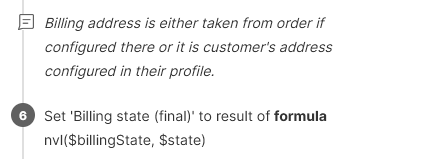

##### Reorder steps

You can reorder a step, note or [group](transforming-data.md#organize-steps-with-groups) by drag and dropping it. You can also move steps within a group or drag them outside of the group for further organization. To revert the changes, use the **Undo** button in the left upper corner.

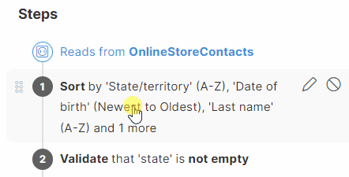
> [!NOTE]
> Reordering of steps might result in invalid step configuration. Consider the sequence of the steps and step dependencies. Some steps might need to be adjusted after moving them into a different position.

In the example below one step renames a column to "Date1", and the second step adds a new column after it. If these two steps are switched, the first step fails because the column referenced in it is no longer valid. The step needs to be updated and the reference corrected.

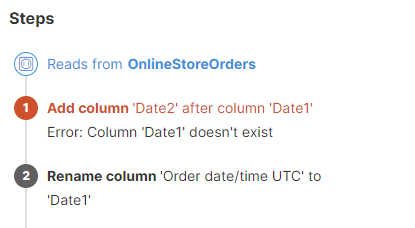

##### Organize steps with groups

You can enhance your transformation workflow by organizing steps into **groups**.

- You can drag and drop existing steps into a group or directly add new ones within it.
- Steps within a group execute sequentially, similar to ungrouped steps. For a cleaner view, collapse groups by clicking the Up arrow next to the group name.
- To quickly remove steps from a group, click on the three-dot menu on the right and select *Ungroup*. This removes the group and all steps are moved back to the main step outline.
- You can set a single condition for the entire group, affecting all the steps it contains. This streamlines your workflow by managing step execution collectively. To learn more about enabling and using group conditions, see [Enabling group conditions.](step-and-group-conditions.md#enabling-group-conditions)
> [!NOTE]
> When a group is deleted, all assigned steps are removed as well. If you want to keep all assigned steps, use the **Ungroup** feature.

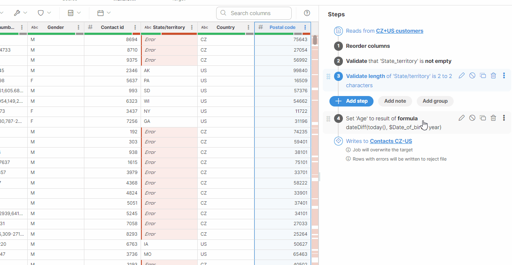

##### Step options

Each step offers multiple options that are shown next to it when you hover your mouse over the step or when the step is selected:

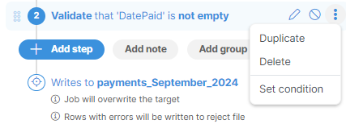
*Figure 83. Contracted Steps options*

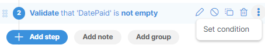
*Figure 84. Steps options on high resolution screens or when the Steps panel width is adjusted*

- **Edit a step** (pencil icon) will open a step editor in the sidebar. Layout of the editor depends on the step you selected.
- **Disable a step** (stop sign icon) allows you to disable the step so that it no longer applies to your data. Note that disabling a step may invalidate the rest of your transformation - for example if you disable a step that adds a column which is used later in the transformation. Disabled step shows in gray like this:
  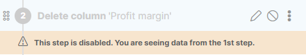
- **Duplicate a step** (copy icon) creates a copy of the step and places it right under the original step. Disabled steps can be duplicated as well.
- **Delete a step** (trash can icon) allows you to delete the step from the list of steps. Just like when disabling a step, deleting a step in the middle of the transformation can make the rest of the transformation invalid if it depends on the step result in any way.
- **Set condition** (option is available in the three-dot menu) allows you to set step conditions. For more information, see [Step and group conditions.](step-and-group-conditions.md)

#### Data types in Wrangler

Each column in Wrangler has its data type that defines how the data in that column is stored and what kind of operations can be applied to it. Data types are visible in the header of data preview:


*Figure 85. Transformation editor screen showing columns of different types.*

Wrangler supports 5 data types: **integer**, **decimal**, **string**, **date** and **boolean**. Conversions between different data types can be done using [Data conversion steps](wrangler-conversion-steps.md).

##### Integer data type

Integer columns can store whole numbers. Smallest integer value is -9223372036854775808 while the largest integer number is 9223372036854775807 (i.e., Wrangler’s integers use 64 bits and correspond to CTL `long` data type).

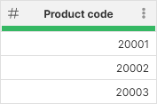

##### Decimal data type

Decimal columns store decimal numbers with fixed precision of 32.10 - i.e., they can have 32 significant digits with 10 of those digits after a decimal point. The smallest decimal value is -9999999999999999999999.9999999999 and the largest value is 9999999999999999999999.9999999999.

You can store up to 10 decimal places in decimal columns. Decimal places after 10th decimal digit will be ignored - i.e. writing 1.1234567890555 will result in 1.123456789.

Decimal in Wrangler corresponds to CTL type `decimal` with length set to 32 and scale set to 10.

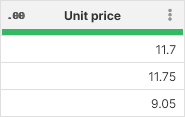

##### Date data type

Date columns in Wrangler store both date and time - there are no separate types to store just the date or just the time. The dates are stored with millisecond precision and you can use [date formatting options](transforming-data.md#date-formatting) to configure what the dates look like.

Date columns can store any date between (approximately) 290 million years ago to 290 million years in the future.

When entering dates in formulas or in target mapping, dates need to be entered in a specific format. See [Working with dates](wrangler-faq.md#how-do-date-values-work) for more information.

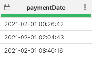

##### String data type

String columns represent text data in Wrangler. They can store text in any language (UTF-16 is used to store the data). You can store strings up to 2.1 billion characters long (less for complex languages like Chinese or Japanese).

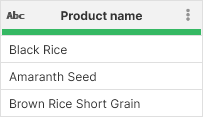

Data containing multi-line strings will be displayed with a preview of the first line followed by ellipses (…​). To view the full content, simply hover your cursor over the value.

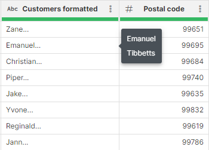
*Figure 86. Example of a multi-line string*

##### Boolean data type

Boolean columns store results of logical expressions and can store a "yes" or "no" value (shown as `true` or `false`).

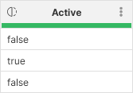

##### Empty values

Besides storing values, each column in Wrangler can also store empty value (sometimes called **null** values). Empty values are shown as **No value** in the data preview:


*Figure 87. Sample data preview showing display of empty values.*

Note the *String column* which shows two different kinds of empty value - a `null` (shown as *No value*) and empty string (shown as cell with no text inside it).

Empty values must be handled separately if you’d like to perform operations on them. Steps in Wrangler will usually ignore empty values but in some cases may return errors. See documentation for each step to see how it handles empty values.

#### Formatting your data

When data preview is displayed in Wrangler, each column can have its own display format that defines how the data is shown. Depending on the source, initial format of the column is either provided by the source (in case the data comes from a connector) or is detected by Wrangler (in case of CSV files).

The formatting you select for a column will affect how your data is written to the output file. For CSV files, the output will match the formatting exactly. For Excel data target, the formatting will be configured on given column in the spreadsheet so the format will be the same as well even though the actual data written may have greater precision. See more details in [Excel target section](data-sources-data-targets.md#formatting-of-excel-files).

The formatting options are accessible by selecting **Change display format** from the column context menu. Note that this option is not available for string and boolean columns - it only applies to date, integer and decimal columns.

##### Integer formatting

Integer columns offer the following options for formatting:

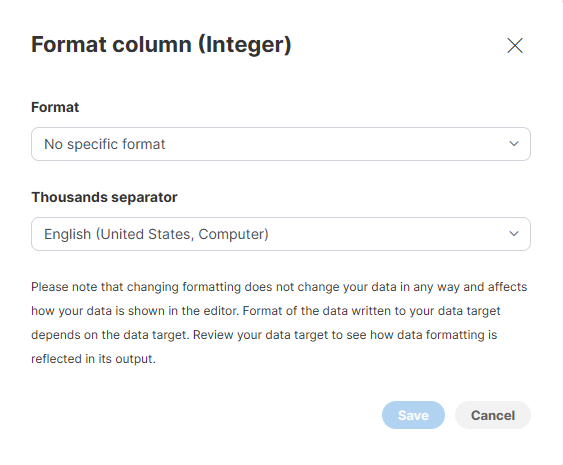

**Format** defines the pattern that tells the formatter how many digits and how to write them.

**Thousands separator** allows you to select character to use between groups when the pattern specifies a format that groups digits (e.g., it allows you to configure whether to write larger numbers as "1 234" or "1,234").

Pattern uses a set of special characters that are interpreted by the formatter:

| Character | Meaning |
| --- | --- |
| `0` | A digit. Leading zero is written out. |
| `#` | A digit. Leading zero is omitted. |
| `,` (comma) | Grouping separator |
| `-` (dash, minus) | Minus sign |

Examples: consider numbers -1234 and 1234 and the following patterns with *English (United states)* setting for **Thousands separator** (i.e., a comma is used as separator character):

| Pattern | Output for 1234 | Output for -1234 |
| --- | --- | --- |
| (no specific format) | 1234 | -1234 |
| `#,###` | 1,234 | -1,234 |
| `000,000` | 001,234 | -001,234 |
| `$###,##0` | $1,234 | -$1,234 |
| `$###,##0;($###,##0)` | $1,234 | ($1,234) |

For more information about number formatting options see [Numeric formats](../developer/metadata-records-and-fields.md#numeric-format).

##### Decimal formatting

Decimal columns offer following formatting options:

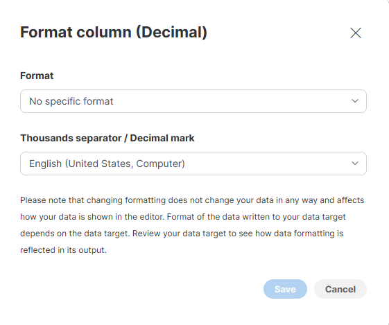

**Format** defines the pattern that tells the formatter how many digits and how to write them. **Thousands separator / Decimal mark** parameter allows you to select character to use between groups and as a decimal separator.

Pattern uses a set of special characters that are interpreted by the formatter:

| Character | Meaning |
| --- | --- |
| `0` | A digit. Leading zero before decimal point or trailing zero after decimal point is written out. |
| `#` | A digit. Leading zero before decimal point or trailing zero after decimal point is omitted. |
| `.` (period) | Decimal separator. |
| `,` (comma) | Grouping separator |
| `-` (dash, minus) | Minus sign |

Examples: let’s consider two examples: numbers 1234.05 and -1234.05 with language set to *English (United states)*:

| Pattern | Output for 1234.05 | Output for -1234.05 |
| --- | --- | --- |
| (no specific pattern) | 1234.05 | 1234.05 |
| `#.#` | 1234 | -1234 |
| `#.###` | 1234.05 | -1234.05 |
| `#.000` | 1234.050 | -1234.050 |
| `###,##0.00` | 1,243.05 | -1,234.05 |
| `$####,##0.00;($####,##0.00)` | $1,234.05 | ($1,234.05) |

For more information about number formatting options see [Numeric formats](../developer/metadata-records-and-fields.md#numeric-format).

##### Date formatting

Date columns provide three parameters you can configure:

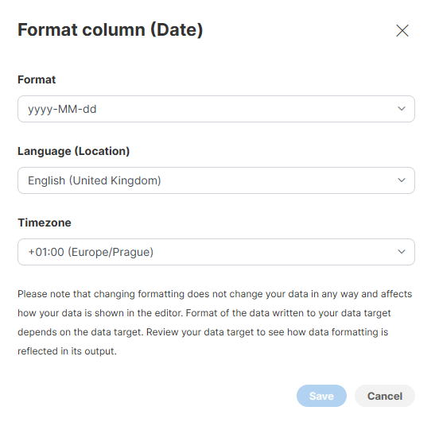

**Format** allows you to configure pattern that can be used to format date and time elements, **Language** allows you to select language and **Timezone** provides options to configure the timezone in which the dates will be interpreted.

Many different special characters are allowed in the formatting pattern. Following table provides a summary of the most common ones:

| Pattern character | Meaning |
| --- | --- |
| `y` | year |
| `M` | month, value from 1 to 12 |
| `d` | day, value from 1 to 31 |
| `H` | hour (24-hour format), value from 0 to 23 |
| `h` | hour (12-hour format), value from 1 to 12 |
| `m` | minute, value from 0 to 59 |
| `s` (lower case) | second, value from 0 to 59 |
| `S` (upper case) | millisecond, value from 0 to 999 |
| `a` | AM/PM marker |

Using a special character multiple times in a row (like `MM`) will left pad the numeric values with zero. For date elements that have names (like months), using three or more characters will spell out the whole value in selected language (e.g., for February and US English locale, `MMM` will produce value "Feb" while `MMMM` will produce "February").

For more information about number formatting options, see [Date and time formats](../developer/metadata-records-and-fields.md#date-and-time-format).

Examples: let’s imagine date/time value of **27th February 2023, 16:35:50.456**:

| Pattern | Output |
| --- | --- |
| `yyyy-MM-dd` | 2023-02-27 |
| `M/d/yyyy` | 2/27/2023 |
| `MMM d, yyyy` | Feb 27, 2023  (*English (United States)* language) |
| `MMM d, yyyy` | févr. 27, 2023  (*French (France)* language) |
| `HH:mm:ss` | 16:35:50 |
| `hh:mm:ss a` | 04:35:50 PM |
| `yyyy-MM-dd HH:mm:ss` | 2023-02-27 16:35:50 |
| `yyyy-MM-dd hh:mm:ss a` | 2023-02-27 04:35:50 PM |
| `yyyy-MM-dd HH:mm:ss.SSS` | 2023-02-27 16:35:50.456 |
| `yyyy-MM-dd’T’HH:mm:ss.SSSXXX` | 2023-02-27T16:35:50.456+01:00 *(English (United States)* language, +1:00 time zone) |

For more information about possible patterns and formatting options see full documentation in [Date and time formats](../developer/metadata-records-and-fields.md#date-and-time-format).

#### Using formulas

**CloverDX Wrangler** offers powerful formula functionality to manipulate and analyze your data. Formulas can be be used in the following places:

**Transformation steps:**

The following transformation steps can be used to perform a wide range of data manipulation tasks through the use of formulas.

- [**Calculate formula**](wrangler-step-formula.md): This step allows you to perform calculations involving existing columns and constants. You can leverage various built-in functions for mathematical operations, string manipulation, date calculations, and more.
- [**Filter rows based on formula**](wrangler-step-filter-with-formula.md): This step enables you to filter your data set by defining a formula. Rows where the formula evaluates to `true` are retained, while others are excluded. This is useful for isolating specific data subsets based on conditions.
- [**Replace errors**](wrangler-step-replace-errors.md): This step lets you replace erroneous values in a column with a user-defined value or the result of a formula. You can use conditional logic within the formula to replace errors selectively based on specific criteria.
- [**Validate with formula**](wrangler-step-validate-with-formula.md): This step allows you to define a formula that validates the data in a specific column. If the formula evaluates to `false` for any row, an error message is generated, indicating a data quality issue.

**Step and group conditions**

Formulas are also used to add conditions to your data transformations. For more information, see [Step and group conditions.](step-and-group-conditions.md)

##### Referencing data set columns in formulas

You’ll often need to reference various columns from your data set in your formulas. To refer to a column, use its **technical name**, an identifier (unique name) starting with a dollar sign ($).

**Technical column names** cannot contain special characters like spaces, commas, parentheses and so on. Wrangler creates them for you from column names by removing those characters and replacing them with underscore. Technical column names are case-sensitive - a column called `$AMOUNT` is different from `$amount`.

If you type a wrong column name (a name that does not exist in your data set), you’ll get an error like this:

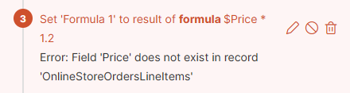
*Figure 88. Incorrect technical name in Formula editor*

You can easily find and copy the technical name of a column by hovering your mouse over the column header in the data preview and clicking on **Copy**. Alternatively, you can take advantage of the [autocomplete feature](transforming-data.md#autocomplete-feature-in-formula-editor) to quickly display the list of all available technical names or formulas.


*Figure 89. How to find and copy a technical name*

##### Autocomplete feature in Formula editor

Take advantage of the autocomplete feature in Formula editor to help you quickly find the desired column names or functions:

- As you type the $ sign, a list of all existing data set preview columns appears for your selection.
- While writing formulas, autocomplete suggests available functions as you type. By selecting functions from the autocomplete hints, functions are inserted with their required parameters to provide a clear view of what needs to be entered.
- You can also display a list of all available functions and technical column names using the **CTRL + Space** shortcut.


##### Using AI to write your formulas

**Clover Assistant** in Wrangler allows you to use AI in formula editors to help you create, refine, and correct formulas more easily. This functionality is available in formula-based editors in [Calculate formula](wrangler-step-formula.md), [Filter rows based on formula](wrangler-step-filter-with-formula.md), and in formula rules in the [Mapping editor](data-sources-data-targets.md#target-mapping).

###### Clover Assistant

You can use Clover Assistant to help write or improve a formula by describing the result you want. The Assistant is displayed directly in the sidebar, so you can work with the formula and the Assistant at the same time.

Suggested formulas in the conversation are clickable. When selected, a suggestion replaces the current formula in the editor. The formula remains fully editable after the suggestion is applied. Dynamic preview can then help you easily see the results of your formula and verify that it produces the expected results.

If you are editing an existing formula, the editor also provides a **Revert** button, which restores the original saved formula.

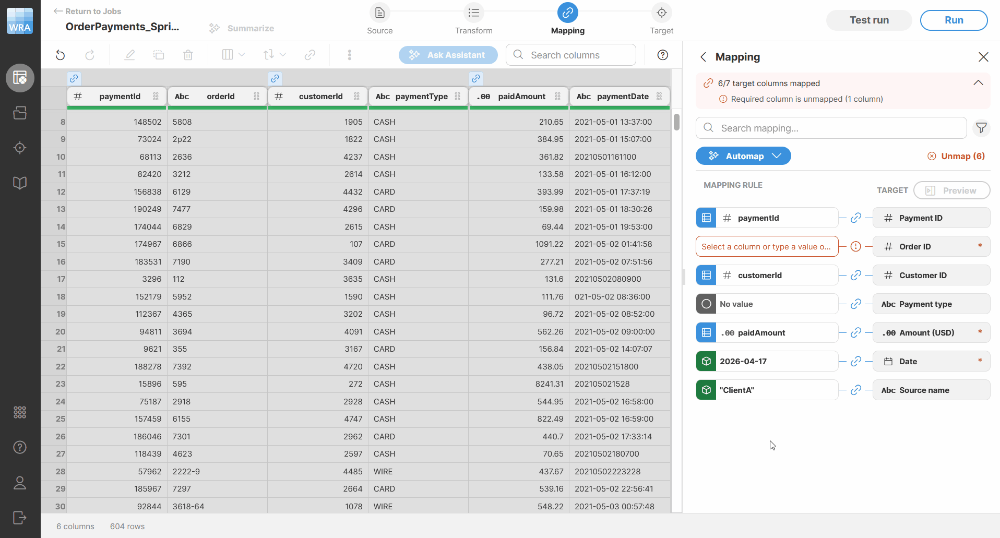
*Figure 90. How AI writes a suggested formula.*

###### Using Improve answers

Clover Assistant can work without using your data, but some requests may benefit from access to data values so the Assistant can provide more accurate suggestions or fixes.

The **Improve answers** option allows Clover Assistant to use relevant data from the current context to improve the quality of its response. When this option is enabled and a request requires access to data, Wrangler uses the relevant data to help Clover Assistant provide a better answer.

Use data sharing only when your data can be shared according to your company’s policies.

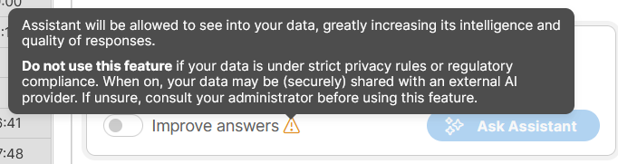
*Figure 91. Improve answers button.*

###### Use Clover AI to fix your formulas

If a formula contains a syntax error, Wrangler displays the error message in the bottom area of the editor which also shows a **Fix with AI** button next to the error message.

Click **Fix with AI** to invoke Clover Assistant and try to automatically correct the syntax of your formula. If the correction is successful, the formula in the editor is replaced with the corrected version and the data preview is refreshed automatically.

If Clover Assistant cannot fix the formula for you, it shows a notification and leaves the formula unchanged.

###### Output errors

If a formula produces an error in the preview output, Wrangler displays the error message in the bottom area of the editor after the preview is generated. The formula editor also shows a **Fix with AI** button next to the error message.

To help resolve this type of error, Clover Assistant may require access to your data. In that case, Wrangler asks for confirmation before sharing the data. You can choose **Share this time only** to allow data sharing only for the current request.

After the request is sent, Clover Assistant suggests an updated formula in the chat. You can then review the suggestion and apply it to the editor.

##### Quick example

To add 20% VAT to a price column, you first check the technical name of the column by hovering mouse over the *Price (no VAT)* column (technical name is `$Price_no_VAT`) and then use the [Calculate formula step](wrangler-step-formula.md) with the following formula:

```
$Price_no_VAT * 1.2
```

The result might look like this:

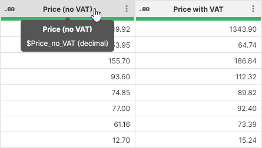

##### Mathematical operators

You can use several operators when working with your formulas to compute values or to work with text data:

| Operator | Description |
| --- | --- |
| `+` | Add two numbers, concatenate string columns |
| `-` | Subtraction |
| `*` | Multiplication |
| `/` | Division |
| `%` | Modulus |

Operator priorities work as expected - multiplication, division and division remainder have higher priority than addition or subtraction. You can also use parentheses to group your operations.

Examples:

- Convert from one currency to another while also applying a fixed conversion fee: `$originalAmount * $exchangeRate + $fixedFee`
- Add VAT to price with variable VAT in percent: `$price * (1.0 + $vatPercent / 100.0)`

The operators all work on all numeric types - integers as well as decimals. The only exception is the `+` operator which also works on string and can be used to concatenate strings like this:

```
$firstName + " " + $lastName
```

Note that it is also possible to concatenate string with another type (e.g., `"VAT is " + $vatPercent`) but you need to be careful about data formatting. Default formatting will be applied when converting to string. For greater control of the formatting you can use [CTL string conversion functions](../developer/conversion-functions-ctl2.md#conversion-functions) like `date2str` and so on (the functions you’d most likely use all end with `2str` suffix).

##### Comparison operators

If you’d like to compare various values when writing conditions in [Filter rows based on formula step](wrangler-step-filter-with-formula.md), you can use the following operators:

| Operator | Description |
| --- | --- |
| `<` | Less than |
| `>` | Greater than |
| `<=` or `=<` | Less than or equal to |
| `>=` or `=>` | Greater than or equal to |
| `==` | Equal to |
| `!=` or `<>` | Does not equal to |
| `~=` | Matches regular expression |
| `?=` | Contains regular expression |

These operators can be applied to any data type but both sides of the comparison must be of similar or same data type - i.e., you can compare integer and decimal but you cannot directly compare integer and string.

The operators always return boolean value so they can be used directly as a condition.

Note that the last two operators can only be applied to string values.

Examples:

- Test if payment type is "CREDIT": `$paymentType == "CREDIT"`
- Test if a person is at least 18 years old: `$age >= 18`
- Test if a date occurred before 1st March 2023: `$dateValue < 2023-03-01`
- Test if string value is a number followed by a dash and a single letter (e.g. "12345-A" but not "12345-AB"): `$value ~= "[0-9]+-[A-Z]"`

Most common use for these operators is in the [Filter rows based on formula step](wrangler-step-filter-with-formula.md) but they can also be used in [Calculate formula step](wrangler-step-formula.md).

##### Logical operators

Logical operators allow you to connect multiple conditions together to create more complex conditions. They can only be applied to boolean values and will produce another boolean value.

| Operator | Alternative form |
| --- | --- |
| `&&` | `AND` |
| `\|\|` | `OR` |
| `!` | `NOT` |

Examples:

- Test if a row represents an oversized package - a package where one of the dimensions (width, height, length) is larger than 100: `$width > 100 || $height > 100 || $length > 100`
- Test if contact has a phone number (either work or cell phone) and an email: `($workPhone != null || $cellPhone != null) && $email != null`

These operators are most commonly used in [Filter rows based on formula step](wrangler-step-filter-with-formula.md) where they are useful when defining more complex conditions.

#### Error handling in Wrangler

There are several types of errors you can encounter when working with data in Wrangler - incorrectly formatted data, values rejected by validation, errors caused by incorrect step configuration, runtime errors and so on. In all cases, Wrangler tries to help you by allowing you to continue with your job as far as possible so that you can try to fix the errors when it makes sense.

Most of your errors will be displayed right in the data preview when you are designing your job. The errors are shown as red cells, hovering over them will show you a tooltip with additional information about the error.


The errors are also shown in row number column. This is useful especially if an error happens to be outside of your current view if you have data set with many columns.

Similarly, the errors are also shown as red markers in the background of the scrollbar in the data preview. This can be quickly used to see distribution of errors within your sample.

Data Quality bar in the column header also reflects the quality of your data - it will show how many records from your sample are valid (green), empty (grey) or in error (red):

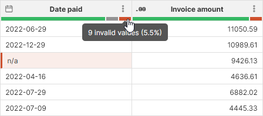

##### Errors in data

Your data may not always match the expected format. For example, you may get text in numeric column, wrongly formatted dates etc. Wrangler can detect errors like these and will allow you to work with the data even if it does not match the expected data type or format. Additionally, you can use [Validation steps](wrangler-validation-steps.md) to ensure that your data matches your expectations and add customized error messages to data that does not meet those expectations.

If a row which contains any kind of an error gets through the transformation all the way to the data target, it will be **rejected**. Rejected records are collected in a file that allows you to inspect error details even in large data sets. See below for additional details about reject file format.

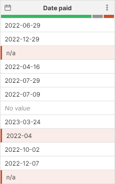
*Figure 92. Invalid data shows up as red cells in the data preview.*

For data errors you can see that the value read from source is retained even if it does not fit into expected format - for example, the `Date paid` column in the above screenshot contains values like `n/a` or incorrectly formatted dates. Wrangler allows you to access the original (invalid) value in variety of steps so that you can attempt to fix the issue in your transformation.

To learn how to fix errors in data, read more in [Fixing errors](transforming-data.md#fixing-errors) and [Fixing data errors](transforming-data.md#fixing-data-errors) sections below.

##### Validation errors

Some values might be invalid even if they are of correct type and have correct format. For example, age of a person cannot be negative number, invoice amount cannot be empty and so on. Wrangler offers several [Validation steps](wrangler-validation-steps.md) that allow you to validate your your data and flag values that do not match the requirements for given column.

All values that are flagged as invalid - validation errors - are shown just like any other error in Wrangler with red cells in data preview.

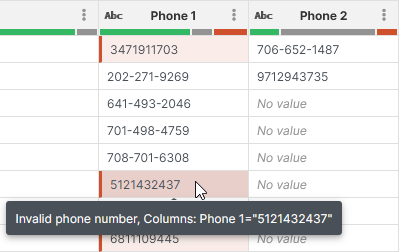
*Figure 93. Validation errors reported by validation steps - Validate phone number step in this example.*

##### Errors occurring during step execution

These errors happen when you run a step and it encounters a value it cannot handle. For example, this can happen if you try to apply mathematical step to an empty value, if you divide by zero, or use invalid length in string function etc.

Just as before, Wrangler will show the errors in the data preview and will allow you to work with all other records even if some data is in error.

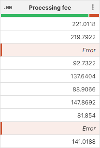
*Figure 94. Errors from step execution in data preview.*

Notice that these errors do not show any value in the cell since the calculation of the new value could not finish. Instead, they are shown as **Error**. To fix this type of error, you usually need to find the step that causes it and either fix the data before that step so that the steps does not fail anymore or modify the step settings.

To learn how to fix errors raised during step execution, read more in [Fixing errors](transforming-data.md#fixing-errors) and [Fixing step execution errors](transforming-data.md#fixing-step-execution-errors) sections below.

##### Step configuration errors

These errors happen during design time and are detected by Wrangler as you work on your transformation. These errors generally mean that the step cannot be executed at all and Wrangler transformation cannot progress past this step.

For example, the following screenshot shows a step configured to use a column that is no longer part of the data set:

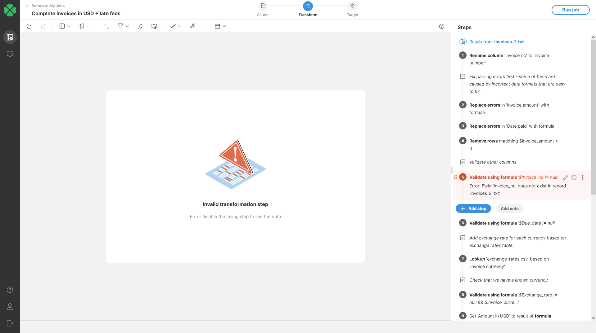
*Figure 95. Step configuration error that prevent the step from running.*

To learn how to fix these errors, read more in [Fixing step configuration errors](transforming-data.md#fixing-step-configuration-errors) section.

##### Errors and output

Since Wrangler allows you to continue working with your data even if there are errors in your data, it may happen that some rows that contain errors can get all the way to the end of the transformation into the data target.

Since data targets may not be able to write the malformed or erroneous data into their output, they allow you to configure what to do with rows that have errors. You can pick from two options:

- **Write rows with errors to reject file** (default value): if selected, all rows that contain errors are written to a **reject file**. Reject file allows you to see the rejected records as well as information about errors that caused those records to be rejected. You can then see number of records that were rejected on **Jobs** page. To quickly see that your target has been configured to produce a reject file by looking at the target in the step list:
  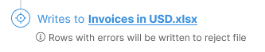
- **Fail job on the first invalid cell**: when an error is encountered when writing the file, the job is stopped and the error will be reported on **Jobs** page. This is shown in the step list like this:
  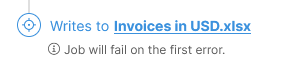

Both of the options above are available in the target configuration dialog. Read more about this in [CSV data target configuration](data-sources-data-targets.md#csv-data-target-configuration) and [Excel data target configuration](data-sources-data-targets.md#excel-data-target-configuration).

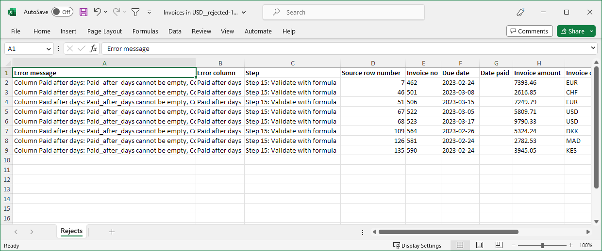
*Figure 96. Sample reject file in Microsoft Excel format showing error message as well as rejected records.*

#### Fixing errors

Wrangler offers several steps that can help you fix various errors:

- [Clear error cells step](wrangler-step-clear-error-cells.md) to remove data from cells with errors.
- [Replace errors step](wrangler-step-replace-errors.md) to replace errors with constant value or with result of a formula.
- [Calculate formula step](wrangler-step-formula.md) to calculate or fix values before they cause issues in the transformation.

In some cases you might want to remove rows which contain errors from your process. This can be done either at the end of the process by the data target as described above or by using filtering steps:

- [Remove rows with errors step](wrangler-step-remove-rows-with-errors.md)
- [Filter rows based on formula step](wrangler-step-filter-with-formula.md)

##### Fixing data errors

These errors can often be prevented by changing the column type to a more permissive type (e.g., integer to decimal etc.).

If changing type is not viable, you can attempt to parse or interpret the original value in some other way to recover from the error. This is possible since Wrangler keeps the original invalid value and allows you to access that value in error fixing steps like [Replace errors step](wrangler-step-replace-errors.md).

For example, common error is that you receive dates with incorrect format like in the `Date paid` column on the following screenshot:


*Figure 97. Original data set with errors in Date paid column.*

To fix these, you can use [Replace errors step](wrangler-step-replace-errors.md) and parse the incorrectly formatted date with different format by using a formula `str2date($Date_paid, "d.M.yyyy")`. This will result in the following output where the incorrectly formatted dates are fixed:


*Figure 98. Data set after incorrectly formatted dates have been fixed with Replace errors step.*

##### Fixing step execution errors

One of the most common ways of getting step execution errors is to use [Calculate formula step](wrangler-step-formula.md) and forgetting to deal with an edge case in the data. Typically this means not handling *No value* cells in your formulas or values that are outside of the range of valid inputs for your formula.

For example, math formulas typically do not handle `null` (*No value*). Consider a simple formula like this:

```
$amount * (1 + $vatPercent / 100)
```

This formula applies VAT specified in `$vatPercent` column to amount specified in `$amount` column. If either of those values is `null`, the formula will fail.

To fix this, you can either decide not to run the step at all and return a default value. To do that, you can use `if` function. The following formula tests for `null` values of its inputs and only runs if the inputs are not `null`:

```
if($amount != null AND $vatPercent != null, $amount * (1 + $vatPercent / 100))
```

Alternatively, we may decide that if there is no VAT, we use a default value such as 21% (we are not handling `null` value of `$amount` column in this formula):

```
$amount * (1 + nvl($vatPercent, 21) / 100)
```

Another option for dealing with such errors is to fix the data before it gets to the step that fails.

For example, to get the same effect as the the last formula above, you can use [Replace empty values step](wrangler-step-replace-empty.md) configured to set `$vatPercent` to 21 if it is empty. The computation of the amount with VAT can then remain in its original form since that step will guarantee that there are no `null` values in the `$vatPercent` column.

If the above options are not possible, rows with errors can be removed from the data set by using filtering steps like [Remove rows with errors](wrangler-step-remove-rows-with-errors.md) or [Filter rows based on formula](wrangler-step-filter-with-formula.md).

##### Fixing step configuration errors

These errors must be fixed in the step that is failing. Wrangler will run your job as far as it can and will stop on the first step that failed. For example, consider the following job:


In this job we are trying to sort data based on column that is no longer available in the data set. This can happen for example if your data source is a CSV file and it no longer contains the column you used or if the column has been renamed.

You can see that the Wrangler will try to run the job as far as it can and stops on the invalid step. The only way to fix this is to either disable the step (or even remove it) or update the step settings to use a different column (if the column was renamed in the source data set).

#### Running jobs in Wrangler

There are two ways to run your job from Wrangler: either from the **Jobs** page via the **Run** button on each job, or directly from the transformation editor via the **Run job** button in the top-right corner.

When you run a job, it will read the complete data source (CSV file or a connector-provided data source), so it may take a while if you are processing a large volume of data.

##### Viewing job status

The **Jobs** page will show you the status of your jobs - it shows each job on a single row and displays status of the last run of the job.


*Figure 99. Jobs page showing job statuses.*

Jobs can have one of the following statuses:

| Status | Status icon | Description |
| --- | --- | --- |
| Not run yet |  | Job did not run yet. To run it, you can press the Run button. |
| Running |  | Job is currently running. |
| Completed | 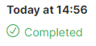 | Job finished successfully and produced an output you can download on **Jobs** page. |
| Completed with rejected records | 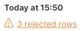 | Job finished successfully but there were rejected rows which are not included in the output. |
| Failed |  | Job failed during execution. Clicking on the job row on **Jobs** table will show you more details about the job failure. No output is available for failed jobs. |
| Stopped | 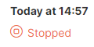 | Job was stopped by user (e.g., by clicking a Stop button) and did not finish. No output is available for aborted jobs. |
| Test run |  | Job was run with the **Test run** option. **Test run** is available when writing data into [**data target connectors**](data-sources-data-targets.md#data-target-connectors). |

After the job finished successfully, you will be able to download its results directly from **Jobs** page by clicking on the **Download result** button. This will download the output file - Excel or CSV - to your computer.

##### Job run details

For jobs that produced reject files or ended in an error, you can view additional details in the **Last run** status dialog. To open the dialog, click on the *rejected rows status message* (orange text) or on the *failed status* (red text) on the **Jobs** page.

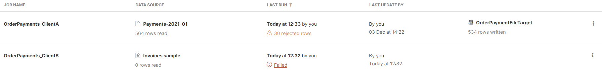
*Figure 100. Jobs table showing two jobs - a failed one and a job that produced a reject file.*

The dialog allows you to download result as well as reject files via **Download result** and **Download reject file** buttons in the left part of the dialog.

In the right half of the dialog, you can see additional details about the errors that occurred during the job run. The overview table supports two different ways of showing th error summary:

- **Per step** groups the errors based on the step which raised those errors. I.e., for each step that produced an error, there will be a single row in this table and it will show number of errors in the reject file that were produced by given step. This view is useful to see which parts of your job may need to be updated to handle invalid data or edge cases in your data.
  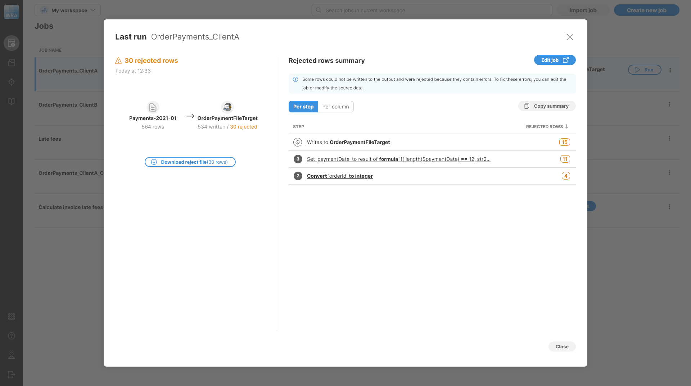
  *Figure 101. Last run detail of a job with reject file showing Per step error summary.*
- **Per column** shows number of errors in each column of the data. This view is useful to see whether given column frequently contains invalid data or not which can help to decide whether to update the job to handle the data in a better way or whether to go to the source system and request data to be fixed there.
  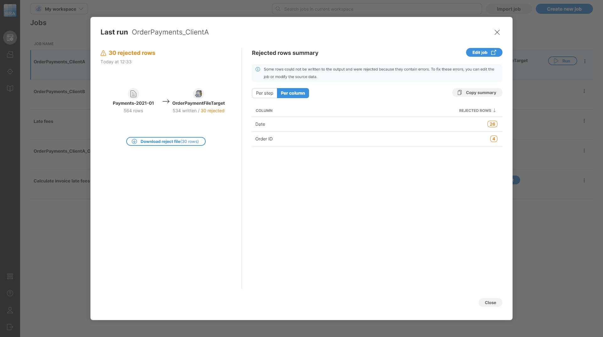
  *Figure 102. Last run detail of a job with reject file showing Per column error summary.*

If the job ended in an error, the dialog will allow you to see additional details about the error:

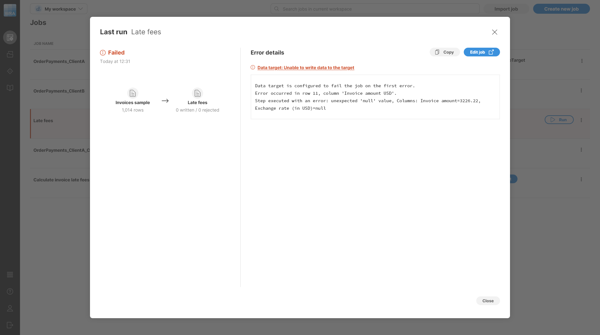
*Figure 103. Last run detail of a failed job.*

#### How does Wrangler expression language differ from CTL?

Wrangler expression language is heavily inspired by CTL but it is not the same. There are several key differences that we’ll describe below.

##### Data types

Selection of data types available to use in Wrangler is more limited than types in CTL and in metadata.

The following table summarizes the types supported in Wrangler columns compared to CTL and metadata column types.

| CTL / metadata type | Corresponding Wrangler column type | Note |
| --- | --- | --- |
| `boolean` | `boolean` |  |
| `byte` | not supported |  |
| `cbyte` | not supported |  |
| `date` | `date` | Same type with same range. |
| `integer` | `integer` | Wrangler `integer` is *larger* than CTL integer - Wrangler uses 64-bit numbers while CTL uses 32-bit numbers. CTL integer stores values from -2147483648 to 2147483647. |
| `long` | `integer` | CTL `long` type corresponds to Wrangler `integer` type - both are 64-bit types. |
| `number` | `decimal` | CTL `number` is a floating-point type that does not store exact values. Its precision and range is much bigger than decimal so not every `number` value can be stored in decimal and the conversion may fail. The largest value number can store is 1.7976931348623157 x 10308, the smallest (in terms of absolute value) value it can store is 4.9406564584124654 x 10-324. Both boundaries exceed the precision and scale available in Wrangler `decimal` type. |
| `decimal` | `decimal` | The types are the same except for precision and scale. Wrangler always uses `decimal(32, 10)` (32 significant digits, 10 are after decimal point). In CTL and metadata it is possible to declare decimal type with different scale and precision. |
| `string` | `string` |  |
| `list` of any type | not supported |  |
| `map` of any type | not supported |  |
| `variant` | not supported |  |

When writing formulas in Wrangler, you can also use CTL types like map, list or variant. However, you cannot declare them (so you cannot create temporary variables). Type conversion rules apply only when interacting with columns. If you use a column reference in a formula, its type will be converted to CTL type. Same applies in reverse - CTL type returned by your expression will be converted to Wrangler column type on write. This conversion may fail if there is no corresponding Wrangler type to map your expression result to.

##### if function

CTL does not have an `if` function but uses an `if`**statement**. They are functionally equivalent with Wrangler syntax being more natural in formulas since it directly returns a value which can be used right away. Both languages have ternary operator which works in the same way.

| Wrangler syntax | Corresponding CTL |
| --- | --- |
| ```ctl if(condition, value_if_true) ``` | ```java if (condition) {     return value_if_true; } ``` |
| ```ctl if(condition, value_if_true, value_if_false) ``` | ```java if (condition) {     return value_if_true; } else {    return value_if_false; } ``` |

##### How to use CTL functions in Wrangler?

You can use CTL functions in Wrangler formulas directly by calling them with their CTL name. When calling CTL functions, be mindful of data types in Wrangler - Wrangler will automatically convert to/from CTL types based on the table and rules mentioned [above](transforming-data.md#data-types).

Note that even though Wrangler does not support variant type, lists or maps as column types, they are available in Wrangler expression language. Therefore, following is a valid formula in Wrangler:

```
in($transactionType, ["CASH", "CARD", "WIRE"])
```

The formula uses `in` function to test whether value of a `$transactionType` column is one of the three values provided as a CTL `string[]` (list of strings) type. The formula will return `true` if the `$transactionType` is one of the three values and `false` otherwise.

#### List of common functions

##### Date functions

List of useful **date** functions for reference (full list of all date functions can be found [here](../developer/date-functions-ctl2.md)):

| Function | Description |
| --- | --- |
| [dateAdd](../developer/date-functions-ctl2.md#dateadd) | adds a number of time units to the specified date and returns a new date |
| [dateDiff](../developer/date-functions-ctl2.md#datediff) | returns the difference of two dates in a specified time unit |
| [extractDate](../developer/date-functions-ctl2.md#extractdate) | extracts year, month, and day from a date |
| [extractTime](../developer/date-functions-ctl2.md#extracttime) | extracts hours, minutes, seconds, and milliseconds from a date |
| [getYear](../developer/date-functions-ctl2.md#getyear) | extracts years from a date |
| [getMonth](../developer/date-functions-ctl2.md#getmonth) | extracts months from a date |
| [getDay](../developer/date-functions-ctl2.md#getday) | extracts days from a date |
| [getHour](../developer/date-functions-ctl2.md#gethour) | extracts hours from a date |
| [getMinute](../developer/date-functions-ctl2.md#getminute) | extracts minutes from a date |
| [getSecond](../developer/date-functions-ctl2.md#getsecond) | extracts seconds from a date |
| [getMillisecond](../developer/date-functions-ctl2.md#getmillisecond) | extracts milliseconds from a date |
| [today](../developer/date-functions-ctl2.md#today) | returns today’s date and time |

##### String functions

List of useful **string (text)** functions (full list of all string functions can be found [here](../developer/string-functions-ctl2.md)):

| Function | Description |
| --- | --- |
| [chop](../developer/string-functions-ctl2.md#chop) | removes specified characters or line feed and carriage return characters |
| [concat](../developer/string-functions-ctl2.md#concat) | concatenates multiple string values |
| [contains](../developer/string-functions-ctl2.md#contains) | returns `true`/`false` values if the specified characters are found |
| [endsWith](../developer/string-functions-ctl2.md#endswith) | returns `true` if the specified characters are found at the end of a string value, otherwise returns `false` |
| [isBlank](../developer/string-functions-ctl2.md#isblank) | returns `true` if input consists of spaces, otherwise returns `false` |
| [isDate](../developer/string-functions-ctl2.md#isdate) | returns `true` if input matches the date pattern, otherwise returns `false` |
| [isDecimal](../developer/string-functions-ctl2.md#isdecimal) | returns `true` if input matches a decimal pattern, otherwise returns `false` |
| [isEmpty](../developer/string-functions-ctl2.md#isempty) | returns `true` if input is empty, otherwise returns `false` |
| [isInteger](../developer/string-functions-ctl2.md#isinteger) | returns `true` if input is an integer, otherwise returns `false` |
| [isNumber](../developer/string-functions-ctl2.md#isnumber) | returns `true` if input is a number, otherwise returns `false` |
| [isUrl](../developer/string-functions-ctl2.md#isurl) | returns `true` if input is an URL, otherwise returns `false` |
| [lowerCase](../developer/string-functions-ctl2.md#lowercase) | converts all characters to lowercase |
| [removeBlankSpace](../developer/string-functions-ctl2.md#removeblankspace) | removes blank spaces |
| [removeDiacritic](../developer/string-functions-ctl2.md#removediacritic) | removes diacritical marks |
| [removeNonAscii](../developer/string-functions-ctl2.md#removenonascii) | removes non-Ascii characters |
| [reverse](../developer/string-functions-ctl2.md#reverse) | returns reverted string |
| [startsWith](../developer/string-functions-ctl2.md#startswith) | returns `true` if the specified characters are found at the end of a string value, otherwise returns `false` |
| [trim](../developer/string-functions-ctl2.md#trim) | takes one string argument and returns another string with leading and trailing white spaces removed |
| [upperCase](../developer/string-functions-ctl2.md#uppercase) | converts all characters to uppercase |

##### Conversion functions

List of useful **conversion** functions (full list of all conversion functions can be found [here](../developer/conversion-functions-ctl2.md)):

| Function | Description |
| --- | --- |
| [bool2num](../developer/conversion-functions-ctl2.md#bool2num) | converts boolean values to number 0 or 1 |
| [date2num](../developer/conversion-functions-ctl2.md#date2num) | returns the number of specified time units from the entered date |
| [date2str](../developer/conversion-functions-ctl2.md#date2str) | converts the input date to the string data type according to the specified pattern, locale and target timeZone |
| [decimal2integer](../developer/conversion-functions-ctl2.md#decimal2integer) | converts a decimal value to an integer |
| [num2bool](../developer/conversion-functions-ctl2.md#num2bool) | converts a number to a boolean value |
| [num2str](../developer/conversion-functions-ctl2.md#num2str) | converts any numeric type to the string decimal representation |
| [str2bool](../developer/conversion-functions-ctl2.md#str2bool) | converts a given string argument to the corresponding boolean value |
| [str2date](../developer/conversion-functions-ctl2.md#str2date) | converts the input to the date data type using the specified pattern, locale and timeZone |
| [str2decimal](../developer/conversion-functions-ctl2.md#str2decimal) | converts a given string argument into a decimal value |
| [str2integer](../developer/conversion-functions-ctl2.md#str2integer) | converts a given string argument to the corresponding integer value, the conversion can be determined by a numeral system, format or locale |
| [toString](../developer/conversion-functions-ctl2.md#tostring) | converts the given argument (integer, decimal or boolean) to its string representation |
