<!-- End user’s guide > Wrangler user guide > Frequently Asked Questions -->

### Frequently Asked Questions

#### How do transformation steps work? Why are they needed?

Instead of manipulating data directly and potentially doing something you might regret in the future, Wrangler records the steps you’re taking and then plays them back on the source data when the job is executed. **Source data is never modified in any way.**

You can always **go back** to **change**, **remove**, **disable**, or **insert steps** in your job to revert or modify the actions you’ve taken in the past.

*Example: We initially deleted 'Profit margin' but later realized we might be needing it.*

*We can remove Step 2 (Delete column 'Profit margin') to bring the column back to our dataset as if we never deleted it in the first place. All subsequent actions will still be applied.*

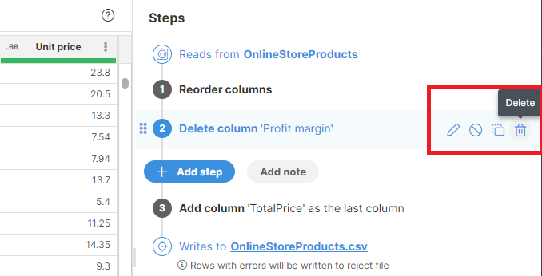

**Tip: Steps are your safeguard against making mistakes. Any decision you’ve made in the past can be reverted or modified.**

**Disable** a step if you don’t want to remove it just yet. Disabled steps won’t have any effect on the data and will stay in the job until you delete them.

See [Using Steps sidebar](transforming-data.md#using-steps-sidebar) for more information.

##### Moving between steps

The preview always shows the data corresponding to the **currently highlighted step**. You can freely move around the steps to see what the data looks like at each point in the sequence. To see the final output, click on the last step.

Example:

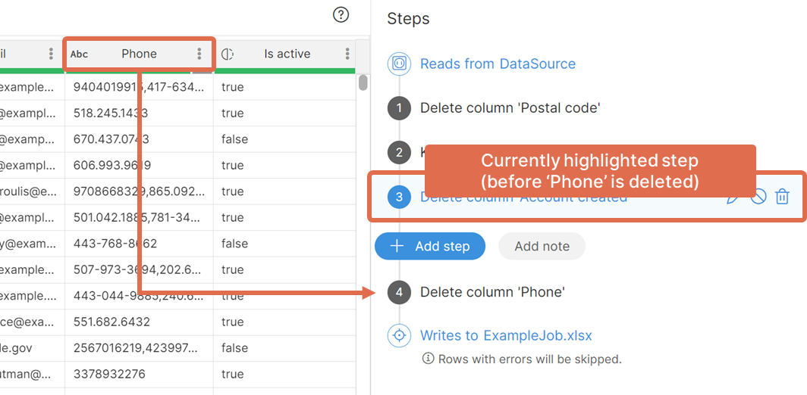

`Phone` is still visible here because step 3 is selected. Clicking on the last step will show a preview without the `Phone` column since it is removed in step 4.

See [Using Steps sidebar](transforming-data.md#using-steps-sidebar) for more information.

#### How to choose data source for your job?

CloverDX Wrangler uses concepts of **data sources** and **data targets** to define where the data comes from and where it is written at the end of the transformation. To learn more about targets and their configuration, see [target file configuration](wrangler-faq.md#how-can-i-configure-where-my-job-output-goes-how-do-i-use-data-targets).

A **data source** is the location from where your data is loaded. All sources that you can work with are listed in the **Data Catalog** and in **Sources** section.

[**Data Catalog**](data-catalog.md) provides an overview of the sources published by your organization - this is where you can find your source systems like CRM, data warehouse, and anything else your organization published.

**Sources** section allows you to see all sources that you’ve created and configured in the past.

Data sources can be created in multiple ways:

- From a CSV or Excel file uploaded to Wrangler in [**Sources**](data-sources-data-targets.md#sources) or when editing the job’s configuration.
- From an existing **data source connector**, **reference data set source**, or **transactional data set** in the [**Data Catalog**](data-catalog.md). Items in the **Data Catalog** are defined and managed by your organization’s IT team or by Data Manager administrators. To add a new source from the [**Data Catalog**](data-catalog.md), click on **Add to Sources**, or to use it in a new job right away, click on **Use in a new job**.

See [data sources](data-sources-data-targets.md#data-sources) for more information.

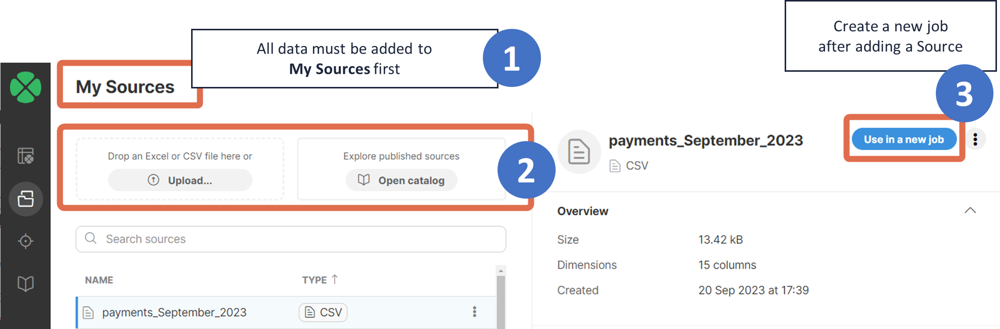

#### How can I combine multiple data sources? (Join? Lookup?)

Each job must have one main source. It can also optionally include any number of additional sources which are used in lookups.

To add ("join") additional lookup sources to your job, follow these steps:

1. Open the **Sources** screen and add the additional source(s) either from the **Data Catalog** or by uploading CSV or Excel files with lookup data.
2. Go back to your job and add the [**Lookup step**](wrangler-step-lookup.md) to the transformation as appropriate. In the lookup configuration pick the data source you created in the previous step.

If you need to add multiple lookups each with a different lookup data source, repeat the above process as many times as necessary.

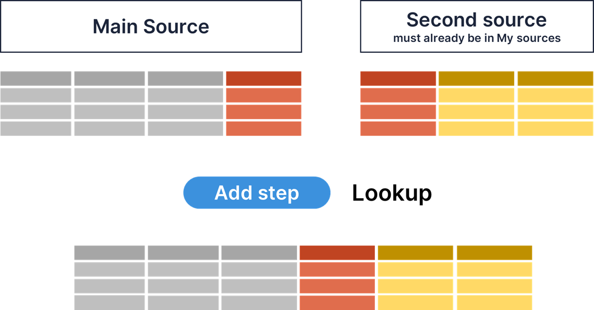
*Figure 126. Lookup step principle.*

##### Lookup configuration

1. **Lookup data source**
   - Pick the lookup (second) source you want to add to your data set (your data set will be joined with the lookup data).
   - It needs to be in **Sources** first, otherwise, it won’t be visible in the dropdown.
2. **Data column**
   - Typically, the "ID" or "key" column in the main source (CustomerID, InvoiceNumber, etc).
3. **Lookup column**
   - The corresponding "ID" or "key column in the lookup source (the other CustomerID, InvoiceNumber, etc).
4. **Columns to add from lookup**
   - Choose which column(s) you want to load from the second source. You will be able to transform them further in subsequent steps in your job if needed.

##### Lookup hints

Things to bear in mind when working with lookups:

- Values added from the **Lookup** step will always be added as new columns. You cannot overwrite existing columns with a **Lookup** step (you can do that in subsequent steps).
- When there are values in your data set for which no matches have been found in the lookup data, the output columns will be left empty (`null`). If you want to populate all such values with a static (default) value, you can use the [**Replace empty values**](wrangler-step-replace-empty.md) step.
- Lookups are case-sensitive, and the data used as keys in the lookup must match exactly with the data in your dataset for the keys to match.
- When the data source used in an existing **Lookup** step is deleted and uploaded again, the step will need to be edited, and the lookup source file selected again.
- The source file should not include duplicate keys. For example, the table below includes currencies and conversion rates, where "EUR" appears twice. If this data is used in a lookup to pull the rates, only the first rate (1.07) for EUR will be used.
> [!NOTE]
> The data preview in Wrangler is limited to 1000 rows. If the lookup file or source file includes more than 1000 rows, it might happen that you will not see any matched data from the lookups when editing the job. Refer to the following [section](wrangler-faq.md#why-cannot-i-see-any-data-why-is-some-data-missing) for more information on how to proceed.

For more information about the **Lookup** step, see [here](wrangler-step-lookup.md).

#### How can I configure where my job output goes? How do I use data targets?

**Data target** defines the location where the data is written to. When a new job is created, a **CSV target file** is automatically generated and assigned as the target. The assigned data target can be changed as needed; for more information on how to update the target in an existing job, refer [here](data-sources-data-targets.md#updating-data-target-in-existing-job).

A target can be:

- A CSV file uploaded to Wrangler on **Targets** screen,
- An Excel file uploaded to Wrangler on **Targets** screen,
- A custom target added to **Targets** from the [**Data Catalog**](data-catalog.md).

To change your data target settings, click on the **Target** button in the overview diagram of your job at the top of the [transformation editor screen](transforming-data.md#working-with-transformations) or click on the  icon which appears when you hover over the **Target step**.


*Figure 127. Job diagram showing main parts of your Wrangler job*

Your currently used target will be automatically selected and its details displayed on the right side. To change the configuration of your target, click on the **Edit** button next to Configuration.

To select a different target, select the desired target from the list, click on the **Select ⟶** button, and confirm your changes.

**CSV and Excel** target files can be downloaded from the **Jobs** page once a job has finished successfully. **Data target connectors** and **reference data set sources** do not generate output files. Instead, they write data directly into the configured target-such as a database or a third-party interface like Hubspot or Xero-in the case of connectors, or into the related data set in the case of reference data set sources.

See [Data targets](data-sources-data-targets.md#data-targets) for more information on how to add targets to **Targets** or how to change your target configuration.

#### How can I get full output from my job?

To get the complete results from your job, you must first run the job via the **Run** button either from the job editor or from **Jobs** page. Running the job will process all data from its data source rather than just a sample.

Then depending on the data target, you will either be able to download the resulting file, or the data will be written directly into the target. You can see the difference on the screenshot below - the first job called *CompanyA payments to Excel* uses Excel data target and therefore produces a file you can download via **Download result** button.

The second job uses a data target from **Data Catalog**. This target does not produce a file but rather writes the data into a Snowflake database (a target from **Data Catalog** can write to any system). As such, there is no file to download. You will need to use external tools to check the results in your Snowflake instance.

Note that in both cases you can download a **reject file**. This can be downloaded from a status dialog shown when you click on the orange "rejected rows" link. See more details about job status and the status dialog [here](transforming-data.md#running-jobs-in-wrangler).

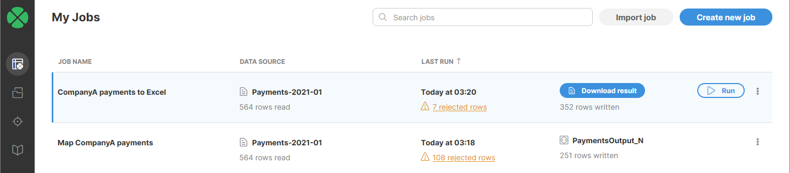

#### What data types can column have?

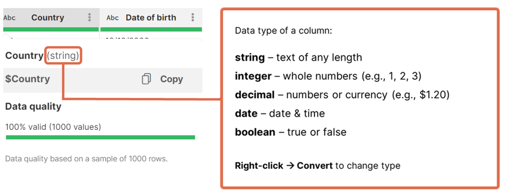

All columns in CloverDX Wrangler have a type which defines what kind of data can be stored in the column - whether it is a number, date or text. Types are either automatically detected (for example when reading from a CSV file) or they are provided by the data source (when reading from a data source connector from the Data Catalog).

The data type for each column is indicated by an icon in the column header with additional information available in the tooltip shown when hovering over a column header. The following table shows how different types are visualized in the data preview.

| Data type | Example column | Example usage |
| --- | --- | --- |
| `integer` represents whole numbers | 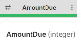 | `10000` `-200` |
| `decimal` represents numbers with fractions. More information about how to work with decimal values [here](wrangler-faq.md#how-can-i-work-with-precise-numbers-including-currency). | 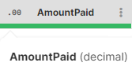 | `1500.25` `1.4142135623` `-2500.5` |
| `date` represents date and time. More information about date formats and how to work with date values [here](wrangler-faq.md#how-do-date-values-work). | 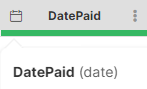 | `2023-02-17` (date only) `2023-01-14 18:51` (date and time) `2023-01-14 18:51:25` `2023-01-14 18:51:25.347` |
| `string` represents text data. More information about how to work with string values [here](wrangler-faq.md#how-can-i-use-strings-how-to-work-with-text-data). | 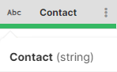 | `"CloverDX 6.0 is great"` `"東京"` (you can use any characters) |
| `boolean` represents `true` or `false` values. | 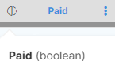 | `false` `true` |

For more information about data types, refer [here](transforming-data.md#data-types-in-wrangler).

Since having the correct data type is essential when working with your data, it is important to review the loaded data. If the type is not the type you would expect, you can convert column to a different type by using one of the conversion steps:

- [Convert to decimal step](wrangler-step-convert-to-decimal.md)
- [Convert to integer step](wrangler-step-convert-to-integer.md)
- [Convert to string step](wrangler-step-convert-to-string.md)
- [Convert Unix time to date step](wrangler-step-convert-unix-time-to-date.md)
- [Convert to boolean step](wrangler-step-convert-to-boolean.md)
- [Convert to date step](wrangler-step-convert-to-date.md)

#### Do I always need to add columns with Add column step?

Before using the [**Add column**](wrangler-step-add-column.md) step, note that there are steps that add a new column automatically:

- The [**Lookup**](wrangler-step-lookup.md) step will automatically add one or more columns with data from the lookup depending on the step configuration.
- The [**Calculate formula**](wrangler-step-formula.md) step has an option to create a new column.

In both scenarios, you don’t need to explicitly add a new column beforehand - both the **Lookup** and **Calculate formula** steps add columns for you.

#### How can I use strings? How to work with text data?

String is one of the most common types of data. Wrangler supports quite a few steps that work with string data - see more details in [Text manipulation steps](wrangler-text-manipulation-steps.md).

When working with string values in formulas, you have two options of how to write them - either with double quotes or with single quotes. The following represent the same strings in your formulas:

- `"test"`
- `'test'`

String columns can have two different types of empty values (`null` values shown as *No value* and an empty string). See [How do I work with empty values? What’s the difference between null and empty?](wrangler-faq.md#how-do-i-work-with-empty-values-whats-the-difference-between-null-and-empty) for more information.

When working with strings, string comparisons are sensitive to white-spaces and letter case. So `"TREE"` is not the same as `"tree"` and `"blue car"` is not the same as `"blue car"` (multiple spaces between words).

For a list of string functions refer [here](transforming-data.md#string-functions).

#### How can I work with precise numbers (including currency)?

Currency is represented as a decimal column with corresponding formatting on a column.

- Right-click → *Convert column to Decimal* to change the column data type to decimal if it is a different data type.
- Right-click → *Change display format…​* to choose the correct format and update the currency symbol if needed.

To see the values in their unformatted form, set the display format to *No specific format*.

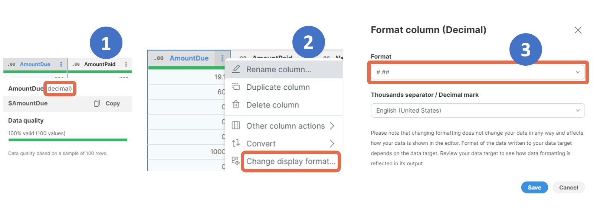

Things to bear in mind when working with decimals:

- Wrangler always operates on full decimal precision (10 decimal places) regardless of the display format.
- When writing decimal values in formulas, you must not use any digit grouping and you must use period as decimal point. For example, you cannot write `123 456,5` and must write the number as `123456.5`.

#### How do date values work?

Wrangler defines a single `date` type which stores both date and time with millisecond precision. If you wish to write date value in a formula, you can use syntax `yyyy-MM-dd` for dates or `yyyy-MM-dd HH:mm:ss.SSS` for full date and time.

For example, these are all valid date values:

- `2023-01-01` - date only, time is set to midnight
- `2023-01-01 14:45:30` - date and time, milliseconds are not specified so will be 0
- `2023-01-01 14:45:30.123` - full date and time with millisecond precision

You can use this syntax when writing date and time values in your formulas or in steps that require you to enter a date value (e.g., [Replace empty value step](wrangler-step-replace-empty.md)).

When working with dates, you can take advantage of one of the following steps:

- [**Current date and time step**](wrangler-step-current-datetime.md) sets all fields in a date column to the current date and time. All fields are populated with the same date and time.
- [**Date add/subtract step**](wrangler-step-date-add-subtract.md) adds or subtracts time units (*years, months, weeks, days, hours, minutes, seconds, or milliseconds*) to / from date values. This step can help you quickly calculate new dates, for example, to calculate invoice due dates based on payment terms.
- [**Date difference step**](wrangler-step-date-diff.md) calculates the time difference between two dates in a given time unit (*days, weeks, months, years, hours, minutes, seconds, or milliseconds*). This step allows you to quickly calculate, for example, the number of days between invoice creation and invoice payment.
- [**Get part of date step**](wrangler-step-get-date.md) extracts the specified time unit *(day of week, day of month, month, year, hours, minutes, seconds, milliseconds)* from a date column. You can, for example, use this step to extract the month from invoice dates from the past year and use it to create statistics of sales per month.

You can also extract the whole part of a date using one of the following functions in the [Calculate formula step](wrangler-step-formula.md) step:

- [`extractDate($date)`](../developer/date-functions-ctl2.md#extractdate) to return just the date part of the value (time is set to 0:00:00.000)
- [`extractTime($date)`](../developer/date-functions-ctl2.md#extracttime) to return just the time. Since there can be no date value without the date part, the result will have the date part set to 1970-01-01 (the beginning of the Unix epoch).

#### How do formulas work?

Formulas can be entered in the following steps:

- [Calculate formula](wrangler-step-formula.md)
- [Filter rows based on formula](wrangler-step-filter-with-formula.md)
- [Validate with formula](wrangler-step-validate-with-formula.md)
- [Replace errors](wrangler-step-replace-errors.md)

Formulas are also used in **step** and **group conditions**. For more information, see [Step and group conditions.](step-and-group-conditions.md)


In your formulas, you will need to specify the column(s) that you want to work with. A column is referenced by its **technical column name** - a name that is automatically created by Wrangler by stripping various special characters from the column label (e.g., a column with the label *Invoice amount (USD)* will have the technical name `$Invoice_amount_USD`). Technical column names always include the `$` sign to make it easy to distinguish from other names that can appear in formulas.

To find and easily copy the technical column name, hover over a column header.


*Figure 128. Technical column name shown in a tooltip of the column header.*

Technical column names are case-sensitive and need to be entered in the exact form as displayed. If you mistype a technical column name, you will get an error like this:

`Error: Field '$invoice_amount_USD' does not exist in record 'invoices_csv'`


You can also use the autocomplete functionality in Formula Editor, which automatically displays a list of all existing technical column names after you type the `$` character. Alternatively, you can display the **list of all technical column names and all available functions** by using the **Ctrl** + **Space** shortcut.


##### Comparing values

The operators below can be used to compare values; however, note that that **you can only compare values with the same data types**.

| Operator | Description |
| --- | --- |
| `==` | Equal to (double =) for all data types |
| `!=` | Not equal to |
| `>` | Greater than |
| `>=` | Greater or equal |
| `<` | Less than |
| `<=` | Less or equal |

Important information to bear in mind:

- When working with **decimals**, you need to specify all the decimal places in the unformatted form in your formula. Decimal values can also only include decimal points; commas as decimal separators are not supported. See [How can I work with precise numbers (including currency)?](wrangler-faq.md#how-can-i-work-with-precise-numbers-including-currency) for more information.
- When working with **dates**, make sure to enter them in the `YYYY-MM-dd format` (or `YYYY-MM-dd HH:mm:ss` when using full date and time). See [How do date values work?](wrangler-faq.md#how-do-date-values-work) for more information.
- When working with **strings**, the values need to be enclosed in double or single quotes. See [How can I use strings? How to work with text data?](wrangler-faq.md#how-can-i-use-strings-how-to-work-with-text-data) for more information.
- When working with empty values, see [How do I work with empty values? What’s the difference between null and empty?](wrangler-faq.md#how-do-i-work-with-empty-values-whats-the-difference-between-null-and-empty) for more information.

| Example | Explanation |
| --- | --- |
| `$decimal == 999.9999` | Returns `true` if `$decimal` equals `999.9999` exactly. |
| `$string == "NOT PAID"` | Returns `true` only if $string is exactly `"NOT PAID"` - the comparison is case sensitive. |
| `$string == null` | Returns `true` if `$string` is *No value* (i.e., `null` means that the value is missing). |
| `$string == ""` | Returns `true` if `$string` is an empty string. Note that empty string is not the same as *No value*. |
| `isBlank($string)` | Often the best option. `isBlank` function returns `true` if `$string` is *No value*, empty string or composed entirely of whitespaces (e.g. `" "` is a blank string since it contains just three spaces). |
| `$date > 2000-01-01` | Returns `true` for any date time that is at least midnight, January 1st, 2000. E.g. `2005-03-14`, `2000-01-01 07:23` etc. |
| `$date == 2000-01-01` | Returns `true` for any date time that is exactly midnight, January 1st, 2000. This is the same as writing `$date == 2000-01-01 00:00:00.000`. |

##### Calculations and functions

| Operator | Description | Example formula | Result |
| --- | --- | --- | --- |
| `+` | Add numbers | `$count + 1` | `1001` |
| `+` | Concatenate strings | `$file + ($count + 1) + ".jpg"` | `"image1001.jpg"` if `$file` is "image", `$count` is 1000 |
| `-` | Subtract numbers | `$amount - $discount` | `540.25` if `$amount` is 600.00 and `$discount` is 59.75 |
| `*` | Multiply numbers | `$price * 0.8` | `800` if `$price` is 1000 |
| `/` | Divide integers | `$passengers / 2` `$passengers` must be `integer` column | 500 if `$passengers` is 1000  250 if `$passengers` is 501 (rounds down) |
| `/` | Divide decimals | `$price / 2.0` `$price` is decimal or integer | 500.5 if `$price` is 1000 |
| `%` | Modulo (remainder after division) | `$passengers % 2` `$passengers` must be integer | `1` if `$passengers` 11 |

When working with columns that include numbers (integers or decimals), you can use mathematical operators.

**Note: Exception for the `+` operator, these operators cannot be used for any other data types than integers or decimals.** If you, e.g., attempt to use the `-` operator when working with date columns, you will get the following error:

`Error: Operator '-' is not defined for types: 'date' and 'date'`

The **+ operator** can be used as a **concatenation function** to join values from multiple columns when working with **string** values (or a combination of string and other data types values; however, in such a case a use of other functions to set the desired format might be needed: more information on this can be found in the Functions section). You can also optionally insert a space or any other characters in between the values.

*Example: You want to join invoice numbers and status values and want to enter the & symbol in between, preceded and followed by a space:*

`$InvoiceNumber + ' & ' + $Status`


For more complex cases, you can use one of our built-in **functions**. The autocomplete feature in **Formula Editor** suggests relevant functions as you type. Alternatively, you can use the **CTRL** + **Space shortcut** to display the list of available *column names* (marked in green, starting with the $ sign) and *functions* (marked in purple). When inserting a function, placeholders for its parameters are automatically included, providing guidance for formula construction. Substitute these placeholders with the appropriate data to build your formula.


*Figure 129. Autocomplete and column name hints in formula editor.*

| Function | Description | Example formula | Result |
| --- | --- | --- | --- |
| `if(condition, then, else)` | IF THEN ELSE | `if($value > 4, "larger", "smaller")` | `"larger"` |
| `dateDiff(later, earlier, unit)` | Difference in two dates (use day, week, month, year, hour, minute, second, millisecond as unit) | `dateDiff(today(), 2020-01-01, year)` | `3` (years ago) |
| `contains(string)` | Returns `true` if the specified string is found | `contains($string, "green")` | Returns `true` for values where "green" is present |
| `lowerCase(string)` | Converts the specified string to lowercase | `lowerCase($string)` | E.g. the text *RED Apple* will be converted to `red apple` |

Functions can also be combined, e.g. to convert values to lowercase and look for the values that include the word "green" in them, the formula would like as follows:

`contains(lowerCase($Contact), "green")`

For a list of existing date functions refer [here](transforming-data.md#date-functions).

For a list of existing string functions refer [here](transforming-data.md#string-functions).

For a list of existing conversion functions refer [here](transforming-data.md#conversion-functions).

#### How can I modify values based on a condition?
> [!NOTE]
> You can also use step or group conditions to easily control when data transformations are applied. For more information, see [Step and group conditions](step-and-group-conditions.md).

In many transformations you’ll need to test your data and use different values in your formula depending on the result of the test. Wrangler formulas offer two ways of doing this - either with **`if`** function or with **ternary operator**.

##### if function

`if` function allows you to test a condition and return a value depending on whether the condition evaluated to `true` or `false`. Two variants are provided:

- `if(condition, value_if_true)`
- `if(condition, value_if_true, value_id_false)`

The parameters in the function:

- `condition` is a boolean expression - the test you want to run
- `value_if_true` and `value_if_false` are expressions that are calculated depending on the result of the test. Both must return the same data type.

The first form of the function is useful when you only need to react when the condition is `true`. That way if condition is met, the function returns `value_if_true`.

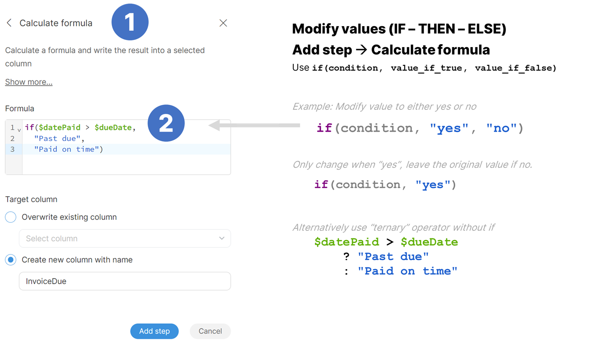

Examples:

- Return "USD" currency code if no currency code is provided or if exchange rate is 1: `if($currencyCode == "USD" OR $exchangeRate == 1.0, "USD")`
- Use `if($datePaid > $dueDate, "Past due", "Paid on time")` to return either "Past due" for invoices paid after their due date or "Paid on time" for invoices paid before their due date.
- You can also nest `if` functions to create more complex formulas: `if($Total < 20000, "Low", if($Total < 50000, "Medium", "High"))`. This expression will return one of "Low", "Medium" or "High" depending on the value of `$Total` column.

##### Ternary operator

Another way of getting the same result is a ternary operator `?`. Its syntax is the following:

```
condition ? value_if_true : value_if_false
```

In this case, both `value_if_true` and `value_if_false` have to be present. Same examples as above written using ternary operator:

- `$currencyCode == "USD" || $exchangeRate == 1.0 ? "USD" : $currencyCode` This assumes that the result is written into the `$currencyCode` column.
- `$datePaid > $dueDate ? "Past due" : "Paid on time"`
- `$Total < 20000 ? "Low" : ($Total < 50000 ? : "Medium" : "High")` Note the use of parenthesis to make the expression easier to read.

Both ways lead to the same result, and it is up to you to use whichever you are more comfortable with.

#### How does Wrangler handle errors in my data?

**Errors (or invalid values)** occur when the underlying data doesn’t match the column data type, or when you use [validation steps](wrangler-validation-steps.md) to find values that do not match your criteria.

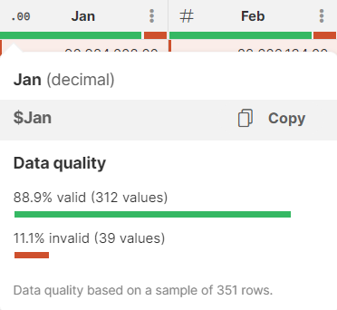

To correct errors:

- **Convert** the column to string or other better suited data type (right-click → Convert)
- Use the **Fix errors** menu to remove erroneous values or rows or replace errors with new values.

For more information on error handling refer to the [Error handling in Wrangler](transforming-data.md#error-handling-in-wrangler) section.

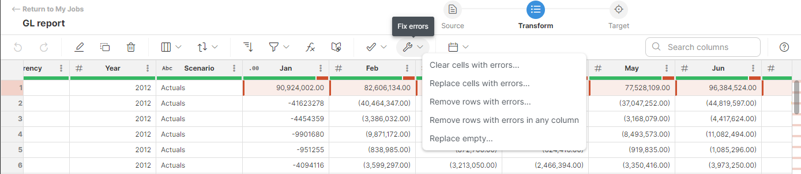

Depending on your [target configuration](transforming-data.md#errors-and-output), all rows where a data error is found are either rejected and output to a [reject file](data-sources-data-targets.md#reject-file-format) when you run the job, or the job fails on the first error.

#### Why cannot I see any data? Why is some data missing?

If you don’t see the data you expect, it might be caused by the limited size of the preview data. This is not an error, and you can continue working, only with limited visibility into the preview data.

**Run the job** to process and see all the data in the result.

How to work around the preview size limitation:

- Keep adding steps as you need, regardless of the empty grid and warning message.
- Run the job and inspect the full results in the target Excel/CSV.
- You might want to apply some filters that limit the number of records you can see as the very last steps of your job.

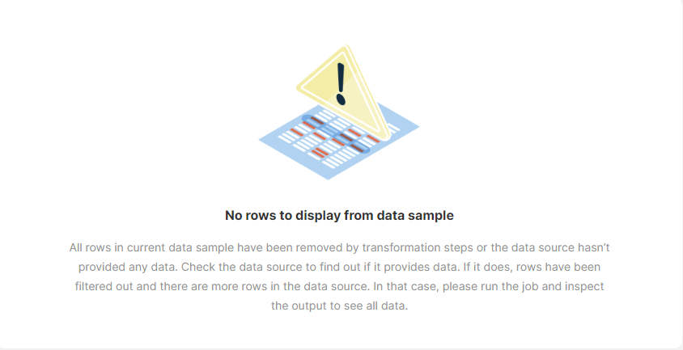

#### How do I work with empty values? What’s the difference between null and empty?

The *No value* label (in italics) indicates that a cell is empty (will show as empty in the target, depending on how it handles empty values). In formulas, *No value* is represented with the `null` keyword (case sensitive).

Note that for string columns there are two different empty values - a *null* value, which comes up as *No value* in fields, and an *empty string* (i.e., a string with zero length), which comes up as an empty field in Wrangler. They do not represent the same data and when writing your formulas you’ll need to make sure you handle both cases if needed. To work with empty strings, use two straight (double or single) quotes: `""` or `''`

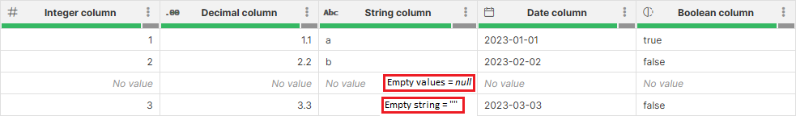

In formulas you can use function [isBlank](../developer/string-functions-ctl2.md#isblank) which can determine if a string is empty - it will return `true` for strings that are null, empty or contain only whitespaces.

Example to remove null values:

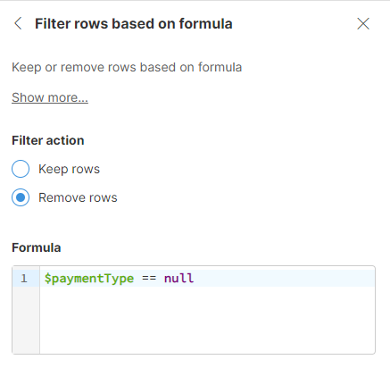

Example to remove **empty string values**:

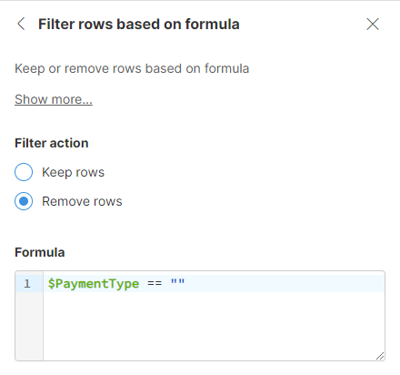

#### How can I populate empty cells with default value?

In many cases you may want to replace empty value of given column with a default value. This can be done via [Replace empty values step](wrangler-step-replace-empty.md). This step will allow you to use single value instead of all empty values in selected column.

Note that this step will correctly handle string data - both `null` and empty string will be replaced with the value you provide.

If you wish to dynamically compute the new value, you will have to use [Calculate formula step](wrangler-step-formula.md). The best way to do this is to use `if` function which has the following syntax:

```
if(condition, value_if_true)
```

The function returns `value_if_true` if the `condition` is satisfied (i.e., if the condition evaluates to `true` for given row). This is what you can effectively use to replace empty values. For example, to use USD as a default currency, you can do this:

```
if(isBlank($currencyCode), "USD")
```

[`isBlank`](../developer/string-functions-ctl2.md#isblank) function is a CTL function that returns `true` if a string value is `null`, empty string or contains just spaces. If the condition is not met, original value remains in the column.

`if` function also has a second variant with one extra parameter:

```
if(condition, value_if_true, value_if_false)
```

See [below](wrangler-faq.md#how-can-i-modify-values-based-on-a-condition) for more details on how to use `if` function.

#### How can I filter my data?

To filter your data, use the **Filter rows based on formula** step.

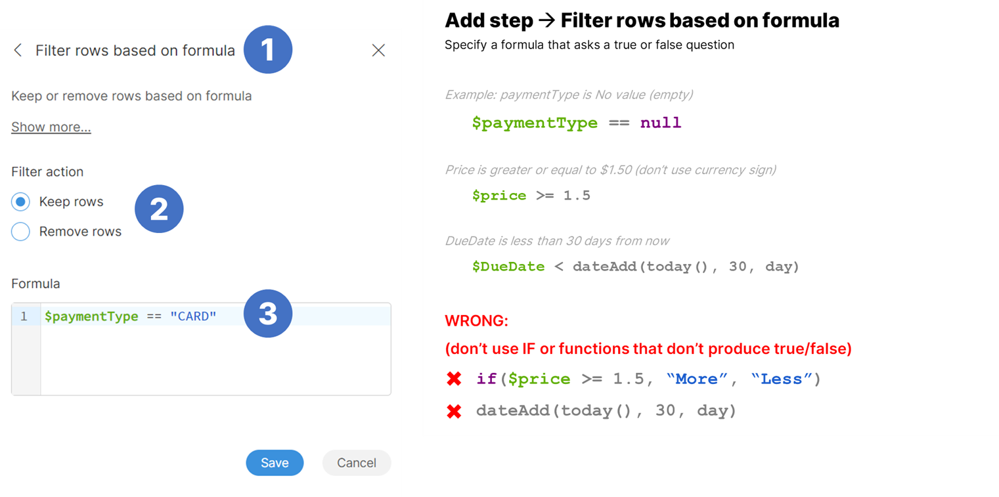

#### How can I build mapping between my data layout and the layout required by a data target?

Targets created from the **Data Catalog** may require specific data formats. These targets may have required and optional columns that you can map into when building your data transformation. Jobs that use such targets will show a special **Mapping step** at the end of the step list in job editor.

This mapping step can be configured in a special Mapping view. This view offers functionalities to map either constant values or columns from your data preview to the target system. By creating a "link" between these elements, you essentially define how your data will be written into the corresponding target columns.

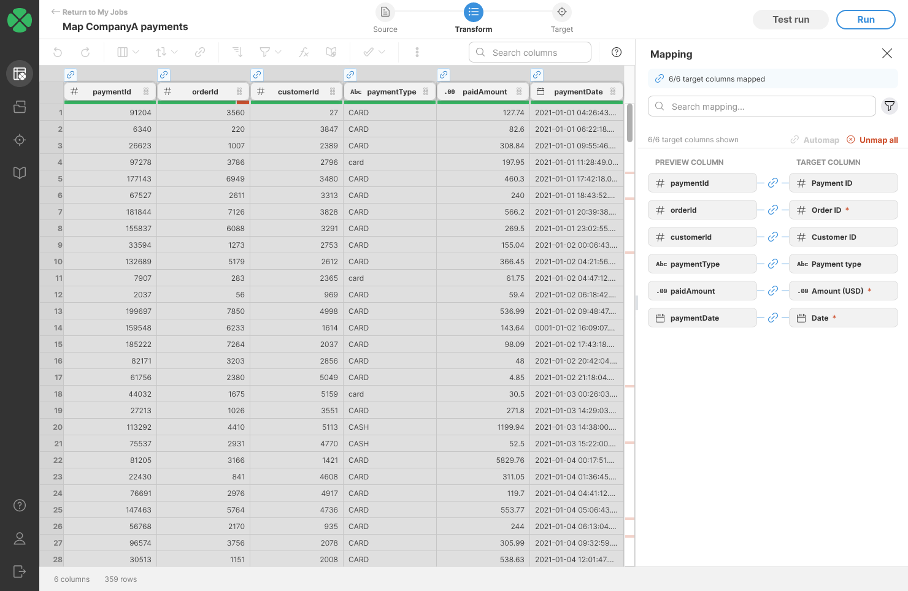
*Figure 130. Target mapping mode showing data preview and finished mapping.*

To learn more about how to work with your data in the Mapping mode, refer to [Target mapping section](data-sources-data-targets.md#target-mapping).
