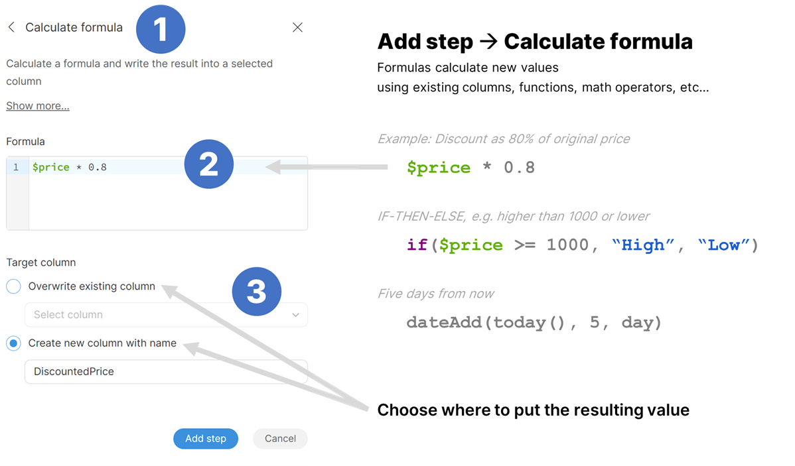
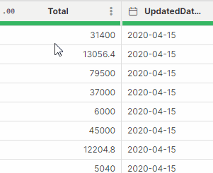
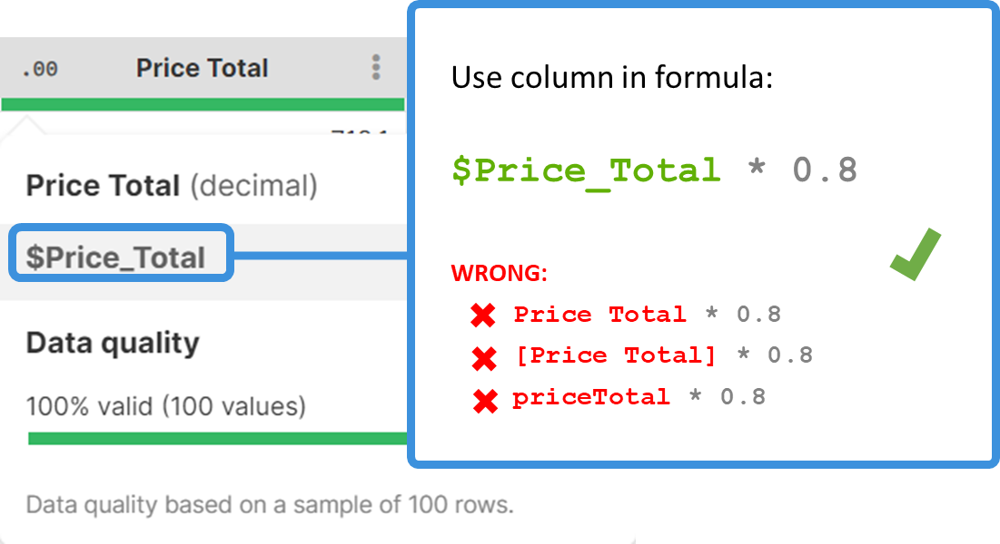
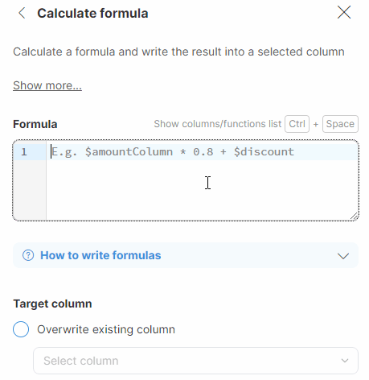
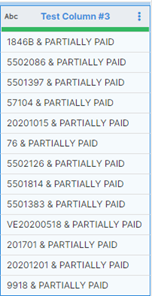
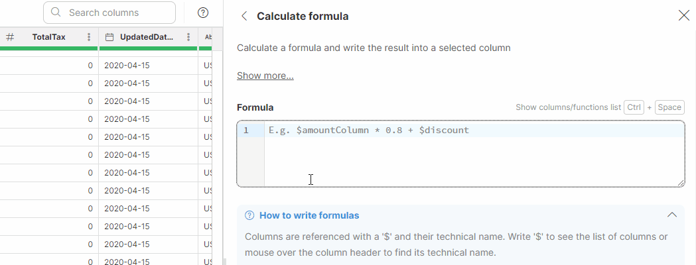

<!-- End user’s guide > Wrangler user guide > Getting started (legacy) -->

### Getting started (legacy)

**Welcome to Wrangler!**

To get yourself comfortable with CloverDX Wrangler, we recommend you take the following path to learn the Wrangler basics so that you can later explore additional functionality on your own:

1. Start with the [Wrangler tutorial](wrangler-tutorial.md) if you are on CloverDX 7.2 or newer.
2. Use the [steps reference](wrangler-steps-list.md) part of this documentation to understand each transformation step in detail.
3. Start your own project!
4. Start with a quick introduction video [How Wrangler works](wrangler-getting-started.md#how-wrangler-works-video) (2 minutes). This video works best for CloverDX 7.1 or older.
5. You can also watch a 15-minute [Quick tutorial](wrangler-getting-started.md#quick-tutorial-video) that will guide you through a sample task.

#### How Wrangler works (video)

This video provides a brief overview of what Wrangler is and what you can do with it.

#### Quick tutorial (video)

We highly recommend you follow this quick tutorial before you start exploring on your own. This video is most suitable for CloverDX 7.1 or older. With CloverDX 7.2 and introduction of **Clover AI Assistant**, we recommend you start with the [tutorial](wrangler-tutorial.md).

The video will walk you through building your first Wrangler job and explain the core principles in detail. You can then read additional details in the rest of this guide.

#### Formulas and calculations

If you are using CloverDX 7.2 or newer, please continue reading [here](wrangler-faq.md).

Formulas can be entered in the following steps:

- [Calculate formula](wrangler-step-formula.md)
- [Filter rows based on formula](wrangler-step-filter-with-formula.md)
- [Validate with formula](wrangler-step-validate-with-formula.md)
- [Replace errors](wrangler-step-replace-errors.md)

Formulas are also used in **step** and **group conditions**. For more information, see [Step and group conditions.](step-and-group-conditions.md)

In your formulas, you will need to specify the column(s) that you want to work with. A column is referenced by its **technical column name** - a name that is automatically created by Wrangler by stripping various special characters from the column label (e.g., a column with the label *Invoice amount (USD)* will have the technical name `$Invoice_amount_USD`). Technical column names always include the `$` sign to make it easy to distinguish from other names that can appear in formulas.

To find and easily copy the technical column name, hover over a column header.

*Figure 127. Technical column name shown in a tooltip of the column header.*

Technical column names are case-sensitive and need to be entered in the exact form as displayed. If you mistype a technical column name, you will get an error like this:

`Error: Field '$invoice_amount_USD' does not exist in record 'invoices_csv'`

You can also use the autocomplete functionality in Formula Editor, which automatically displays a list of all existing technical column names after you type the `$` character. Alternatively, you can display the **list of all technical column names and all available functions** by using the **Ctrl** + **Space** shortcut.

##### Comparing values

The operators below can be used to compare values; however, note that that **you can only compare values with the same data types**.

| Operator | Description |
| --- | --- |
| `==` | Equal to (double =) for all data types |
| `!=` | Not equal to |
| `>` | Greater than |
| `>=` | Greater or equal |
| `<` | Less than |
| `<=` | Less or equal |

Important information to bear in mind:

- When working with **decimals**, you need to specify all the decimal places in the unformatted form in your formula. Decimal values can also only include decimal points; commas as decimal separators are not supported. See [How can I work with precise numbers (including currency)?](wrangler-faq.md#how-can-i-work-with-precise-numbers-including-currency) for more information.
- When working with **dates**, make sure to enter them in the `YYYY-MM-dd format` (or `YYYY-MM-dd HH:mm:ss` when using full date and time). See [How do date values work?](wrangler-faq.md#how-do-date-values-work) for more information.
- When working with **strings**, the values need to be enclosed in double or single quotes. See [How can I use strings? How to work with text data?](wrangler-faq.md#how-can-i-use-strings-how-to-work-with-text-data) for more information.
- When working with empty values, see [How do I work with empty values? What’s the difference between null and empty?](wrangler-faq.md#how-do-i-work-with-empty-values-whats-the-difference-between-null-and-empty) for more information.

| Example | Explanation |
| --- | --- |
| `$decimal == 999.9999` | Returns `true` if `$decimal` equals `999.9999` exactly. |
| `$string == "NOT PAID"` | Returns `true` only if $string is exactly `"NOT PAID"` - the comparison is case sensitive. |
| `$string == null` | Returns `true` if `$string` is *No value* (i.e., `null` means that the value is missing). |
| `$string == ""` | Returns `true` if `$string` is an empty string. Note that empty string is not the same as *No value*. |
| `isBlank($string)` | Often the best option. `isBlank` function returns `true` if `$string` is *No value*, empty string or composed entirely of whitespaces (e.g. `" "` is a blank string since it contains just three spaces). |
| `$date > 2000-01-01` | Returns `true` for any date time that is at least midnight, January 1st, 2000. E.g. `2005-03-14`, `2000-01-01 07:23` etc. |
| `$date == 2000-01-01` | Returns `true` for any date time that is exactly midnight, January 1st, 2000. This is the same as writing `$date == 2000-01-01 00:00:00.000`. |

##### Calculations and functions

| Operator | Description | Example formula | Result |
| --- | --- | --- | --- |
| `+` | Add numbers | `$count + 1` | `1001` |
| `+` | Concatenate strings | `$file + ($count + 1) + ".jpg"` | `"image1001.jpg"` if `$file` is "image", `$count` is 1000 |
| `-` | Subtract numbers | `$amount - $discount` | `540.25` if `$amount` is 600.00 and `$discount` is 59.75 |
| `*` | Multiply numbers | `$price * 0.8` | `800` if `$price` is 1000 |
| `/` | Divide integers | `$passengers / 2` `$passengers` must be `integer` column | 500 if `$passengers` is 1000  250 if `$passengers` is 501 (rounds down) |
| `/` | Divide decimals | `$price / 2.0` `$price` is decimal or integer | 500.5 if `$price` is 1000 |
| `%` | Modulo (remainder after division) | `$passengers % 2` `$passengers` must be integer | `1` if `$passengers` 11 |

When working with columns that include numbers (integers or decimals), you can use mathematical operators.

**Note: With the exception of the + operator, these operators cannot be used for any other data types than integers or decimals.** If you, e.g., attempt to use the - operator when working with date columns, you will get the following error:

`Error: Operator '-' is not defined for types: 'date' and 'date'`

The **+ operator** can be used as a **concatenation function** to join values from multiple columns when working with **string** values (or a combination of string and other data types values; however, in such a case a use of other functions to set the desired format might be needed: more information on this can be found in the Functions section). You can also optionally insert a space or any other characters in between the values.

*Example: You want to join invoice numbers and status values and want to enter the & symbol in between, preceded and followed by a space:*

`$InvoiceNumber + ' & ' + $Status`

For more complex cases, you can use one of our built-in **functions**. The autocomplete feature in **Formula Editor** suggests relevant functions as you type. Alternatively, you can use the **CTRL** + **Space shortcut** to display the list of available *column names* (marked in green, starting with the $ sign) and *functions* (marked in purple). When inserting a function, placeholders for its parameters are automatically included, providing guidance for formula construction. Substitute these placeholders with the appropriate data to build your formula.

*Figure 128. Autocomplete and column name hints in formula editor.*

| Function | Description | Example formula | Result |
| --- | --- | --- | --- |
| `if(condition, then, else)` | IF THEN ELSE | `if($value > 4, "larger", "smaller")` | `"larger"` |
| `dateDiff(later, earlier, unit)` | Difference in two dates (use day, week, month, year, hour, minute, second, millisecond as unit) | `dateDiff(today(), 2020-01-01, year)` | `3` (years ago) |
| `contains(string)` | Returns `true` if the specified string is found | `contains($string, "green")` | Returns `true` for values where "green" is present |
| `lowerCase(string)` | Converts the specified string to lowercase | `lowerCase($string)` | E.g. the text *RED Apple* will be converted to `red apple` |

Functions can also be combined, e.g. to convert values to lowercase and look for the values that include the word "green" in them, the formula would like as follows:

`contains(lowerCase($Contact), "green")`

For a list of existing date functions refer [here](transforming-data.md#date-functions).

For a list of existing string functions refer [here](transforming-data.md#string-functions).

For a list of existing conversion functions refer [here](transforming-data.md#conversion-functions).
