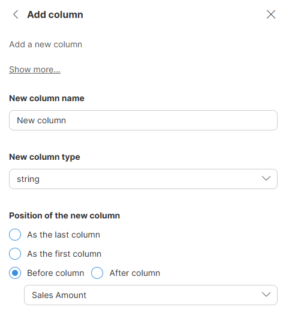

<!-- End user’s guide > Wrangler user guide > Transformation steps > Data set manipulation steps > Add column -->

##### Add column

**Add column** step allows you to add a new empty column of given data type to the specified position in your data set. All rows will have *No value* in the new column (the value of the column in each row will be `null`). To populate the column with data, use other steps.

###### Parameters

- **New column name**: required, the name of your desired column. Name can contain special characters (like spaces) - new technical name for the column will be derived by replacing those with underscore character "_".
- **New column type**: required, the data type the new column (string, date, integer, decimal, boolean).
- **Position of the new column**: defines where the new column is added:
  - **As the last column**: insert the column after the last column in the data set.
  - **As the first column**: insert the column before the first column in the data set.
  - **Before column**: insert the column before a selected column in the data set.
  - **After column**: insert the column after a selected column in the data set.

###### Examples

To add a decimal column called `Late fee` after `Invoice amount` column, use the following settings:

###### See also

- [Duplicate column step](wrangler-step-duplicate-column.md)
- [Delete column(s) step](wrangler-step-delete-column.md)
- [Rename column step](wrangler-step-rename-column.md)
- [Reorder columns step](wrangler-step-reorder-columns.md)
- [Merge columns step](wrangler-step-merge-columns.md)
- [Split column step](wrangler-step-split-column.md)
