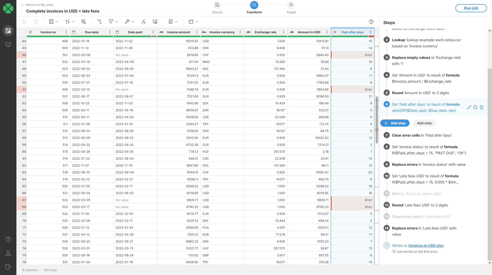
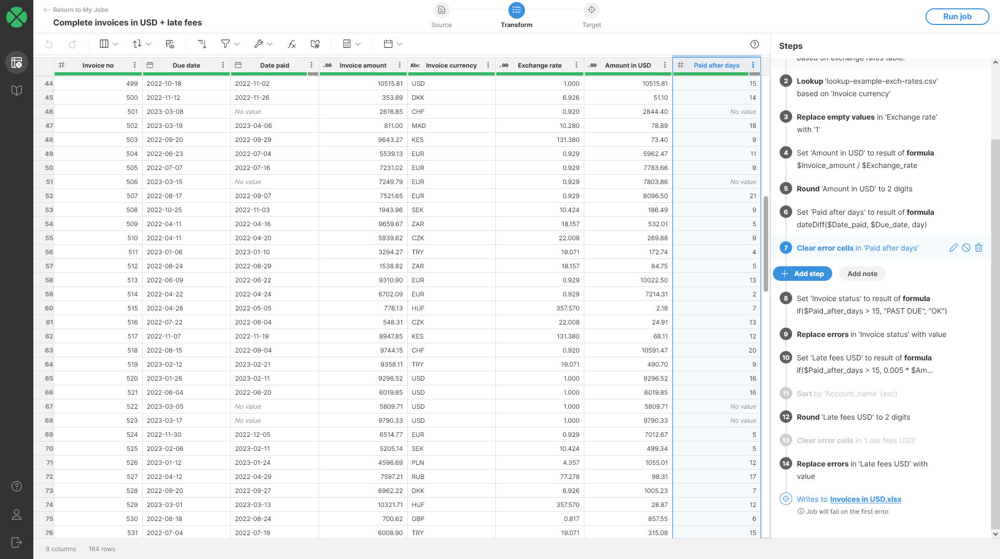

<!-- End user’s guide > Wrangler user guide > Transformation steps > Error handling steps > Clear error cells -->

##### Clear error cells

The **Clear error cells** step replaces all errors in the selected column with `null` value so they will show up as *No value* in the data preview. Cells that do not have errors are left without any changes.

###### Parameters

- **Input Column**: required, column in which to clear all errors. All data types are allowed.

###### Example

In the example below we are trying to calculate the how many days past the due date is an invoice. This is done in step #6 on the screenshot with [Calculate formula](wrangler-step-formula.md) step with `dateDiff($Date_paid, $Due_date, day)` formula.

This formula does not take into consideration *No value* cells in the `Date paid` column - these are there for invoices which have not been paid yet. This means that for those rows, the formula results in an error:

*Figure 114. An error in Paid after days caused by not handling No value cells in the Date paid column.*

To solve this, we can change the formula and only run it if we also have value in `Paid date`. This makes the formula harder to understand and especially in cases where the formula is more complex with more parameters it can be quite hard to see what it really does.

A simpler solution is to leave the formula as is and simply clear the error values in `Paid after days` columns after the formula step. This can be done with **Clear error cells** step. Note that in this case using [Replace errors step](wrangler-step-replace-errors.md) does not make sense as there is no default value to use for unpaid invoices.

*Figure 115. Data set after clearing the error values in Paid after days column.*

###### Remarks

- The step works with every data type.
- The step does not distinguish between different kinds of errors and will replace the error for both data errors as well as step execution errors.

###### See also

- [Error handling in Wrangler](transforming-data.md#error-handling-in-wrangler)
- [Remove rows with errors step](wrangler-step-remove-rows-with-errors.md)
- [Replace errors step](wrangler-step-replace-errors.md)
