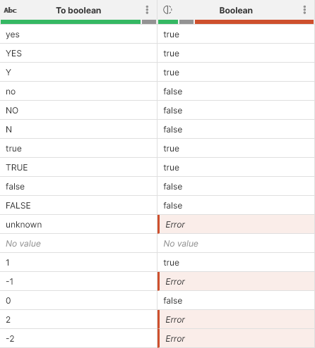

<!-- End user’s guide > Wrangler user guide > Transformation steps > Data conversion steps > Convert to boolean -->

##### Convert to boolean

The Convert to boolean step can be used to convert text column into a boolean column. It cannot be applied to any other column type. See below for the list of values that the step can handle.

###### Parameters

- **Input column**: required, a string column to convert to boolean.
- **Target column**: required, configure the column which will receive the output. Output will always be of boolean type.
  - **Write result to the current column**: overwrite the input column with the result.
  - **Create new column with name**: create a new column with specified name. Name of the new column can contain spaces or special characters - technical column name will be created automatically. The new column will be placed right after the input column.

###### Example

Since the step does not have any extra configuration besides input and target columns, its application is quite straightforward. Following screenshot shows possible values and how they are converted:

###### Remarks

- The step can handle following values when converting to boolean. Note that the step ignores leading or trailing whitespaces and is not case sensitive (so "YES" and "yes" are treated the same).
  | Input | Output |
  | --- | --- |
  | "true", "yes", "y", "1" | `true` |
  | "false", "no", "n", "0" | `false` |
  | *No value* | *No value* |
  | Any other value not mentioned above | *Error* |
- Converting an *Error* value will result in an *Error*.

###### See also

- [Convert to string step](wrangler-step-convert-to-string.md)
- [str2bool CTL function](../developer/conversion-functions-ctl2.md#str2bool)
