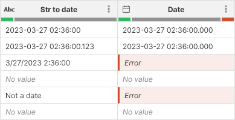
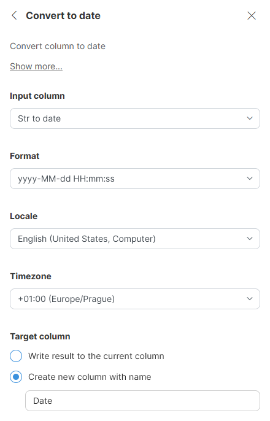

<!-- End user’s guide > Wrangler user guide > Transformation steps > Data conversion steps > Convert to date -->

##### Convert to date

The **Convert to date** converts string columns to date columns using a format that you specify in the step configuration.

To learn more about formatting options consult our [date format documentation](transforming-data.md#date-formatting).

###### Parameters

- **Input column**: required, a string column to convert to date.
- **Format**: required, describes format to use when parsing values in the input column. See [date formats](transforming-data.md#date-formatting) for more details.
- **Locale**: required, determines which language to use when parsing the data. This is important for example when trying to parse month names that are spelled out (e.g. "November" instead of 11).
- **Timezone**: required, the timezone to be used to create the date values.
- **Target column**: required, configure the column which will receive the output. Output will always be a date column.
  - **Write result to the current column**: overwrite the input column with the result.
  - **Create new column with name**: create a new column with specified name. Name of the new column can contain spaces or special characters - technical column name will be created automatically. The new column will be placed right after the input column.

###### Example

A simple example showing conversion results alongside settings step settings:

*Figure 111. Result of the conversion*

*Figure 112. Convert to date step settings*

Note that for the above screenshot, the date column uses `yyyy-MM-dd HH:mm:ss.SSS` display format. You can observe that:

- The first and second rows have the same output value even though the input value is different. This is because the milliseconds are ignored since they are not part of the conversion date format.
- The third row returns and error (with error message being "Unparseable date"). The date in that row does not use the same format as expected and therefore cannot be parsed and converted.
- *No value* gets converted into *No value*.

###### Remarks

- Converting an *Erorr* value will result in an *Error*.

###### See also

- [Convert to string step](wrangler-step-convert-to-string.md)
- [str2date CTL function](../developer/conversion-functions-ctl2.md#str2date)
- [date2str CTL function](../developer/conversion-functions-ctl2.md#date2str)
