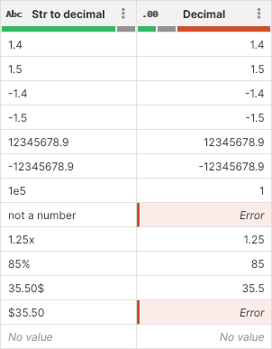
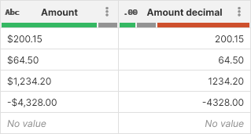
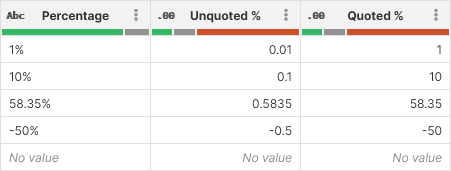
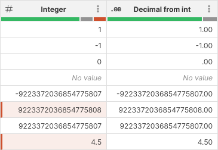

<!-- End user’s guide > Wrangler user guide > Transformation steps > Data conversion steps > Convert to decimal -->

##### Convert to decimal

The **Convert to decimal** step converts values in the selected column from string or integer to decimal.

###### Parameters

- **Input column**: required, a string or integer column to convert to decimal.
- **Format**: only shown if converting string to decimal. Describes format to use when parsing values in the input column. See [decimal formats](transforming-data.md#decimal-formatting) for more details.
- **Locale**: only shown if converting string to decimal. Determines which language to use when parsing the data. Locale controls whether (for example) decimal point or comma is used, what digit grouping is allowed etc.
- **Target column**: required, configure the column which will receive the output. Output will always be a decimal column.
  - **Write result to the current column**: overwrite the input column with the result.
  - **Create new column with name**: create a new column with specified name. Name of the new column can contain spaces or special characters - technical column name will be created automatically. The new column will be placed right after the input column.

###### Examples
Simple example
A basic example that shows output of the conversion from string to decimal using *No specific format* formatting and *English (United States)* locale.

Parsing monetary values
When parsing monetary data you’ll often need to parse values that have currency symbol - often $, € or other symbol. In such case, you can write a format string with this symbol in mind: the following screenshot shows `$###,###.00` with *English (United States)* locale.

Parsing percentages
Percent symbol has a special meaning when parsing numerical data. It will automatically cause the data to be divided by 100 when converting to decimal. While this may be desirable in some case, sometimes you want to parse the percentage as it is. In such case, you will have to use a format string like `0.00'%'` - note the single quotes around the percent sign. The difference can be seen on the following screenshot:

Integer to decimal conversion
For the example below, the decimal column uses `#.00` format to always show two decimal places.

Notice how the values that do not fit into an integer column can still be converted to decimal properly:

- Row 6 is too large to fit into integer, but fits into a decimal. Conversion process understands this and will handle cases like this.
- Row 8 is a decimal number in the source CSV file. It cannot be stored in integer column so it is marked as an error. The conversion to decimal is able to convert the value so it no longer shows as error in the converted data.

###### Remarks

- When converting string to decimal, format you specify will apply.
- When converting integer to decimal, no format is necessary and you’ll see that the step will not show you the **Format** or **Locale** parameters. The step will try to convert also values that do not fit into integer column but may fit into decimal - e.g. values that are too large/small or contain non-integer numbers.
- Converting an *Error* value will result in an *Error* unless the error is a data error as described in the previous point.
- Keep in mind that Wrangler data type integer corresponds to CTL type `long` when researching CTL functions to use in formulas that work with integer columns.

###### See also

- [Convert to string step](wrangler-step-convert-to-string.md)
- [decimal2long CTL function](../developer/conversion-functions-ctl2.md#decimal2long)
