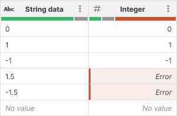
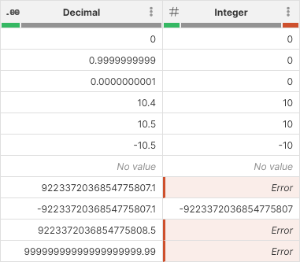

<!-- End user’s guide > Wrangler user guide > Transformation steps > Data conversion steps > Convert to integer -->

##### Convert to integer

The **Convert to integer** step converts decimal or string values to integer. When converting string values, you can define format

###### Parameters

- **Input column**: required, a string or decimal column to convert to integer.
- **Format**: only shown if converting string to integer. Describes format to use when parsing values in the input column. See [integer formats](transforming-data.md#integer-formatting) for more details.
- **Locale**: only shown if converting string to integer. Determines which language to use when parsing the data. Locale controls whether what digit grouping is allowed etc.
- **Target column**: required, configure the column which will receive the output. Output will always be a integer column.
  - **Write result to the current column**: overwrite the input column with the result.
  - **Create new column with name**: create a new column with specified name. Name of the new column can contain spaces or special characters - technical column name will be created automatically. The new column will be placed right after the input column.

###### Examples
Simple example
A basic example that shows output of the conversion from string to integer using *No specific format* formatting and *English (United States)* locale.

Decimal to integer conversion
Converting from decimal to integer does not require **Format** or **Locale** parameters and works by throwing away fractional part of a decimal number. Note that decimal can store larger numbers than integer and the conversion can therefore result in an error.

###### Remarks

- Converting an *Error* value will result in an *Error*.
- Converting a *No value* cell will result in a *No value*.

###### See also

- [Convert to string step](wrangler-step-convert-to-string.md)
- [str2decimal CTL function](../developer/conversion-functions-ctl2.md#str2decimal)
