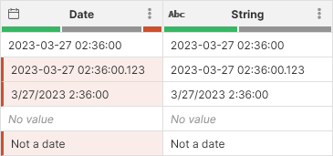

<!-- End user’s guide > Wrangler user guide > Transformation steps > Data conversion steps > Convert to string -->

##### Convert to string

The **Convert to string** step converts values from any Wrangler-supported to string. Display format of the input column is preserved during the conversion.

###### Parameters

- **Input column**: required, a column to convert to string.
- **Target column**: required, configure the column which will receive the output. Output will always be a string column.
  - **Write result to the current column**: overwrite the input column with the result.
  - **Create new column with name**: create a new column with specified name. Name of the new column can contain spaces or special characters - technical column name will be created automatically. The new column will be placed right after the input column.

###### Examples

A screenshot below shows an example in which date is converted to string. Notice how errors "disappear" in the String column since string can store even invalid and malformed dates.

###### Remarks

- Converting *No value* will result in a *No value* again.
- Converting errors may in many cases "fix" the date errors since string can store values that cannot be parsed as numbers, dates etc. Runtime errors will be propagated (i.e., a cell with *Error* will result in *Error* if the error is a runtime error and not a data formatting error). See examples above for more details.

###### See also

- [Convert to boolean step](wrangler-step-convert-to-boolean.md)
- [Convert to date step](wrangler-step-convert-to-date.md)
- [Convert to decimal step](wrangler-step-convert-to-decimal.md)
- [Convert to integer step](wrangler-step-convert-to-integer.md)
- [date2str CTL function](../developer/conversion-functions-ctl2.md#date2str)
- [num2str CTL function](../developer/conversion-functions-ctl2.md#num2str)
- [toString CTL function](../developer/conversion-functions-ctl2.md#tostring)
