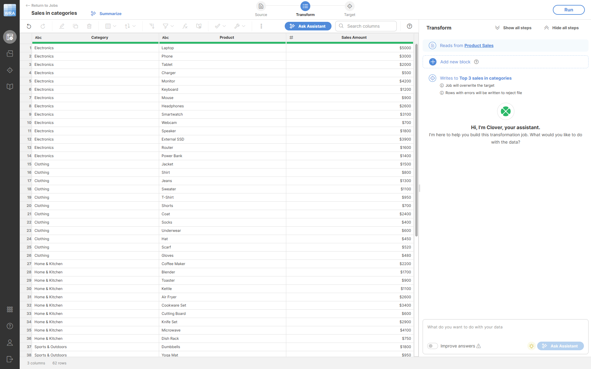
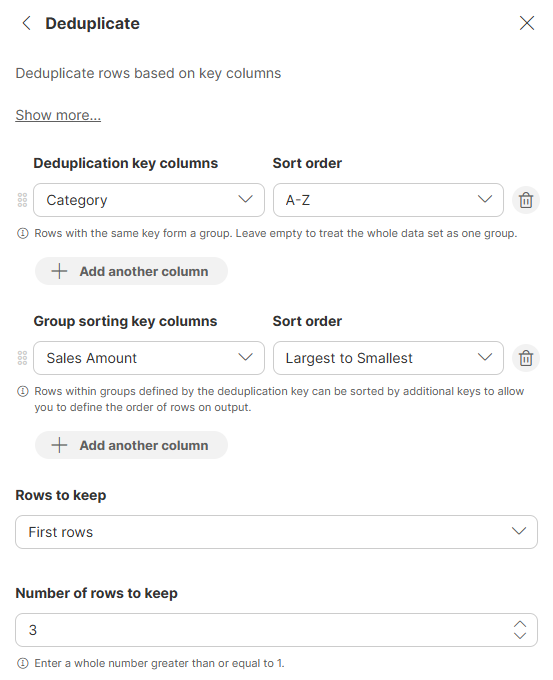
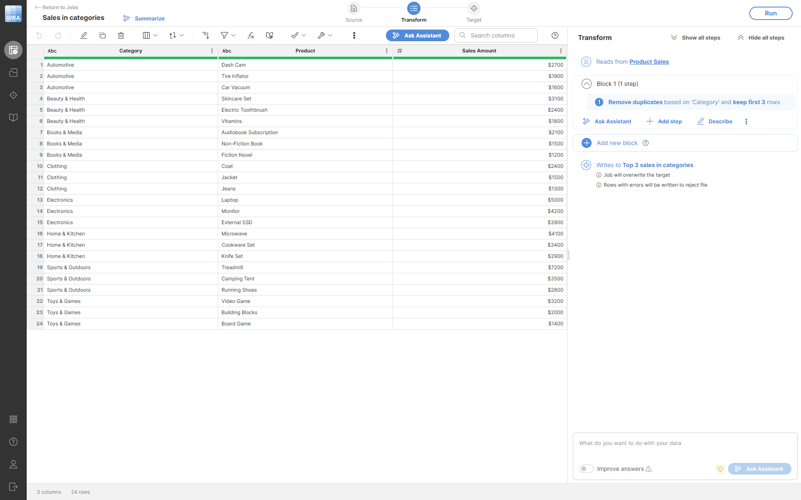

<!-- End user’s guide > Wrangler user guide > Transformation steps > Data set manipulation steps > Deduplicate -->

##### Deduplicate

The **Deduplicate** step removes duplicate rows based on selected deduplication key columns. You can select how many rows to keep from each group of rows with the same key. This step sorts your data based on the deduplication key and the group sort key.

###### Parameters

- **Deduplication key columns**: optional, the set of columns that will be considered a unique key for the row. Rows with the same values in these columns form a group. You can specify the sorting direction (ascending or descending) for each column. Leave empty to treat the whole data set as one group.
- **Group sort key columns**: optional, the set of columns that will be used for sorting records within a group with the same dedup key. You can specify the sorting direction for each column. If empty, the overall sort key will be the same as the deduplication key. This is useful when you want to control which duplicate rows are kept (e.g., keep the most recent record).
- **Rows to keep**: required, determines which rows will be kept from each group. Options are:
  - **First rows**: keep the first N rows from each group (default).
  - **Last rows**: keep the last N rows from each group.
  - **Unique rows**: keep only rows that appear exactly once in their group (rows without any duplicates).
- **Number of rows to keep**: required (except when **Unique rows** is selected), an integer that must be at least 1. Determines the maximum number of rows to keep from each group. This field is disabled when **Unique rows** is selected.

###### Examples
Keep top 3 products by sales in each category
To find the top-performing products in each category, we can use the **Deduplicate** step on our product sales data:

We configure the step to use `Category` as the deduplication key (to group products by category) and `Sales Amount` as the group sort key (to order products within each category from highest to lowest sales), then keep the first 3 rows from each category:

The output will look like this - notice that only the top 3 products from each category are kept:

Remove duplicate customer records
Suppose you have a customer dataset with duplicate entries and you want to keep only one record per customer based on their email address:

**Configuration:** - **Deduplication key columns**: `Email` (A-Z) - **Rows to keep**: First rows - **Number of rows to keep**: `1`

| Customer Name | Email | Purchase Date | Amount |
| --- | --- | --- | --- |
| John Smith | [john@example.com](mailto:john@example.com) | 2024-01-15 | $100 |
| John Smith | [john@example.com](mailto:john@example.com) | 2024-02-20 | $150 |
| Jane Doe | [jane@example.com](mailto:jane@example.com) | 2024-01-10 | $200 |

**Output:**

| Customer Name | Email | Purchase Date | Amount |
| --- | --- | --- | --- |
| Jane Doe | [jane@example.com](mailto:jane@example.com) | 2024-01-10 | $200 |
| John Smith | [john@example.com](mailto:john@example.com) | 2024-01-15 | $100 |
Keep most recent record for each customer
To keep the most recent record for each customer, use the **Group sort key columns** to sort by date:

**Configuration:** - **Deduplication key columns**: `Email` (A-Z) - **Group sort key columns**: `Purchase Date` (Newest to Oldest) - **Rows to keep**: First rows - **Number of rows to keep**: `1`

Using the same input data as above, the output would be:

| Customer Name | Email | Purchase Date | Amount |
| --- | --- | --- | --- |
| Jane Doe | [jane@example.com](mailto:jane@example.com) | 2024-01-10 | $200 |
| John Smith | [john@example.com](mailto:john@example.com) | 2024-02-20 | $150 |
Find truly unique records
To keep only records that have no duplicates (truly unique rows), use the **Unique rows** option:

**Configuration:** - **Deduplication key columns**: `Product ID` (Smallest to Largest) - **Rows to keep**: Unique rows

| Product ID | Product Name |
| --- | --- |
| 101 | Laptop |
| 102 | Mouse |
| 102 | Mouse |
| 103 | Keyboard |

**Output:**

| Product ID | Product Name |
| --- | --- |
| 101 | Laptop |
| 103 | Keyboard |

Only products with IDs 101 and 103 are kept because product 102 appears twice.
Deduplicate entire dataset
If you leave the **Deduplication key columns** empty, the entire dataset is treated as one group:

**Configuration:** - **Deduplication key columns**: (empty) - **Group sort key columns**: `Amount` (Largest to Smallest) - **Rows to keep**: First rows - **Number of rows to keep**: `5`

| Customer | Product | Amount |
| --- | --- | --- |
| Alice | Laptop | $1200 |
| Bob | Phone | $800 |
| Carol | Tablet | $950 |
| David | Monitor | $450 |
| Eve | Keyboard | $120 |
| Frank | Mouse | $85 |
| Grace | Headphones | $200 |

**Output:**

| Customer | Product | Amount |
| --- | --- | --- |
| Alice | Laptop | $1200 |
| Carol | Tablet | $950 |
| Bob | Phone | $800 |
| David | Monitor | $450 |
| Grace | Headphones | $200 |

This keeps the 5 rows with the highest amounts from the entire dataset.

###### Remarks

- This step always sorts the data. The overall sort key is a combination of the deduplication key columns and the group sort key columns (in that order).
- Each column can appear only once across both key configurations (deduplication key and group sort key).
- When **Unique rows** is selected, the **Number of rows to keep** parameter is not used and will be disabled.
- The step can be used with multiple columns in the deduplication key to define complex uniqueness criteria.

###### See also

- [Sort step](wrangler-step-sort.md)
- [Group by step](wrangler-step-group-by.md)
- [Filter rows based on formula step](wrangler-step-filter-with-formula.md)
