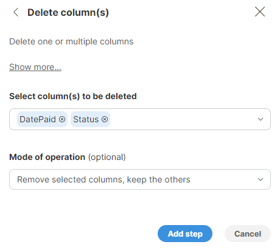
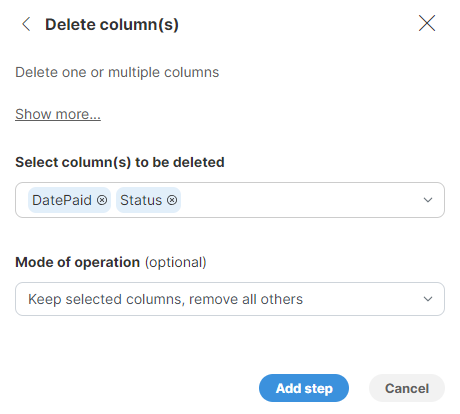

<!-- End user’s guide > Wrangler user guide > Transformation steps > Data set manipulation steps > Delete column(s) -->

##### Delete column(s)

**Delete column(s)** step allows you to delete columns from the data set.

###### Parameters

- **Select column(s) to be deleted**: required, select the column(s) to be removed or kept (depending on the **Mode of operation**) from the data set.
  - Display the list of columns by clicking in the **Select column(s)** field.
  - To quickly find the desired column, start typing the column name.
  - Select all the columns to be deleted or kept by clicking on them.
  - To unselect a column either click on the column name in the column list or click on X on the right side of the column name in the **Select column(s) to be deleted** field.
  - To quickly select or unselect all the columns, click on the check box next to the column name lookup field.
- **Mode of operation**: by default, the selected columns are deleted.
  - *Remove selected columns, keep the others* (default option)
  - *Keep selected columnns, remove all others*

###### Examples

To delete the `Type` and `Contact` columns, configure the step like this:

To delete all columns but the `Type` and `Contact` columns, configure the step like this:

###### See also

- [Add column step](wrangler-step-add-column.md)
- [Duplicate column step](wrangler-step-duplicate-column.md)
- [Rename column step](wrangler-step-rename-column.md)
- [Reorder columns step](wrangler-step-reorder-columns.md)
- [Merge columns step](wrangler-step-merge-columns.md)
- [Split column step](wrangler-step-split-column.md)
