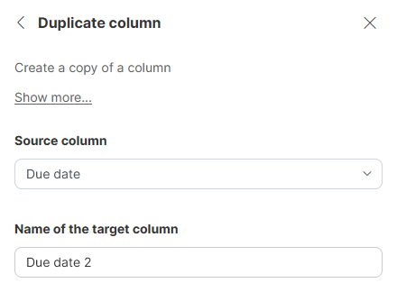

<!-- End user’s guide > Wrangler user guide > Transformation steps > Data set manipulation steps > Duplicate column -->

##### Duplicate column

**Duplicate column** step can be used to create a copy of an existing column - values and formatting are both copied.

###### Parameters

- **Source column**: required, the column you wish to duplicate.
- **Name of the target column**: required, the name you wish to give the new column. Name can contain special characters (like spaces) - new technical name for the column will be derived by replacing those with underscore character "_". Note that the new column will be placed immediately to the right of the source column - there is no way to control the location of the added column in this step. To do so, you can use [Reorder columns step](wrangler-step-reorder-columns.md).
> [!NOTE]
> When a condition is applied to this step, it takes on a copy function and copies rows that meet the condition from the source column to the target column. For more information on step and group conditions, see [Step and group conditions](step-and-group-conditions.md).

###### Examples

To create a copy of `Due date` column, configure the step like this:

###### Remarks

- The new column will be placed immediately to the right of the source column - there is no way to control the location of the added column in this step. To do so, you can use [Reorder columns step](wrangler-step-reorder-columns.md).
- New column will have the same type as the input column. It will also inherit the display format. If you change the display format of the input column even after the step was added, the format will be copied to the duplicate column. If you change display format of the duplicate column, it will *not* be copied to input column.

###### See also

- [Add column step](wrangler-step-add-column.md)
- [Delete column(s) step](wrangler-step-delete-column.md)
- [Rename column step](wrangler-step-rename-column.md)
- [Reorder columns step](wrangler-step-reorder-columns.md)
- [Merge columns step](wrangler-step-merge-columns.md)
- [Split column step](wrangler-step-split-column.md)
