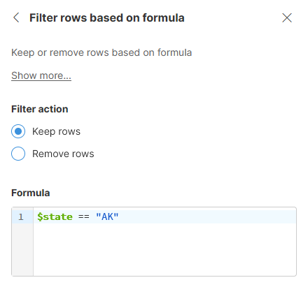
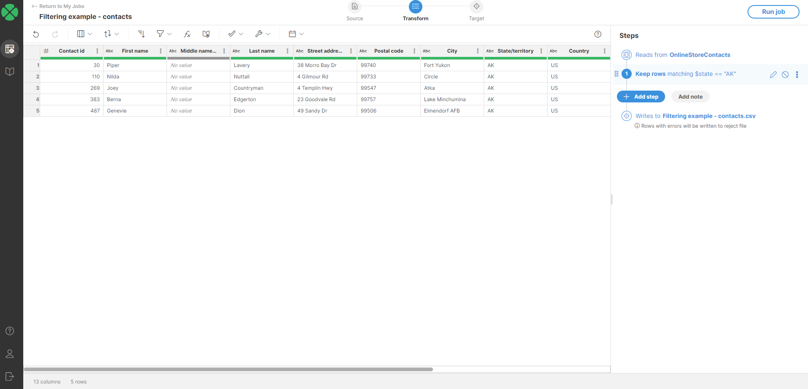
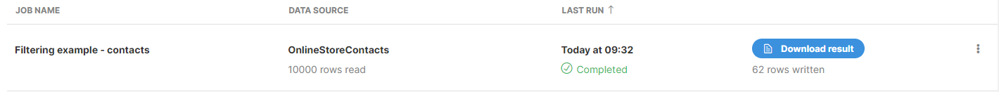
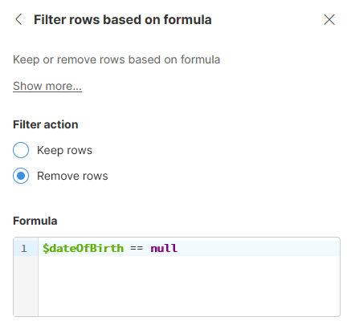
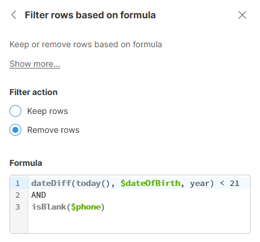
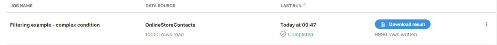

<!-- End user’s guide > Wrangler user guide > Transformation steps > Data set manipulation steps > Filter rows based on formula -->

##### Filter rows based on formula

The **Filter rows based on formula** step allows you to filter your data set. It can keep or remove rows based on the result of the specified formula.


###### Parameters

- **Filter action**: select what to do with rows for which the formula returns true:
  - **Keep rows**: default, keep the rows for which the formula returns true. All other rows are removed.
  - **Remove rows**: remove the rows for which the formula returns true. All other rows are removed.
- **Formula**: the formula (condition) which decides whether to keep or remove the rows. It must be a formula that returns true or false.

###### Usage

Filter works by evaluating the formula for each row in your data set. Based on the result (whether the formula returns `true` or `false`) and configured **Filter action** it will decide whether to keep the row or remove it from further processing.

Filter step never changes the data in any way - it simply removes subset of the data from further processing based on the condition provided by the user.
> [!NOTE]
> Note that when you filter, the preview will show you only subset of the records that are available in the sample. This means that the preview output might be much more limited compared to what you’ll get by running the job in full. See examples below to see this.
Simple filtering
To only **keep** rows in the contacts data set where the contact address is in Alaska, we can use filter configured like this:



The result after applying the above step may look like this:



Notice that only 5 rows are shown in the preview. When you run the job, you will get 62 rows in the output:



This is because when working with interactive job editor, you are only working with a **sample** that has 1000 rows by default. However, when you run the job, it works with complete data set which in this case has 10000 rows and therefore also contains more than just 5 contacts from Alaska.
Removing rows with empty values
To remove rows that have empty value in certain column from your data set, you can configure the step like this:



Note that since `$dateOfBirth` is a date column, we compare with `null` to determine if the value is present or not.

The same approach will work for decimal, integer and boolean columns. For string columns, you can use formula `isBlank($stringColumn)` instead.

Alternatively, you can also write `$stringColumn == null || $stringColumn == ""` - this is less generic than using `isBlank` function as it does not catch values that are composed entirely of spaces.
Filtering with more complex conditions
In this example, we will **remove** all contacts who are younger than 21 years and do not have a phone number.



In this case we set the **Filter action** to **Remove** so that rows matching the condition are removed rather than kept in the data set.

The formula used in the step is the following:

```
dateDiff(today(), $dateOfBirth, year) < 21
AND
isBlank($phone)
```

In the first line of the formula, we calculate the age of the customer by using a `dateDiff` function to calculate the difference between two dates combined with `today()` function to get today’s date. The result is compared with 21 to see if the customer is younger than 21.

In the third line above we test if the `$phone` column is empty by using an `isBlank` function.

Both parts (age test and phone test) are combined with `AND` operator so both conditions must be `true` for the formula to also return `true`. You can often see this operator written as `&&`.

With settings like this, the step will remove small number of customers from the data. To see the full effect of the step, we can run the job to get result like this:



###### Remarks

- When working in an interactive job editor, the step works with sample. Full data set may contain more records that satisfy filtering conditions. To get full picture of your data after it has been filtered, run the job via **Run job** button.

###### See also

- [Using formulas](transforming-data.md#using-formulas)
  - [Mathematical operators](transforming-data.md#mathematical-operators)
  - [Comparison operators](transforming-data.md#comparison-operators)
  - [Logical operators](transforming-data.md#logical-operators)
- [How to work with date values](wrangler-faq.md#how-do-date-values-work)
- [How to work with strings (text)](wrangler-faq.md#how-can-i-use-strings-how-to-work-with-text-data)
