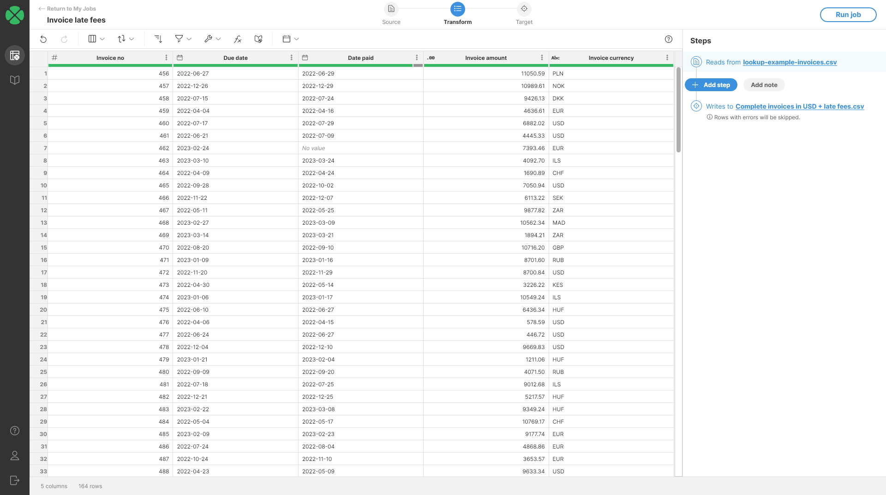
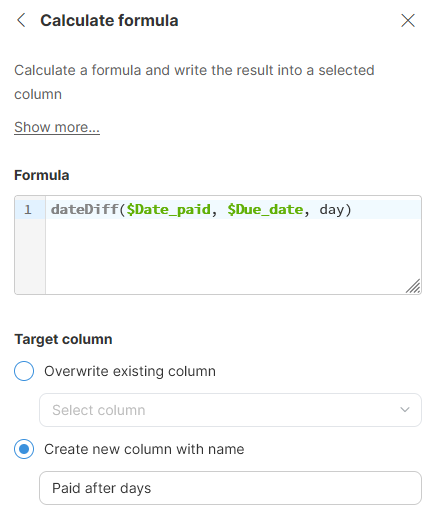
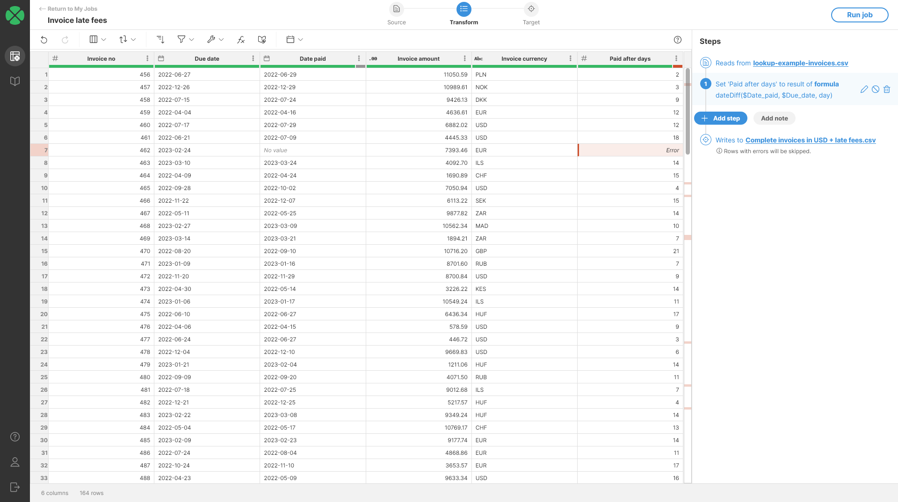
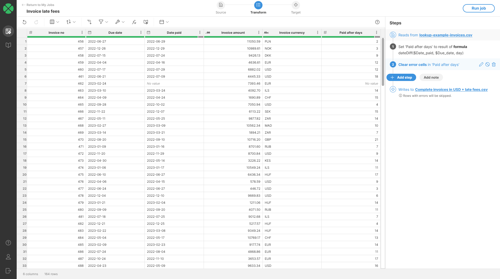
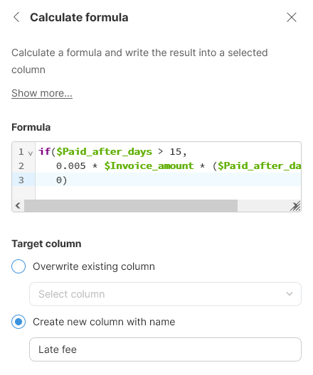
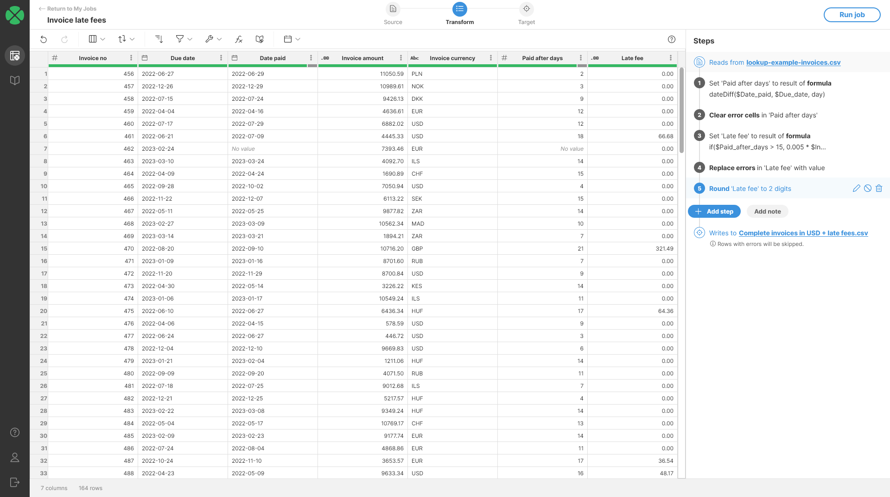

<!-- End user’s guide > Wrangler user guide > Transformation steps > Data set manipulation steps > Calculate formula -->

##### Calculate formula

The **Calculate formula** step calculates the value of a cell using a formula. Formulas can return a value of any type. Formulas can reference other columns using `$Column_Name` syntax and many built-in functions.
> [!TIP]
> **Learn the basics of writing formulas**
>
> Visit [**Formulas and calculations**](wrangler-faq.md#how-do-formulas-work) to learn how to work with formulas.


###### Parameters

- **Formula**: required, the formula to apply to create the target column values. Formula can return a value of any type. Formulas can reference other columns using `$Column_Name` syntax and many built-in functions.
- **Target column**: required, configure the column which will receive the output. Output type will be determined automatically depending on the output type of the formula.
  - **Overwrite existing column**: overwrite existing column with the result.
  - **Create new column with name**: create a new column with specified name. Name of the new column can contain spaces or special characters - technical column name will be created automatically. The new column will be placed right after the input column.

###### Examples
Objective
Calculate the late fees for invoices. Late fees are derived from invoice due date and when it was paid. Late fees are added to invoices which are paid more than 15 days after their due date. Late fee is then 0.5% of the amount for each date the invoice is not paid past the due date.
Solution
1. Load the invoices data set. it has two columns - `Due date` and `Paid date` - which provide information about invoice payments. `Paid date` is empty if the invoice was not yet paid. You data may look like this:
   
2. You can use [dateDiff function](../developer/date-functions-ctl2.md#datediff) in **Calculate formula** step to calculate how many days are between two dates.
   
3. Once you add the step, you will get output that can look like the following screenshot. Notice the error cells highlighted in red - they show rows where invoices have not yet been paid so it is not possible to calculate the number of days. We’ll clean this in next steps.
   
4. To clean the errors from previous step, use [Clear error cells step](wrangler-step-clear-error-cells.md). This step will remove the errors and use `null` (*No value*) instead. You will get an output like this:
   
5. To calculate the late fees, we can use formula like this:
   ```
   if($Paid_after_days > 15,
      0.005 * $Invoice_amount * ($Paid_after_days - 15),
      0)
   ```
   The formula uses `if` function to only run when `Paid after days` is greater than 15. If invoice is paid in 15 days or less, we do not add any fees. Otherwise we calculate the fee as 0.5% of the `Invoice amount` for each day the payment is late.
   
6. The output will look like this. Notice again that we have errors in the output - this time caused by *No value* cells in the `Paid_after_days` column. *No value* cells cannot be used in calculation and hence an error is raised. We can solve this in two ways:
   - Improve our formula from the previous step with more complex condition to not calculate anything for those rows. This can be done for example like this:
     ```
     if($Paid_after_days == null,
        0,
        if($Paid_after_days > 15,
           0.005 * $Invoice_amount * ($Paid_after_days - 15),
           0
        )
     )
     ```
   - Use [Replace errors step](wrangler-step-replace-errors.md) to clean the result after the calculation. This is the approach we’ll use here.
7. Finally, we can round the output to 2 decimal places to make it nicer. Do not forget to [set the display format](transforming-data.md#formatting-your-data) for the column to get nicer output.
   

###### Remarks

- The target column data type is automatically determined based on the type returned by the formula. If the target column is of a different type, the type of the target column will be changed to match the formula’s return type.

###### See also

- [Using formulas - introduction](transforming-data.md#using-formulas)
- [How to return a different value depending on condition](wrangler-faq.md#how-can-i-modify-values-based-on-a-condition)
- [How does Wrangler expression language differ from CTL?](transforming-data.md#how-does-wrangler-expression-language-differ-from-ctl)
- [How to work with date values](wrangler-faq.md#how-do-date-values-work)
- [How to work with strings (text)](wrangler-faq.md#how-can-i-use-strings-how-to-work-with-text-data)
