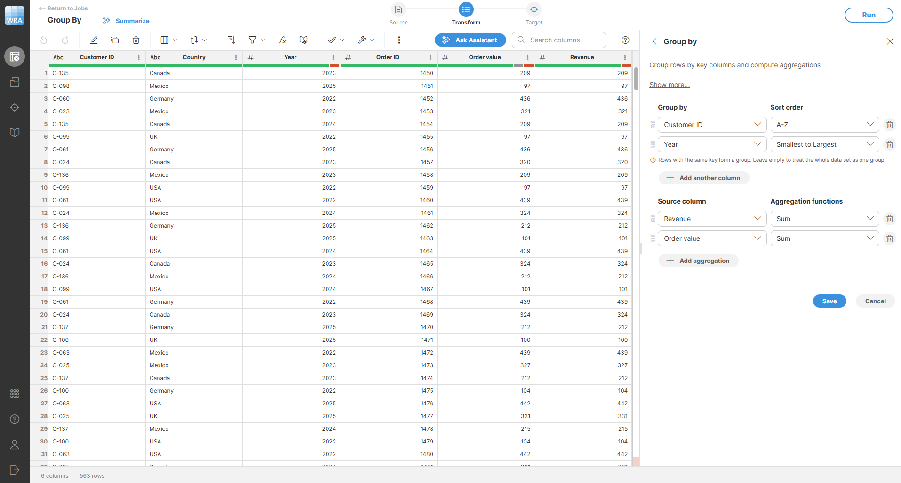
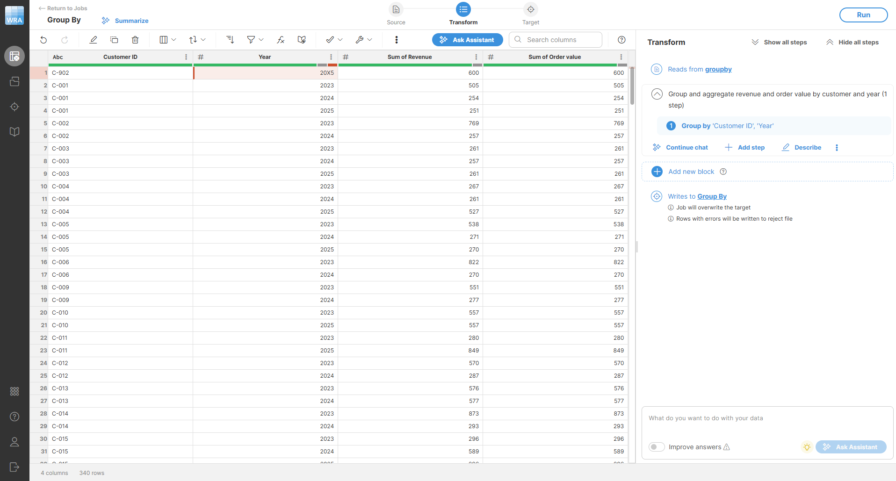
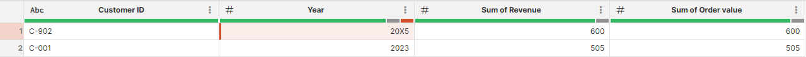

<!-- End user’s guide > Wrangler user guide > Transformation steps > Data set manipulation steps > Group by -->

##### Group by

The **Group by** step bundles rows with the same values and adds summary columns (counts, sums, averages, first/last, etc.) so you can make quick reports without formulas.

###### Parameters

- **Group by (key columns)**: choose zero or more columns that define each group. Leave empty to aggregate the whole data set into one record. Each column can be used only once.
- **Sort order**: configure the sorting direction. The choices will depend on the data type:
  - For numeric columns (integer and decimal) select either **Smallest to largest** (ascending) or **Largest to smallest** (descending order).
  - For string columns select either **A-Z** (ascending) or **Z-A** (descending).
  - For date columns select **Oldest to newest** (ascending) or **Newest to oldest** (descending).
  - For boolean columns select either **False first** or **True first**.
- **Aggregations**: add the summary columns you need. For each:
  - **Source column**: pick a compatible column. The list is filtered based on the chosen function. **Count** needs no column.
  - **Aggregation function**: See the table below for available functions and what they do.

| Function | What it returns | Compatible column types |
| --- | --- | --- |
| Count | Number of rows (includes empty values). | None (no column needed) |
| Count non-empty | Number of non-empty values (ignores empty cells). | Any |
| Count unique | Number of distinct non-empty values. | Any |
| Average | Average of non-empty numeric values. | Integer, decimal |
| Minimum | Lowest non-empty value. | Integer, decimal, date, string |
| Maximum | Highest non-empty value. | Integer, decimal, date, string |
| Sum | Sum of non-empty numeric values. | Integer, decimal |
| Median | Median of non-empty values. | Integer, decimal, date |
| Standard deviation | How spread out the non-empty numeric values are. | Integer, decimal |
| Mode | Most common non-empty value. | Any |
| First | First value in the group (after sorting). | Any |
| First non-empty | First non-empty value in the group. | Any |
| Last | Last value in the group (after sorting). | Any |
| Last non-empty | Last non-empty value in the group. | Any |

Empty strings count as empty values.

###### Examples
Summarize revenue by country and year
To analyze yearly sales, group by `Country` and `Year`. Add aggregations for **Sum** of `Revenue` and **Average** of `Order value`. The output will have one row for each country/year combination with total and average revenue.

The output will look like this:

###### Remarks

- Output columns are ordered: all key columns first (in your order), then aggregations (in the order added).
- With no keys, the step still outputs one record. Count functions return `0` on empty input.
- Empty strings count as empty values. If a key column is empty or has an error, those rows are grouped together in their own group.
- When sorting by key columns, rows with errors in the key sort first (errors are treated as the lowest values).

- Input is sorted by key columns before aggregation.

| Area | Behavior |
| --- | --- |
| Key columns | Empty strings and nulls are grouped together. Cells with an error in a key column are grouped together and sort first so you can see those records. |
| Aggregated columns | Error values are skipped. If everything in a group is empty or error, the aggregation returns an empty value (not an error). |
| Output order | Key columns first, then aggregations; data is sorted by key columns before aggregation. |

###### See also

- [Aggregate component](../developer/aggregate.md)
