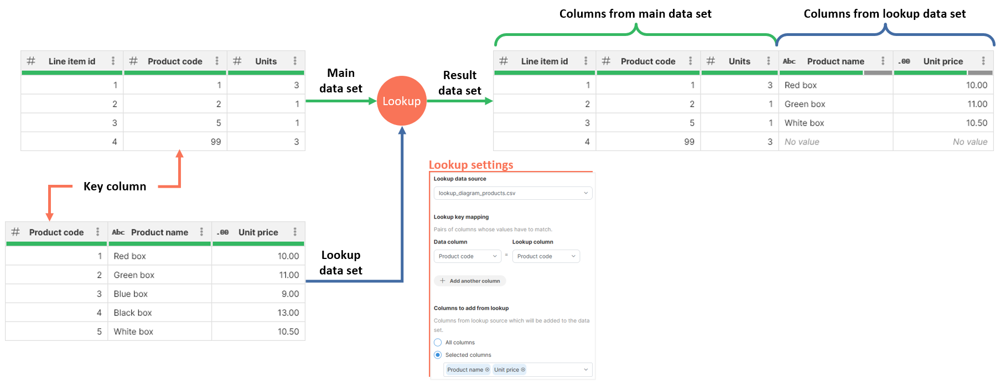
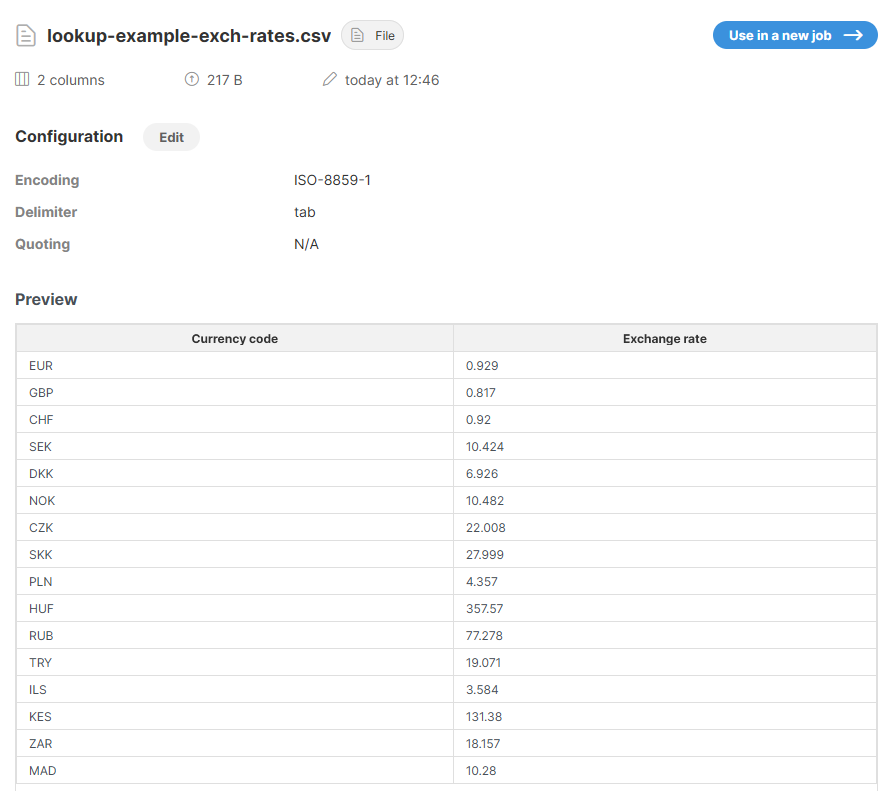
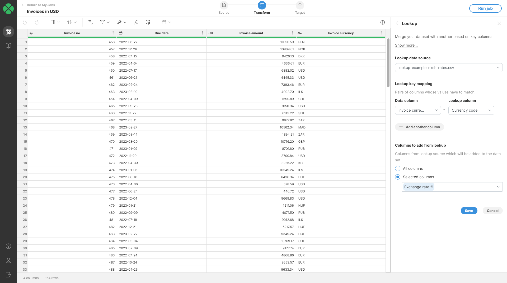
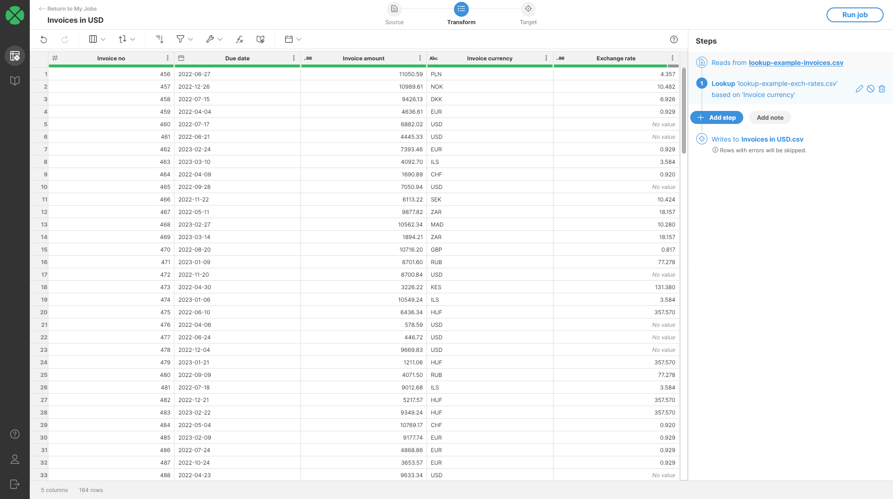
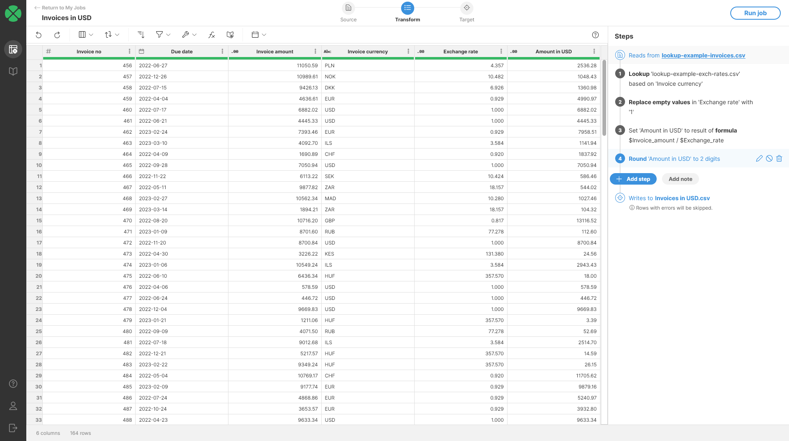

<!-- End user’s guide > Wrangler user guide > Transformation steps > Data set manipulation steps > Lookup -->

##### Lookup

**Lookup** step performs a lookup based on key columns from your data set. Lookup step allows you to add columns from your lookup data set to your current data set based on a set of key columns.

Key columns are columns from your data set that will be matched against selected lookup columns. When the values match, columns you selected from lookup data set will be added to your current dataset.

###### Lookup step principle

Lookup step works by searching for values of key columns in lookup data set. If the match is found, selected columns from lookup data set are added to the rows in the main data set. The result of the lookup therefore always has more columns than the main data set. If a match for lookup key column values is not found in the lookup data set, empty values are used for the columns in the output (these will show as *No value* in the data preview). In more technical terms, this process is called **left outer join**.

The principle of a lookup step can be illustrated on the following diagram:

*Figure 106. Lookup step where main data set contains line items, lookup data set contains products and the output data set contains extended line item table with product details added at the end.*

The above diagram uses following lookup settings:

- Key column is *Product code* in both data sets.
- Columns to add from lookup is set to *Product name* and *Product code*.

Notice how the last row of the output does not have any value in *Product name* and *Unit price* columns. This is because that line item uses *Product code* 99 which does not appear in lookup data set.

###### Parameters

- **Lookup data source**: required, lookup source data set. A data set that is added to the main data set. The lookup data set must be available in **Sources** before it can be used here. See [Example](wrangler-step-lookup.md#example) below for more details.
- **Lookup key mapping**: required, defines pairs of columns from both data sets whose values must match.
  - **Data column** represents a column in the main data set.
  - **Lookup column** represents a column in the lookup data set.
- **Columns to add from lookup**: required, configures list of columns from the lookup data set to be added to the current data set. Two options are available:
  - **All columns** will add all lookup columns including the key columns (which will therefore be duplicated in the result).
  - **Selected columns** will add only columns selected in the dropdown.
- **Ignore case for string key values**: configure whether string comparisons are case-sensitive or not. If checked, the value comparison is not case-sensitive. By default, this option is unchecked.

###### Example
Objective
Add a *Exchange rate* column to your invoice data and use that exchange rate to calculate invoice amount in USD. The new column should contain exchange rate of a currency respective to USD.

Exchange rates are provided by a file `lookup-example-exch-rates.csv` with two columns:

- *Currency code*: 3-letter currency code.
- *Exchange rate*: exchange rate of 1 USD to the currency defined by *Currency code* (i.e. how many of the other currency for 1 USD).
Solution
1. **Create lookup data source** via **Sources** screen. The easiest way os to drag & drop the `lookup-example-exch-rates.csv` file to **Drop a file box** in upper left corner of **Sources** screen.
2. Preview the currency rates in **Sources** to ensure the file was parsed properly.
   
3. Create a new job called `Invoices in USD`. Load the invoices data as the job’s data source.
4. In the transform editor, add **Lookup step** (either from toolbar or by searching via **Add step** button) and configure it as shown on the screenshot.
   
5. Once the lookup is added, you should see an output like the following screenshot. Notice the *No value* cells in the column we added - these are there because currency pair USD-USD with exchange rate of 1.0 is not in the exchange rates file.
   
6. To fix the *No value* cells, add [Replace empty values step](wrangler-step-replace-empty.md) and set it to replace empty values with value 1.
7. Then, to compute the final invoice amount in USD, add a [Calculate formula step](wrangler-step-formula.md) with the following formula: `$Invoice_amount / $Exchange_rate`. Finally, to round the data to 2 decimal places, you can add a [Round step](wrangler-step-round.md). Once all the steps are added, you should see an output like this:
   

###### Remarks

- Lookup data set must be available in **Sources** before it can be used. It can be added there from the Data Catalog.
- Lookup data set should not contain duplicate keys. If that is the case, the last value will be used.
- When there are values in your dataset for which there are no matches in the lookup data set, the output column values for those keys will be set to *No value*.
- Lookups are case-sensitive, and the data used as keys in the lookup must match exactly with the data in your data set in order to be matched.
