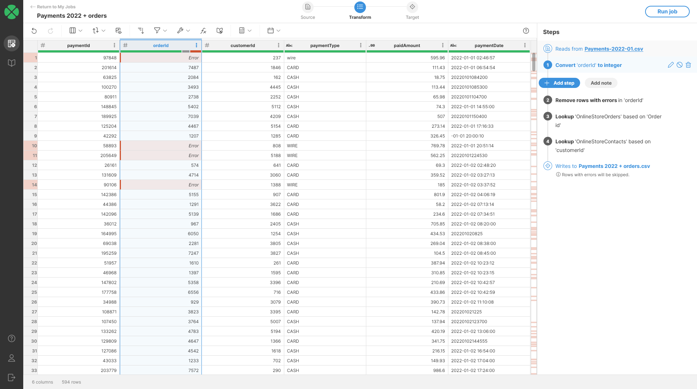
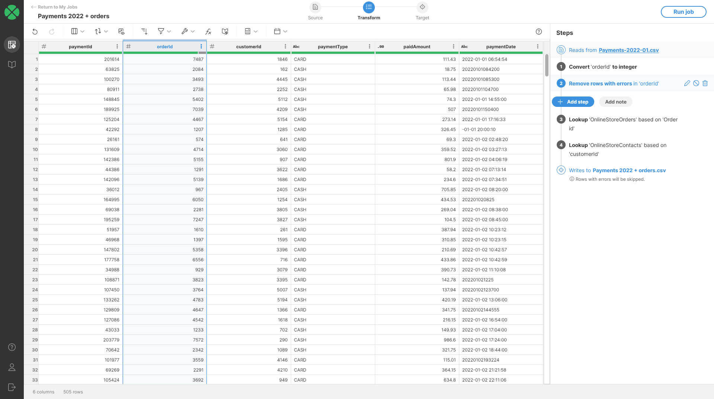

<!-- End user’s guide > Wrangler user guide > Transformation steps > Error handling steps > Remove rows with errors -->

##### Remove rows with errors

The **Remove rows with errors** step removes all rows that have error in the specified column or columns.

###### Parameters

- **Error position**: required, select where to look for errors:
  - **in any column**: consider all columns from the whole data set and remove rows that contain errors in any column.
  - **in selected column**: only consider selected column and remove rows that contain error in that column only.

###### Example

Consider a data set like the one below where we have payments data and we were unable to convert `$orderId` column to integer. This means that we would not be able to join the data with order data and then further with customer data.

To avoid transforming rows that cannot be used, we can easily remove them all from the process by using [Remove rows with errors](wrangler-step-remove-rows-with-errors.md) configured to look into `$orderId` column. The output will then look like this:

###### See also

- [Error handling in Wrangler](transforming-data.md#error-handling-in-wrangler)
- [Replace errors step](wrangler-step-replace-errors.md)
- [Clear error cells step](wrangler-step-clear-error-cells.md)
- [Fill down step](wrangler-step-fill-down.md)
