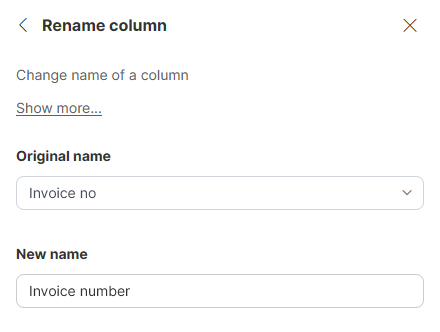

<!-- End user’s guide > Wrangler user guide > Transformation steps > Data set manipulation steps > Rename column -->

##### Rename column

**Rename column** step allows you to change the name of a column in your data set. After the step, you will have to use the new name to refer the column.

###### Parameters

- **Original Name**: required, a column to rename (chosen from the dropdown list).
- **New Name**: required, the name you wish to give to your column.

###### Examples

To change name of the `Invoice no` column to `Invoice number` use the following settings:

###### Remarks

- New name of the column can contain special characters (like spaces). New technical name for the column will be derived by replacing those with underscore character "_".
- If a column you are renaming no longer exists in your data set (this can happen either if you changed the steps before **Rename column** step or if your data source changed), the step will fail. You will get an error similar to *Column 'Column_to_rename' doesn’t exist*.

###### See also

- [Add column step](wrangler-step-add-column.md)
- [Duplicate column step](wrangler-step-duplicate-column.md)
- [Delete column(s) step](wrangler-step-delete-column.md)
- [Rename column step](wrangler-step-rename-column.md)
- [Reorder columns step](wrangler-step-reorder-columns.md)
- [Merge columns step](wrangler-step-merge-columns.md)
- [Split column step](wrangler-step-split-column.md)
