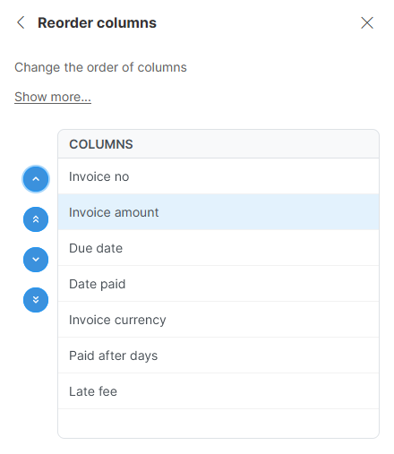

<!-- End user’s guide > Wrangler user guide > Transformation steps > Data set manipulation steps > Reorder columns -->

##### Reorder columns

**Reorder columns** step allows you to change ordering of columns within the data set. It does not modify the data in way, except for changing the relative positions of the columns within the data set.

###### Parameters

- **Columns**: required, a widget that allows you to reorder columns using the arrows to the left of the column list. Following actions are available in the list:
  | Icon | Action |
  | --- | --- |
  |  | Move the selected column(s) to the beginning of the data set. |
  |  | Move the selected column(s) by one towards the beginning of the data set ("up" in the list of columns). |
  |  | Move the selected column(s) by one towards the end of the data set ("down" in the list of columns). |
  |  | Move the selected column(s) to the end of the data set. |
  You can select multiple columns at once with *Ctrl+click* (or *Control+Click* on Mac). You can unselect one of the selected columns in the same way - with *Ctrl+Click*.

###### Examples

To change the order of columns so that `Invoice amount` column is the second column, use the widget to select `Invoice amount` and move it using arrows to the second place in the list:

###### Remarks

- **Reorder columns** will work also if some of the columns you moved are no longer in the data set (this can happen either if you changed the steps before **Reorder columns** step or if your data source changed). In such case, the missing columns are ignored by the step and other column movements are performed as configured.

###### See also

- [Add column step](wrangler-step-add-column.md)
- [Duplicate column step](wrangler-step-duplicate-column.md)
- [Delete column(s) step](wrangler-step-delete-column.md)
- [Rename column step](wrangler-step-rename-column.md)
- [Reorder columns step](wrangler-step-reorder-columns.md)
- [Merge columns step](wrangler-step-merge-columns.md)
- [Split column step](wrangler-step-split-column.md)
