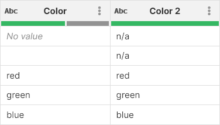
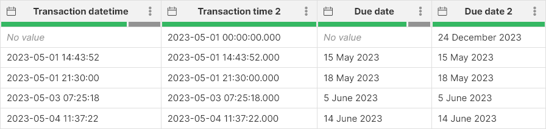
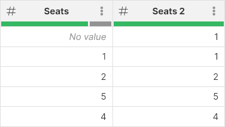
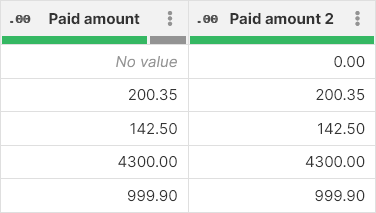

<!-- End user’s guide > Wrangler user guide > Transformation steps > Error handling steps > Replace empty values -->

##### Replace empty values

**Replace empty values** allows you to replace *No value* or empty strings with a constant value. The step is useful, for example, to provide default values when the input does not provide a value.

###### Parameters

- **Input column**: required, a column of any type in which you’d like replacements to be made.
- **Replacement**: required, value to use when an empty string or *No value* is encountered in specified input column. The data type and formatting of the replacement value depends on the data type of the input column:
  - **boolean**: use either `true` or `false`.
  - **integer**: use numbers without any grouping, e.g., use `123456` instead of `123 456`.
  - **decimal**: write decimal values without any grouping and with a period as the decimal character, e.g., `123456.789` instead of `123,456.789`.
  - **string**: write a string without enclosing quotes, e.g. `replacement text`.
  - **date**: write date or date and time using one of the following formats:
    - `yyyy-MM-dd HH:mm:ss` (e.g., `2023-08-01 08:09:07`)
    - `yyyy-MM-dd HH:mm` (e.g., `2023-08-01 08:09`)
    - `yyyy-M-d H:m:s` (e.g., `2023-8-1 8:9:7`)
    - `yyyy-M-d H:m` (e.g., `2023-8-1 8:9`)
    - `yyyy-M-d` (e.g., `2023-8-1`) - in this case the date is considered as `2023-08-01 0:00:00`
- **Target column**: required, configure the column which will receive the output. The data type of the output column will remain without change.
  - **Write result to the current column**: overwrite the input column with the result.
  - **Create new column with name**: create a new column with the specified name. The name of the new column can contain spaces or special characters - the technical column name will be created automatically. The new column will be placed right after the input column.)

###### Examples
String values
In this example, we read data from the `Color` column and write the result into the `Color 2` column. Notice that the empty string in the second row was also replaced with `n/a`.

Date values
When specifying the date replacement, the formatting of the Replacement parameter is always `yyyy-MM-dd HH:mm:ss.SSS` regardless of the formatting of the input column. In the following screenshot, we show two replacements:

- The *Transaction datetime* column uses replacement `2023-05-01` without the time part. Midnight on the given date is used. The result is in the `Transaction time 2` column.
- The *Due date* uses replacement `2023-12-24` even though the column formatting is configured as `d MMMM yyyy`. The result is in the `Due date 2` column.

Integer values
We read from the `Seats` column and write the output into the `Seats 2` column.

Decimal values
We read from the `Paid amount` column and write the output into the `Paid amount 2` column.

Boolean values
Replacement written as `false` is used. Note that you cannot use `yes` or `no` etc. in the replacement value, only `true` and `false` are allowed.

###### See also

- [Replace errors step](wrangler-step-replace-errors.md)
- [Calculate formula step](wrangler-step-formula.md)
- [Fill down step](wrangler-step-fill-down.md)
