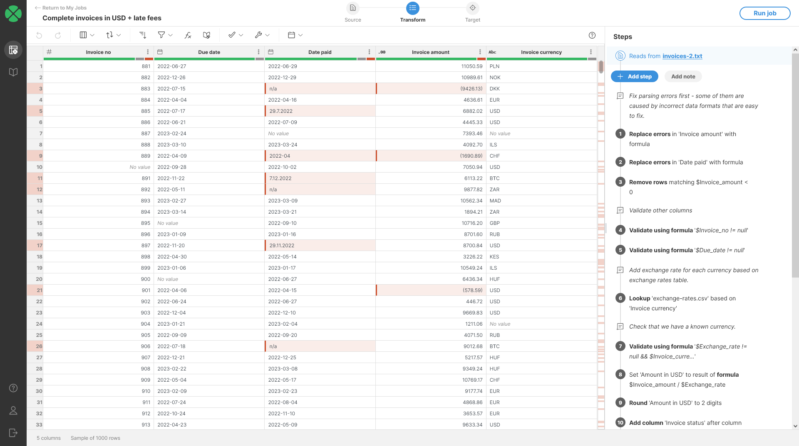
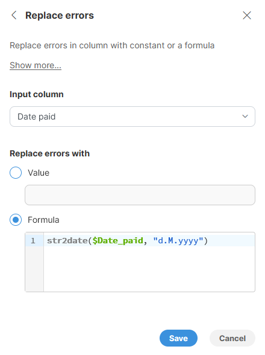
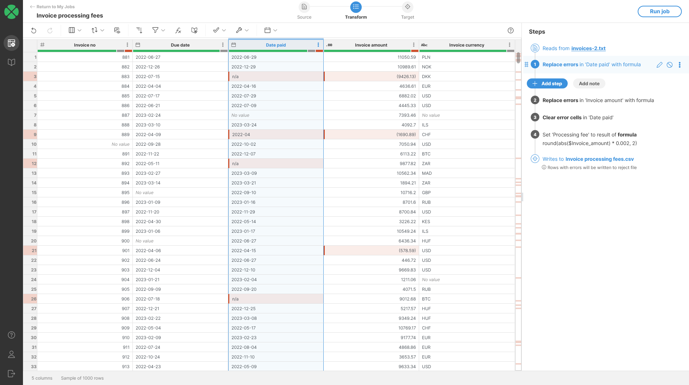
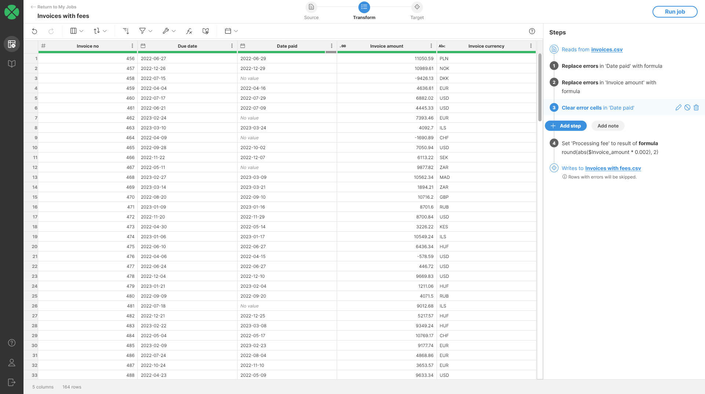

<!-- End user’s guide > Wrangler user guide > Transformation steps > Error handling steps > Replace errors -->

##### Replace errors

The **Replace Errors** step replaces all errors in the selected column with the specified constant value or the result of the specified formula. Rows that do not have any error in the selected columns will not be changed.

When replacing with a constant, all errors in the selected column will be replaced with the same value.

When replacing with a formula, the formula will be calculated only for rows where there is an error in the selected column.

###### Parameters

- **Input Column**: required, column in which you’d like to replace the errors.
- **Replace errors with**: required, configures what is the replacement value for errors in the column:
  - **Value**: allows you to configure constant value to replace **all** errors with. The replacement value type must match the type of your column. The type then determines the formatting you have to use. See more in the [Remarks section](wrangler-step-replace-errors.md#remarks).
  - **Formula**: allows you to write a formula to calculate for each row with an error. The formula can access the original value of the cell in case the error is a data error. See more details in examples below.

###### Example

In our example invoices data set we could get data that looks like this:


*Figure 108. Original data set with errors.*

Notice the `Date paid` column - it contains a variety of errors that we can fix with the [Replace errors step](wrangler-step-replace-errors.md). We’ll be able to recover data from the cells that contain incorrectly formatted dates and we’ll be able to remove `n/a` values from cells that contain it.
Fixing wrong formatting
To fix the cells with the wrong format, we can use a formula that attempts to parse the data in a different format:



Once we apply this step, we will see our data quality improve:


*Figure 109. Data set after the first fix is applied.*

We can fix the `Invoice amount` column in a similar way - some of the values in that column look like `(9426.13)`. This is a number format sometimes used in accounting to represent negative values. To parse this format, we can use the same approach as for fixing the date, but with a slightly different step formula in the step:

```
str2decimal($Invoice_amount, "0.00;(0.00)")
```

This formula relies on the fact that we can specify two different patterns for numbers - the part of the pattern before the semicolon specifies how to read positive numbers while the second part specifies how to read negative numbers.

To clean the rest of the errors we can use the [Clear error cells step](wrangler-step-clear-error-cells.md) on the `Data paid` column.



###### Remarks

- When entering a value of the **Replace errors with** parameter, follow these rules:
  - **Integer columns**: replacement value must be an integer written without any spaces or other symbols used for grouping (i.e., `123456` is ok, `123,456` is not).
  - **Decimal columns**: replacement value must be a decimal written with a period as the decimal symbol and without any digit grouping (i.e., `123456.05` is ok, `123,456.05` is not).
  - **String columns**: replacement value must be a string and must be written without enclosing double quotes (i.e., write `example` instead of `"example"` otherwise quotes will be used in your data).
  - **Date columns**: replacement value must be a date or date and time using one of the following formats:
    - `yyyy-MM-dd HH:mm:ss` (e.g., `2023-08-01 08:09:07`)
    - `yyyy-MM-dd HH:mm` (e.g., `2023-08-01 08:09`)
    - `yyyy-M-d H:m:s` (e.g., `2023-8-1 8:9:7`)
    - `yyyy-M-d H:m` (e.g., `2023-8-1 8:9`)
    - `yyyy-M-d` (e.g., `2023-8-1`) - in this case the date is considered as `2023-08-01 0:00:00`
  - **Boolean columns**: you must use either `true` or `false`.

###### See also

- [Error handling in Wrangler](transforming-data.md#error-handling-in-wrangler)
- [Calculate formula step](wrangler-step-formula.md)
- [Remove rows with errors step](wrangler-step-remove-rows-with-errors.md)
- [Clear error cells step](wrangler-step-clear-error-cells.md)
- [Fill down step](wrangler-step-fill-down.md)
