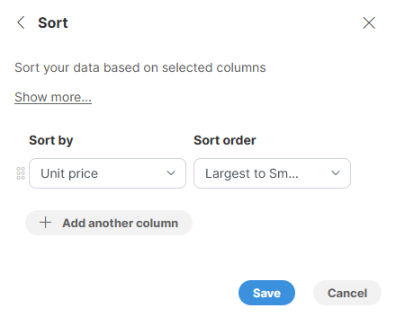
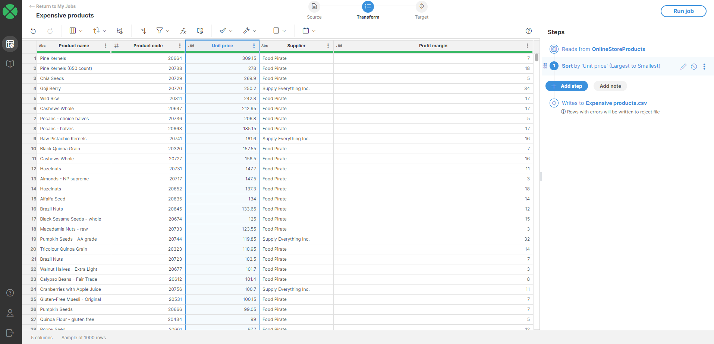
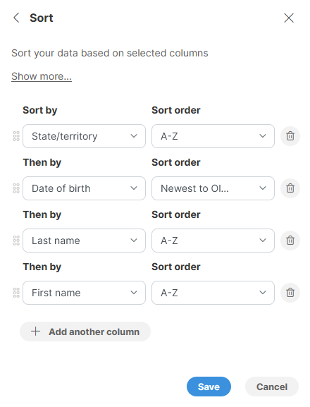
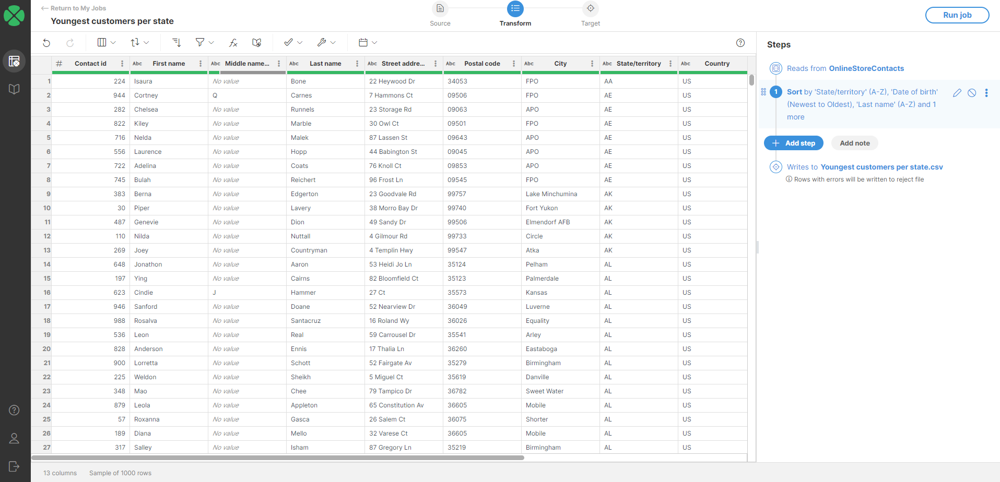
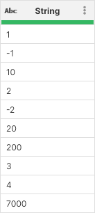
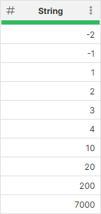
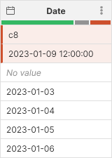

<!-- End user’s guide > Wrangler user guide > Transformation steps > Data set manipulation steps > Sort -->

##### Sort

**Sort** allows you to sort your data based on selected columns and direction (ascending or descending).

###### Parameters

**Sort** step configuration is defined as a list of sort key settings. Each sorting key is represented by a column and sorting direction. This allows you to easily configure sorting by multiple columns. Each sort key is configured by using two parameters:

- **Sort by**: a key column the data set will be sorted by. All column data types are supported for sorting. Each column can appear only once.
- **Sort order**: configure the sorting direction. The choices will depend on the data type:
  - For numeric columns (integer and decimal) select either **Smallest to largest** (ascending) or **Largest to smallest** (descending order).
  - For string columns select either **A-Z** (ascending) or **Z-A** (descending).
  - For date columns select **Oldest to newest** (ascending) or **Newest to oldest** (descending).
  - For boolean columns select either **False first** or **True first**.

###### Examples
Sorting by single column
To find most expensive products, we can sort our product data set by product `Unit price` column in descending order (i.e., **Largest to smallest**):

The output will look like this:

Sorting by multiple columns
If we wanted to see youngest customers in each state, we can do this by sorting our contacts data set by `State` column, then by `Date of birth` (in descending order) and finally we can also sort by `Last name` and `First name` to make the output nicer.

The output may look like this:

###### Remarks

- Each **Sort** step can have multiple sorting columns. You can add them in any order and then use drag handles to the left of each sorting key column to rearrange the columns.
- Sorting can take long time to finish on very large data sets.
- Sorting of string column uses case-sensitive comparison. This means that lower-case letters are considered to be before upper-case letters when sorting in ascending order.
- Note that if you have numbers stored in a string column, it will not be sorted properly by number value but rather lexicographically. For example, consider the following picture where we have data sample with numbers in string column sorted in "ascending" order (from smallest to largest):
  
  To sort these numbers properly, convert the column to integer (or decimal) first:
  
  Notice the changed header icon - it shows the column is now integer instead of a string.
- *Error* is treated as the lowest value for any data type. Next lowest value is *No value* (`null`). For example, the below data set has been sorted based on a date column in ascending (Oldest to newest) order:
  
  Notice how both errors are at the top (they are first) regardless of what is written in them, followed by *No value* and finally the valid data is sorted in ascending order.

###### See also

- [Filter rows based on formula](wrangler-step-filter-with-formula.md)
