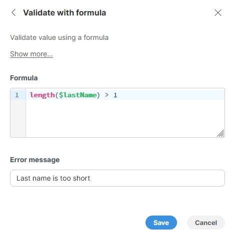

<!-- End user’s guide > Wrangler user guide > Transformation steps > Data validation (data quality) steps > Validate with formula -->

##### Validate with formula

The **Validate with formula** step allows you to validate values in a column based on result of validation formula. If the validation formula returns `true`, the value is considered valid. Otherwise, the value is considered invalid, and the step allows you to configure a custom error message that will be reported in the data preview.

Rows with these errors are automatically rejected and included in the reject file when running the job. See [Job Run Details](transforming-data.md#job-run-details) for more information on reject files, and refer to [fixing errors](transforming-data.md#fixing-errors) for our recommendations on how to deal with data errors.

###### Parameters

- **Formula**: the validation formula that is calculated for each row in your data set. The formula can use any number of columns - it does not have to be limited to just one column in your data. The formula must return `true` or `false`.
- **Error message**: an error message that will be reported on each column that is contained within the formula if the formula returned `false`. The error message is a static text - it cannot contain references to column names or any calculations.

###### Usage

The *Validate with formula* step works by evaluating the validation formula for each row in your data set. Based on the result (whether the formula returns `true` or `false`) it can mark values in a row as invalid.

The values are considered invalid if the formula returned `false`. In such case, values from all columns that are referenced in the formula will be marked as invalid.

*Figure 111. Simple configuration to validate that last name is at least 1 character long.*

See below for additional examples of how to use the step to validate your data in common situations.

Note that the *Validate with formula* step never changes your data in any way - it can attach a validation error to a value but cannot change the value itself.
Common validation rules
In many cases the validation rules you’d need for your data will be quite simple. This section provides overview of the most common types of validation and corresponding validation formulas. You can use these as guidelines for writing your own formulas for similar validations.
Empty and non-empty values
Frequently you’ll need to validate whether a column value is not empty - i.e., the value is required. The formula depends on the type of your column:

- **numeric columns** (decimals or integers): `$amount != null`, same way for integer as well as decimal columns.
- **string columns**: multiple different formulas exist depending on what is considered to be an empty string:
  - `!isBlank($name)` uses `isBlank` function to determine if the value is a zero-length string, `null` or if the string is composed entirely of whitespaces. `isBlank` also considers strings consisting of whitespaces to be empty - for example, a single space will be considered an empty string, too.
  - `$name != null` tests for `null` values only. Zero-length strings will be considered valid.
  - `$name != ""` tests zero-length strings only, `null` values will be considered valid.
  - `$name != "" && $name != null` tests whether the `$name` is zero-length or `null`. Any other string (including whitespaces) is considered valid.
- **date columns**: `$dueDate != null`
- **boolean columns**: `$isActive != null`
Value in range
You can use conditional expressions to test whether value is in specific range - whether the range is bounded on the lower bound only, upper bound only or both.

- `$amount > 0` to validate that the value is greater than 0. Note that this will fail if the value is `null` (empty). To reject empty values as well as values that are less than zero, you’d need to use a formula like `$amount != null && $amount > 0`.
- `$yearOfBirth >= 1900 && $yearOfBirth <= 2023` to test whether `$yearOfBirth` is between 1900 and 2023 (including both endpoints).
Values matching patterns
To match against patterns, regular expressions can be used like this:

- `$accountId ~ "A[0-9]+"` will validate that the account id consists of upper case letter A followed by at least one digit.
- `matches($accountId, "A[0-9]+")` this is an alternative way - using `matches` function instead of `~` operator. The result is the same as in the previous example.
- `matches($zipCode, "[0-9]{5}(-[0-9]{4})?")` to verify that `$zipCode` is either 5-digit format or 5+4 digits.
String length
Often times you need to ensure that values are long enough or not too long. This can be accomplished by using `length` function:

- `length($lastName) > 1` to ensure that `$lastName` is at least one character long.
- `length($lastName) < 50` to ensure that `$lastName` is 50 characters at maximum.
Values in lists (enumerations)
To test whether value is in a list or not, you can use `containsValue` function. This works for all data types although string values are most common.

- `containsValue(["red", "green", "blue"], $color)` test whether the `$color` is one of "red", "green" or "blue". The test is exact - i.e. "RED" is considered invalid.
- `containsValue(["red", "green", "blue"], lowerCase($color))` is similar to above but also will allow values like "RED" as valid values. The value of `$color` is first converted to lower-case using `lowerCase` function before it is tested against the list of allowed values.
- `containsValue([1, 2, 3], $accountType)` validates whether `$accountType` is one of 1, 2 or 3. Note the list does not contain quotes - the values are integers and must not be quoted.
> [!NOTE]
> If you wish to test value against a large list (more than handful of items), it is better to use [Lookup step](wrangler-step-lookup.md). Lookup step allows you to store even larger number of items to test against in a file or the values can be provided by a connector available in the [Data Catalog](data-catalog.md).
Complex validation rules
The validation expression can be of any complexity. We recommend that you split the expression into multiple steps if it becomes too long or too complicated - this will improve the readability of your transformation.
Multiple columns in formula
It is possible to use more than one column when validating your data. For example, consider an invoice where you have columns for total without tax, tax amount and total amount with tax. All three values must match for the invoice to be considered valid. You can validate this with a formula like `$totalBeforeTax + $tax == $totalWithTax`. If this formula returns `false`, all three values will be marked as invalid since without additional information it is not possible to say which of the values is valid or not (i.e., is the tax calculated incorrectly and total amount is ok? Or is the total amount incorrect while the tax and total before tax are ok?).

###### Remarks

- If the calculation of a formula in the validation step failed for any reason, the value is marked as "in error" with the error message describing the validation formula failure.
- If the validation formula returns `null`, an error message is generated and the value is marked as invalid.
- Running validation on an *Error* value does not try to validate the value and instead produces an *Error* right away.

###### See also

- [Using formulas](transforming-data.md#using-formulas)
  - [Mathematical operators](transforming-data.md#mathematical-operators)
  - [Comparison operators](transforming-data.md#comparison-operators)
  - [Logical operators](transforming-data.md#logical-operators)
- [How to work with date values](wrangler-faq.md#how-do-date-values-work)
- [How to work with strings (text)](wrangler-faq.md#how-can-i-use-strings-how-to-work-with-text-data)
- [Validation steps](wrangler-validation-steps.md)
- [Validator component in CloverDX Designer](../developer/validator.md)
