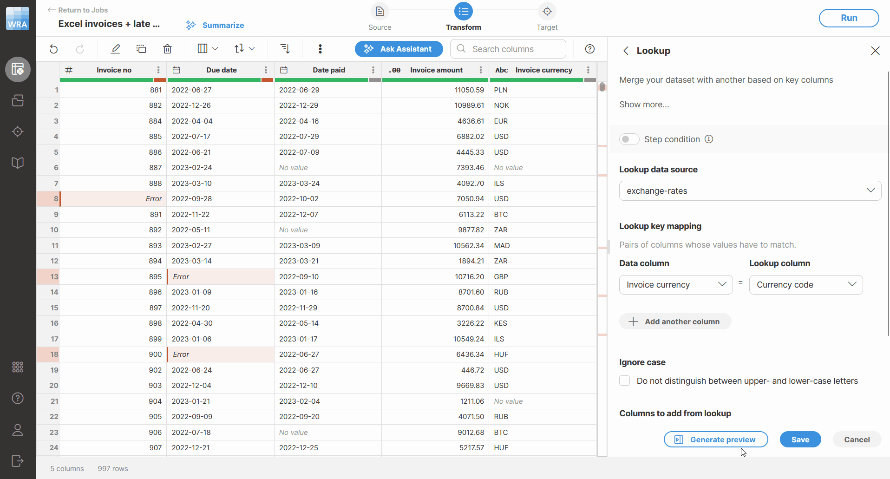
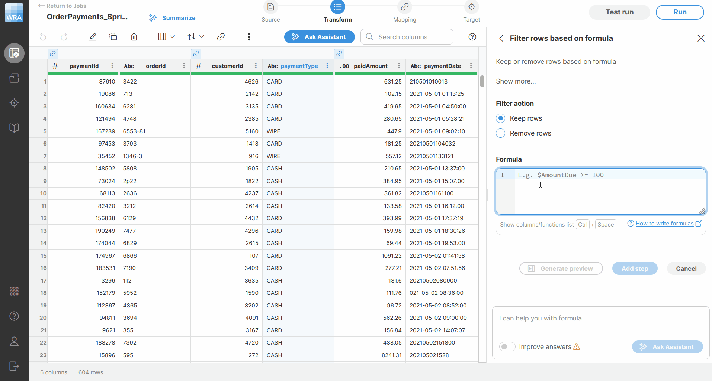

<!-- End user’s guide > Wrangler user guide > Transformation steps > Basics -->

#### Basics

Wrangler provides a wide range of transformation steps that help you clean, validate, enrich, and reshape your data. These steps cover common data preparation tasks such as text and date transformations, calculations, data quality checks, anonymization, filtering, and operations that work with the structure of the data set.

When working with supported transformation steps, you can also use [step preview](wrangler-steps-list-basics.md#step-editing-and-step-preview) to inspect the expected result before applying the step. Preview helps you validate the effect of the edited step directly while configuring it, so you can better understand how the step affects your data before saving the change. This is especially useful for steps that use formulas or produce calculated output.

##### Step editing and step preview

When you select a step in Wrangler, its configuration is opened in the sidebar, where you can review and adjust its settings. This allows you to edit the step while keeping the data preview visible, so you can stay in context and immediately see how the configuration relates to your data.

For supported steps, the editor provides preview functionality, which helps you inspect the expected output before applying the step. This helps you validate changes earlier and better understand how the edited step affects your data.

Step preview is shown in a panel next on top of the main data preview. Step preview displays the output produced by the currently edited step together with the related source columns when they are needed for context. This allows you to compare the original values with the previewed result directly during editing.

*Figure 104. Step preview showing the output of the Lookup step.*

For steps that remove rows from the data set, the preview will show you which rows will be removed since there are no newly produced output columns or values. This applies to steps such as [Filter rows based on formula](wrangler-step-filter-with-formula.md) and [Remove rows with errors](wrangler-step-remove-rows-with-errors.md).

These steps do not change values or create new columns. Instead, they remove rows from further processing based on various conditions. To make this clear before applying the step, rows that will be removed are highlighted in the preview, while rows that will remain are shown without this highlight.

*Figure 105. Step preview showing rows which will be removed with yellow background.*

Filtered-out rows are also marked in the custom vertical scrollbar. The markers are positioned proportionally to the row location in the preview, similarly to error indicators, so you can notice affected rows even when they are outside of the currently visible part of the preview.

To load or update the preview, click **Generate preview** in the step editor. Depending on the edited step, the preview may show one output column or multiple output columns. Preview is available for almost all steps with small exceptions (e.g. Sort, Deduplicate, Group by and few others).
