<!-- End user’s guide > Wrangler user guide > Tutorial: Getting started with Wrangler -->

### Tutorial: Getting started with Wrangler

This chapter provides a quick introduction to using CloverDX Wrangler and the Wrangler Assistant when creating your transformations. This step-by-step tutorial walks you through preparing an invoice dataset in CloverDX Wrangler from start to finish. You’ll connect data, organize work into clear blocks, add core transformations, and produce a clean output ready to be used.

You’ll learn how to

- connect a source,
- create a block and add transformation steps,
- enrich data with a lookup table,
- add basic calculations,
- run the job and view its results.

The text is split into two parts each dealing with different approaches to building your transformations in Wrangler.

In the first part, [Solve the task using the Wrangler Assistant](wrangler-tutorial.md#solve-the-task-using-the-wrangler-assistant), you’ll learn how to effectively use the Wrangler Assistant to create a transformation job. This is usually the fastest way of building jobs in Wrangler and does not require any technical knowledge to get started.

In the second part, [Solve the task manually without AI](wrangler-tutorial.md#solve-the-task-manually-without-ai), you’ll learn how to create Wrangler transformations without using AI. This approach gives you additional control over what your finished jobs look like while still being very simple and requiring no technical skills to complete.

Both parts of the tutorial use the same example to allow you to see the differences between working with AI and working without AI. The best part of Wrangler is that you can combine both approaches at any time - you can easily create part of your job with AI and part without it editing your steps as needed. This is the most effective way of building jobs in Wrangler.

Since both parts of the tutorial produce the same outcome, you can start with any of them and review the other half later. The tutorial also provides many links to relevant parts of the documentation where you can read more about any given topic. They do not have to be read as you are working on the tutorial, but you can come back later if you’d like to learn more about Wrangler.

#### Tutorial task

Imagine you work as part of your organization’s finance team. Your newest task is to create a simple report of receivables in USD while highlighting items that are past-due. For past-dues, you also need to calculate the late fee that is derived as 0.1% of the receivable amount per day the invoice is late. To ensure you convert between currencies in standardized way, your team uses a simple exchange rates table that provides exchange rates between receivable currencies and USD (which is your reporting currency).

Your task will require you to work with two files:

- [**Invoices sample.xlsx**](https://github.com/cloverdx/cloverdx-examples/raw/refs/heads/main/WranglerTutorial/Invoices%20sample.xlsx): main data set containing information about invoices, their due dates, date paid and more.
- [**Exchange rates.csv**](https://raw.githubusercontent.com/cloverdx/cloverdx-examples/refs/heads/main/WranglerTutorial/Exchange%20rates.csv): a look-up table providing exchange rates between selected currencies and USD.

To continue with the tutorial, please download these files and save them to your computer. You can either download the files using the links above or from CloverDX’s GitHub [cloverdx-examples/WranglerTutorial](https://github.com/cloverdx/cloverdx-examples/tree/main/WranglerTutorial).

You’ll upload them to your CloverDX Wrangler as part of this tutorial.

#### Solve the task using the Wrangler Assistant

In this section you’ll learn how you can use the Wrangler Assistant to create jobs in Wrangler. Note that since AI can respond in different ways, you may get different responses (even for the same prompts) than what you see on screenshots in this chapter. If you do not get a good response, you can always ignore it and try again (even by invoking the same functionality) - the Assistant does not make any changes to your jobs on its own and it always requires confirmation when adding steps.

##### Step 1: Uploading sample files to Wrangler

- Open the [**Sources**](data-sources-data-targets.md#sources) screen in Wrangler.

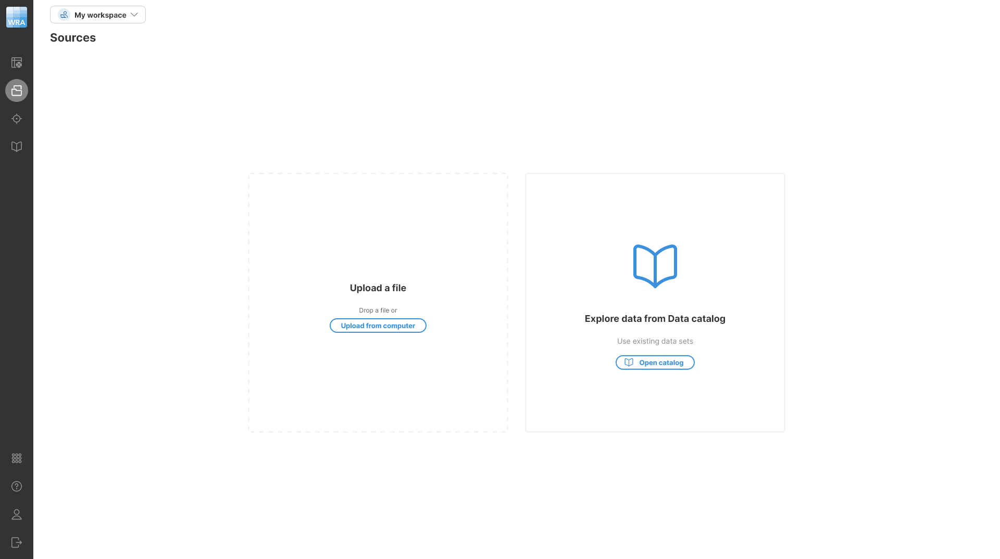
*Figure 2. Sources screen.*

- To upload a file, simply drag and drop the file to the top-left part of the screen or press the **Upload** button to select a file from your computer.
- Upload the **Exchange rates.csv** file first. This will create a new source for this file, and you’ll be able to see the contents of the file.

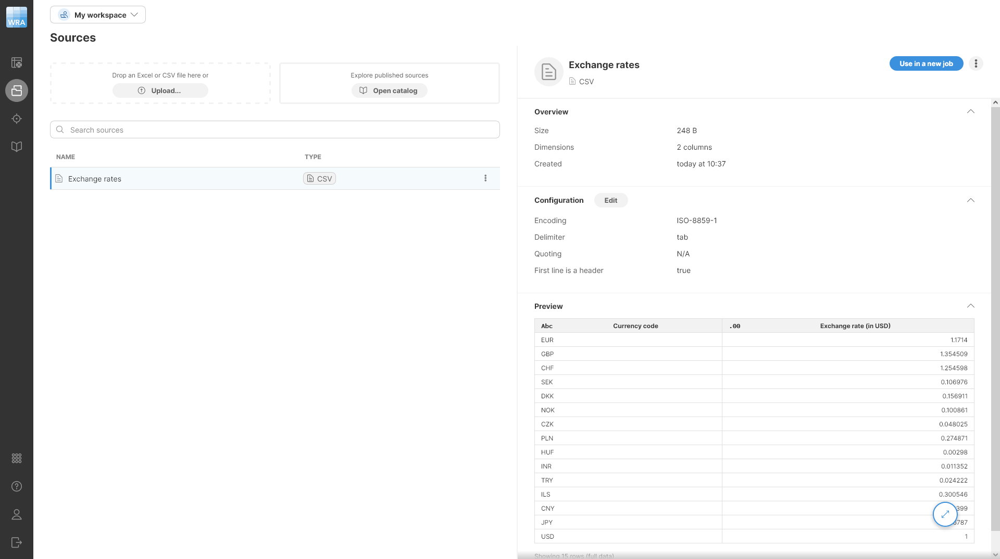
*Figure 3. Data source showing the contents of the Exchange rates.csv file.*

- Upload the **Invoices sample.xlsx** file in the same way.
- Once the file is uploaded, make sure it is selected and then click on the **Use in a new job** button in the top-right corner of the screen.
- Give your job a name - for example, **Late fees**. Click on **Create**. You’ll see a large preview of your data with empty **Transform** side panel. This is the job editor screen in Wrangler where you can create and edit your transformations using AI or manually.

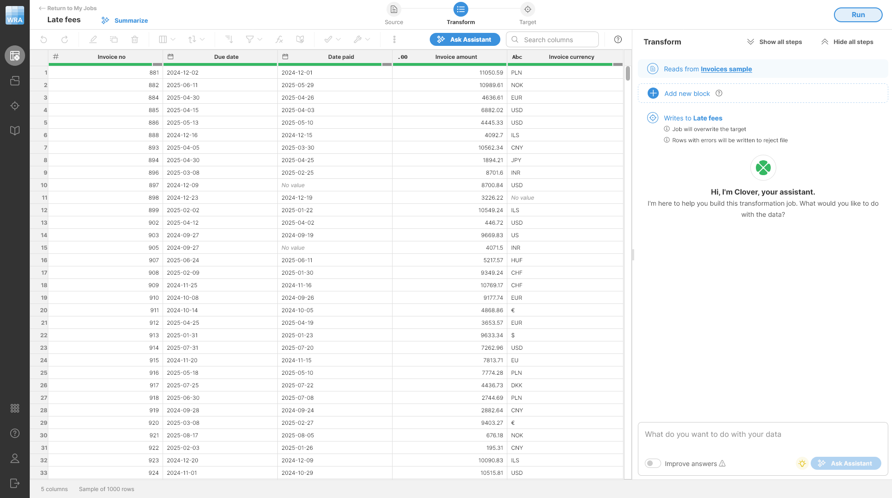
*Figure 4. Empty job showing the data preview and Wrangler Assistant welcome screen in the Transform side bar on the right side.*

Note that if you do not have the Wrangler Assistant enabled or configured, you will not see the Assistant welcome screen - you’ll only see the empty Transform panel. In such case, please ask your CloverDX administrator to configure and enable the Wrangler Assistant for you. In the meantime, you can continue with the tutorial [without the Assistant](wrangler-tutorial.md#solve-the-task-manually-without-ai).

##### Step 2: Find overdue invoices

Before you can add transformations, you need a **block**. A **block** is a container for related steps. It helps you to group transformations logically and makes longer jobs easier to maintain.

You can create a block in two ways:

- With the Wrangler Assistant by typing your request in the **Ask Assistant** box.
- Manually, using the **Add new block**.

In this part of the tutorial, you’ll use the Assistant to create the block and transformation steps within it. The Assistant will create a new block automatically - you only need to type your request.

To find overdue invoices, do the following:

- Type the following request into the **Ask Assistant** box in the bottom right:
  ```
  Filter overdue invoices from input dataset.
  ```
- Press **Enter** or click **Ask Assistant** button to submit the request.

Your view will switch to the Ask Assistant view which represents your conversation with the Assistant. The conversation is represented as a block in your Wrangler job. Once the AI responds, the response will look like this:

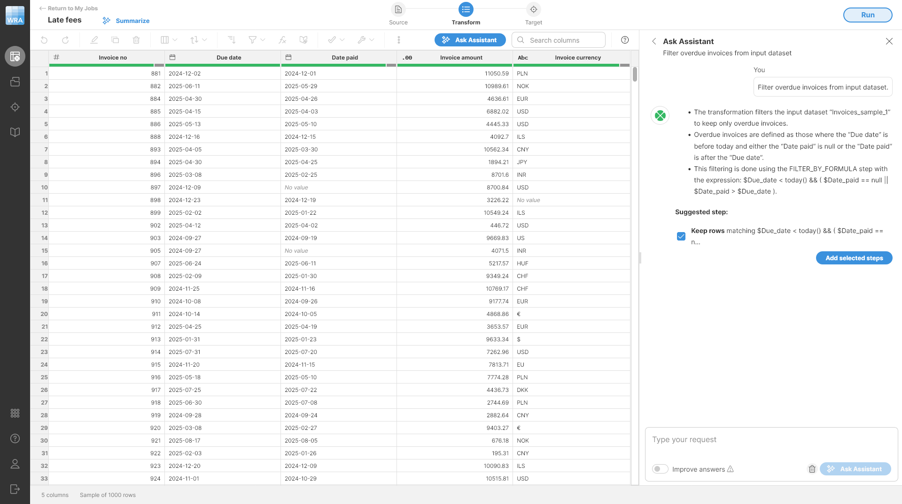
*Figure 5. Ask Assistant view showing one suggested step to filter invoices so that only overdue invoices remain.*

If you are happy with the proposed step (or steps), simply click on the **Add selected steps** button. This accepts the selected steps, creates a new block, and switches the view back to the job editor with refreshed data preview so you can see the results right away:

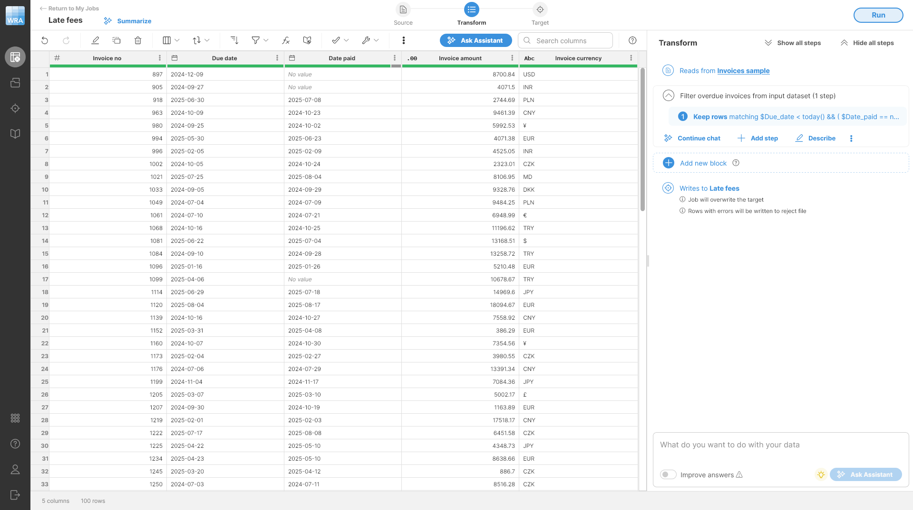
*Figure 6. Job editor showing overdue invoices.*

Notice that the Assistant created and automatically named your block to make it easier to understand what is in it. The step that was created is also selected and the data preview shows you the result of the step. If multiple steps are created or present in the job, you can easily switch between them to see what your data looks like at different stages of your transformation.

**Tip**: You can keep iterating in the same block with **Continue chat** button. You’ll see the chat history for your block and can add new steps by continuing the conversation with the Assistant.

**Tip**: You can edit the step created by the Assistant - simply hover over the step and click on the **Edit** button in the context menu. This allows you to change settings of the steps. See the [second part of the tutorial](wrangler-tutorial.md#solve-the-task-manually-without-ai) to see how to edit steps like this.

##### Step 3: Convert amounts to USD (lookup)

To provide report in your reporting currency - USD - you must convert all invoice amounts to USD using the exchange rates you’ve uploaded to Wrangler before. Just as with the first step, you can use AI to help do this. Type request like this into the **Ask Assistant** box:

```
Convert invoice amount to USD using exchange rates.
```

Once you confirm, you’ll see a response like this:

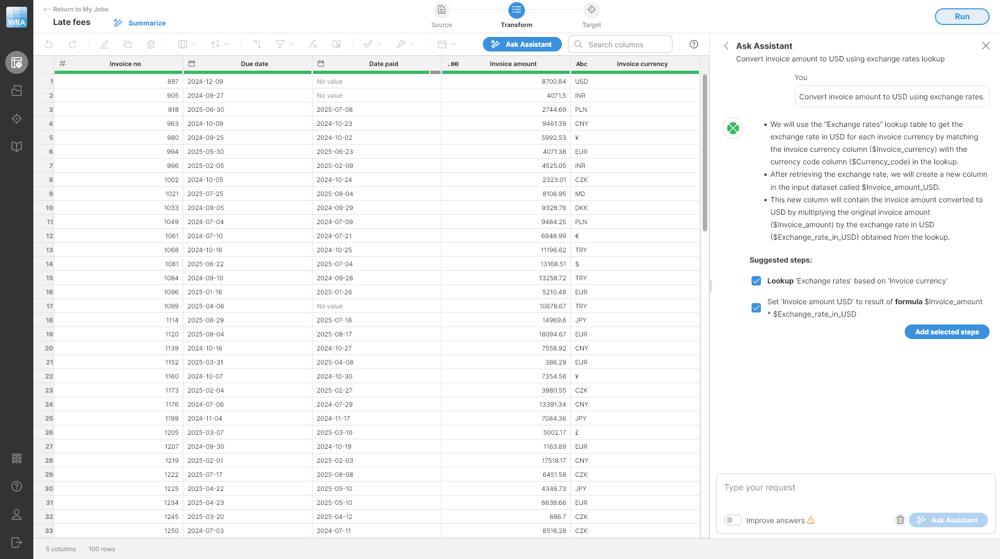
*Figure 7. Suggestions for how to convert from invoice currency to USD using exchange rates lookup table.*

In this case, the Assistant suggested two steps. First one uses the lookup table to find the exchange rates for the invoice currency (using the [**Lookup**](wrangler-step-lookup.md) step) and the second step uses the exchange rate to calculate the amount in USD (via the [**Calculate formula**](wrangler-step-formula.md) step). Accepting the suggested steps will give you a result like this:

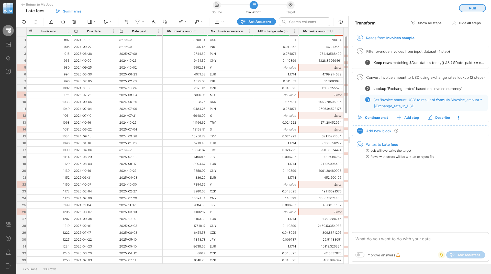
*Figure 8. Preview of the data after currency conversion. Notice the new columns Exchange rate in USD and Invoice amount USD. Also notice the red error cell in the second record - you’ll work on that in the next steps.*

##### Step 4: Dealing with data errors

The preview now shows errors in currency conversion process. Hovering your mouse over the error cell will provide you with additional information about the error:

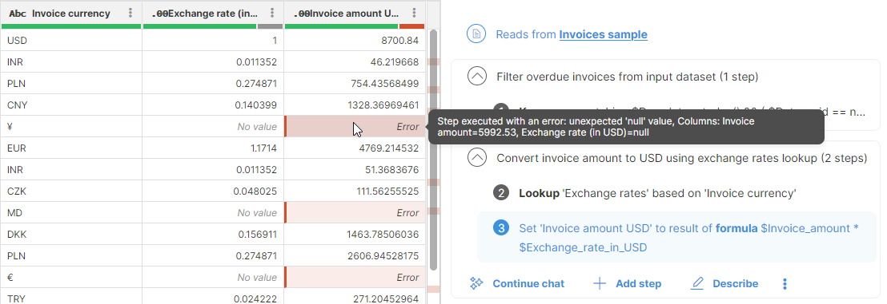
*Figure 9. A tooltip showing error details for one of the error cells.*

The error message in this case tells you that the calculation failed because the exchange rate value is empty (`null`). This is also visible in the `Exchange rate` column in the same row - the value is `null` as well. To figure out why this is the case, look into the `Invoice currency` code column. You can see that it is `HU` while all the other currency codes have three letters. This is a data quality error in the input file - the invoice contains an unknown currency code that will not match any of the codes in the exchange rates lookup table.

There are multiple ways of solving similar data quality issues in Wrangler:

- Use **Assist with fixing errors** functionality of the Wrangler Assistant. The Assistant can help you fix your errors by looking at your data (this will automatically upload sample of your data to your AI provider). It will suggest steps you can take and will modify your transformation accordingly.
- You can **leave the errors as they are**. Wrangler will keep all the data and the error message and will reject the record when it gets to the end of the process - you’ll get a **reject file**. This is best in cases where you cannot fix the data since you get a report of errors at the end of the process and you can work on fixing the data in the source. Read more about reject files and error handling [here](transforming-data.md#error-handling-in-wrangler).
- You can **update your Exchange rates** table to also contain the currency codes that did not match. In this case, this would not be difficult since there are only handful of currencies to add. To do this, you can simply edit the `Exchange rates.csv` file on your computer and reupload to Wrangler.
  You can also improve the overall approach by using [reference data set](data-manager-working-with-reference-data.md) in the [Data Manager](dm-index.md) to maintain the lookup table instead of a file - this would be much more scalable and easier to maintain, but it is outside the scope of this tutorial.
  However, the approach of fixing the lookup table like this may not always be viable due to large number of values or even missing data where you cannot easily find the correct value to use as lookup key.
- You can **update your transformation** to replace the invalid value with correct currency codes before the [Lookup](wrangler-step-lookup.md) step. This is best when there are only handful different values like this and where the data can be fixed in simple way (e.g., using [Calculate formula](wrangler-step-formula.md), [Replace text](wrangler-step-replace-text.md), another *Lookup* or other steps).

In this case, the default behavior of Wrangler is what you are looking for - it will save the rows that contain errors to a separate reject file which you can download alongside the transformation output. You can then go back to the source system with this file and ask the data owners to fix the data.

**Optional exercise**: Try implementing the other approaches to dealing with this error as mentioned above. Play with your data to get more sense about how Wrangler can be used.

##### Step 5: Adding late fees

To add late fees, just ask the Assistant using prompt like this:

```
Calculate late fee for invoices paid after due date. The fee is 0.1% of the invoice amount in USD per day the invoice is late.
```

You’ll get response like this:

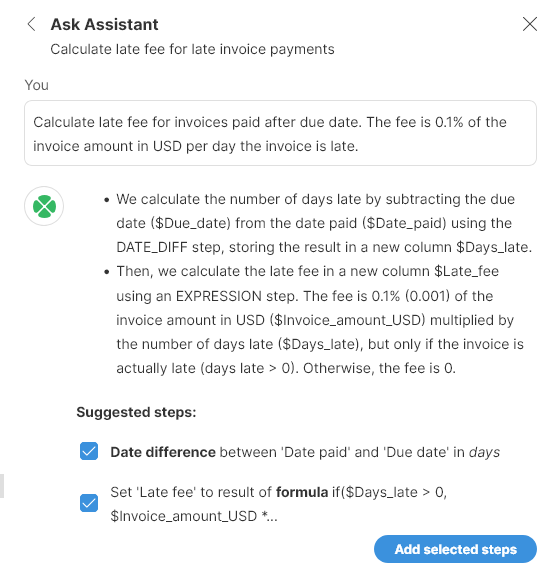

Accepting the suggestions will produce an output with larger number of errors:

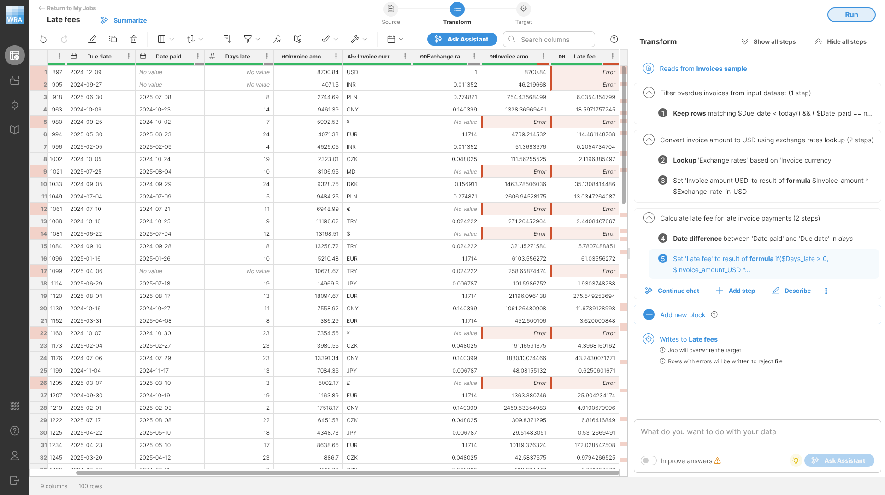
*Figure 10. A preview showing errors in the newly added Late fee column.*

Looking closely, you can see that the additional errors appear whenever the `Date paid` column is empty - for example, the first two rows are like this. This makes sense since the steps added by Assistant try to compare the `Date paid` with `Due date` and this does not make sense for empty cells.

To resolve this, you need to ensure that you can calculate late fees even for invoices that do not have `Date paid` value. In this case, these are the invoices that have not been paid yet, so you can use today as the date to calculate the late fee.

Let’s use Assistant to add this to our *Calculate fees* block. To do that, click on the **Continue chat** button on the block to go "inside" the block and see the history of your chat with the Assistant. You can then use a prompt like this in the **Ask Assistant** view inside the block:

```
Use today as the date when calculating late fee for invoices that do not have date paid.
```

And the response will look like this:

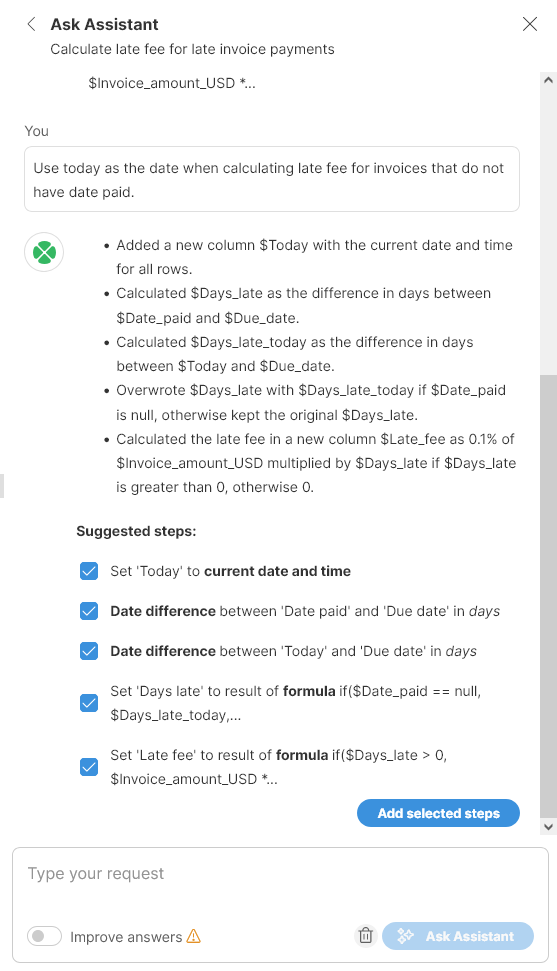
*Figure 11. Suggested steps to fix the empty due dates.*

Accepting these steps will produce an output like this:

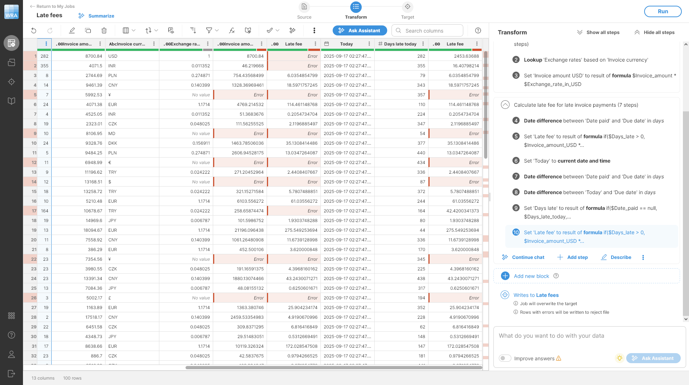
*Figure 12. Transformation after the suggested steps have been accepted.*

Since the previously accepted steps were kept in the transformation, the new steps produce duplicate columns - you can see on the screenshot two columns called `Late fee` and just outside of the view there are two columns called `Days late`. Since we only want our fixed results, we need to delete the two steps 4 and 5 that were added before. This can be done simply from the Transform view by selecting **Delete** from steps' context menu shown on hover.

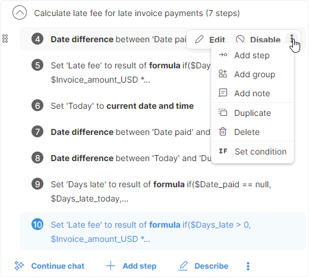
*Figure 13. Step context menu allowing you to delete the step.*

Once done, you will get a result like this:

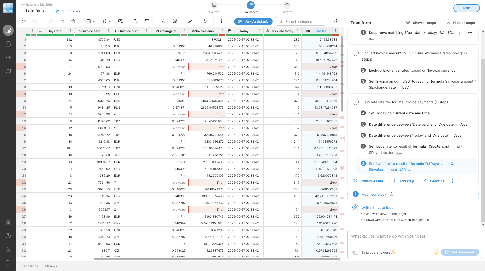
*Figure 14. Transformation after steps 4 and 5 have been deleted.*

Going back into the chat history of the *Calculate late fee* block will show you all previous steps suggestions - even the ones that have been deleted or modified later. This can help you understand the job if you come back to it later.
> [!NOTE]
> You will get an error if you first delete step 4 since step 5 depends on this. In this case this is not an issue - deleting step 5 will resolve the error.

##### Step 6: Cleaning the output

Finally, let’s clean up the result so that it is easier to review and present. Let’s make the following adjustments to your job:

- Remove all unnecessary temporary columns from the result.
- Round the numbers to two decimal places as is usual for currency values.

These changes can be made using the Assistant, but in this part of the tutorial let’s implement them without AI to show how you can combine both approaches to get the most of Wrangler. To implement the clean-up, do the following:

- Create a new block by clicking on the **Add new block** button. A new empty block will be added at the end of the transformation.
- Click on **Describe** to give the block a nice description. Let’s use "Clean-up".
- Click on **Add step** button on the block. This will show a list of all steps that are available in Wrangler. You can either find the step in the list or use the search to find it based on its name or description. Add a [**Delete column(s)**](wrangler-step-delete-column.md) step:
  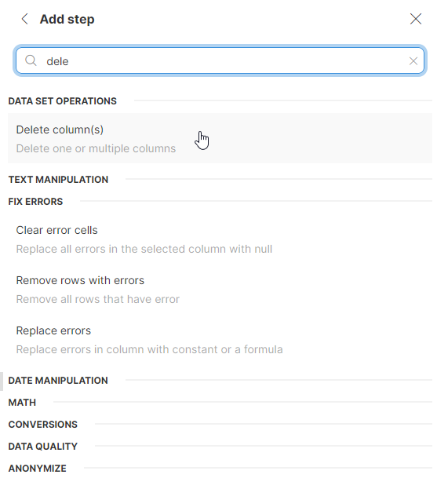
- Configure the step to delete unnecessary columns `Days late`, `Invoice amount`, `Invoice currency`, `Exchange rate (in USD)`, `Today`, and `Days late today`.
  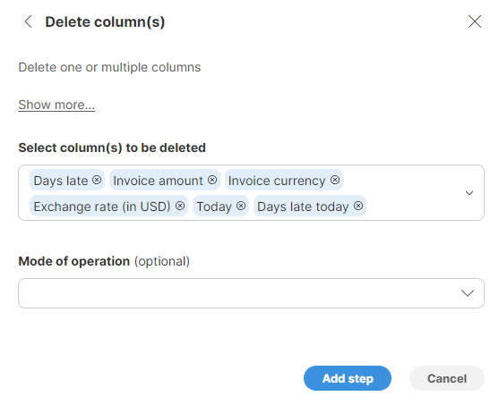
- Click **Add step** to add it to the block.
- Add a [**Round**](wrangler-step-round.md) step and configure it to round column `Invoice amount USD` to two decimal places.
- Add another [**Round**](wrangler-step-round.md) step and configure it to round column `Late fee` to two decimal places.

Your transformation will then look like this:

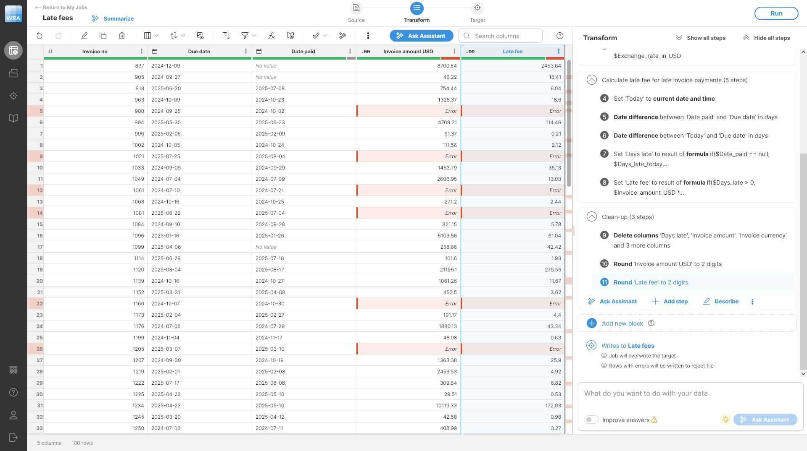
*Figure 15. Transformation after temporary columns have been deleted.*

**Tip**: To make the output even nicer, you can also format the monetary amount columns to contain the currency symbol. This can be done by right clicking a column and changing the formatting via **Change display format** menu option. Set the **Format** pattern to `$###,##0.00`. Note that the display formatting is not represented by a step, so it is not visible in the Transform view in the list of steps. See more details about data formats in [Formatting your data](transforming-data.md#formatting-your-data) section.

The cleaned output will look like this:

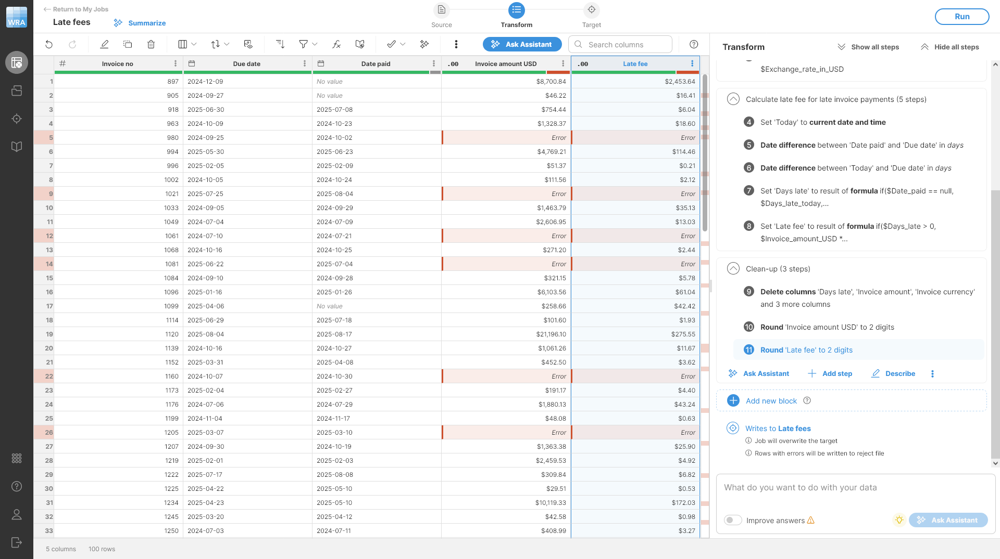
*Figure 16. Preview of the Late fees data set after basic clean-ups.*

##### Step 7: Running your job

To run the job just click the **Run** in the upper-right corner and confirm **Run job** dialog. You’ll be taken back to the **Jobs** screen and after few seconds you should see the job finishing with rejected rows like this:

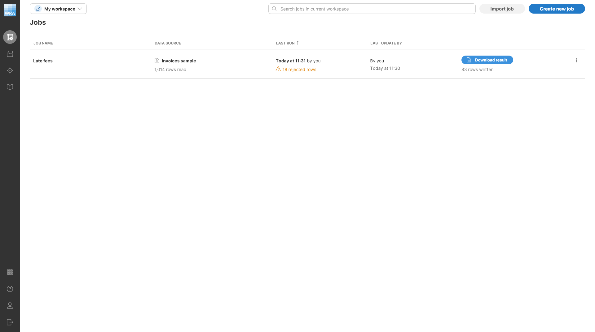
*Figure 17. Jobs screen showing the results of the job.*

On this screen, you can download the results of your jobs, see the rejected records and more. See additional details in [Getting results from your job](wrangler-faq.md#how-can-i-get-full-output-from-my-job) section.

#### Solve the task manually without AI

##### Step 1: Uploading sample files to Wrangler

- Open the [**Sources**](data-sources-data-targets.md#sources) screen in Wrangler.


*Figure 18. Sources screen when no sources have been created yet.*

- To upload a file, simply drag and drop the file to the left part of the screen or press the **Upload from computer** button to select a file from your computer. After you upload the file, the screen will change - the drop area will be in the top-left corner of the screen.
- Upload the **Exchange rates.csv** file first. This will create a new source for this file, and you’ll be able to see the contents of the file in the preview.


*Figure 19. Data source showing the preview of the Exchange rates.csv file.*

- Upload the **Invoices sample.xlsx** file in the same way.
- Once the file is uploaded, make sure it is selected and then click on the **Use in a new job** button in the top-right corner of the screen.
- Give your job a name - for example, **Late fees**. Once you confirm the dialog, your view will switch to **transformation editor** with large preview of your data with empty **Transform** side panel. The [transformation editor](transforming-data.md#working-with-transformations) screen is where you can create and edit your transformations using AI or manually.

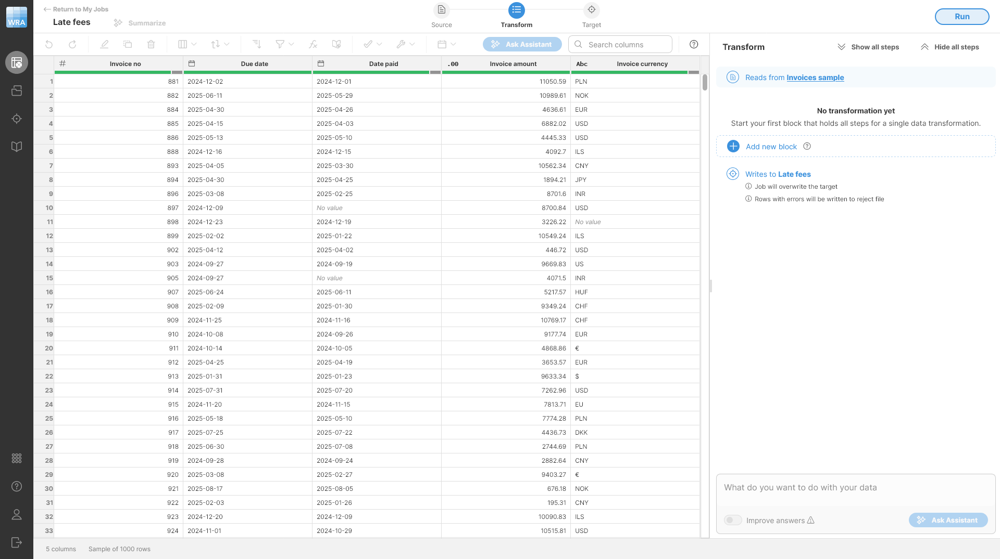
*Figure 20. Empty job showing the data preview and empty Transform side bar without any blocks or steps. Note that the Ask Assistant box at the bottom is disabled since the AI is not configured in this Wrangler.*

Note that if you have the **Wrangler Assistant** enabled and properly configured, your **Transform** view will look slightly different - it will contain the Assistant’s welcome page. Note that regardless of whether you have AI enabled or not, you’ll be able to use the approach described in this part of the tutorial to create your job. If you’d like to see how to work with AI, please continue with the [tutorial using the Wrangler Assistant](wrangler-tutorial.md#solve-the-task-using-the-wrangler-assistant).

##### Step 2: Find overdue invoices

Before you can add transformations steps, you need a **block**. A **block** is a container for related steps. It helps you to group transformations logically and makes longer jobs easier to maintain.

You can create a block in two ways:

- Manually, using the **Add new block**.
- With the Wrangler Assistant by typing your request in the **Ask Assistant** box.

In this part of the tutorial, you’ll use the manual approach to create the block and transformation steps within it.

Do this:

- Add a new block by clicking on **Add a new block** in the **Transform** view. A new empty block without any steps will be created for you.
- Add a clear description to the block using the **Describe** functionality. The description can contain spaces, even multiple lines of text if needed. In this case, let’s use "Find overdue invoices" as the block description since that will be the first part of the job you’ll build.
  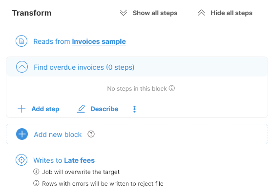
  *Figure 21. Transform view after adding a block and providing a short description of its functionality.*

##### Step 3: Find overdue invoices

To find overdue invoices, you will have to filter the invoices in the data set. To filter the invoices, you’ll add a step to the job like this:

- Click **Add step** on the newly created block.
- A list of all steps will be shown. You can search within this list or simply scroll to the step called **Filter rows based on formula**:
  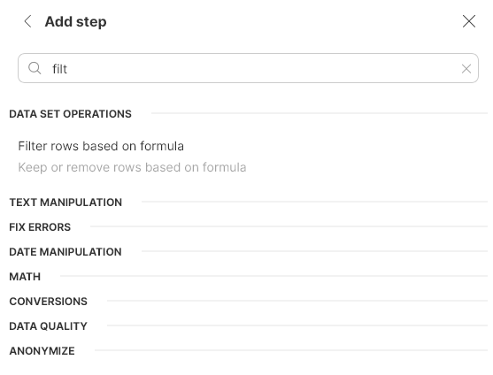
- To find overdue invoices, you’ll have to filter the data set to only contain invoices where the `Due date` is before today (for invoices that have not been due yet) and where `Date paid` is empty (invoices not paid yet) or is after the `Due date` (invoices paid late). To do this, enter the following formula into the step:
  ```javascript
  $Due_date < today() && ($Date_paid == null || $Date_paid > $Due_date)
  ```
  The formula editor will help you write your formulas by providing suggestions for column names, functions and their parameters, etc. If you make an error, the error will be highlighted to allow you to fix it before you save the step configuration.
  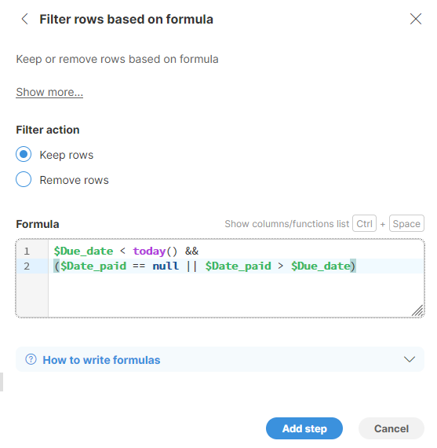
  *Figure 22. Configuration of the Filter step to only keep overdue invoices and remove the ones that were paid on time from data.*
- Click on **Add step** button to add the step to the block.

Once you complete the above steps, the preview of your data will be updated and only the unpaid invoice will be shown:

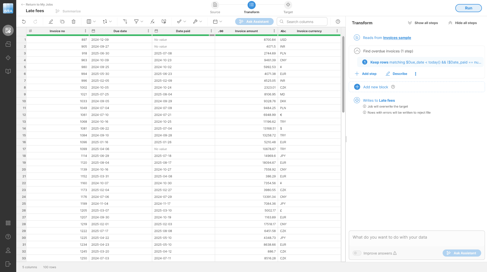
*Figure 23. A preview of your data set after the invoices have been filtered to overdue invoices.*

##### Step 4: Convert amounts to USD (lookup)

To provide report in your reporting currency - USD - you must convert all invoice amounts to USD using the exchange rates you’ve uploaded to Wrangler before. In this case, you’ll use the Lookup step to perform a lookup in the exchange rates table.

To perform the lookup, do this:

- Add a new block and set its description to *Currency conversion*. This is useful to keep your job nicely organized and easy to follow. You can also add the step to the first block, but in that case, you should also change the block description so that it is still accurate. The result will be the same.
  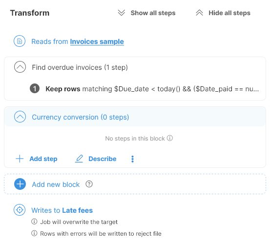
- Add a [**Lookup**](wrangler-step-lookup.md) step via **Add step** button into the newly created block.
- Configure the *Lookup* step to use **Exchange rates** as its **Lookup data source**, **Lookup key mapping** to use `Invoice currency = Currency code` and **Columns to add from lookup** to add just the `Exchange rate (in USD)` column. The step will look like this when configured:
  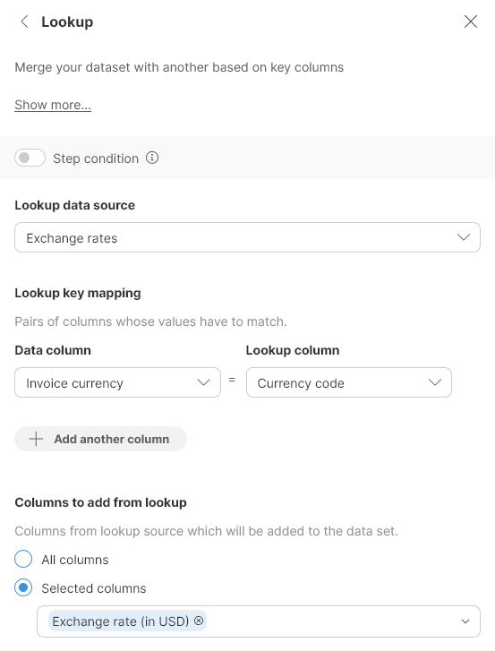
- Add step [**Calculate formula**](wrangler-step-formula.md) to the same block via the **Add step** button. This step will use a simple formula to calculate invoice amount in USD based on the original invoice amount and the exchange rate found in the previous step.
- Configure the *formula* step to use the formula `$Invoice_amount * $Exchange_rate_in_USD` and to write the result to a new column `Invoice amount in USD`:
  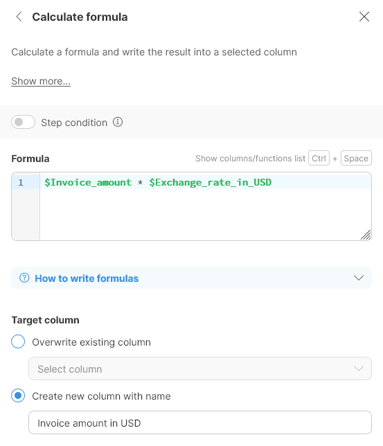

Once both steps are added, you’ll have your invoice amount converted to USD using the found exchange rate. Your job and data will look like this:

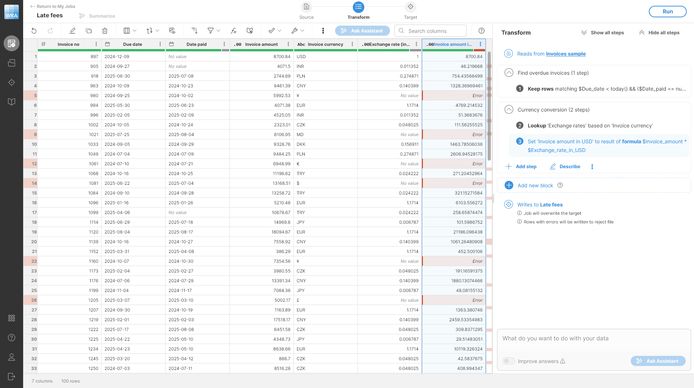
*Figure 24. A preview of the data after the currency conversion has been applied.*

The preview now shows errors in currency conversion process. Hovering your mouse over the error cell will provide you with additional information about the error:

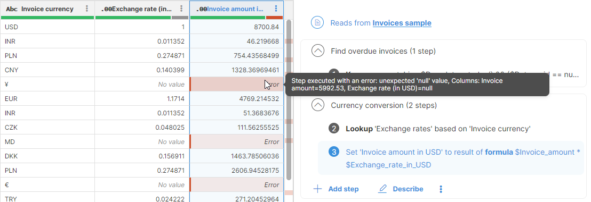
*Figure 25. A tooltip showing error details for one of the error cells.*

The error message in this case tells you that the calculation failed because the exchange rate value is empty (`null`). This is also visible in the `Exchange rate` column in the same row - the value is `null` as well. To figure out why this is the case, look into the `Invoice currency` code column. You can see that it is `¥` while all the other currency codes have three letters rather than currency symbols. This is a data quality error in the input file - the invoice amount uses a currency symbol or code that will not match any of the codes in the exchange rates lookup table. You can also look at the other errors in the preview to confirm this is the case there as well.

There are multiple ways of solving similar data quality issues in Wrangler:

- You can **leave the errors as they are**. Wrangler will keep all the data and the error message and will reject the record when it gets to the end of the process - you’ll get a **reject file**. This is best in cases where you cannot fix the data since you get a report of errors at the end of the process and you can work on fixing the data in the source. Read more about reject files and error handling [here](transforming-data.md#error-handling-in-wrangler).
- You can **update your Exchange rates** table to also contain the currency codes that did not match. In this case, this would not be difficult since there are only handful of currencies to add. To do this, you can simply edit the `Exchange rates.csv` file on your computer and reupload to Wrangler.
  You can also improve the overall approach by using [reference data set](data-manager-working-with-reference-data.md) in the [Data Manager](dm-index.md) to maintain the lookup table instead of a file - this would be much more scalable and easier to maintain, but it is outside the scope of this tutorial.
  However, the approach of fixing the lookup table like this may not always be viable due to large number of values or even missing data where you cannot easily find the correct value to use as lookup key.
- You can **update your transformation** to replace the invalid value with correct currency codes before the [Lookup](wrangler-step-lookup.md) step. This is best when there are only handful different values like this and where the data can be fixed in simple way (e.g., using [Calculate formula](wrangler-step-formula.md), [Replace text](wrangler-step-replace-text.md), another *Lookup* or other steps).
- If you have the **Wrangler Assistant** available, you can use AI to try to help you fix the errors by using Assistant’s **Assist with fixing errors** functionality. The Assistant will look at your data (this will automatically upload sample of your data to your AI provider) and try to suggest ways to fix the errors.

In this case, the default behavior of Wrangler is what you are looking for - it will save the rows that contain errors to a separate reject file which you can download alongside the transformation output. You can then go back to the source system with this file and ask the data owners to fix the data.

**Optional exercise**: Try implementing the other approaches to dealing with this error as mentioned above. Play with your data to get more sense about how Wrangler can be used.

##### Step 5: Adding late fees

To calculate the late fees, you will use multiple steps to figure out how late the invoice is and then calculate the fee based on that. As before, you’ll create a new block for these steps to make the job easy to follow.

Let’s use the following approach:

- Calculate the *effective date paid* as either *date paid* or *today* if the invoice has not been paid yet. This will allow you to estimate the late fee for invoices that do not have any payment date.
- Calculate the fee based on how many days are between *due date* and *effective date paid*.

Do the following:

- Create a new block with description *Add late fees*.
- Add a [**Current date and time**](wrangler-step-current-datetime.md) step and configure it to write the output to a new column called `Today`.
- Add a [**Calculate formula**](wrangler-step-formula.md) step with formula `if($Date_paid == null, $Today, $Date_paid)` and write the result to a new column called `Effective date paid`. This formula uses `if` condition to populate the result with either today’s date or *date paid* if available.
  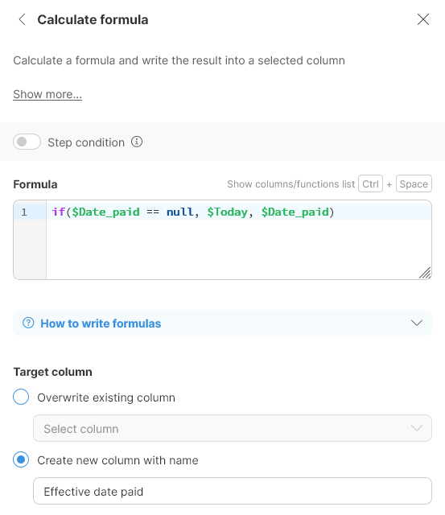
- Add a [**Date difference**](wrangler-step-date-diff.md) step. Configure it so that **First date** is set to `Effective date paid` and the **Second date** is set to `Due date`. Write the result to a new column called `Days late`.
- Add another [**Calculate formula**](wrangler-step-formula.md) step with formula set to
  ```javascript
  if($Days_late > 0, $Invoice_amount_in_USD * 0.001 * $Days_late, 0)
  ```
  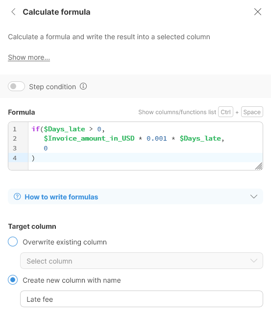

Once you’ve added all the steps above, you have calculated the late fee value. Your job and data should look like this:

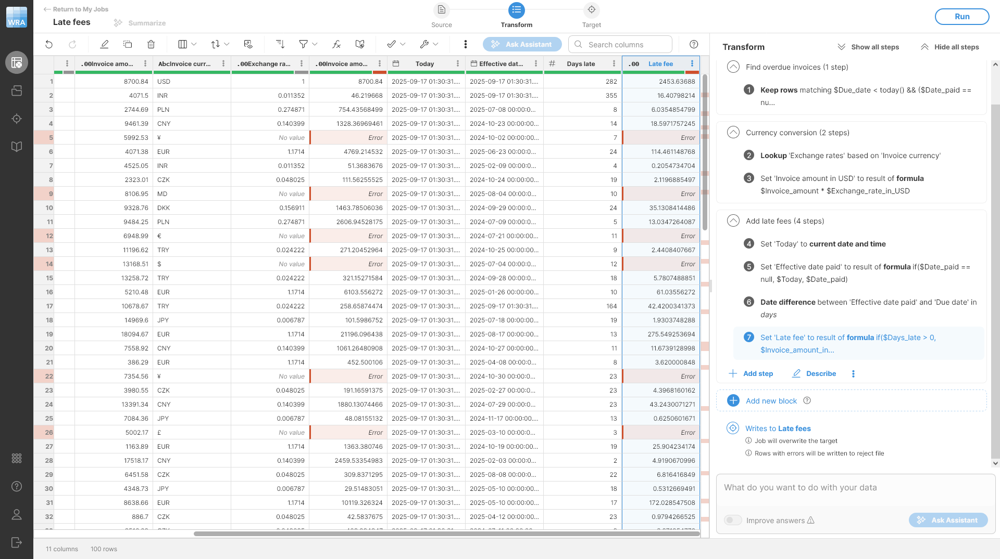
*Figure 26. Data set with late fees added. Note that all errors are kept - they will be rejected at the end of the job.*

**Tip**: There are many ways of doing this. You can, for example, implement the whole process within a single [Calculate formula](wrangler-step-formula.md) step with more complex formula. Try implementing some other approaches as an exercise to get a better feel for what Wrangler can do.

##### Step 6: Cleaning the output

Finally, let’s clean up the result so that it is easier to review and present. Let’s make the following adjustments to your job:

- Remove all unnecessary temporary columns from the result.
- Round the numbers to two decimal places as is usual for currency values.

Do the following:

- Add a new block with description `Clean-up for reporting`.
- Add a [**Delete column(s)**](wrangler-step-delete-column.md) step and configure it to delete columns `Invoice amount`, `Invoice currency`, `Exchange rate (in USD)`, `Today`, `Effective date paid`, and `Days late`.
- Add a [**Round**](wrangler-step-round.md) step and configure it to round column `Invoice amount in USD` to two decimal places.
- Add another [**Round**](wrangler-step-round.md) step and configure it to round column `Late fee` to two decimal places.

**Tip**: To make the output even nicer, you can also format the monetary amount columns to contain the currency symbol. This can be done by right clicking a column and changing the formatting via **Change display format** menu option. Set the **Format** pattern to `$###,##0.00`. Note that the display formatting is not represented by a step, so it is not visible in the Transform view in the list of steps. See more details about data formats in [Formatting your data](transforming-data.md#formatting-your-data) section.

The cleaned output will look like this:

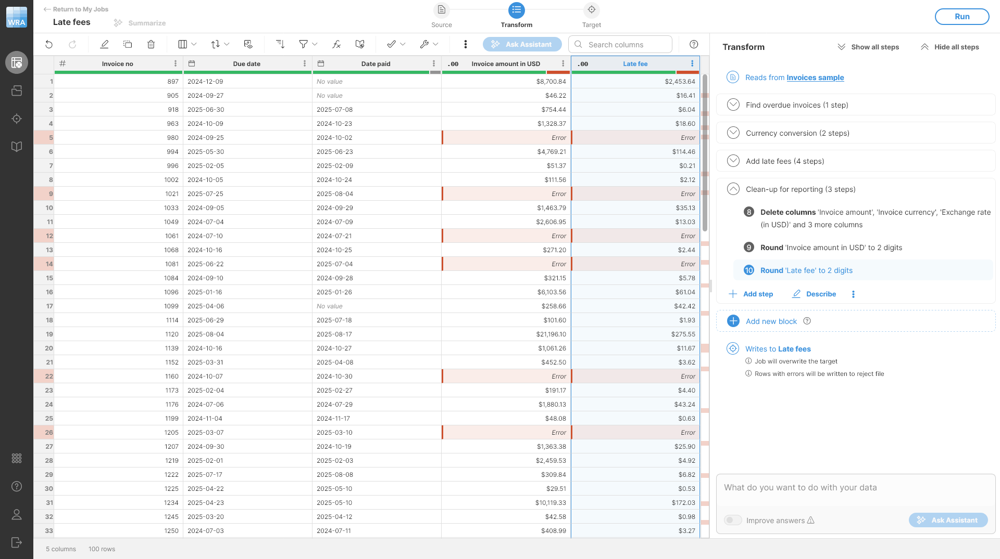
*Figure 27. Preview of the Late fees data set after basic clean-ups with formatting applied. All blocks except for the clean-up block have been collapsed.*

##### Step 7: Running your job

To run the job just click the **Run** in the upper-right corner and confirm **Run job** dialog. You’ll be taken back to the **Jobs** screen and after few seconds you should see the job finishing with rejected rows like this:


*Figure 28. Jobs screen showing the results of the job.*

On this screen, you can download the results of your jobs, see the rejected records and more. See additional details in [Getting results from your job](wrangler-faq.md#how-can-i-get-full-output-from-my-job) section.
