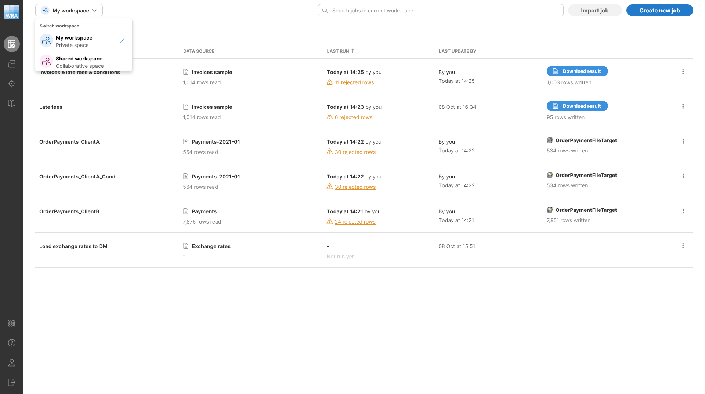
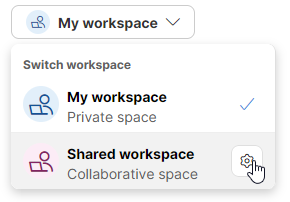
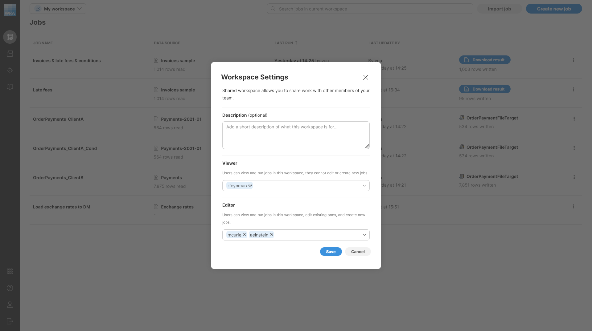
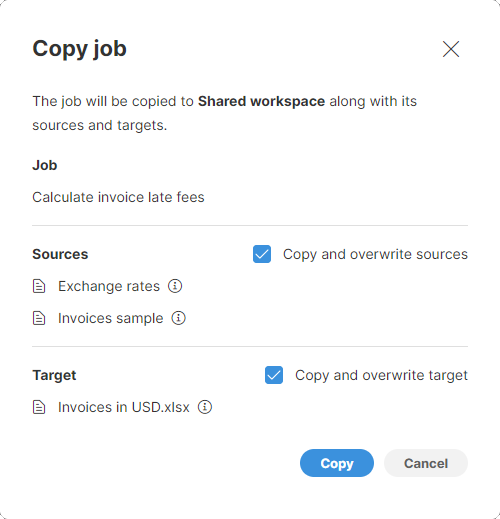
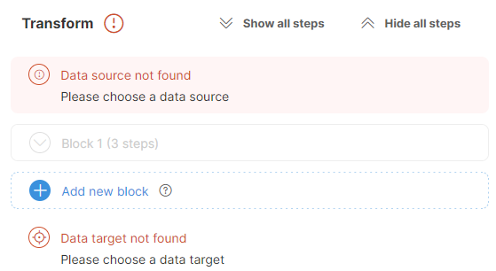
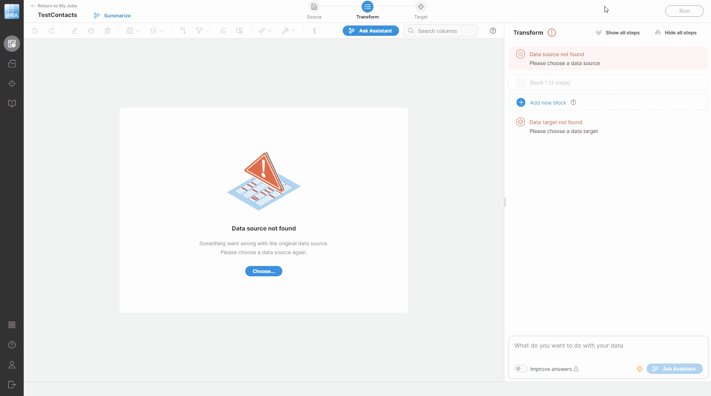
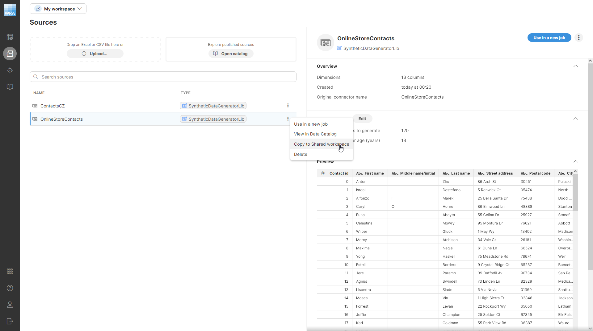

<!-- End user’s guide > Wrangler user guide > Workspaces -->

### Workspaces

#### Introduction

Wrangler provides **workspaces** to allow you to separate your work into your private work in your own **private workspace** and work shared with others in **shared workspace**. Each workspace can contain any number of jobs, data sources or data targets. You will get access to one or two workspaces depending on your permissions - you will always have access to your private workspace and you may also get access to the shared workspace.

Your **private workspace** is intended as a place where you can create and run your own jobs without worrying about anyone else being able to see, run, or modify what you’ve created. As such, personal workspace is suitable as a starting place for jobs that you create. If you wish to share the work you created in your personal workspace with other Wrangler users, you can share those jobs via the **shared workspace**.

The **shared workspace** is designed to help users collaborate on their jobs. All users who have permissions to this workspace can see and run jobs in it. Some users may also have write permissions which allows them to make changes to jobs and other resources in the workspace.

You can see which workspace is currently selected in the top left part of your screen in **workspace selection dropdown**. The workspace selector allows you select currently active workspace. Everything you do in Wrangler happens within currently active workspace and does not affect any other workspaces (i.e., you cannot change job in any other workspace until you switch to that workspace).

*Figure 29. Private workspace showing several job and expanded workspace selector in the top left corner of the screen.*

#### What is in a workspace?

Each workspace contains all resources needed to work in Wrangler - jobs, data sources, and data targets. Workspaces are independent so you can have jobs with the same name in two workspaces without any name collisions.

#### Workspace permissions

Different users can have different permissions in workspaces in one Wrangler instance. Every user can work in their own private workspace - they are the owner and have full permissions in this workspace. Other users do not see this workspace at all - they have their own separate private workspaces.

The shared workspace is different. Users with **Wrangler workspace administrator** permissions can change settings of the shared workspace and change its visibility with regards to other users.

*Figure 30. Accessing shared workspace settings via Settings button.*

All users can open the shared workspace settings. However, only administrator users can make any changes to these settings, other users can only see the settings.

*Figure 31. Shared workspace settings showing user permissions.*

Permissions provide two options:

- **Viewer**: users listed in the viewer group can see all resources in the shared workspace. They can run jobs from the shared workspace but cannot change settings of the job. Viewers also cannot make any changes in jobs themselves - they can look at how the job works (i.e., see the steps), but cannot modify anything within the job. Note that viewers can copy jobs out of the shared workspace - i.e., they can create their own copy of a job and modify it to suit their needs once it has been copied to their private space. However, they will not be able to sync the changes back to the shared workspace.
- **Editor**: editors can make changes to resources in the shared workspace. They can edit steps in each job and can run jobs while also changing source or target settings. Editors can also copy jobs or other resources to the shared workspace. This allows them to easily share their work with others by either creating their jobs in the shared workspace or copying them to this workspace.

Users who are not listed as viewers or editors have no access to the shared workspace - they cannot even see that this workspace exists.

#### Collaborating with other users

The easiest way of collaborating with other users is to share your jobs via the shared workspace. This can be done either by creating the jobs there or by copying them from your private workspace.

To copy jobs or other resources from your private workspace to shared workspace, use the context menu **Copy to Shared workspace**. This context menu action is available on the **Jobs** screen for each job as well as on the **Sources** and **Targets** screens on sources and targets.

*Figure 32. Dialog shown when copying a job from private to shared workspace.*

The dialog will show you all sources that participate in your job (the primary source and any sources that may be used by [Lookup](wrangler-step-lookup.md) steps) and the target of your job. This will help you see the dependencies that are needed for the job to run and decide whether to copy them to the shared workspace or not.

- **Copy and overwrite sources**: when this box is checked, the sources listed in the dialog will be copied to the shared workspace. If any of those sources exist in the shared workspace, it will be overwritten with the new one. If this box is unchecked, you will need to create new sources for this job in the shared workspace to make it work (i.e., you will have to switch to shared workspace, edit the job and configure all its sources so that they are valid).
- **Copy and overwrite target**: job target follows the same principle as job sources. If the box is checked, the target will be copied to the shared workspace potentially overwriting existing instances of that target. If the box is unchecked, the target will not be copied. In such case you may need to create new target for the job in the shared workspace.

As an example, a simple workflow where the shared workspace is used as production and your private workspace is used as development area can look like this:

1. Create a job in your workspace.
2. Once you are happy with the job, copy it to the shared workspace
3. You (and other users) can use the job in shared workspace and run it as many times as needed.
4. If a change in the job is needed, make it in your private copy of the job, debug in your workspace. Then copy to shared workspace again to update the copy visible to others as well.

The above approach will allow you to update the job safely even if the update development takes a while - other users will not be able to see half-finished job since they will only get access to the new version once you are happy with it and publish it in the shared workspace.

This approach also works if multiple users are involved. You should just be careful to optionally copy the job from shared workspace to your private workspace to make sure you get the latest version before you make any changes. To make it easier to see whether the job you have is older, you can use the **Last update by** column on the **Jobs** screen to see when was the last change of the job you are working with.

##### Keeping the sources or target

The approach described above assumes that you want to copy job including its sources and target. This works well when you can develop your job on the same data as everyone else. However, there may be cases where you want to use different source or target in shared workspace than in your workspace (for example, you may use a CSV file to make the job development faster but call an API in shared workspace). Since jobs, sources, and targets in different workspaces are independent, you can simply change job (or source or target) settings in the shared workspace without affecting your private copy in any way.

When you want to publish newer version of the job by copying it from your workspace, you can opt to not copy the sources or target - the **Copy job** dialog allows you to skip copying of the sources or target. However, if you do this, the copied job may be left in an inconsistent state since it can refer to a source that does not exist in the shared workspace.

When this happens, the job will show with invalid data source or target when you try to edit or run it. It may look like this:

*Figure 33. Transform view showing errors when source and target cannot be found in the workspace.*

Fixing this is simple: you can select the correct source or target in your job to get it to run again. To change the source, click on the **Source** icon at the top of the screen or on the **Source settings** menu shown on hover. You’ll see the **Change data source** dialog which allows you to select one of the existing sources or create a new one. Once you’ve selected or created the source you wanted, click on **Select** in the top right corner of the screen. You can change the target in similar way. The following animation shows a quick example of how to fix both source and target.

*Figure 34. How to fix invalid source and target in a job.*

##### Copying sources or targets

In some cases, you may not need to copy the whole job, just its source or target so that you can share its settings with other users. To do this, open the **Sources** or **Targets** screens in your workspace and select the item you wish to copy. To copy it to shared workspace, select **Copy to Shared workspace** item in the three-dots menu for the item you’d like to copy:

*Figure 35. Menu showing Copy to Share workspace action to copy the selected source to shared workspace.*
